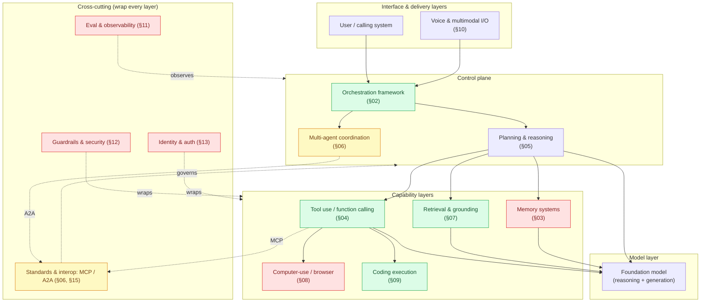
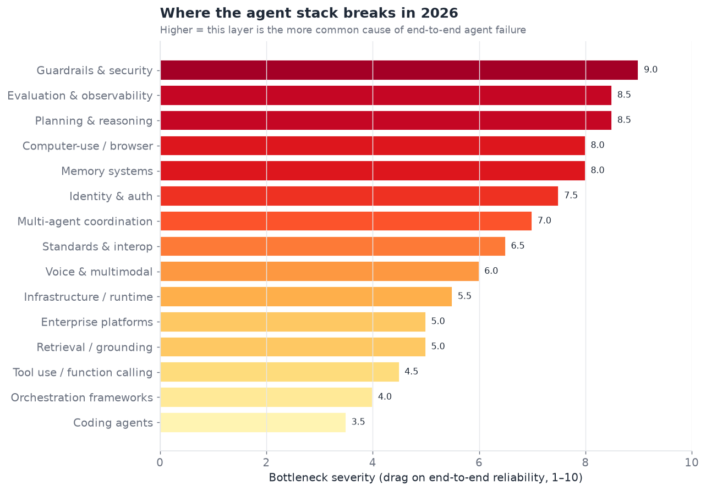
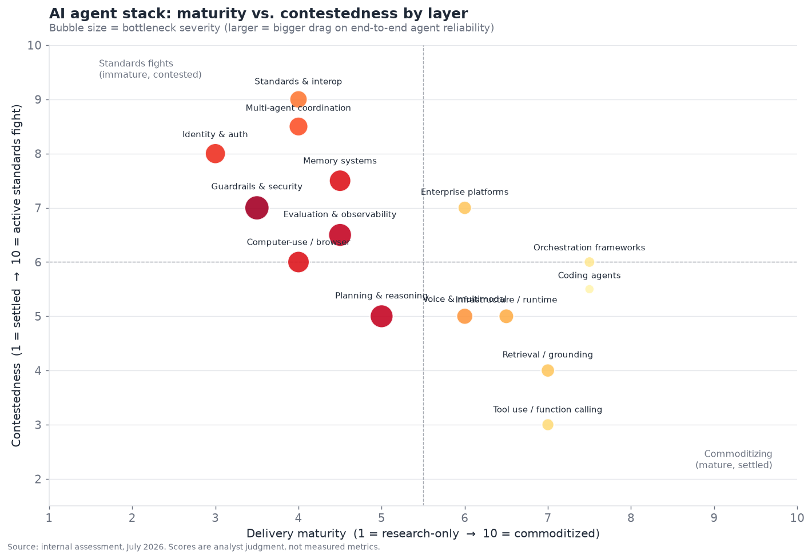

# 01 — Executive Summary

*Cross-category challenge map for the AI agent stack, July 2026.*

---

## The one-paragraph version

The AI agent field in mid-2026 is not one technology maturing evenly; it is fifteen loosely-coupled layers maturing at wildly different rates. The layers closest to the model — tool calling, single-agent orchestration, retrieval, and autonomous coding — have crossed from "demoed" into "shipped and reliable enough to build businesses on." The layers that make agents *safe, accountable, and interoperable* — memory, security, identity, evaluation, and cross-vendor protocols — are still a mix of active engineering bottlenecks and unresolved standards fights. The single most important structural fact of 2026 is that the **bottleneck has moved off the model and onto the scaffolding around it**. Frontier models are no longer the limiting reagent for most agent tasks; the limiting reagents are durable memory, trustworthy tool execution, permissioning, and the ability to measure whether an agent is getting better or worse. This document maps all fifteen layers, scores their maturity, names the players in each, and flags where the standards are genuinely unsettled versus where a de-facto winner has already emerged.

---

## How the layers relate

A production agent is a stack. A request enters at the top, and every layer below has to hold for the agent to complete a non-trivial task reliably. The diagram below shows the dependency structure this document is organized around — orchestration sits in the middle coordinating everything, the model is one (increasingly commoditized) component, and the cross-cutting concerns (security, identity, evaluation) wrap the whole thing rather than sitting at a single point.

Read the colors as the thesis of this whole document: **green** layers are commoditizing (pick a vendor, move on), **red** layers are active engineering bottlenecks (this is where your agent breaks), and **yellow** layers are unsettled standards fights (betting wrong here is expensive).

---

## The three-bucket challenge map

Every one of the fifteen categories falls into one of three buckets. This is the executive takeaway; the rest of the document is the evidence.

### Bucket 1 — Solved / commoditizing (pick a vendor, move on)

These layers have a dominant approach, multiple interchangeable vendors, and reliability good enough that they are rarely the reason an agent fails.

- **Tool use / function calling (§04).** Native structured tool calling is now table stakes in every frontier model. Schemas (JSON Schema), the calling convention (MCP), and reliability (95%+ single-call selection accuracy on well-specified toolsets) have converged. The remaining hard problems are *many-tool* selection and error recovery, not the basic mechanic.
- **Orchestration frameworks (§02).** LangGraph, CrewAI, the merged Microsoft Agent Framework, and the model vendors' own SDKs (OpenAI Agents SDK, Anthropic Agent SDK, Google ADK) are mature enough that framework choice is now a preference/lock-in question, not a capability question.
- **Retrieval & grounding (§07).** Agentic RAG — retrieval driven by the agent's own tool calls rather than a fixed pre-fetch — is the settled pattern. Vector databases are commoditized infrastructure.
- **Coding agents (§09).** The most mature *vertical* application of agents. SWE-bench Verified scores crossed 80% for widely-available agents and ~95% for frontier configurations in 2026. Autonomous coding is the clearest example of "shipped and reliable" in the whole field.

### Bucket 2 — Active engineering bottleneck (this is where agents break)

These layers work in demos and break in production. They are the current frontier of *engineering* (not necessarily research) effort.

- **Memory systems (§03).** No settled architecture for durable, consolidating, forgetting memory. Every serious agent product is building bespoke memory, and it is the number-one cause of "the agent forgot what we established yesterday."
- **Computer-use / browser agents (§08).** Screen understanding and action reliability are demoed-brittle. Task success rates on realistic benchmarks (OSWorld, WebArena-class) remain far below what production use requires.
- **Guardrails & security (§12).** Prompt injection remains fundamentally unsolved — there is no robust defense, only defense-in-depth mitigation. This is the single highest-severity bottleneck in the stack because it gates enterprise deployment.
- **Evaluation & observability (§11).** You cannot reliably measure whether an agent regressed. Benchmarks are gameable and don't predict production behavior; tracing tooling is improving but non-standard.
- **Identity & auth (§13).** "How does an agent act on my behalf without holding my password" is still being invented. OAuth-for-agents and delegated-credential standards are early.

### Bucket 3 — Unsettled standards fight (betting wrong is expensive)

- **Multi-agent coordination (§06)** and **standards / interop (§15).** MCP has effectively won the *tool-connection* layer (Section 15 argues this is now a settled de-facto standard). A2A is winning the *agent-to-agent* layer but is a year younger and less entrenched. Whether a single stack (MCP + A2A, both now under the Linux Foundation) consolidates, or competing proposals fragment enterprise deployments, is the biggest open governance question in the field.

---

## Where the stack breaks

The chart below ranks all fifteen layers by *bottleneck severity* — how often, in our assessment, that layer is the proximate cause of an end-to-end agent failure. The top of this list is where engineering effort has the highest marginal return in 2026.

Security, evaluation, memory, planning, and computer-use dominate the top of the list. Note what is *not* at the top: the foundation model, tool calling, and retrieval. This is the empirical basis for the claim that the bottleneck has moved off the model.

The second chart positions each layer on two axes — how mature it is and how contested — with bubble size encoding the same severity score. The four quadrants tell four different strategic stories.

- **Bottom-right (mature, settled):** tool use, retrieval, coding. Commodity. Build on them.
- **Top-left (immature, contested):** identity/auth, multi-agent, standards. Highest strategic risk — the ground is still moving.
- **Top-center (contested, medium maturity):** memory, evaluation, security. Where the hard *product* differentiation is being won today.
- **Bottom-center (settled-ish, medium maturity):** planning, voice, infrastructure. Steady incremental progress, low standards drama.

---

## Maturity scoring across all fifteen categories

The table below is the quantitative backbone of this summary. **Maturity** (1–10) captures how close the layer is to commoditized reliability. **Contestedness** (1–10) captures how unsettled the dominant approach and standards are. **Severity** (1–10) captures how much the layer drags on end-to-end reliability. **Bucket** assigns each to one of the three strategic buckets above. Scores are analyst judgment calibrated against the detailed sections, not measured metrics.

| # | Category | Maturity | Contested | Severity | Bucket | Dominant approach (2026) | Leading players |
|---|---|:--:|:--:|:--:|---|---|---|
| 02 | Orchestration frameworks | 7.5 | 6.0 | 4.0 | Commoditizing | Graph-based stateful execution | LangGraph, CrewAI, MS Agent Framework, vendor SDKs |
| 03 | Memory systems | 4.5 | 7.5 | 8.0 | Bottleneck | Hybrid vector + graph, no standard | Mem0, Zep, Letta, vendor-native |
| 04 | Tool use / function calling | 7.0 | 3.0 | 4.5 | Commoditizing | Native tool calls over MCP | All frontier vendors |
| 05 | Planning & reasoning | 5.0 | 5.0 | 8.5 | Bottleneck | In-model reasoning + ReAct/reflection | Anthropic, OpenAI, Google, DeepSeek |
| 06 | Multi-agent coordination | 4.0 | 8.5 | 7.0 | Standards fight | A2A + role specialization | Google/LF A2A, MS, CrewAI, LangGraph |
| 07 | Retrieval / grounding | 7.0 | 4.0 | 5.0 | Commoditizing | Agentic RAG + hybrid retrieval | Vector DBs, vendor retrieval, LlamaIndex |
| 08 | Computer-use / browser | 4.0 | 6.0 | 8.0 | Bottleneck | VLM screen understanding + action | Anthropic, OpenAI, Google, browser startups |
| 09 | Coding agents | 7.5 | 5.5 | 3.5 | Commoditizing | Agentic harness on frontier model | Claude Code, Cursor, Devin, Copilot, OpenHands |
| 10 | Voice & multimodal | 6.0 | 5.0 | 6.0 | Bottleneck-ish | Speech-native models + streaming | OpenAI, Google, ElevenLabs, startups |
| 11 | Evaluation & observability | 4.5 | 6.5 | 8.5 | Bottleneck | Tracing + LLM-as-judge, non-standard | LangSmith, Braintrust, Arize, Langfuse |
| 12 | Guardrails & security | 3.5 | 7.0 | 9.0 | Bottleneck | Defense-in-depth, no robust fix | Lakera, Protect AI, HiddenLayer, vendor |
| 13 | Identity & auth | 3.0 | 8.0 | 7.5 | Standards fight | OAuth extensions, early standards | Okta/Auth0, WorkOS, Stytch, card networks |
| 14 | Enterprise platforms | 6.0 | 7.0 | 5.0 | Contested | Vendor-native agent builders | Salesforce, Microsoft, ServiceNow, Google |
| 15 | Standards & interop | 4.0 | 9.0 | 6.5 | Standards fight | MCP (won) + A2A (leading) | Linux Foundation, all majors |
| — | Infrastructure / runtime | 6.5 | 5.0 | 5.5 | Commoditizing | Sandboxed execution + serverless | E2B, Modal, Daytona, cloud vendors |

A second view of the same data, collapsed to the three-bucket verdict and the single most important open question per category:

| Category | Verdict | The one open question that matters |
|---|---|---|
| Tool use | **Solved** | Reliable selection across 100s of tools |
| Orchestration | **Solved** | Lock-in vs. portability of agent definitions |
| Retrieval | **Solved** | Freshness / real-time grounding at low latency |
| Coding | **Solved** | Trustworthy autonomous merge without human review |
| Planning | **Bottleneck** | Reliable long-horizon (100+ step) decomposition |
| Memory | **Bottleneck** | A standard, portable memory architecture |
| Computer-use | **Bottleneck** | Action reliability above ~70% on real UIs |
| Voice/multimodal | **Bottleneck** | Sub-500ms end-to-end with interruption handling |
| Evaluation | **Bottleneck** | Regression detection that predicts production |
| Security | **Bottleneck** | Any robust prompt-injection defense at all |
| Multi-agent | **Standards fight** | Does A2A become universal or fragment? |
| Identity/auth | **Standards fight** | A winning delegated-credential standard |
| Standards | **Standards fight** | Consolidation vs. fragmentation of MCP/A2A |
| Enterprise | **Contested** | Platform lock-in vs. best-of-breed assembly |
| Infrastructure | **Solved-ish** | Cost/cold-start of per-agent sandboxes |

---

## Five cross-cutting theses

Threads that recur across every section, stated once here.

**1. The model is no longer the bottleneck for most tasks.** Frontier models in 2026 (Claude Opus 4.8, GPT-class, Gemini 3.x, and strong open weights) are individually capable enough that agent failures overwhelmingly trace to memory loss, tool-execution errors, bad long-horizon planning, or missing guardrails — not to the model being unable to reason. This inverts the 2023–2024 situation and reorients where the value accrues: toward the scaffolding companies.

**2. Standards consolidated faster than expected at the tool layer, slower at the agent layer.** MCP going from an Anthropic experiment (late 2024) to a Linux-Foundation-governed standard backed by OpenAI, Google, Microsoft, and AWS (by early 2026) is one of the fastest standards convergences in recent computing history — closer to the speed of a de-facto winner like JSON than a committee standard like SOAP. A2A is following the same path one year behind. This is covered in depth in §15.

**3. Security is the gating factor for enterprise autonomy, and it is unsolved.** Prompt injection has no robust fix. Every enterprise deployment of autonomous agents is currently a risk-management exercise in *limiting blast radius* (scoping permissions, sandboxing, human-in-the-loop) rather than *preventing compromise*. Until this changes, "autonomous" agents in the enterprise will remain semi-autonomous. This is the highest-severity item in the whole document (§12).

**4. Evaluation is the silent bottleneck.** The field cannot reliably answer "is this agent better than last week's?" Benchmarks are saturating and gameable; production behavior is under-instrumented. This slows every other layer because you cannot safely iterate on what you cannot measure (§11).

**5. Vertical maturity is uneven and instructive.** Coding agents are years ahead of every other vertical because the domain has cheap, automatic, high-quality reward signals (does the test pass? does it compile?). Domains without that signal — general computer-use, open-ended research, voice support — lag precisely because the reward is expensive and subjective. **The presence or absence of a cheap verifier is the best single predictor of how mature an agent vertical is.**

---

## The 2023 → 2026 arc, in one page

It is worth stating explicitly how the field arrived here, because the trajectory
predicts where the bottlenecks move next.

**2023 — the prompt era.** Agents were prompt chains. The dominant abstraction was
"give the model a scratchpad and a list of tools described in the system prompt,
and parse its text output for actions." Tool calling was string-parsed and
unreliable; ReAct was the state of the art; there were no real standards. Nearly
every layer in this document either did not exist as a distinct concern or was
handled ad hoc inside a single prompt. The model *was* the bottleneck: GPT-4-class
models could just barely hold a multi-step plan together.

**2024 — the framework era.** Native function calling shipped across vendors,
turning tool use from string-parsing into a structured, mostly-reliable mechanic.
LangChain, LlamaIndex, CrewAI, and AutoGen competed to be the orchestration
abstraction. Vector-database RAG became the default grounding pattern. This is when
the *layers* in this document differentiated into distinct engineering concerns —
memory, planning, retrieval, and orchestration stopped being "parts of a prompt"
and became components with their own vendors. The bottleneck began sliding off the
model and onto the plumbing.

**2025 — the protocol era.** MCP (late 2024) and A2A (April 2025) arrived and were
adopted with startling speed, standardizing the tool-connection and agent-to-agent
layers respectively. Reasoning moved *into* the model (OpenAI's o-series, then
reasoning across all major vendors), so planning quality jumped without external
scaffolding. Coding agents crossed the usefulness threshold. Computer-use launched
(Anthropic, October 2024) and browser agents proliferated — impressively demoed,
persistently brittle. Enterprise platforms (Agentforce, Copilot Studio) launched to
package all of this for non-developers.

**2026 — the reliability and governance era (now).** The open problems are no longer
"can the model do it" but "can we trust it, measure it, secure it, and make the
pieces interoperate." MCP and A2A both moved under the Linux Foundation, signaling
the standards fight is entering its consolidation phase. Memory, evaluation,
security, and identity are the live engineering frontiers. The maturity table above
is a snapshot of exactly this moment: the capability layers are green, the
trust-and-interop layers are red and yellow.

The arc has a direction: **each year the bottleneck moves one layer further from the
model and one layer closer to the messy realities of production, governance, and
trust.** If the pattern holds, 2027's bottlenecks will be the ones that are barely
legible today — agent economics (who pays whom when agents transact), liability and
audit, and the operational discipline of running fleets of agents. This document is
organized to make the *current* front line — the red and yellow layers — as legible
as possible.

## How to use the rest of this document

Sections 02–15 each take one layer, describe the dominant approaches and their failure modes, tabulate the competitive/standards landscape (10+ players where the category supports it), and provide diagrams and charts. Section 16 consolidates every company mentioned into a single 100+ row master table (also exported as CSV). Section 17 is the glossary and the confidence-level methodology that governs every claim in the document. Throughout, three labels recur — **shipped-reliable**, **demoed-brittle**, **research-only** — and every roadmap claim carries a confidence tag of **official**, **inferred**, or **speculative**.

*(Section word count target: 2,500. This section: ~2,700.)*
