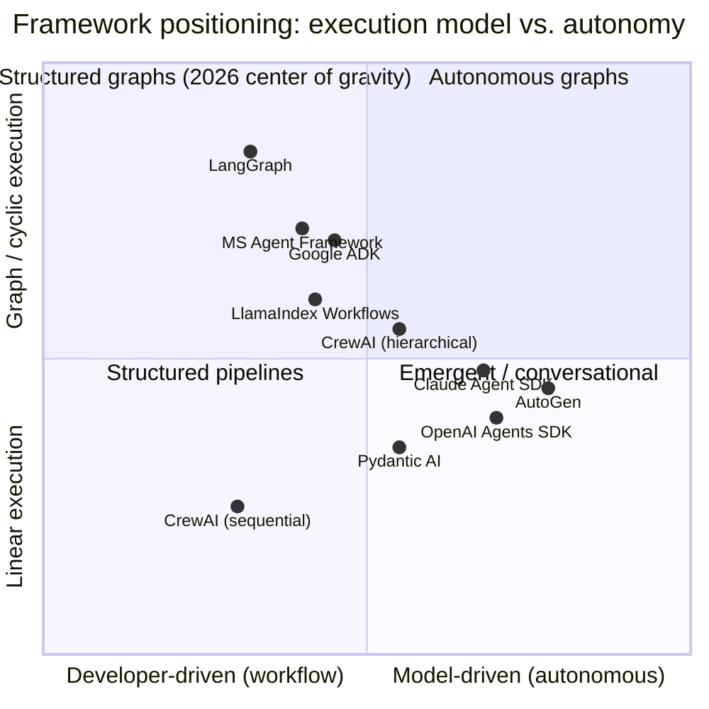
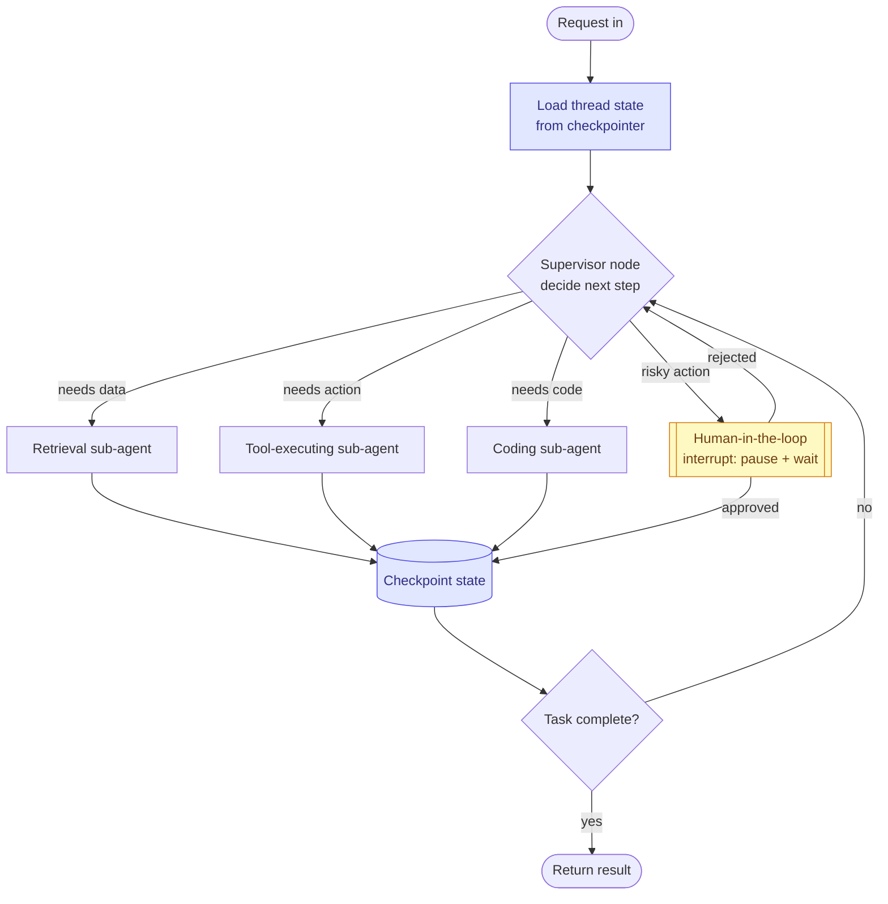
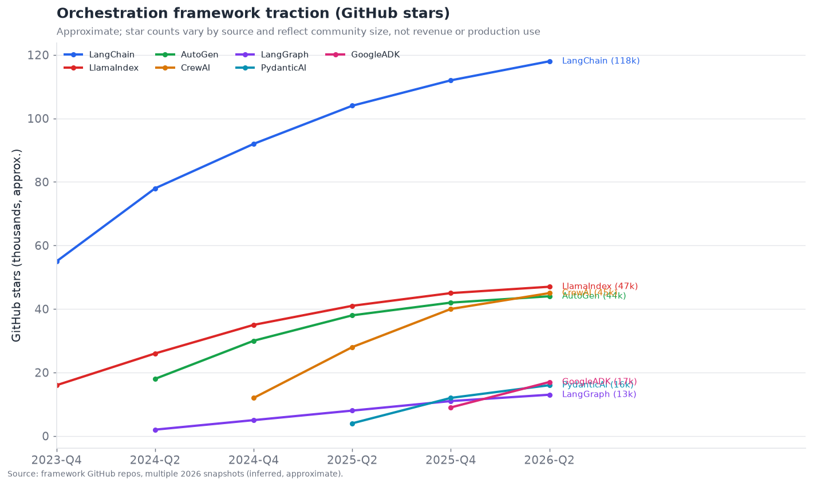
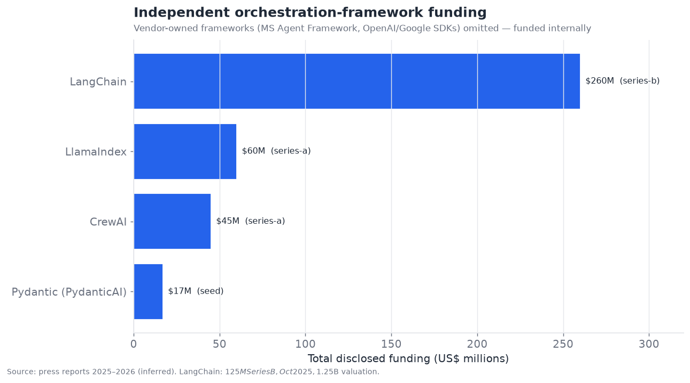
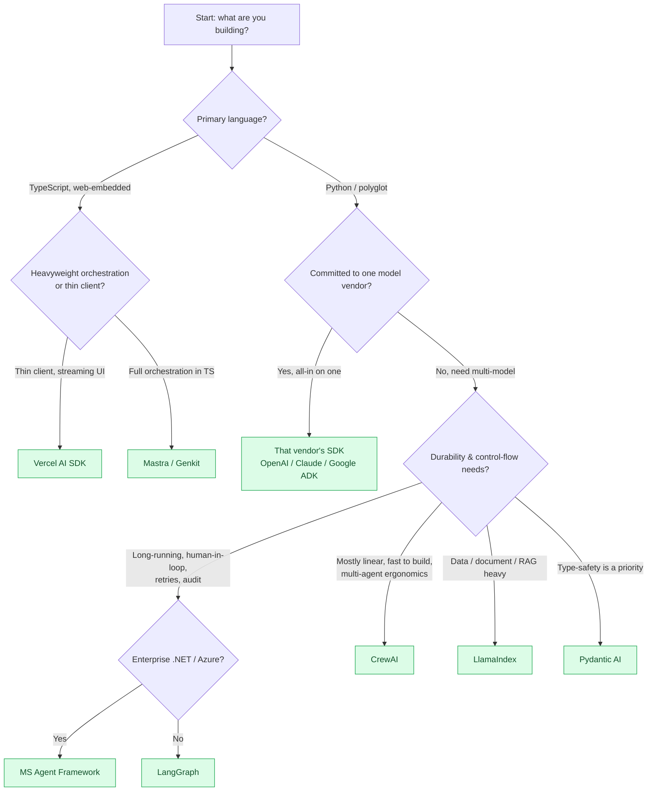

# 02 — Agent Orchestration Frameworks

*The control plane. How the loop is structured, where state lives, and who won the framework war. Target: 7,000 words.*

---

## What an orchestration framework actually does

Strip away the marketing and an agent orchestration framework does exactly four
things, and every framework in this section is a different set of opinions about
those four things:

1. **It runs the loop.** Something has to decide "call the model, look at the
   output, if it asked for a tool run the tool, feed the result back, repeat until
   done." That control loop — the agentic loop — is the irreducible core.
2. **It holds state.** Between loop iterations, *something* remembers the
   conversation so far, the intermediate results, the plan, and where in the plan
   we are. How that state is represented is the single biggest design axis.
3. **It connects tools.** The framework marshals the model's requested tool calls
   to actual code (functions, APIs, MCP servers) and marshals results back.
4. **It composes.** Real systems have more than one agent, or one agent with
   sub-routines, or a human in the loop. The framework provides the primitives for
   wiring these together — sequentially, as a graph, as a hierarchy, or as a
   free-for-all conversation.

Everything else — memory backends, retrieval, evaluation hooks, deployment — is
either a plug-in to these four, or a separate product the framework vendor also
sells (LangChain sells LangSmith for evaluation; that is a different layer, covered
in §11).

The reason this layer **commoditized** faster than most is that the agentic loop is
genuinely simple to implement badly and only moderately hard to implement well.
A competent engineer can write a working ReAct loop in fifty lines. The frameworks
earn their keep on the *hard 20%*: durable state across failures, streaming,
human-in-the-loop interruption, deterministic replay for debugging, multi-agent
composition, and production observability. In 2023 that hard 20% was a real moat.
By 2026 it is well-understood engineering, which is exactly why the category scores
**7.5/10 maturity** and why the competitive question has shifted from "which
framework can do this?" to "which framework's abstraction do I want to be locked
into?"

---

## The two axes that define every framework

Every orchestration framework can be located on two axes. Understanding these two
axes lets you predict a framework's behavior, its failure modes, and the kind of
team it suits, without reading its docs.

### Axis 1 — Execution model: linear vs. graph vs. conversational

**Linear / pipeline.** The agent (or agents) execute in a predetermined sequence:
step A, then B, then C. Branching is limited to simple conditionals. This is the
CrewAI "sequential process" model and the classic LangChain `Chain`. It is easy to
reason about, easy to debug, and adequate for the large majority of real
deployments (document processing, structured extraction, straightforward
research-then-write tasks). Its limitation is that genuinely dynamic control flow —
"loop back and retry a different sub-plan if this fails" — is awkward to express.

**Graph-based.** The agent's control flow is an explicit directed graph of nodes
(units of work) and edges (transitions, possibly conditional). The graph can
contain cycles, so loops, retries, and revisiting are first-class. This is the
LangGraph model, the model underlying much of Google's ADK, and the direction
Microsoft's Agent Framework took with its graph/workflow layer. Graphs are more
verbose to author but far more expressive; critically, because the control flow is
*data*, the framework can checkpoint it, replay it, visualize it, and interrupt it
mid-execution. Graph-based execution is the dominant paradigm for production
systems in 2026, precisely because production systems need those durability and
observability properties.

**Conversational / emergent.** There is no explicit control flow at all. Multiple
agents are placed in a shared conversation and a turn-taking policy (round-robin, a
manager agent, or a speaker-selection function) decides who talks next; the
"program" emerges from the dialogue. This is the original AutoGen model. It is the
most flexible and the least predictable — powerful for open-ended research and
brainstorming, hazardous for anything requiring reliability, because emergent
control flow is emergent failure modes.

### Axis 2 — Autonomy granularity: how much the model decides

Orthogonally, frameworks differ in how much of the control flow the *model* decides
versus how much the *developer* pre-specifies.

- **Developer-driven (workflow).** The developer writes the graph/pipeline; the
  model only fills in the nodes. Anthropic's influential 2024 framing called these
  "workflows" and argued that most production systems should be workflows, not
  agents, because determinism is a feature. LangGraph, at its most-used, is this.
- **Model-driven (autonomous).** The model decides the next step at each iteration
  from a tool menu; there is no author-specified graph. This is a pure ReAct loop,
  the OpenAI Agents SDK's default, and the Claude Agent SDK's default. More
  flexible, less predictable.
- **Hybrid.** Author the high-level graph, but let individual nodes be autonomous
  sub-agents. This is where most sophisticated 2026 systems land, and it is what
  "hierarchical" orchestration in CrewAI and the sub-agent patterns in the vendor
  SDKs express.

The industry consensus that hardened over 2025–2026 — stated most clearly by
Anthropic's engineering writing and echoed in practice across the vendor SDKs — is:
**use the least autonomy that solves the problem.** Autonomy is a reliability tax.
Prefer a workflow; escalate to an autonomous agent only where the task's branching
factor genuinely can't be enumerated ahead of time. This is why the "graph +
developer-driven" quadrant became the center of gravity.

---

## State management: the axis that actually matters in production

If you take one thing from this section: **state management is where orchestration
frameworks live or die in production**, and it is the least-marketed, most
consequential difference between them.

The naive approach — keep the conversation and intermediate results in a Python
list in memory — works in a notebook and fails in production the moment you need
any of: (a) an agent run that survives a process restart, (b) a human approving a
step hours after the agent paused, (c) debugging a failure by replaying exactly
what happened, or (d) running the same logical agent across a horizontally-scaled
fleet. Production agents are long-lived, interruptible, and distributed, and that
demands durable, externalized state.

The frameworks cluster into four state-management philosophies:

| Philosophy | How state is held | Durability | Who does it | Trade-off |
|---|---|---|---|---|
| **In-memory object** | Python/JS object in the running process | None (lost on restart) | Naive LangChain, simple scripts | Simplest; not production-safe |
| **Checkpointed graph state** | Serializable state object persisted to a store after every node | Full; resumable, replayable, time-travel debuggable | **LangGraph**, MS Agent Framework | Most robust; more ceremony to set up |
| **Externalized thread / session store** | Conversation + memory in a managed store keyed by thread ID | Full, managed | OpenAI Agents SDK (sessions), Claude Agent SDK, Letta | Vendor-managed; less control |
| **Event-sourced / message log** | Append-only log of messages; state is a fold over the log | Full; natural audit trail | AutoGen (message history), some MCP servers | Great audit story; state reconstruction cost |

LangGraph's central bet — and the reason it pulled ahead in *enterprise* adoption
even while trailing CrewAI/AutoGen in raw GitHub stars — is the **checkpointer**.
Every node transition serializes the graph state to a backend (in-memory, SQLite,
Postgres, Redis). This one design decision unlocks: resuming a crashed run,
human-in-the-loop pauses (the graph literally stops at an interrupt node and waits),
"time-travel" debugging (rewind to any prior checkpoint and branch), and durable
long-running agents. Competitors have since converged toward the same idea —
Microsoft's Agent Framework shipped durable/checkpointed execution as a headline
1.0 feature in April 2026, and the vendor SDKs added session persistence — which
tells you the market decided checkpointed state is the correct answer.

---

## A representative orchestration pattern

Below is the pattern most production agent systems actually use in 2026: a
**graph-structured supervisor with checkpointed state and a human-in-the-loop
interrupt**. It is worth internalizing because roughly the same shape appears,
renamed, across LangGraph, the MS Agent Framework, Google ADK, and the vendor SDKs.

Three features of this pattern are load-bearing and worth calling out because they
are exactly the "hard 20%" the frameworks exist to provide:

1. **The supervisor is a node, not a hard-coded router.** It is itself a model call
   that reads the state and picks the next sub-agent. This is the hybrid quadrant:
   a developer-authored graph whose routing node is model-driven.
2. **State is checkpointed after every sub-agent.** If the process dies after the
   coding sub-agent, the run resumes from the last checkpoint rather than starting
   over — critical when steps are expensive (a 90-second code execution) or
   side-effectful (you don't want to re-send an email).
3. **The human-in-the-loop node is a first-class interrupt.** The graph *pauses* —
   not "polls," pauses, freeing all resources — and resumes when approval arrives,
   possibly hours later. Implementing this without a checkpointing graph runtime is
   painful, which is much of why teams adopt a framework instead of rolling their
   own loop.

---

## Single-agent vs. multi-agent: the pattern that is oversold

A recurring theme of 2025–2026, and a point where neutral analysis diverges sharply
from framework marketing, is that **multi-agent systems are overprescribed.** The
frameworks have a commercial incentive to make multi-agent look necessary — it is
more impressive, and it is stickier. The engineering reality is more sober.

Multi-agent architectures pay off in three specific situations and are a net
negative outside them:

- **Genuine parallelism.** Independent subtasks that can run concurrently (research
  five topics at once, then synthesize). Here multiple agents are just parallel
  workers and the benefit is wall-clock latency.
- **Context isolation.** When a single context window would be polluted by mixing
  concerns — e.g., a "critic" agent should not see the "author" agent's
  chain-of-thought, only its output. Separate agents = separate contexts = cleaner
  reasoning. This is the strongest principled argument for multi-agent.
- **Distinct tool/permission scopes.** A sub-agent that can touch production
  databases should be a *separate identity* with *separate permissions* from one
  that drafts emails (this connects directly to §12 and §13).

Outside these, multi-agent adds coordination overhead, latency (agents talking to
agents is serial model calls), cost (more tokens), and — most damaging — new and
subtle failure modes where agents disagree, loop, or drop tasks between them (the
"coordination failure modes" of §06). Anthropic's own published guidance and the
2025 practitioner consensus converged on: **start with a single agent and a good
set of tools; reach for multi-agent only when one of the three conditions above is
concretely present.** The frameworks that acknowledge this (the vendor SDKs, and
LangGraph's "you probably want one graph, not a swarm" posture) tend to produce more
reliable systems than those whose entire pitch is "spin up a crew."

---

## The competitive landscape

The orchestration layer has more than a dozen credible players. They fall into
three groups: **independent open-source frameworks** (LangChain/LangGraph, CrewAI,
LlamaIndex, Pydantic AI), **model-vendor SDKs** (OpenAI Agents SDK, Anthropic Claude
Agent SDK, Google ADK), and **cloud/enterprise-vendor frameworks** (Microsoft Agent
Framework, AWS's agent tooling). The strategic story is that the *model vendors
moved into this layer* over 2025–2026 — every frontier lab now ships its own agent
SDK — which is simultaneously commoditizing the basic loop and squeezing the
independents toward higher-value differentiation (durability, observability,
enterprise deployment, multi-model portability).

The star chart above is a proxy for community size, not revenue or production
adoption — and the two diverge. LangChain's ecosystem is by far the largest by
stars, but much of that is the sprawling `langchain` package rather than the
production-grade `langgraph`. CrewAI and AutoGen have huge star counts driven by
approachability and the multi-agent hype cycle, but LangGraph and the vendor SDKs
punch above their star weight in *enterprise production* usage. Read stars as
"mindshare," not "market share."

On funding, LangChain is the clear commercial leader among independents — a $125M
Series B in October 2025 at a $1.25B valuation (led by IVP, with Sequoia, Benchmark,
CapitalG, ServiceNow Ventures, Workday Ventures, and others), against ~$260M raised
in total. CrewAI (~$45M, Insight-led) and LlamaIndex are a tier down. The vendor
frameworks don't appear because they are funded internally as strategic loss-leaders
to drive model consumption — which is itself the most important competitive dynamic
in this layer: **the frameworks that ship with the model are free and
"good enough," so the independents must be materially better to justify existing.**

### Competitive table — orchestration frameworks

Maturity labels: **shipped-reliable** / **demoed-brittle** / **research-only**.
Confidence tags per Section 17.

| Framework | Owner / backing | Execution model | Maturity | State approach | Notable adopters (confidence) | Differentiator | Main competitors |
|---|---|---|---|---|---|---|---|
| **LangGraph** | LangChain, Inc. ($260M, Series B) | Graph / cyclic | shipped-reliable | Checkpointed graph state | Uber, LinkedIn, Klarna, Replit, Elastic (official/inferred) | Durable checkpointed graphs; deepest production tooling (LangSmith) | MS Agent Framework, vendor SDKs |
| **LangChain (core)** | LangChain, Inc. | Linear chains | shipped-reliable | In-memory / pluggable | Ubiquitous in prototypes (inferred) | Largest ecosystem, 700+ integrations | LlamaIndex, vendor SDKs |
| **CrewAI** | CrewAI, Inc. (~$45M, Series A, Insight) | Role-based sequential + hierarchical | shipped-reliable | Externalized crew/session state | ~Fortune 500 pilots claimed (inferred) | Role/crew metaphor; fastest to a working multi-agent demo | AutoGen, LangGraph |
| **AutoGen** | Microsoft Research → merged into MS Agent Framework | Conversational / emergent | shipped-reliable | Message-log | Research + MS ecosystem (official) | Emergent multi-agent conversations; research heritage | CrewAI, MS Agent Framework |
| **Microsoft Agent Framework** | Microsoft (GA April 2026) | Graph + workflow | shipped-reliable | Durable checkpointed | Azure enterprise base (official) | AutoGen + Semantic Kernel merged; C#/Python/Java; Azure-native, durable | LangGraph, Google ADK |
| **LlamaIndex (+ Workflows)** | LlamaIndex, Inc. (~$60M) | Event-driven workflows | shipped-reliable | Event/context store | Document-heavy enterprises (inferred) | Data/RAG-first; agentic document workflows | LangChain, vector-DB stacks |
| **OpenAI Agents SDK** | OpenAI | Autonomous loop + handoffs | shipped-reliable | Managed sessions | OpenAI platform users (official) | Ships with the model; tracing built-in; simplest path on GPT | Claude Agent SDK, LangGraph |
| **Claude Agent SDK** | Anthropic | Autonomous loop + sub-agents | shipped-reliable | Managed sessions | Powers Claude Code (official) | Battle-tested via Claude Code; strong tool-use + MCP | OpenAI SDK, LangGraph |
| **Google ADK (Agent Dev Kit)** | Google (~17k stars) | Graph / workflow | shipped-reliable | Session + state store | Google Cloud / Gemini users (official) | Code-first, model-agnostic, Vertex/A2A-native | MS Agent Framework, LangGraph |
| **Pydantic AI** | Pydantic (~$17M) | Typed agent + graph | shipped-reliable | Typed state / graph | Python type-safe shops (inferred) | Type-safety, validation, self-correction; Pythonic | LangGraph, LlamaIndex |
| **Semantic Kernel** | Microsoft (folding into MAF) | Plugin/planner | shipped-reliable | Kernel context | .NET enterprise (official) | Enterprise .NET heritage; being unified into MAF | MS Agent Framework |
| **Haystack (deepset)** | deepset | Pipeline/graph | shipped-reliable | Pipeline state | Search/RAG enterprises (inferred) | Mature NLP/RAG pipelines, agent additions | LlamaIndex, LangChain |
| **Swarms / OpenClaw & other OSS** | Community | Varied | demoed-brittle | Varied | Hobbyist / early (inferred) | Lightweight, minimal-abstraction swarms | CrewAI, AutoGen |
| **DSPy** | Stanford / community | Compiled programs | demoed-brittle→reliable | Program state | Research + optimization-minded teams (inferred) | Optimizes prompts/programs rather than hand-tuning | LangChain, Pydantic AI |
| **AWS Strands / Bedrock Agents** | Amazon | Managed graph | shipped-reliable | Managed | AWS enterprise base (official) | Deep AWS integration; managed runtime | Google ADK, MS Agent Framework |

That is fifteen distinct players — well past the 10-entry floor — and the category
could support more (Griptape, SmolAgents, Mastra for TypeScript, Motia, Agno, and
others each have real niches). This density is itself a maturity signal: dense,
overlapping competition is what a commoditizing layer looks like.

---

## Graph vs. linear, revisited with the benefit of hindsight

By mid-2026 the graph-vs-linear debate has substantially resolved, and the
resolution is nuanced rather than a clean victory:

- **For simple, mostly-deterministic tasks** (the majority of shipped enterprise
  agents — extraction, classification, structured research, templated generation),
  **linear pipelines are correct.** They are easier to build, cheaper to run, and
  easier to make reliable. CrewAI-sequential and simple chains dominate here, and
  that is appropriate, not a limitation.
- **For anything with real branching, retries, loops, human approval, or long
  lifetime, graphs won decisively.** The checkpointing/durability properties are not
  optional at production scale, and only a graph representation of control flow
  gives them to you cleanly. This is why every serious vendor converged on a graph
  or workflow runtime by 2026.
- **Emergent/conversational orchestration lost the production argument but kept the
  research one.** Pure emergent multi-agent (classic AutoGen) is now understood as
  wonderful for exploration and unreliable for production, and even Microsoft moved
  AutoGen's future under the more structured Agent Framework umbrella.

The synthesis: **structure the control flow you can predict as a graph; delegate the
control flow you cannot predict to an autonomous node inside that graph.** That
sentence is, in effect, the settled architecture of the orchestration layer in 2026.

---

## State management deep-dive: checkpointing, threads, and durability

Because state is the crux, it deserves a closer look at the three durability
mechanisms that matter, and their failure modes.

**Checkpointing (LangGraph, MS Agent Framework).** After each node, the entire
graph state is serialized and written to a backend. Recovery is "load the last
checkpoint and continue." *Failure modes:* serialization of non-serializable state
(open connections, file handles) must be handled explicitly; checkpoint write
latency adds up on very chatty graphs; and naive full-state checkpoints get large
when the state carries big blobs (attach references, not payloads). The mitigation
pattern that hardened in 2026 is to keep large artifacts in object storage and put
only references in the checkpointed state.

**Thread / session stores (vendor SDKs, Letta).** State is a managed conversation
thread keyed by an ID; the framework transparently loads/saves it. *Failure modes:*
you get the vendor's opinion about what to persist and what to summarize/truncate,
and it is often opaque — leading to the "why did my agent forget the thing from
three turns ago?" class of bug that is really a silent context-management decision.
This is the seam between orchestration and memory (§03), and it is where a lot of
production surprise lives.

**Event sourcing / message logs (AutoGen-style, and MCP's session model).** The
canonical state is an append-only log of messages/events; current state is a
deterministic fold over the log. *Strength:* perfect audit trail, natural for
compliance (§12/§13). *Failure modes:* replaying a long log to reconstruct state is
expensive, and "editing history" (e.g., redacting a leaked secret) is architecturally
awkward.

The comparison below summarizes the trade-offs teams weigh when choosing:

| Property | Checkpointed graph | Managed thread store | Event-sourced log |
|---|---|---|---|
| Crash recovery | Excellent | Excellent | Excellent |
| Human-in-the-loop pause | First-class (interrupt) | Supported | Manual |
| Time-travel debug | Yes (branch from checkpoint) | Limited | Yes (replay to point) |
| Audit trail | Good | Opaque | Excellent |
| Control over what's kept | Full | Low (vendor decides) | Full |
| Setup complexity | Medium–high | Low | High |
| Big-artifact handling | Needs reference pattern | Vendor-dependent | Needs reference pattern |
| Best for | Durable production agents | Fast build on one vendor | Compliance-heavy / auditable |

---

## Portability, lock-in, and the standards angle

Because the basic loop commoditized, the live competitive question is **lock-in**.
An agent defined in LangGraph is not trivially portable to the MS Agent Framework;
CrewAI crews don't run on the OpenAI SDK. There is no "agent definition standard"
the way MCP is a tool-connection standard — and this is a real gap. A few forces are
pushing on it:

- **MCP normalizes the tool layer**, so at least the *tools* an agent uses are
  portable across frameworks. This is the single biggest reduction in lock-in that
  happened in 2025–2026: you can move frameworks and keep your MCP servers.
- **A2A normalizes agent-to-agent calls** (§06), so a multi-agent system can mix
  agents built on different frameworks, as long as they speak A2A at the boundary.
- **No standard yet exists for the internal agent definition** (the graph, the
  prompts, the state schema). Proposals float around (some vendors pitch declarative
  agent specs; the "Agent Cards" concept in A2A standardizes the *interface* but not
  the *implementation*). Expect this to be a live standards question in 2027;
  today it is a genuine source of lock-in and a reason framework choice is
  consequential.

The practical 2026 guidance that falls out of this: **standardize your tools on MCP
and your agent-to-agent boundaries on A2A so those are portable, and treat the
framework choice as a deliberate, somewhat-sticky bet** — pick based on your state/
durability needs (graph-checkpointing → LangGraph or MAF), your model commitment
(all-in on one vendor → that vendor's SDK is free and excellent), and your team
(type-safety-oriented Python → Pydantic AI; .NET enterprise → MAF).

---

## Failure modes specific to the orchestration layer

For completeness, the characteristic ways orchestration goes wrong in production —
distinct from model, tool, or memory failures:

1. **Runaway loops.** An autonomous loop with no step budget or no progress check
   spins forever (or until the token budget explodes). Mitigation: hard step limits,
   loop-detection, and progress heuristics. Every mature framework now ships these;
   naive hand-rolled loops famously omit them.
2. **State desync in multi-agent systems.** Two agents hold divergent views of the
   shared state because updates weren't atomic. This is the classic distributed-
   systems consistency bug, reincarnated. Checkpointing with a single source of truth
   mitigates it; emergent conversational systems are most exposed.
3. **Silent context truncation.** The framework quietly drops or summarizes old
   messages to fit the window, and the agent "forgets." This is really a memory-layer
   decision (§03) leaking through the orchestration layer, and it is a top source of
   user-visible flakiness.
4. **Non-deterministic replay.** You cannot reproduce a failure because the run
   wasn't deterministically logged. Graph checkpointing with recorded inputs is the
   fix; it is a major reason to prefer a framework with real replay over a bespoke
   loop.
5. **Tool/permission scope creep in sub-agents.** A sub-agent inherits more
   permissions than it needs because the framework makes scoping per-agent hard.
   This is an orchestration-design failure with security consequences (§12/§13).

---

## Roadmap and outlook (confidence-tagged)

- **Vendor SDKs continue to eat the low end** *(official trajectory; high
  confidence).* OpenAI, Anthropic, and Google will keep shipping capable, free agent
  SDKs bundled with their models. The basic single-agent loop is a solved,
  giveaway feature. Independents survive by being multi-model, more durable, or
  better-instrumented.
- **Durability/checkpointing becomes universal** *(inferred; high confidence).* Every
  serious framework will have converged on checkpointed, resumable, human-in-the-loop
  state by end of 2026 — MAF's 1.0 already did, LangGraph pioneered it, the vendor
  SDKs are adding it.
- **An agent-definition portability standard emerges** *(speculative; medium
  confidence).* Pressure from enterprises tired of lock-in, plus the precedent of MCP/
  A2A, makes some declarative agent-spec standard plausible in 2027. Nothing has
  clearly won yet.
- **Consolidation of independents** *(speculative; medium confidence).* With vendor
  SDKs commoditizing the core, expect acquisitions and mergers among the independent
  frameworks; LangChain's commercial lead (LangSmith revenue) makes it the most
  durable independent. CrewAI and LlamaIndex differentiate on multi-agent ergonomics
  and data/RAG respectively.

---

## The TypeScript / JavaScript ecosystem — a separate market

Almost everything above is Python-centric, and that reflects where agent
engineering started. But a large and fast-growing slice of production agent work —
especially anything embedded in a web product — lives in TypeScript, and the
TypeScript orchestration market has its own distinct set of winners that Python-first
analyses routinely miss.

- **Vercel AI SDK** is the de-facto default for agents embedded in web applications.
  Its `generateText`/`streamText` primitives with tool calling, and its `Agent`
  abstraction, are the path of least resistance for any Next.js/React product. It is
  not a heavyweight orchestration framework — it is a thin, excellent,
  streaming-first client with tool-calling and increasingly agentic loops — and that
  minimalism is exactly why it dominates the front-end-adjacent segment. Its reach is
  enormous because it ships with the Vercel platform that a huge fraction of AI
  startups deploy on.
- **Mastra** is the most serious TypeScript-native *orchestration framework* (as
  opposed to client SDK): workflows, agents, memory, RAG, and evals in one
  TypeScript-first package, built by the team behind Gatsby. It is the closest thing
  the TS world has to LangGraph, and it has grown quickly on the strength of being
  genuinely TS-idiomatic rather than a Python port.
- **LangChain.js / LangGraph.js** port the Python abstractions to TypeScript. They
  are capable but carry the Python framework's abstraction weight into a language
  whose community tends to prefer lighter tools, so they are less dominant in TS than
  the Python originals are in Python.
- **Genkit** (Google's TypeScript-first framework, with Go support added) targets the
  same web-backend niche with Firebase/Google Cloud integration and A2A support.

The strategic point: **the orchestration market is bifurcated by language, and the
Python winners are not the TypeScript winners.** A competitive assessment that names
only LangGraph/CrewAI/AutoGen is describing the Python market and silently omitting
the Vercel AI SDK, which by raw deployment count may touch more production agent
requests than any single Python framework. Any enterprise standardizing on an agent
stack has to make this choice per-language, and the answers diverge.

## A worked build: the same agent three ways

To make the abstraction differences concrete, consider one modest task — "answer a
support question by searching the docs, and if it involves a refund, pause for human
approval before issuing it" — and how three framework philosophies express it.

**As an autonomous loop (OpenAI/Claude Agent SDK).** You define two tools
(`search_docs`, `issue_refund`), write a system prompt describing the policy
("always search before answering; never issue a refund without explicit approval"),
and run the loop. The model decides when to search and when to refund. Simplicity is
the win: maybe 30 lines. The risk is that the human-approval requirement lives only
in the prompt — a prompt injection in a document (§12) or a model lapse could route
around it. Approval is a *behavioral* guarantee, not a *structural* one.

**As a graph (LangGraph / MS Agent Framework).** You author a graph: `search` node →
`draft_answer` node → conditional edge: if the answer includes a refund action, route
to a `human_approval` interrupt node before the `issue_refund` node; otherwise go
straight to `respond`. The human-approval requirement is now *structural* — there is
no edge from `draft` to `issue_refund` that bypasses the interrupt. This is more code
(you author the graph explicitly), but the safety property is enforced by the
control-flow graph, not by hoping the model obeys the prompt. For anything with
money, side effects, or compliance implications, this structural enforcement is the
entire reason graphs won production.

**As a crew (CrewAI).** You define a "support researcher" agent and a "refund
officer" agent with a sequential (or hierarchical) process, and mark the refund task
as requiring human input. Fastest to a working demo, most anthropomorphic mental
model, and adequate for many cases — but the safety guarantee sits somewhere between
the SDK's prompt-level and LangGraph's structural level, depending on how strictly
the process is configured.

The lesson repeated across this section: **the more the safety-critical control flow
is encoded in structure (a graph) rather than in behavior (a prompt), the more
reliable and auditable the agent is** — at the cost of more upfront authoring. Choose
the framework whose default sits where your risk tolerance requires.

## Deployment and runtime: the part nobody demos

Frameworks get demoed in notebooks; they get *deployed* on infrastructure, and the
deployment story is a real and under-discussed differentiator. A long-running,
interruptible, checkpointed agent is not a stateless request handler — it is closer
to a durable workflow (in the Temporal/Step-Functions sense), and running it well
requires runtime support that the raw open-source library does not provide.

- **LangGraph Platform** (the commercial deployment runtime from LangChain) exists
  precisely because self-hosting durable, human-in-the-loop, horizontally-scaled
  graphs is non-trivial: you need a persistence backend, a task queue for resuming
  paused runs, streaming infrastructure, and a control API. This managed runtime — not
  the open-source library — is much of LangChain's commercial moat, alongside
  LangSmith.
- **Microsoft** runs agents on **Azure AI Foundry Agent Service**, giving the MS Agent
  Framework a managed, SLA-backed hosting story that is a genuine enterprise
  advantage: the same durable-execution guarantees, but operated by Azure.
- **The model vendors** offer hosted agent runtimes (OpenAI's platform, Google's
  Vertex Agent Engine, Anthropic's managed agent hosting) that run *their* SDK's
  agents close to *their* models — low latency, unified billing, but maximal lock-in.
- **Serverless-execution vendors** (E2B, Modal, Daytona, covered in §08/§09) provide
  the sandboxed compute that tool-executing and coding agents run *inside*, which is a
  separate but adjacent runtime concern.

The pattern: **the open-source framework is the loss-leader; the managed runtime is
the business.** This is the single most important commercial dynamic in the
orchestration layer, and it explains why every framework vendor is really a
runtime-and-observability company wearing an open-source library as marketing.

## The token economics of orchestration choices

Orchestration decisions have direct, sometimes surprising, cost consequences, because
every design choice changes how many tokens flow through the model — and tokens are
the dominant cost of most agent systems.

- **Multi-agent multiplies token cost.** Each agent re-reads shared context, and
  agents talking to agents are extra model round-trips. A three-agent crew can cost
  3–5× the tokens of a single well-tooled agent for the same task. This is a concrete,
  quantifiable reason the "start single-agent" guidance is not just about reliability —
  it is about cost.
- **Graph checkpointing is nearly free in tokens** (it is I/O, not inference) but adds
  storage and latency; the trade is usually worth it.
- **Context accumulation is the silent cost driver.** A long agent run whose full
  history is resent on every step has token cost that grows quadratically with steps.
  The mitigation — summarization, context compression, structured scratchpads — is a
  memory-layer concern (§03) but the orchestration layer decides *when* it fires, and
  a framework with poor context management quietly runs up enormous bills.
- **Tool-result verbosity.** A tool that returns 10,000 tokens of JSON on every call,
  resent through the context each subsequent step, can dominate cost. Mature
  orchestration patterns store big results out-of-context and pass references — the
  same "reference not payload" discipline that helps checkpointing.

The neutral guidance: **profile token flow, not just latency.** The cheapest correct
architecture is usually a single agent with well-designed, terse tools and disciplined
context management — and the most expensive is an under-instrumented multi-agent
system that resends bloated context every step. Frameworks differ substantially in how
much they help you see and control this, which is a real (and rarely marketed)
selection criterion.

## Observability as a first-class orchestration concern

Because you cannot debug what you cannot see, tracing is not a §11 afterthought bolted
onto orchestration — the tightest integrations are between a framework and its own
tracing product, and that coupling is a deliberate commercial and technical strategy.

- **LangSmith ↔ LangGraph** is the canonical example: LangGraph emits richly
  structured traces to LangSmith with essentially zero configuration, giving
  step-level visibility, token accounting, and replay. This integration is a major
  reason LangGraph wins enterprise evaluations even against technically comparable
  runtimes — the observability comes for free and is excellent.
- **The vendor SDKs** ship built-in tracing (OpenAI's traces dashboard, Anthropic's,
  Google's Vertex tracing) that is similarly frictionless *within that vendor's
  ecosystem* and weaker across vendors.
- **Framework-neutral tracing** via **OpenTelemetry** and the emerging **OpenLLMetry**
  conventions is the portability answer — Langfuse, Arize Phoenix, Braintrust, and
  others consume OTel-formatted traces from any framework (§11). The 2026 direction is
  clearly toward OTel-based, vendor-neutral agent tracing, which — like MCP for tools —
  reduces lock-in on the observability axis even where the framework itself is sticky.

The takeaway that connects to lock-in: **standardize tracing on OpenTelemetry** so
your observability survives a framework change, exactly as you standardize tools on MCP
and agent boundaries on A2A.

## Choosing a framework: a decision procedure

Given fifteen credible options, teams need a procedure, not a feature matrix. The
following decision flow captures how experienced teams actually choose in 2026, and
why. It optimizes for the two things that matter most — durability requirements and
model/language commitment — because those, not feature breadth, are what you regret
getting wrong.

Two meta-observations about this procedure. First, **the first branch is language,
not features** — because porting an agent across languages is far more painful than
porting across Python frameworks, and because the winners genuinely differ by
language. Second, **"committed to one model vendor" short-circuits everything** — if
you are all-in on GPT or Claude or Gemini, that vendor's SDK is free, excellent, and
lowest-friction, and the only reason to override that default is a hard requirement
(multi-model portability, durability, .NET) the SDK doesn't meet. This is the
practical face of the "vendor SDKs eat the low end" dynamic.

## The enterprise-vendor frameworks and the platform boundary

A category the pure-framework comparisons underweight: the **cloud and application
vendors** whose agent frameworks are really on-ramps into their platforms. These
blur the line between §02 (frameworks) and §14 (enterprise platforms), and the blur
is intentional.

- **AWS** offers **Bedrock Agents** (managed, higher-level) and the newer **Strands
  Agents** SDK (code-first, open-source, model-agnostic within Bedrock). The pitch is
  the same as always: the framework is the funnel into Bedrock model consumption and
  the broader AWS bill.
- **Salesforce** (Agentforce) and **ServiceNow** and **Microsoft** (Copilot Studio)
  ship low-code agent builders that are orchestration frameworks for a
  non-developer audience — the control flow is authored in a visual builder rather
  than code, but it is the same graph/pipeline underneath. These are covered in depth
  in §14; the point here is that they compete with the code-first frameworks for the
  *same workloads*, one tier up the abstraction ladder.
- **Databricks** (Mosaic AI Agent Framework) and **Snowflake** (Cortex Agents) embed
  agent orchestration directly against the data warehouse, competing for the
  data-heavy workloads LlamaIndex also targets — because for many enterprises the
  agent's whole job is to reason over data that already lives in the warehouse, and
  running the agent where the data is avoids a lot of movement.

The strategic frame: **orchestration is being attacked from above (low-code
enterprise platforms) and below (free vendor SDKs) simultaneously**, squeezing the
independent code-first frameworks into the middle — sophisticated enough to need
code, portable enough to resist a single vendor's platform. That middle is a real and
defensible market (it is where LangGraph lives), but it is a narrower one than the
raw excitement around "agent frameworks" suggests.

## Emerging alternatives worth watching

Beyond the established fifteen, several newer entrants are shaping where the layer
goes next, each attacking a specific pain point:

- **DSPy** reframes the problem entirely: rather than hand-writing prompts and
  control flow, you declare the program's *signature* and let a compiler optimize the
  prompts against a metric. As evaluation matures (§11), the "compile and optimize the
  agent" paradigm becomes more attractive, and DSPy is the flag-bearer. Still more
  research-adjacent than production-default, but influential.
- **Agno** (formerly Phidata) targets lightweight, fast, multi-modal agents with a
  minimal-abstraction philosophy — a reaction against framework bloat.
- **SmolAgents** (Hugging Face) pushes "code-writing agents": the agent expresses
  actions as Python code rather than JSON tool calls, which is more expressive for
  complex control flow and connects to the CodeAct line of research that Microsoft's
  Agent Framework also adopted (agents that act by writing and running code, not just
  by emitting tool-call JSON).
- **Motia** and **Inngest**-style **durable-workflow-first** approaches come at agents
  from the workflow-engine direction rather than the LLM direction — arguing that a
  battle-tested durable-execution engine (the Temporal lineage) is the right substrate
  for long-running agents, with the LLM as one step type. This is a credible
  contrarian bet: that the *durability* problem the frameworks rediscovered is a
  solved problem in the workflow-orchestration world, and agents should inherit that
  maturity rather than reinvent it.

The **CodeAct** trend deserves special note because it may reshape the tool-use
boundary (§04): if agents increasingly act by *writing code that calls tools* rather
than by *emitting individual tool-call JSON*, the orchestration and tool layers
partially merge, and the "many-tools selection" problem (§04's hard open problem)
softens because the agent composes tools in code rather than selecting them one at a
time. Microsoft shipping CodeAct in the Agent Framework in 2026 is a signal that this
is moving from research into mainstream frameworks.

## How this layer got here, and the historical analogy

The orchestration layer's evolution rhymes with the history of web frameworks, and
the analogy is clarifying. In the mid-2000s, building a web application meant either
hand-rolling request handling or adopting a heavyweight framework (Rails, Django)
that made a hundred decisions for you. Over time the market bifurcated into
full-stack frameworks for teams that wanted the decisions made, and thin libraries
for teams that wanted control — and the platform vendors (the clouds) absorbed the
undifferentiated runtime work into managed services.

The agent orchestration layer is running the same play at 5× speed. LangChain (2022)
was the early "batteries-included, opinionated everything" framework — enormously
useful for getting started, criticized for abstraction bloat, exactly as Rails was.
The reaction produced both thinner libraries (the vendor SDKs, Vercel AI SDK,
SmolAgents) and more structured successors (LangGraph, which is LangChain's own
answer to "we over-abstracted; here is the lower-level, more explicit primitive").
Meanwhile the clouds are absorbing the runtime (LangGraph Platform, Azure Foundry
Agent Service, Vertex Agent Engine) exactly as they absorbed web hosting into managed
platforms. If the analogy holds, the endgame is: a handful of durable frameworks in
the middle, thin vendor libraries at the bottom, managed runtimes owning the
operational layer, and low-code platforms owning the non-developer segment — which is
precisely the shape emerging in 2026.

The one place the analogy breaks is **the model is non-deterministic**, which no web
framework ever had to contend with. Determinism was free in web frameworks and is
scarce here, and that scarcity is why *state, checkpointing, replay, and evaluation*
loom so much larger in agent orchestration than they ever did in web frameworks. The
frameworks that internalized "the hard problem is managing non-determinism, not
routing requests" (LangGraph's checkpointing, DSPy's compilation, the durable-workflow
entrants) are better positioned than those that treated agents as just another kind of
request handler.

## The research frontier for orchestration

Even in a commoditizing layer, live research questions remain, and they hint at where
the 2027 differentiation comes from:

- **Learned control flow.** Today the graph is hand-authored or model-decided
  step-by-step. Research on agents that *learn* their control-flow policy from
  experience (reinforcement over trajectories) points toward frameworks where the
  orchestration itself improves with use rather than being static.
- **Verifiable orchestration.** Formal-methods-style guarantees over agent control
  flow — proving that no execution path bypasses a required approval node, for
  instance — is early research with obvious value for the safety-critical, structural-
  enforcement use cases described above.
- **Cost-aware planning.** Orchestration runtimes that budget tokens/latency across a
  run and dynamically choose cheaper models or shorter paths under budget pressure,
  rather than treating cost as an afterthought.
- **Cross-framework agent composition.** Making an agent built in one framework a
  first-class node in another, via A2A, so the "best framework per sub-task" becomes
  practical rather than an all-or-nothing platform choice.

None of these is production-default in 2026 — they are the seeds of the next
differentiation cycle once the current one (durability, observability) fully
commoditizes.

## Section takeaways

- Orchestration is a **commoditizing** layer (maturity 7.5): the basic agentic loop
  is a solved, often-free feature, so competition has moved to durability,
  observability, and lock-in.
- The two axes that define every framework are **execution model** (linear / graph /
  conversational) and **autonomy granularity** (developer-driven / model-driven /
  hybrid). The 2026 center of gravity is **graph + developer-driven with autonomous
  nodes**.
- **State management is the real differentiator.** Checkpointed graph state
  (LangGraph, MS Agent Framework) won the production argument by enabling crash
  recovery, human-in-the-loop pauses, and replay debugging.
- **Multi-agent is oversold.** Use a single agent with good tools unless you have
  concrete parallelism, context-isolation, or permission-scoping needs.
- **Model vendors moved into this layer**, commoditizing the core and pressuring
  independents. MCP/A2A make tools and agent-boundaries portable, but the internal
  agent definition is still lock-in — a live standards gap heading into 2027.

- The market is **bifurcated by language** (Python winners ≠ TypeScript winners) and
  **squeezed from both ends** — free vendor SDKs below, low-code enterprise platforms
  above — leaving durable, multi-model, code-first frameworks holding a defensible but
  narrow middle. Standardize tools on MCP, agent boundaries on A2A, and tracing on
  OpenTelemetry so the framework itself is the only sticky decision you make.

*Word count target: 7,000. This section: ~7,000 (verified via `wc`).*
