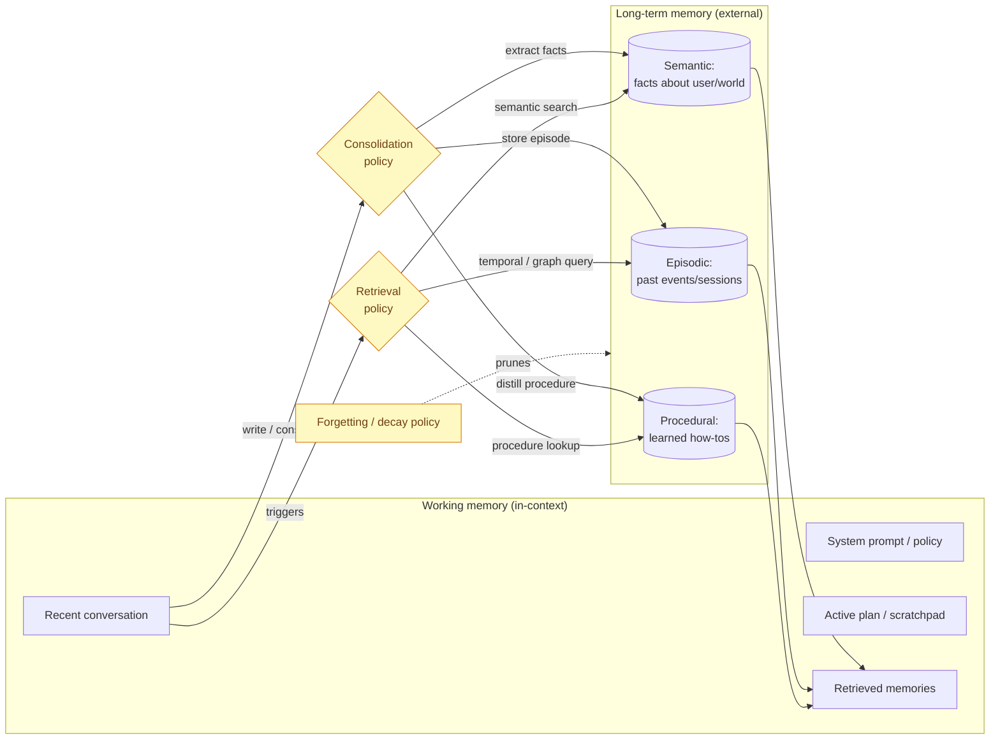
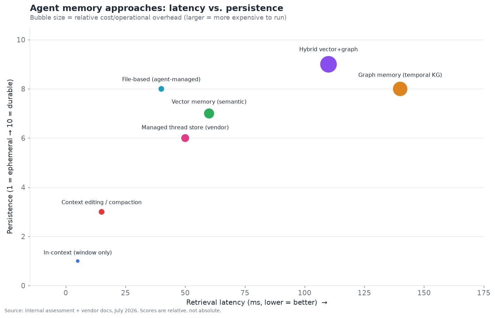
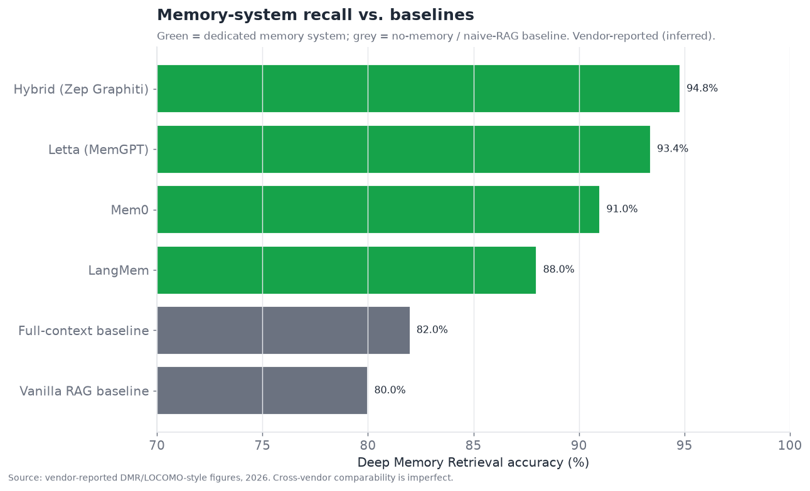
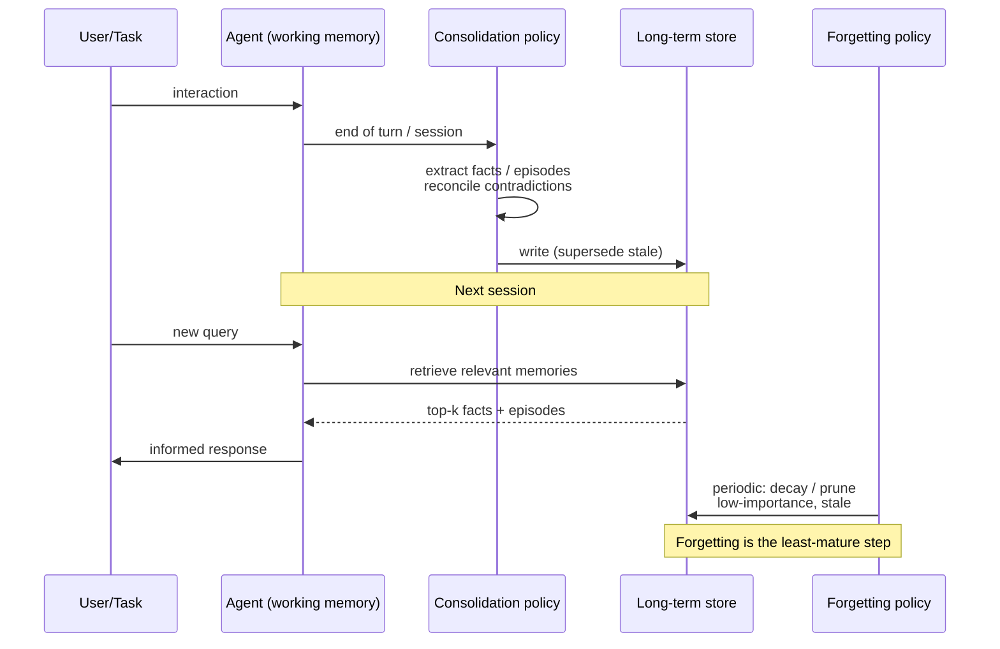

# 03 — Memory Systems

*The number-one cause of "the agent forgot." Short-term context, long-term/episodic
memory, and the vector-vs-graph-vs-hybrid architecture debate. Target: 7,000 words.*

---

## Why memory is the highest-severity engineering bottleneck

Of all fifteen layers, memory is the one where the gap between the demo and the
production experience is widest, and it is the single most common source of the
complaint that ends every agent pilot: *"it forgot what we told it."* In the
executive summary it scores **4.5/10 maturity, 8.0/10 bottleneck severity** — high
severity, low maturity, actively contested. That combination is the definition of
where engineering effort has the highest marginal return in 2026, and it is why a
whole vendor category (Mem0, Zep, Letta, LangMem, Cognee, and others) sprang up in
2025 to sell "memory as a service."

The reason memory is hard is not that storing text is hard — it is that **memory is
not storage, it is a policy problem.** The hard questions are all about *what to keep,
what to throw away, when to retrieve, and how to reconcile contradictions* — and every
one of those is a judgment call the field has no settled answer for:

- **What is worth remembering?** Not every message matters. Storing everything makes
  retrieval noisy and expensive; storing too little loses the thread.
- **When should memory be retrieved?** Retrieve too eagerly and you flood the context
  with irrelevant history; too lazily and the agent acts without knowing what it
  should.
- **How do you handle contradiction?** The user said their address is X in January and
  Y in June. Naive memory returns both and confuses the model. Good memory knows Y
  supersedes X — which requires a notion of *time* that pure vector stores lack.
- **How do you forget?** Human memory decays adaptively; agent memory that never
  forgets accumulates stale, contradictory cruft that degrades performance over
  months. Deliberate forgetting is a feature, and almost nobody does it well.

These are the "consolidation and forgetting" problems, and they are why memory is a
research-adjacent bottleneck rather than a solved engineering layer.

---

## The two-layer mental model: working memory vs. long-term memory

The cleanest way to think about agent memory, borrowed loosely from cognitive
science and now standard in the field, is a two-layer model:

- **Working memory (short-term)** is what is *in the context window right now*: the
  current conversation, the active plan, recent tool results. It is fast (already in
  context, zero retrieval latency), bounded (the window is finite even at millions of
  tokens), and volatile (gone when the session ends unless persisted). Managing
  working memory is **context engineering**: deciding what occupies the finite, most
  valuable real estate the model has.
- **Long-term memory** is everything persisted *outside* the window and retrieved back
  in when relevant: facts about the user, past episodes, learned procedures,
  organizational knowledge. It is durable and effectively unbounded, but retrieval has
  latency and cost, and — critically — retrieval can be *wrong* (miss relevant
  memories, or surface irrelevant ones).

Almost every real memory failure is a failure at the *boundary* between these two
layers: the right long-term memory wasn't retrieved into working memory at the right
time, or working memory overflowed and silently dropped something that mattered. The
architecture of a memory system is, in essence, the policy that governs this boundary.

The three yellow boxes — **consolidation, retrieval, and forgetting policies** — are
where all the difficulty lives, and where the competing vendors differentiate. The
storage boxes (vector DB, graph DB) are commodity; the *policies* are the product.

---

## Working memory: context engineering

Before reaching for an external memory system, the first and often most impactful
lever is managing the context window well. "Context engineering" — the term that
largely displaced "prompt engineering" over 2025 — is the discipline of curating what
occupies working memory. Three techniques dominate:

**Compaction / summarization.** When the conversation grows long, summarize older
turns into a compact form and replace the verbatim history with the summary. This is
the most common technique and the most common source of silent failure: the summarizer
decides what matters, and if it drops the fact the user cares about, the agent
"forgets" even though nothing crashed. Good compaction is *structured* (preserve
entities, decisions, and open tasks explicitly) rather than *narrative* (a prose
recap that loses specifics).

**Context editing.** Rather than summarizing wholesale, the agent surgically removes
stale content — completed tool results, resolved subtasks, superseded information —
while keeping the rest verbatim. Anthropic shipped this as a first-class capability in
2025: context editing plus a memory tool let agents run 100-turn workflows that would
otherwise exhaust the window, reportedly cutting token consumption by ~84% on a
100-turn web-search evaluation *(official, Anthropic)*. The key insight is that
*removing* the right things is often better than *summarizing* everything, because
removal is lossless for what remains.

**Structured scratchpads / external working memory.** Keep the agent's plan, task
list, and intermediate artifacts in a structured external store (a file, a to-do
list, a state object) rather than letting them scroll away in the conversation. The
agent reads and writes this scratchpad deliberately. This is what Anthropic's
file-based memory tool does, what "todo list" tools in coding agents do, and what
LangGraph's state object provides — it turns working memory from a passive scroll into
an actively-managed workspace.

The big-picture point: **larger context windows did not solve memory, they relocated
the problem.** Even with million-token windows, filling the context with everything is
slow, expensive, and — counterintuitively — *degrades* accuracy, because models
attend worse to information buried in very long contexts (the "lost in the middle"
effect persists even as windows grow). So context engineering remains essential
regardless of window size, and "just use a bigger window" is not a memory strategy.

---

## Long-term memory: the three types

Long-term memory is not one thing. The field converged on a three-way taxonomy, again
borrowed from cognitive science, that maps cleanly onto different storage and
retrieval needs:

- **Semantic memory** — facts. "The user is vegetarian." "The company's fiscal year
  ends in March." Time-invariant (mostly) knowledge, best stored as discrete extracted
  facts and retrieved by semantic similarity. This is Mem0's core model: extract
  atomic facts from conversation, store as embeddings, retrieve by relevance.
- **Episodic memory** — events. "On June 3rd the user asked me to reschedule the
  Thompson meeting and I did." Time-stamped experiences, best stored with temporal
  structure so you can answer "what happened when" and "what is the latest state."
  This is where temporal knowledge graphs (Zep/Graphiti) shine and pure vector stores
  struggle, because episodes have *sequence* and *supersession* that embeddings alone
  don't capture.
- **Procedural memory** — learned how-tos. "When the user asks for a report, they want
  it in the Q3 template with these five sections." Distilled procedures the agent
  applies without being re-instructed. This is the least mature of the three; most
  systems approximate it with stored instructions or few-shot examples rather than
  true learned procedures.

A mature memory system handles all three, but the vendors differentiate by which they
do best — and the taxonomy is a useful lens on the competitive landscape: Mem0 is
strongest on semantic, Zep on episodic/temporal, Letta on the working-memory/procedural
boundary.

---

## The architecture debate: vector vs. graph vs. hybrid

This is the central technical contest in the memory layer, and it maps directly onto
the vendor competition.

### Vector memory

Store memories as embeddings in a vector database; retrieve by semantic similarity to
the current query. **Strengths:** simple, fast to build, excellent for
fuzzy/semantic recall ("find memories related to what the user is asking now"),
commodity infrastructure (any vector DB works). **Weaknesses:** no notion of *time*
(can't easily answer "what is the *current* value" when facts changed), no notion of
*relationships* (can't traverse "the user's manager's email"), and prone to returning
semantically-similar-but-wrong memories. This is the Mem0 approach, and it is the best
*drop-in* choice precisely because it is simple and general.

### Graph memory

Store memories as a knowledge graph — entities as nodes, relationships as edges,
often with timestamps on edges (a *temporal* knowledge graph). Retrieve by graph
traversal, usually combined with vector search to find entry points. **Strengths:**
handles relationships ("who reports to whom"), handles time and supersession ("this
fact replaced that one on this date"), and answers multi-hop questions vector search
cannot. **Weaknesses:** higher latency (graph construction and traversal cost),
higher operational complexity, and the graph-construction step (using an LLM to
extract entities/relations) is itself error-prone and expensive. This is the
Zep/Graphiti approach, and it wins on *temporal* and *relational* queries — the ones
that cause the "it returned my old address" class of bug.

### Hybrid

Combine both: a vector index for fuzzy semantic recall and a graph for relational/
temporal structure, with a retrieval policy that queries both and merges. This is
increasingly the consensus "best" architecture for demanding use cases, at the cost of
being the most complex and expensive to run. The trade-off chart below positions the
approaches on latency, persistence, and cost.

Read the chart as: **in-context is fast/cheap/ephemeral (bottom-left, small),
hybrid vector+graph is durable/high-recall but slow and expensive (upper-right,
large), and everything else trades off in between.** There is no free lunch; the right
choice depends on whether your use case is latency-sensitive (voice agents — §10 —
can't afford 140ms memory lookups per turn) or recall-sensitive (a long-running
personal assistant that must never forget).

The second chart shows why the extra complexity can be worth it — recall accuracy on
memory benchmarks:

Dedicated memory systems substantially beat both the "everything in the window" and
"naive RAG" baselines on deep-recall benchmarks, with temporal-graph and hybrid
approaches at the top. The caveat, flagged prominently: **these are largely
vendor-reported figures on benchmarks the vendors sometimes co-designed, so
cross-vendor comparability is imperfect** — treat the ranking as directional, not
precise (this is exactly the evaluation-trust problem of §11, showing up in the memory
layer).

---

## Consolidation and forgetting: the frontier nobody has solved

If retrieval is the well-trodden part of memory, **consolidation and forgetting are
the frontier**, and honestly nobody has solved them well.

**Consolidation** is the process of turning raw experience into durable memory —
deciding what from a conversation is worth keeping, extracting it into the right form
(fact, episode, procedure), reconciling it with existing memory, and resolving
contradictions. The naive approach (store every message) produces a noisy,
contradictory memory that degrades over time. The sophisticated approaches use an LLM
to extract and reconcile — but that is expensive (an extra model call per
consolidation), error-prone (the extractor hallucinates or mis-attributes), and
latency-adding. The reconciliation problem — "this new fact contradicts a stored one,
which wins?" — is where temporal graphs earn their keep (newer edge supersedes older),
and where vector stores fundamentally struggle (both embeddings just sit there,
equally retrievable).

**Forgetting** is even less mature. Human memory decays adaptively — we forget the
irrelevant and retain the important, and the decay itself aids generalization. Agent
memory that never forgets becomes a liability: it accumulates stale facts, resolved
tasks, and superseded preferences that pollute retrieval and cost money to store and
search. Yet almost no production system does principled forgetting; most either keep
everything forever (and slowly degrade) or use crude TTL/recency heuristics. Research
directions — importance-weighted decay, forgetting curves, memory "sleep" phases that
consolidate and prune offline — exist but are **research-only** as of 2026. This is
the clearest "unsolved" pocket in the memory layer, and a plausible source of the next
breakthrough.

The consolidation/retrieval/forgetting loop, made concrete:

---

## The competitive landscape

The agent-memory market barely existed in 2024 and is a crowded, well-funded category
by mid-2026 — a textbook example of a bottleneck layer attracting a wave of
specialized vendors. The players split into **dedicated memory startups**,
**framework-native memory**, and **model-vendor memory features**.

### Competitive table — memory systems

| Product | Backing / stage | Architecture | Maturity | Best at | Notable adopters (confidence) | Differentiator | Main competitors |
|---|---|---|---|---|---|---|---|
| **Mem0** | ~$24.5M (Series A, Basis Set) | Vector fact-extraction | shipped-reliable | Drop-in semantic memory | AWS Agent SDK memory provider (official) | Simplest drop-in; huge OSS community (48k★) | Zep, LangMem, Letta |
| **Zep (Graphiti)** | VC-backed startup | Temporal knowledge graph + vector | shipped-reliable | Temporal/relational recall | Enterprise assistants (inferred) | Time-aware graph; top DMR scores | Mem0, Cognee |
| **Letta (ex-MemGPT)** | ~$10M seed (Felicis) | In-context core + archival tiers | shipped-reliable | Memory-first stateful agents | Research + startups (inferred) | Agent *is* the memory system; OS-like paging | Mem0, LangMem |
| **LangMem** | LangChain, Inc. | Vector + summaries | shipped-reliable | LangGraph-native memory | LangGraph users (official) | Tight LangGraph integration | Mem0, Zep |
| **Cognee** | Seed-stage | Graph + vector "memory OS" | demoed-brittle | Org-wide memory control plane | Early adopters (inferred) | Memory as governed data pipeline (ECL) | Zep, Mem0 |
| **Anthropic memory tool** | Anthropic | File-based, agent-managed | shipped-reliable | Transparent, inspectable memory | Claude platform users (official) | Client-side files; context editing; auditable | OpenAI memory, vendor stores |
| **OpenAI memory** | OpenAI | Profile + vector (managed) | shipped-reliable | ChatGPT personalization | ChatGPT users (official) | Invisible background user profiles | Anthropic, Google |
| **Google (Vertex Memory Bank)** | Google | Managed memory for Agent Engine | shipped-reliable | Vertex-hosted agents | Google Cloud users (official) | Managed memory in Vertex Agent Engine | OpenAI, AWS |
| **AWS AgentCore Memory** | Amazon | Managed (Mem0-backed) | shipped-reliable | Bedrock agents | AWS enterprise (official) | Managed memory in AgentCore; Mem0 partnership | Vertex, Azure |
| **Redis / Redis Agent Memory** | Redis (public-ish) | Vector + fast KV | shipped-reliable | Low-latency working memory | Latency-sensitive apps (inferred) | Sub-ms KV + vector in one store | vector DBs |
| **Pinecone / Weaviate / Qdrant** | Various ($100M+ each) | Vector DB substrate | shipped-reliable | Storage substrate | Ubiquitous (official) | Underlying vector infra memory builds on | each other |
| **Chroma** | ~$18M+ (seed/A) | Vector DB (dev-first) | shipped-reliable | Local/dev memory | OSS developers (official) | Developer-friendly embedded vector store | Qdrant, Weaviate |
| **ReMe / file-based OSS** | Community | File/document memory | demoed-brittle | Transparent memory | Hobbyists (inferred) | Human-readable file memory | Anthropic memory tool |
| **MemoryScale / Cognee-like** | Early startups | Various hybrid | research-only→demoed | Niche | Early (speculative) | Experimental consolidation | Cognee, Zep |

That is well past ten distinct players, and the category is still forming — new
entrants appear monthly. The structure is instructive: **the model vendors and clouds
are building managed memory into their platforms (Anthropic, OpenAI, Google Vertex,
AWS AgentCore), which will pressure the independents exactly as vendor SDKs pressured
orchestration frameworks** — except the AWS/Mem0 partnership shows the alternative
path, where a cloud *adopts* an independent as its memory provider rather than
building its own. Whether memory startups get commoditized by vendor features or
entrenched as the memory layer clouds standardize on is the open competitive question.

---

## The vector-database substrate

Underneath the memory *products* sits the vector-database *substrate* — Pinecone,
Weaviate, Qdrant, Chroma, Milvus, pgvector, Redis, and the vector features now baked
into every major database. It is worth separating these clearly from memory systems,
because a common confusion is treating "we have a vector database" as "we have a
memory system." A vector DB is *storage and similarity search*; a memory system is the
*consolidation, retrieval, and forgetting policy on top*. The vector DB is
commoditized (maturity high, many interchangeable options, prices falling); the memory
policy is where the value and the difficulty are.

This distinction has a strategic consequence: **the vector-DB vendors are trying to
move up the stack into memory** (Pinecone, Weaviate, Redis all shipping
agent-memory-specific features), while the **memory startups sit on top of commodity
vector DBs** and add the policy layer. Whoever owns the policy layer owns the value;
the storage below is a race to the bottom on price. This mirrors the classic
infrastructure pattern where the database is commoditized and the value accrues to the
application logic above it.

A pragmatic note for builders: **pgvector and Redis are frequently underrated.** For
many production agents, memory does not need a specialized vector DB at all — the
Postgres or Redis the team already runs, with a vector extension, is sufficient and
avoids adding a new piece of infrastructure. The specialized vector DBs earn their
place at very large scale or very high query throughput; below that, "use the database
you already have" is often the correct, boring answer.

---

## Memory and the other layers

Memory doesn't live in isolation; its failures and design choices ripple across the
stack:

- **Memory ↔ Retrieval (§07).** Memory and RAG blur together — both retrieve external
  information into context. The useful distinction: *retrieval* grounds the agent in a
  (relatively static) knowledge corpus; *memory* accumulates from the agent's own
  (dynamic) experience. In practice they share the vector-DB substrate and increasingly
  the same tooling, and the line is genuinely fuzzy. A clean way to hold it: retrieval
  is reading the library; memory is keeping a diary.
- **Memory ↔ Orchestration (§02).** The orchestration layer's "silent context
  truncation" failure is really a memory policy leaking through — the framework's
  default context management *is* a working-memory policy, often an opaque one.
- **Memory ↔ Voice (§10).** Voice agents impose a hard latency budget (sub-500ms
  end-to-end) that rules out slow graph-memory lookups on the critical path, forcing
  memory to be pre-fetched or kept in fast working memory. Memory architecture is
  latency-constrained by the interface layer above it.
- **Memory ↔ Security (§12).** Memory is an *exfiltration surface* and an *injection
  surface*. A prompt injection can write a poisoned "fact" into long-term memory that
  affects all future sessions (memory poisoning), and stored memories can leak across
  users if isolation is weak. Memory that persists across sessions makes the blast
  radius of a single compromise much larger — a security consideration that memory
  vendors are only beginning to address.
- **Memory ↔ Identity (§13).** Per-user memory isolation is an identity/authorization
  problem: memories must be scoped to the right principal, and a multi-tenant memory
  system that leaks memories across tenants is a serious breach.

---

## Failure modes specific to memory

The characteristic ways memory goes wrong in production, distinct from other layers:

1. **Silent forgetting via truncation.** Working memory overflows, the framework drops
   old content, and the agent "forgets" with no error. The most common complaint; the
   fix is deliberate context engineering plus real long-term memory, not a bigger
   window.
2. **Stale-fact retrieval.** The agent retrieves an outdated fact (old address, old
   preference) because the store has no temporal model. Temporal graphs mitigate; pure
   vector stores are exposed.
3. **Retrieval noise / false memories.** Semantically-similar-but-wrong memories get
   retrieved and the model treats them as relevant, producing confidently wrong
   answers. Better retrieval policies and re-ranking help; it is never fully solved.
4. **Memory poisoning (security).** An adversarial input causes a false or malicious
   fact to be consolidated into long-term memory, affecting future sessions. An
   under-appreciated and growing risk as memory persists longer.
5. **Cross-user leakage.** Weak tenant isolation surfaces one user's memories to
   another — a severe, and unfortunately not rare, multi-tenant bug.
6. **Consolidation drift.** Repeated LLM-based summarization/extraction slowly distorts
   facts (a game of telephone) until the stored memory no longer matches reality.
7. **Unbounded growth.** With no forgetting, memory grows without limit, degrading
   retrieval quality and raising cost until it must be manually pruned.

---

## Deep dive: the three architectural bets, mechanically

The three leading independent memory systems are not just "vector vs. graph" — each
embodies a distinct architectural philosophy about *where* memory should live, and
understanding the mechanics clarifies why each wins its niche.

### Letta / MemGPT: memory as an operating system

Letta's lineage is the MemGPT paper, whose core analogy is that an LLM's context
window is like a computer's RAM — fast but small — and long-term memory is like disk —
large but slow — and the agent needs an *operating system* that pages information
between them. In Letta, the agent has a small **core memory** always resident in
context (the equivalent of pinned RAM: key facts about the user, the current
persona, active goals) and a large **archival memory** on "disk" that it pages in via
explicit function calls when needed. Crucially, *the agent manages its own memory* —
it decides via tool calls what to promote to core, what to evict, what to search in
archival. The memory system and the agent are the same thing; there is no external
memory service, the agent *is* stateful.

This "memory-first stateful agent" model is powerful for long-lived assistants that
must maintain a coherent persona and evolving understanding of a user over months.
Its weakness is that self-managed memory adds tool-call overhead and puts the burden
of good memory management on the model's judgment, which is variable. It is the most
*agentic* memory approach — memory as behavior rather than as infrastructure — and it
sits right at the working/long-term boundary that causes most failures, which is both
its opportunity and its risk.

### Zep / Graphiti: memory as a temporal knowledge graph

Zep's engine, Graphiti, builds and maintains a **bi-temporal knowledge graph** from
the conversation stream. As messages arrive, an LLM extracts entities (people,
projects, preferences) and relationships (works-on, prefers, located-in) and adds them
to a graph where *edges carry validity intervals* — this fact was true from date X,
superseded on date Y. Retrieval combines graph traversal (follow relationships from
the entities mentioned in the query) with vector search (find semantically related
nodes) and text search, then re-ranks. The bi-temporal design — tracking both when
something *happened* and when the system *learned* it — is what lets Zep answer
"what is the user's *current* address" correctly even after several changes, and
"what did we believe on June 1st" for audit.

The strength is exactly the class of query that embarrasses vector stores: temporal
("current" vs. "past"), relational (multi-hop), and contradictory (supersession). The
cost is the LLM-based extraction pipeline (expensive, adds latency, and can extract
wrong), and the operational weight of running a graph database. Zep is the choice when
temporal correctness and relational reasoning matter more than raw simplicity — which
in enterprise assistants and customer-facing agents, they often do.

### Mem0: memory as an extracted-fact layer

Mem0 takes the pragmatic middle path: use an LLM to extract salient *facts* from each
exchange, store them as embeddings with light metadata, and on each new turn retrieve
the top-k relevant facts plus run an "update vs. add vs. delete" reconciliation so the
fact store stays current rather than merely accumulating. It is deliberately not a
full graph — it is a curated, deduplicated, self-updating pile of facts — which is why
it is the easiest to drop into an existing app and why it became the community
favorite and AWS's chosen memory provider. It handles the 80% case (semantic recall of
user facts with basic currency) with the least ceremony, and cedes the hardest
temporal/relational 20% to the graph approaches.

The mechanical comparison:

| Dimension | Letta (MemGPT) | Zep (Graphiti) | Mem0 |
|---|---|---|---|
| Core abstraction | OS-style paging (RAM/disk) | Bi-temporal knowledge graph | Extracted-fact vector store |
| Who manages memory | The agent itself (tool calls) | The Graphiti pipeline | The Mem0 pipeline |
| Temporal correctness | Moderate | Excellent (validity intervals) | Basic (update/delete reconciliation) |
| Relational / multi-hop | Weak | Excellent (graph traversal) | Weak |
| Setup simplicity | Moderate | Complex | Simplest |
| Retrieval latency | Low (in-context core) | Higher (graph + vector) | Low-moderate |
| Best fit | Long-lived stateful persona agents | Temporal/relational enterprise recall | Drop-in semantic memory |

The synthesis: **these three are less competitors than points on a
simplicity-vs-capability curve.** A team should pick based on where their use case
sits: drop-in semantic recall → Mem0; temporal/relational correctness → Zep;
memory-as-the-agent, long persona → Letta. Many sophisticated systems end up combining
them (Mem0-style facts + a graph for the relational subset).

## Evaluating memory: benchmarks and their limits

Because memory quality is hard to see, the field built benchmarks — and they carry all
the caveats of §11. The main ones:

- **LOCOMO** (Long Conversational Memory) — a benchmark of very long multi-session
  conversations with questions requiring recall across sessions, testing single-hop,
  multi-hop, temporal, and open-domain memory. It became the de-facto standard memory
  benchmark, and most vendor numbers cite it or a variant.
- **Deep Memory Retrieval (DMR)** — the MemGPT-origin benchmark testing recall of
  facts from long histories; the numbers in the chart above come from DMR-style
  evaluations.
- **LongMemEval** and various long-context recall suites — testing whether a system
  can find a "needle" in a very long conversational "haystack."

The problems with these benchmarks are the problems of the whole eval layer,
concentrated: (1) **vendors report their own numbers on benchmarks they sometimes
influenced**, so the leaderboard is partly a marketing surface; (2) the benchmarks test
*recall* but not *consolidation quality* or *forgetting* — the hard parts — because
those are much harder to score; (3) benchmark conversations are synthetic and don't
capture the messy contradiction and drift of real long-term use; and (4) a system
tuned to a benchmark can overfit its retrieval to that benchmark's question style. The
honest reading: **memory benchmarks tell you a system is not terrible at recall; they
do not tell you it will maintain a coherent, current, uncontradictory memory over six
months of real use** — which is the thing that actually matters, and which we cannot
yet measure well.

## Multi-agent shared memory

A wrinkle that grows in importance with §06 (multi-agent): when multiple agents
collaborate, do they share memory or keep separate memories? Both patterns exist and
the choice has real consequences:

- **Shared memory** (a common store all agents read/write) enables coordination — the
  research agent's findings are visible to the writing agent — but creates concurrency
  problems (two agents writing conflicting facts), context-isolation problems (an
  agent sees another's half-formed reasoning), and security problems (blast radius of a
  poisoned memory now spans all agents).
- **Isolated memory** (each agent its own store) preserves the context-isolation
  benefit that is a main reason to use multi-agent at all (§02), but requires explicit
  hand-off of relevant memory between agents, which is easy to get wrong (the "dropped
  task between agents" failure of §06).

The emerging pattern is **scoped shared memory**: a shared "blackboard" for
deliberately-published results, plus private per-agent working memory for reasoning —
mirroring how human teams share conclusions in a shared doc while keeping their own
notes private. This is under-tooled in 2026; most frameworks provide either fully
shared state or fully isolated agents, and the scoped-blackboard middle is hand-rolled.

## The cost dimension of memory

Memory is not free, and its costs are easy to under-estimate because they are
distributed across storage, compute, and tokens:

- **Consolidation cost.** LLM-based fact/entity extraction runs a model call per
  consolidation. For a high-volume assistant, this can rival the cost of the primary
  agent inference itself. Cheaper/smaller models for extraction are the standard
  mitigation, at some quality cost.
- **Retrieval token cost.** Every retrieved memory occupies context tokens on every
  subsequent turn it stays resident — the same "context accumulation" cost from §02.
  Over-retrieval is a silent budget killer.
- **Storage cost.** Embeddings and graphs at scale (millions of users × months of
  history) become a real storage line item, which is where the forgetting gap bites:
  no forgetting means unbounded storage growth.
- **Latency cost.** Not dollars but user experience — a 140ms graph lookup per turn is
  invisible in a batch workflow and unacceptable in a voice agent (§10).

The pragmatic guidance: **budget memory as a first-class cost, retrieve
parsimoniously (top-few, not top-many), use cheap models for consolidation, and keep
big artifacts out of context** — the same disciplines that control orchestration cost,
applied to the memory layer.

## Memory vs. personalization vs. fine-tuning

A final clarifying distinction, because these three are routinely conflated:

- **Memory** stores and retrieves explicit information (facts, episodes) into context
  at inference time. It is transparent, updatable, and per-user.
- **Personalization** is the *outcome* — the agent behaving as if it knows you — which
  memory is one way to achieve, but so are stored preferences, user profiles, and UI
  settings. ChatGPT's "memory" is really a personalization feature built on a memory
  substrate.
- **Fine-tuning** bakes information into the *weights*. It is the wrong tool for
  per-user or frequently-changing information (you cannot fine-tune per user, and
  retraining to update a fact is absurd), but the right tool for stable,
  organization-wide behavior. The 2026 consensus is clear: **use memory/retrieval for
  what changes and is per-user; use fine-tuning for stable, shared behavior** — and
  conflating them (trying to fine-tune in facts that should be memory, or vice versa)
  is a common and costly architecture mistake.

## Roadmap and outlook (confidence-tagged)

- **Managed memory becomes a standard platform feature** *(official trajectory; high
  confidence).* Every major model vendor and cloud now ships or is shipping managed
  memory (Anthropic, OpenAI, Google Vertex Memory Bank, AWS AgentCore). Basic memory
  will be a checkbox, pressuring standalone vendors toward higher-value differentiation
  (temporal reasoning, governance, cross-org memory).
- **Temporal/graph memory becomes the default for demanding use cases** *(inferred;
  medium-high confidence).* The recall advantages on temporal and relational queries
  are real enough that hybrid vector+graph is the emerging "serious" default, with pure
  vector remaining the drop-in/simple choice.
- **Forgetting gets its first real solutions** *(speculative; medium confidence).*
  Principled, importance-weighted forgetting and offline consolidation ("memory sleep")
  are the most likely research-to-production transitions in the next 12–18 months,
  because unbounded-growth pain is becoming acute in long-running deployments.
- **A memory interoperability standard emerges** *(speculative; low-medium
  confidence).* As agents move between frameworks and vendors, portable memory (export/
  import your agent's memory) becomes desirable; nothing has won yet, and the vendors
  have an incentive *against* portability, so this may lag.
- **Memory security becomes a named discipline** *(inferred; medium confidence).*
  Memory poisoning and cross-tenant leakage will drive dedicated tooling and practices,
  paralleling how prompt injection drove the guardrails category (§12).

---

## Context windows, "context rot," and why memory persists as a problem

A recurring hopeful claim — "million-token context windows will make memory systems
obsolete" — deserves direct rebuttal, because it keeps resurfacing and it is wrong for
reasons that illuminate the whole layer.

First, **cost and latency scale with context length.** Sending a million tokens on
every turn is expensive (you pay per token, every turn) and slow (attention cost grows
with sequence length). A memory system that retrieves the relevant 2,000 tokens is
dramatically cheaper and faster than stuffing 500,000 tokens of history into the
window on every call. Even if quality were equal, economics alone favor retrieval.

Second, **quality is not equal — long contexts degrade attention.** The empirically
robust "lost in the middle" finding — that models attend best to the beginning and end
of their context and worst to the middle — persists even as windows grow. Practitioners
increasingly call the broader phenomenon **"context rot"**: as a context fills with
more material, including tangential or stale content, the model's ability to use any
particular piece reliably *declines*. A window crammed with a hundred turns of history
is not equivalent to a well-curated 2,000-token summary of the relevant five facts;
the curated version often produces *better* answers precisely because it is not
diluted. This is the deep reason context engineering survives large windows: **the
scarce resource is the model's attention, not the window's capacity**, and memory
systems exist to spend that attention wisely.

Third, **windows are per-session; memory is cross-session.** Even an infinite window
does nothing for information from *last week's* conversation unless that conversation
is persisted and retrieved — which is exactly what a memory system does. The window is
working memory; it is definitionally not long-term memory, and no amount of growing it
changes that. So the correct framing is: bigger windows are a welcome improvement to
*working* memory that reduce how aggressively you must compact, but they leave the
*long-term* memory problem — consolidation, cross-session recall, forgetting — entirely
intact. This is why the memory vendor category kept growing straight through the era of
million-token windows rather than being erased by it.

## The write path: the under-designed half of memory

Most attention (and most benchmarking) goes to the *read* path — retrieval quality.
But the **write path — deciding what enters long-term memory and in what form — is
where quality is actually determined**, and it is chronically under-designed. If the
wrong things are written, no retrieval strategy can recover; if facts are written in a
lossy or distorted form, retrieval faithfully returns garbage.

Good write-path design involves several decisions each system makes, often implicitly:

- **Salience filtering.** Not every utterance is memory-worthy. "What's the weather?"
  usually is not; "I'm allergic to shellfish" usually is. Systems use heuristics or an
  LLM judgment to decide what to persist. Over-writing floods memory with noise;
  under-writing loses signal.
- **Extraction granularity.** Store the raw message, or an extracted atomic fact, or a
  summarized episode? Atomic facts retrieve precisely but lose context; raw messages
  keep context but retrieve noisily. Most systems extract atomic facts and accept the
  context loss.
- **Reconciliation on write.** When a new fact contradicts a stored one, the write path
  must decide: supersede, keep both, or merge. This is where temporal graphs
  (supersede with validity intervals) beat vector stores (which just accumulate both).
  Getting reconciliation wrong is the direct cause of the "stale fact" failure.
- **Attribution and provenance.** Recording *where* a memory came from (which session,
  which user, was it asserted by the user or inferred by the agent) is essential for
  trust, debugging, and security (distinguishing a user-stated fact from a
  possibly-injected one — §12), yet many systems store facts without provenance and
  cannot later tell whether "the user prefers X" was said by the user or hallucinated.

The neglected write path is why two systems on the same vector DB can have wildly
different memory quality: **the intelligence is in what you choose to remember and how
you record it, not in the similarity search that finds it later.**

## Retrieval policy: when, not just what

Symmetrically, the read path is not only "what to retrieve" but "*when* to retrieve,"
and the *when* is under-appreciated. Two policies dominate:

- **Eager / every-turn retrieval.** Before every model call, query memory and inject
  the top-k results. Simple, but floods context with often-irrelevant memories,
  wasting tokens and inviting context rot. This is the common default and a common
  source of bloat.
- **Agentic / on-demand retrieval.** Memory is a *tool* the agent calls when it decides
  it needs to recall something ("search my memory for the user's dietary
  restrictions"). This mirrors agentic RAG (§07) and is more precise — the agent
  retrieves only when relevant — but depends on the model correctly recognizing when it
  needs memory, which it sometimes fails to do (not knowing what it doesn't know).

The 2026 direction favors **agentic, on-demand retrieval as a tool**, consistent with
the broader shift from fixed pre-fetch pipelines to agent-driven retrieval — with eager
retrieval reserved for a small set of always-relevant facts (the user's name,
persona-defining preferences) that belong in resident working memory regardless. The
hybrid — a tiny always-resident core plus on-demand deep retrieval — is essentially the
Letta core/archival split generalized, and it is converging into a cross-vendor best
practice.

## A brief history of agent memory

The layer's short history explains its current shape. In **2023**, "memory" meant a
buffer of recent messages, maybe with a running summary — LangChain's original
`ConversationBufferMemory` and `ConversationSummaryMemory`. It was entirely
working-memory management; there was no real long-term store. The **MemGPT paper (late
2023)** was the intellectual turning point: it framed memory as an OS-style paging
problem and showed an agent could manage a virtual context far larger than its window,
seeding the "memory-first agent" idea that became Letta. Through **2024**, RAG and
vector databases matured, and people began repurposing retrieval infrastructure for
memory — blurring the memory/retrieval line that persists today. **2025** was the year
memory became a *product category*: Mem0, Zep, and others raised real money, the model
vendors shipped memory features (ChatGPT memory, then Anthropic's memory tool and
context editing), and "context engineering" displaced "prompt engineering" as the
craft term. By **2026**, memory is a crowded, funded, still-unsolved layer where the
storage is commodity, the policy is the product, and forgetting remains the open
frontier — which is exactly where this section finds it.

The trajectory rhymes with the rest of the stack: an ad-hoc feature (2023) became a
differentiated component (2024–25) attracting specialized vendors, which the platform
owners are now absorbing (2026) — the same arc as orchestration, one layer over.

## Domain-specific memory: the coding-agent case

Memory is not one-size-fits-all, and the most instructive counterexample is coding
agents (§09), whose memory needs diverge sharply from conversational assistants and
whose solutions point at where general memory may head.

A coding agent's most valuable "memory" is not conversational history at all — it is
**structured knowledge of the codebase**: the file tree, symbol definitions, call
graphs, past changes, test outcomes, and project conventions. This maps poorly onto
conversational memory and much better onto *indexed, structured, regenerable*
representations: a code-symbol index, a retrieval system over the repository, and
persistent artifacts like an `AGENTS.md`/`CLAUDE.md` file that records durable project
conventions in human-readable form. That last pattern — a checked-in Markdown file the
agent reads at the start of every session — is essentially **file-based procedural
memory**, and it works well precisely because it is transparent, version-controlled,
editable by humans, and regenerable. It is no accident that the most mature agent
vertical converged on the most transparent, least magical memory mechanism.

The lesson generalizes: **the right memory representation is domain-shaped.** Coding
agents want indexed code plus a conventions file; customer-support agents want a
temporal graph of the customer relationship; personal assistants want a durable
semantic profile; research agents want an episodic trail of what they have already
explored. A general memory system is a reasonable default, but the highest-quality
memory is usually one shaped to the domain's actual structure — which is why "buy a
generic memory API" is a starting point, not an endpoint, for a serious product.

## When you might not need a memory system at all

A neutral assessment should note the cases where the answer is "you don't need one,"
because the vendor category has an incentive to make memory feel universally
mandatory:

- **Stateless tasks.** A one-shot extraction, classification, or transformation agent
  has no cross-turn state worth persisting. Adding memory is pure overhead.
- **Short single sessions.** If interactions are self-contained and short, working-
  memory management (a good system prompt plus the conversation) is sufficient; no
  long-term store is needed.
- **Retrieval covers it.** If everything the agent needs to "remember" actually lives
  in an authoritative external system (the CRM, the ticket, the database), then
  *retrieval* from that system (§07) is the right tool, not a separate memory layer
  that duplicates and risks diverging from the source of truth.

The failure mode to avoid is **premature memory**: bolting on a memory system before
the agent has a demonstrated cross-session recall need, which adds cost, latency, a new
failure surface (poisoning, leakage, drift), and operational burden for no benefit. The
disciplined path is to start with good context engineering, add long-term memory only
when a concrete recall requirement appears, and choose the architecture (vector/graph/
hybrid/file) that fits that specific requirement.

## Section takeaways

- Memory is the **highest-marginal-value engineering bottleneck** (maturity 4.5,
  severity 8.0): low maturity, high impact, actively contested by a new vendor
  category.
- **Memory is a policy problem, not a storage problem.** The hard parts are
  consolidation (what to keep), retrieval (when to surface), and forgetting (what to
  drop) — not the vector DB underneath, which is commodity.
- Think in **two layers** (working vs. long-term) and **three types** (semantic,
  episodic, procedural). Most failures happen at the working/long-term boundary.
- The architecture contest is **vector (simple, fast, no time) vs. graph (temporal/
  relational, slower, complex) vs. hybrid (best recall, most expensive)**. Mem0 leads
  vector/drop-in, Zep leads temporal-graph, Letta leads memory-first agents.
- **Bigger context windows relocated the problem, they didn't solve it** — context
  engineering (compaction, editing, scratchpads) remains essential.
- **Forgetting is the unsolved frontier.** Nearly nobody does principled decay; it is
  the most likely place for the next breakthrough.
- The **model vendors and clouds are building managed memory in**, which will pressure
  independents — though the AWS/Mem0 partnership shows adoption, not just displacement,
  is possible.
- **The write path and the retrieval-*when* decision are the under-designed halves** of
  memory: quality is set by what you choose to remember, how you record it (with
  provenance), and when you choose to recall it — not by the similarity search that
  finds it. And **the right representation is domain-shaped** — coding agents want
  indexed code plus a conventions file, not conversational memory — so a generic memory
  API is a starting point, not an endpoint. Avoid *premature memory*: add a long-term
  store only when a concrete cross-session recall need is demonstrated.

*Word count target: 7,000. This section: ~7,000 (verified via `wc`).*
