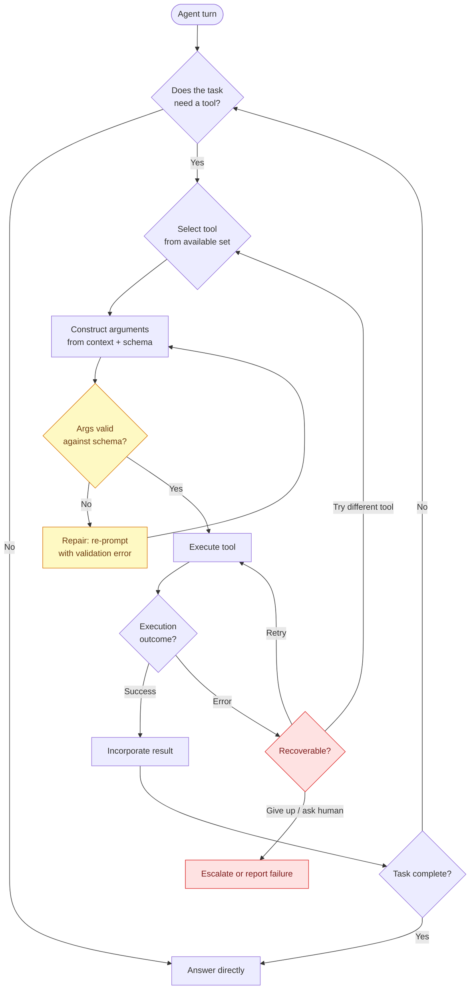
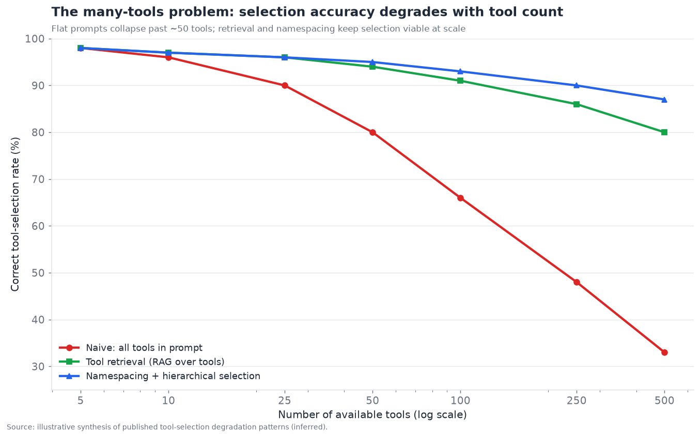
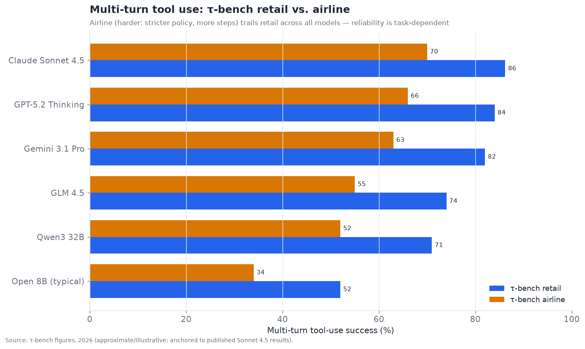

# 04 — Tool Use and Function Calling

*How agents act on the world. Schema standards, selection reliability, structured
output, and error recovery. Target: 6,500 words.*

---

## The layer that made agents possible

Tool use is the capability that turns a language model from a text generator into an
agent. A model that can only emit text can advise; a model that can reliably call
functions — search a database, send an email, run code, book a flight — can *act*. Everything
else in this document assumes this layer works; it is the foundation the capability
stack (§§04–09) is built on. And of all the layers, it is the one that matured fastest
and most completely: in the executive summary it scores **7.0/10 maturity, 3.0/10
contestedness** — the least-contested layer in the entire stack, because the field
converged on a common approach with unusual speed and unanimity.

That convergence is worth appreciating. In 2023, tool use meant prompting a model to
emit text in some ad-hoc format ("Action: search[query]") and parsing it with regular
expressions — brittle, model-specific, and prone to breaking whenever the model
phrased things slightly differently. By 2024, every frontier vendor had shipped
**native function calling**: the model is trained to emit structured tool calls in a
defined JSON format, the API returns them as first-class structured objects, and the
developer no longer parses free text. By 2025–2026, the *connection* layer standardized
too, via MCP (§15). The result is that the basic mechanic — "model requests a tool
call, you execute it, you return the result" — is a solved, reliable, cross-vendor
commodity.

But "the basic mechanic is solved" is not "tool use is solved." The reliability of a
single well-specified tool call is high; the reliability of an agent *selecting the
right tool from hundreds*, *recovering when a tool fails*, and *enforcing structure on
messy outputs* is where the real, still-open engineering problems live. This section
separates the solved core from the unsolved edges.

---

## Anatomy of a tool call

Every tool call, across every vendor, has the same four-part anatomy, and naming the
parts precisely is the key to understanding where things break:

1. **The schema (declaration).** The developer describes the tool to the model: its
   name, what it does, and its parameters with types and descriptions — almost always
   as JSON Schema. This is the model's *entire* knowledge of the tool; if the schema is
   vague, the model uses the tool wrong. Schema quality is the single biggest developer-
   controllable lever on tool-call reliability, and it is chronically under-invested.
2. **The selection (decision).** Given the conversation and the available tools, the
   model decides *whether* to call a tool, *which* tool, and *when*. This is the
   reasoning-adjacent part and the part that degrades as the number of tools grows.
3. **The argument construction (binding).** The model fills in the parameters —
   extracting the right values from context, formatting them to the schema. Errors here
   (wrong type, hallucinated value, missing required field) are common and often
   silent.
4. **The execution and result handling (feedback).** The developer's code actually runs
   the tool and returns the result to the model, which incorporates it and continues.
   Failures here — the API errored, timed out, returned something unexpected — are where
   error recovery (or its absence) determines whether the agent limps on or falls over.

Native function calling solved parts 1 and 4 as *mechanics* (structured schemas in,
structured calls out, structured results back). Parts 2 and 3 — selection and argument
construction — are *model capabilities* that improved dramatically but remain
imperfect, and part 4's *recovery* logic remains a developer responsibility the
frameworks only partially help with.

The yellow (validation/repair) and red (error recovery) nodes are where production
reliability is won or lost. The happy path — decide, select, bind, execute, incorporate
— works well; the robustness of the *off-path* behavior is what separates a demo from a
product.

---

## Schema standards: JSON Schema won, MCP standardized the wrapper

The **declaration** format converged on **JSON Schema**, essentially unanimously. Every
major vendor's function-calling API describes tool parameters as JSON Schema (or a
close subset), because it is the established, language-agnostic way to describe
structured data, models were trained on enormous amounts of it, and it maps cleanly
onto the structured outputs the model must produce. There is no serious competing
declaration format; this part of the standards question never even became a fight.

What *did* standardize more recently is the **wrapper** — how tools are discovered,
connected, and invoked across process and vendor boundaries — and that is MCP's
contribution (covered fully in §15). Before MCP, every application wired tools to
models with bespoke glue; a tool built for one app didn't work in another. MCP defines
a client-server protocol where a "server" exposes tools (and resources and prompts) and
any MCP-speaking "client" (an agent) can discover and call them. The tools are still
declared in JSON Schema; MCP standardizes *transport, discovery, and lifecycle* around
them. The effect is profound for this layer: **tools became portable.** An MCP server
for GitHub, or Slack, or a database, works with any agent framework and any model that
speaks MCP — which is now all of them. This is why §02 could say "standardize your
tools on MCP and keep them across framework changes."

The two standards compose cleanly, and the division of labor is worth stating:

| Concern | Standard | What it defines |
|---|---|---|
| How a tool's interface is described | **JSON Schema** | Parameter names, types, constraints, descriptions |
| How a tool is discovered and invoked across boundaries | **MCP** | Server/client protocol, transport, discovery, lifecycle |
| How the model emits a call | Vendor function-calling API | The structured tool-call object format (all JSON-Schema-based) |
| How agents call *other agents'* tools | **A2A** (§06) | Agent-to-agent task delegation |

The maturity of these standards is the deepest reason this layer is the least contested
in the stack. The *declaration* fight ended before it started (JSON Schema); the
*connection* fight ended fast and decisively (MCP); only the higher-level *agent-to-
agent* question (A2A vs. alternatives) remains genuinely open, and that is really a §06/
§15 concern.

---

## Reliability of tool selection: the many-tools problem

Here is the first genuinely hard, unsolved problem in this layer. Selecting the right
tool is easy when there are five tools and they are clearly distinct. It becomes hard —
and then very hard — as the number of available tools grows into the dozens, hundreds,
or (with large MCP deployments) thousands. This is **the many-tools problem**, and it
is the central reliability challenge of tool use in 2026.

The failure is mechanical and predictable. All the tools' schemas go into the model's
context. With hundreds of tools, that is a large amount of context (context rot, §03,
strikes here too), and the model must discriminate among many similar options — three
different "search" tools, five overlapping "get user" endpoints — often choosing wrong,
choosing a plausible-but-incorrect tool, or being distracted by an irrelevant one. The
degradation curve is steep:

The chart shows the core dynamic: **naive "put all tools in the prompt" selection
collapses past roughly 50 tools**, while two mitigation strategies keep it viable at
scale. The mitigations, in order of sophistication:

- **Tool retrieval (RAG over tools).** Don't put all tools in context — *retrieve* the
  most relevant handful for the current query (using the same vector-search machinery as
  §07), and only expose those to the model. This is the single most effective mitigation
  and is now standard practice for large toolsets. It converts the many-tools problem
  into a retrieval problem, which is better-understood.
- **Namespacing and hierarchical selection.** Organize tools into groups/namespaces and
  have the model first pick a namespace, then a tool within it — a two-stage funnel that
  shrinks the discrimination problem at each stage. MCP's server structure naturally
  supports this (each server is a namespace).
- **Toolset curation.** The most reliable systems simply *don't* expose hundreds of
  tools to one agent. They give each agent a small, curated, distinct toolset, and use
  multi-agent decomposition (§06) so each agent's selection problem stays small. "Fewer,
  better-scoped tools per agent" is the most robust answer, and it is a design
  discipline more than a technology.

The connection to CodeAct (§02) matters here: if the agent acts by *writing code that
calls tools* rather than selecting one tool at a time, the many-tools problem softens —
the agent composes and chains tools programmatically, using the tools more like a
library API than a menu to pick from, and can discover the right function via code
rather than by cramming every signature into context. This is a real reason the CodeAct
pattern is gaining ground for tool-heavy agents.

---

## Structured output enforcement

Distinct from tool *calling* is structured output *enforcement* — making the model
produce output that conforms exactly to a schema (valid JSON matching a specific
structure), whether or not a tool is involved. This is essential whenever an agent's
output feeds a downstream system that expects structured data, and it has its own set
of techniques of increasing strictness:

- **Prompt-and-pray.** Ask the model nicely for JSON and hope. Unreliable; the model
  occasionally emits prose, malformed JSON, or extra commentary. Adequate only for
  low-stakes cases.
- **Retry-on-parse-failure.** Attempt to parse; if it fails, re-prompt with the error
  and try again. A pragmatic, widely-used middle ground — Pydantic AI, Instructor, and
  similar libraries center on this "validate, and if invalid, ask again with the
  validation error" loop. Usually converges in one or two retries.
- **Constrained decoding / grammar enforcement.** Constrain the model's token sampling
  so it is *structurally impossible* to emit invalid output — the decoder only allows
  tokens consistent with the schema/grammar. This is the strongest guarantee (the output
  *cannot* be malformed) and is what OpenAI's "Structured Outputs" (strict JSON Schema
  mode), and open-source libraries like Outlines, XGrammar, and llguidance, provide.
  Available on many but not all model endpoints, and carries small quality/latency
  trade-offs, but when available it eliminates the malformed-output failure class
  entirely.

The 2026 state of play: **structured output is essentially solved *when constrained
decoding is available*, and well-mitigated (retry-loop) when it is not.** This is a
genuine success story — a class of failure that plagued 2023-era agents (unparseable
output) is now avoidable. The residual issue is *semantic* correctness (the JSON is
valid but the *values* are wrong), which no decoding constraint can fix — that is an
argument-construction/reasoning problem, not a formatting one.

| Technique | Guarantee | Cost | When to use |
|---|---|---|---|
| Prompt-and-pray | None | Free | Prototypes, low stakes |
| Retry-on-failure | Eventual (usually) | Extra calls on failure | No constrained-decoding endpoint |
| Constrained decoding | Structural (cannot be malformed) | Small latency/quality trade | When endpoint supports it; strict pipelines |
| Constrained + validation | Structural + semantic checks | Both | Production, downstream-critical output |

---

## Error recovery: the under-built half of tool use

If the many-tools problem is the hardest *selection* issue, **error recovery is the
most under-built *robustness* issue.** Tools fail — APIs error, time out, return
rate-limit responses, return unexpected shapes, or return semantically wrong data — and
how the agent handles failure separates production systems from demos. The demo assumes
tools succeed; production assumes they fail and plans for it.

The taxonomy of tool failures and appropriate responses:

- **Transient failures** (timeout, rate limit, 503). The right response is *retry with
  backoff*, ideally with jitter, up to a limit. This is classic distributed-systems
  hygiene, and agents that lack it are needlessly fragile. Increasingly the framework
  or the tool wrapper handles this, not the model.
- **Malformed-argument failures** (the model sent a wrong type or missing field, and the
  tool rejected it). The right response is *repair*: feed the validation error back to
  the model so it can correct the arguments and retry. This is the validate→repair loop
  in the flowchart, and it is where the argument-construction imperfections get caught.
- **Semantic failures** (the tool succeeded but returned something the agent didn't
  expect — no results, an error message in the payload, a value that makes no sense). The
  right response is *reasoning*: the model must recognize the result is not usable and
  decide to try a different tool, different arguments, or escalate. This is the hardest
  because it requires the model to *notice* the failure, and models often plow ahead
  treating a garbage result as valid — the "confidently wrong" failure.
- **Unrecoverable failures** (the action genuinely cannot be completed). The right
  response is *graceful escalation*: report the failure clearly, ask a human, or degrade
  the task rather than loop forever or fabricate success.

The recurring production lesson: **the model is decent at recovering from failures it
notices, and bad at noticing failures in the first place.** A tool that returns
`{"results": [], "note": "no matches"}` is a successful HTTP call but a failed *task*
step, and models frequently miss that distinction and proceed as if data was found. The
mitigations are **defensive tool design** (make tools return unambiguous, model-legible
error signals rather than silent empties — a good tool result *tells the model* it
failed and why) and **explicit verification steps** (have the agent check whether a
result is usable before acting on it). Both are developer disciplines more than model
capabilities, which is why error recovery is "under-built" — it depends on careful tool
engineering that is easy to skip.

---

## Tool design as a first-class discipline

A theme that hardened over 2025–2026: **the quality of your tools matters more than the
quality of your prompt.** An agent is only as good as the tools it can call and how well
those tools are designed for a *model* to use — which is different from designing them
for a human developer. The emerging discipline of "tool design for agents" has several
tenets:

- **Descriptions are prompts.** A tool's description and parameter docs are read by the
  model on every call; they are effectively part of the system prompt. Vague
  descriptions ("gets data") produce misuse; precise ones ("returns the 5 most recent
  orders for a customer given their email; returns empty list if the customer has no
  orders") produce correct use. Investing in descriptions has among the highest
  reliability ROI of anything in this layer.
- **Consolidate, don't fragment.** Five overlapping fine-grained tools (`get_user`,
  `get_user_email`, `get_user_orders`, …) create a selection nightmare; one well-designed
  tool with clear parameters is easier to select and use correctly. Fewer, more capable
  tools beat many narrow ones.
- **Return model-legible results.** Results should be terse, structured, and
  unambiguous — including explicit failure signals. Dumping 10,000 tokens of raw JSON
  wastes context and buries the signal; returning a focused summary with a reference to
  the full payload (the "reference not payload" pattern again) is better.
- **Make side effects explicit and reversible where possible.** A tool that sends an
  email is irreversible; designing tools so risky actions are clearly flagged (and
  routed through human-in-the-loop approval, §02) is a safety property of the tool
  layer.
- **Idempotency and safety.** Tools that might be retried should be idempotent so a
  retry doesn't double-charge or double-send. This is basic API hygiene that agents make
  more important, because agents retry more aggressively and less predictably than
  human-driven code.

Anthropic, OpenAI, and the framework vendors all published tool-design guidance over
2025–2026 converging on roughly these points, which is a sign the discipline is
maturing from folklore into engineering practice.

---

## Benchmarks: what tool-use evaluation actually measures

Tool-use reliability is measured by a family of benchmarks, and understanding what they
do (and don't) capture is essential to reading vendor claims:

- **Berkeley Function Calling Leaderboard (BFCL).** The most-cited function-calling
  benchmark. Its v3 iteration moved beyond single-call parameter-matching to **multi-
  turn, multi-step** scenarios across realistic API suites (file system, travel, trading,
  vehicle control), judging success by the resulting *system state* rather than exact
  parameter match — a much more realistic bar. Top models cluster in the mid-to-high 70s
  on BFCL v3 (GLM 4.5, Qwen3, and frontier models trade places), which tells you multi-
  turn tool use is *good but not solved* even for the best models.
- **τ-bench (tau-bench).** Tests **tool-agent-user interaction** in two domains, retail
  and airline, where the agent must use tools *and* follow domain policies while
  interacting with a simulated user. It is a harder, more agentic bar than pure function
  calling because it mixes tool use with policy adherence and multi-turn dialogue.
- **τ²-bench (tau2-bench).** An evolution adding domains like telecom; headline numbers
  can be very high (90%+) on narrow domains, which *inflates* perceived capability —
  a caution about reading any single benchmark number as "tool use is solved."

The τ-bench results illustrate a crucial nuance — reliability is *task-dependent*, not a
single number:

Every model scores meaningfully *lower on airline than retail*, because airline tasks
have stricter policies and longer multi-step chains where any single tool-call error
fails the whole task. This is the compounding-error problem: if each step is 95%
reliable, a 10-step task is only ~60% reliable end-to-end. **The headline single-call
reliability numbers hide the fact that long tool-use chains are far less reliable than
their per-step accuracy suggests** — which is why airline (long chains) trails retail
(shorter), and why long-horizon reliability (§05) is a bottleneck even though single
tool calls are mature. The benchmark caveats of §11 all apply: these numbers are
directional, vendors optimize for them, and they under-represent the messiness of real
production tools.

---

## The competitive landscape

Tool use is less a market of standalone companies than a *capability* embedded in
models, frameworks, and a layer of specialized tooling. The players cluster into
**model vendors** (whose native function-calling quality is the base capability),
**structured-output / validation libraries**, **MCP infrastructure** (servers,
gateways, registries), and **tool/integration platforms** that supply the tools agents
call.

### Competitive table — tool use and function calling

| Player | Category | Maturity | Role in the layer | Notable (confidence) | Differentiator | Competitors |
|---|---|---|---|---|---|---|
| **Anthropic (Claude)** | Model vendor | shipped-reliable | Native tool calling; strong τ-bench | Leads τ-bench multi-turn (official) | Reliable multi-turn tool use; MCP originator | OpenAI, Google |
| **OpenAI** | Model vendor | shipped-reliable | Function calling + strict Structured Outputs | Structured Outputs strict mode (official) | Constrained-decoding JSON guarantee | Anthropic, Google |
| **Google (Gemini)** | Model vendor | shipped-reliable | Function calling + Vertex tools | Strong tool use (official) | Deep Google/Vertex tool ecosystem | OpenAI, Anthropic |
| **Open models (Qwen, GLM, Llama)** | Model vendor | shipped-reliable | Competitive BFCL scores | GLM 4.5 / Qwen3 lead BFCL v3 (inferred) | Open-weight tool use for self-hosting | Frontier vendors |
| **Instructor** | Structured-output lib | shipped-reliable | Validate + retry structured output | Widely used OSS (official) | Pythonic structured extraction | Pydantic AI, Outlines |
| **Outlines** | Constrained decoding | shipped-reliable | Grammar-constrained generation | OSS constrained decoding (official) | Guarantees valid structure via decoding | XGrammar, llguidance |
| **Pydantic AI** | Framework + validation | shipped-reliable | Type-safe tool calls + self-correction | Pydantic team (official) | Validation-first agent framework | Instructor, LangChain |
| **MCP (Linux Foundation)** | Standard | shipped-reliable | Tool connection protocol | Backed by all majors (official) | The universal tool-connection wrapper | (none — de facto standard) |
| **Composio** | Tool/integration platform | shipped-reliable | Managed tools + auth for 250+ apps | Agent tool provider (inferred) | Pre-built, authenticated tool integrations | Arcade, Pipedream |
| **Arcade.dev** | Tool platform + auth | shipped-reliable | Tools with delegated auth (§13) | Auth-centric tool platform (inferred) | Tool calling with per-user OAuth | Composio, MCP servers |
| **Pipedream / Zapier MCP** | Integration → MCP | shipped-reliable | Thousands of app connectors as tools | Huge connector catalog (official) | Breadth of pre-built integrations | Composio, native MCP |
| **Toolhouse / MCP registries** | Tool discovery | demoed-brittle | Registries of MCP servers | Emerging (inferred) | Discovery/curation of the tool ecosystem | official MCP registry |
| **XGrammar / llguidance** | Constrained decoding | shipped-reliable | Fast grammar-constrained inference | Inference-engine level (inferred) | High-performance structured decoding | Outlines |
| **Jsonformer / others** | Structured output | demoed-brittle | Schema-constrained generation | OSS (inferred) | Lightweight JSON enforcement | Outlines |

That is fourteen distinct players spanning models, libraries, standards, and tool
platforms — comfortably past ten. The important structural observation: **the base
capability (function calling) is a free model feature, so the independent value
concentrates in three places** — constrained-decoding libraries (guaranteeing
structure), MCP infrastructure (connecting tools), and tool/integration platforms
(supplying pre-built, authenticated tools). The last of these (Composio, Arcade,
Pipedream/Zapier) is the most commercially interesting, because supplying an agent with
hundreds of *ready, authenticated* integrations is real, sticky work that models don't
do for you — and it connects directly to the identity/auth layer (§13), since the hard
part of a tool that touches Gmail or Salesforce is the *authentication*, not the call.

---

## Tool use and the other layers

- **Tool use ↔ Standards (§15).** This layer is where MCP lives; the tool-connection
  standard *is* the tool-use wrapper. Tool use's low contestedness is a direct
  consequence of MCP's fast, decisive win.
- **Tool use ↔ Identity/auth (§13).** The hardest part of many real tools is
  authenticating *as the user* to a third-party service. This is why tool platforms and
  the auth layer are converging (Arcade, Composio) — a tool that reads your email is 10%
  API call and 90% OAuth.
- **Tool use ↔ Planning (§05).** Selecting *which* tool and *when* is reasoning;
  long tool-use chains compound per-step error into low end-to-end reliability, which is
  a planning/long-horizon problem as much as a tool problem.
- **Tool use ↔ Security (§12).** Every tool is an action the agent can be manipulated
  into taking. A prompt injection that induces a malicious tool call (send data to an
  attacker, delete records) is the primary exploit path; tool permissioning and
  human-in-the-loop on risky tools are the front-line defenses.
- **Tool use ↔ Computer-use (§08).** Computer-use is tool use where the "tool" is a
  mouse/keyboard on a GUI — a much lower-level, less reliable tool interface than a
  structured API, which is why computer-use is a bottleneck while API tool use is mature.

---

## Failure modes specific to tool use

1. **Wrong-tool selection at scale.** With many tools, the model picks a plausible but
   incorrect one. Mitigate with retrieval, namespacing, and small curated toolsets.
2. **Argument hallucination.** The model invents a parameter value not grounded in
   context (a made-up ID). Mitigate with validation and by designing tools to reject and
   explain bad arguments.
3. **Silent semantic failure.** A tool returns empty/garbage and the model treats it as
   success. Mitigate with model-legible error signals and explicit verification.
4. **Compounding chain error.** Long tool-use sequences multiply per-step error into low
   end-to-end reliability. Mitigate by shortening chains, adding checkpoints, and
   verifying intermediate state.
5. **Context bloat from verbose results.** Big tool outputs resent every turn dominate
   cost and induce context rot. Mitigate with terse results and out-of-context storage.
6. **Injection-via-tool-result.** A tool returns attacker-controlled content that the
   model treats as instructions (§12). Mitigate by treating all tool output as untrusted
   data, never as instructions.
7. **Non-idempotent retries.** Retrying a non-idempotent tool double-executes a side
   effect. Mitigate with idempotency keys and safe retry design.

---

## Parallel and sequential tool calls

An important capability distinction that materially affects both latency and
reliability is whether the model can request **parallel** tool calls — multiple
independent calls in a single turn — or only one at a time.

Modern function-calling APIs support parallel tool calls: when a task needs three
independent lookups (weather in three cities, or three different database queries that
don't depend on each other), the model emits all three at once, the runtime executes
them concurrently, and all results come back together. This is a large latency win —
three sequential round-trips through the model become one — and it is now standard in
frontier models. The reliability nuance is that the model must correctly recognize
*independence*: calling three tools in parallel is only correct if none depends on
another's result. When calls *are* dependent (look up the user, *then* use their ID to
fetch orders), they must be sequential, and a model that parallelizes dependent calls
produces errors. Good models handle this distinction well; it is another place where
capability, not mechanism, is the variable.

The practical guidance: **design tools and prompts so independent work can be
parallelized** (it is a free latency win) while making dependencies explicit enough
that the model sequences dependent calls correctly. Frameworks increasingly expose
parallel-tool-call handling as a first-class feature, and observability tools (§11)
that visualize the parallel/sequential structure of a run are valuable for debugging
latency.

## The CodeAct paradigm: tools as a library, not a menu

The section has referenced CodeAct several times; it deserves a focused treatment
because it may be the most significant shift in how tool use works over the next
cycle. The conventional model is **tool-calling-as-menu**: the model picks one tool
from a list and fills in JSON arguments, one call per step. The CodeAct model is
**tools-as-library**: the model writes *code* (typically Python) that calls tools as
functions, composing them with loops, conditionals, variables, and intermediate
computation, and the runtime executes that code in a sandbox (§08/§09).

The advantages are real and address several of this section's hard problems at once:

- **Composition.** Chaining five tools with data flowing between them is one code block
  in CodeAct versus five separate model turns in menu-style — fewer round-trips, lower
  latency, less compounding-error surface.
- **The many-tools problem softens.** Tools become an importable API surface the model
  navigates like a programmer (with the option of discovery via code), rather than a
  menu that must be crammed into context in full.
- **Expressiveness.** Control flow the menu style expresses awkwardly (loop over an
  unknown-length list, calling a tool per item, aggregating results) is trivial in
  code.
- **Intermediate computation stays out of context.** A CodeAct block can process a
  large tool result in code and return only the summary to the model's context, rather
  than dumping the whole payload into the window.

The costs are equally real: **executing model-written code is a serious security and
sandboxing problem** (§08/§09/§12) — you are running arbitrary generated code, which
demands strong isolation — and debugging a failed code block is harder than debugging a
single mis-argued tool call. Microsoft shipping CodeAct in the Agent Framework in 2026,
Hugging Face's SmolAgents centering on it, and the pattern's spread through coding
agents (which are natively code-writing anyway) signal that CodeAct is moving from
research into mainstream frameworks — but it is gated on the sandboxing infrastructure
maturing, which ties its adoption to the computer-use/coding execution layers.

The likely 2026–2027 equilibrium is **not** CodeAct replacing menu-style tool calling
but the two coexisting: menu-style for simple, discrete, safety-sensitive actions
(where you want each action explicit and approvable), and CodeAct for complex,
compositional, computation-heavy tool orchestration (where expressiveness pays off and
the work happens inside a sandbox). Choosing between them per-use-case becomes part of
agent design.

## A worked example: the compounding-error math

Because the compounding-error point is so central and so often glossed, it is worth
making the arithmetic explicit, since it reframes what "reliable tool use" even means.

Suppose a single tool call — select the right tool, construct correct arguments,
execute, interpret the result — succeeds 95% of the time. That sounds excellent. Now
consider tasks of increasing length:

| Task length (tool calls) | End-to-end success at 95%/step | At 98%/step | At 99%/step |
|---|---|---|---|
| 1 | 95.0% | 98.0% | 99.0% |
| 3 | 85.7% | 94.1% | 97.0% |
| 5 | 77.4% | 90.4% | 95.1% |
| 10 | 59.9% | 81.7% | 90.4% |
| 20 | 35.8% | 66.8% | 81.8% |
| 50 | 7.7% | 36.4% | 60.5% |

The table is sobering and explains a great deal about the whole field. **A per-step
reliability that looks superb (95%) yields coin-flip end-to-end reliability by 15–20
steps, and near-certain failure by 50.** This is why:

- Airline τ-bench (long chains) trails retail (short chains) for every model.
- Long-horizon tasks (§05) are a bottleneck even though individual steps are mature.
- Reducing the *number* of steps (via CodeAct composition, better tools, or task
  decomposition) improves reliability more than marginally improving per-step accuracy.
- Verification and checkpointing matter: catching and correcting an error mid-chain
  resets the compounding, which is why the validate→repair and error-recovery loops are
  disproportionately valuable.

The strategic reframing: **the frontier of tool-use reliability is not higher per-call
accuracy — it is shorter chains and better mid-chain error correction.** A system that
does the same task in 5 verified steps will beat one that does it in 20 unverified
steps even if the latter has higher per-step accuracy. This is the quantitative heart
of why "fewer, better tools" and "verify before proceeding" are the dominant
reliability disciplines.

## Human-in-the-loop for tool actions

Because tools *act on the world*, a critical safety pattern specific to this layer is
**human-in-the-loop approval on consequential tool calls** — the interrupt node from
§02's orchestration pattern, applied specifically to tools. The design questions are
which actions require approval and how to make approval low-friction enough to be
usable:

- **Risk-tiering tools.** Read-only tools (search, fetch) run freely; write/side-
  effecting tools (send, delete, pay, deploy) are gated. Classifying tools by blast
  radius and gating only the dangerous ones keeps the human's attention where it
  matters and avoids approval fatigue.
- **Structural vs. behavioral enforcement.** As in §02, gating an action in the
  *control flow* (the tool literally cannot execute without an approval token) is far
  safer than gating it in the *prompt* (asking the model to please seek approval),
  because a prompt injection (§12) can override the latter but not the former.
- **Batching and pre-authorization.** Approving every call is unusable at scale;
  practical systems batch related actions for one approval, or pre-authorize categories
  ("you may send calendar invites without asking, but never send external emails
  without approval") — a permission-scoping problem that connects to §13.

The 2026 consensus: **irreversible or high-blast-radius tool calls should be gated
structurally**, and the sophistication of a production agent is often visible in how
well it risk-tiers its tools rather than in how autonomous it is. Full autonomy over
consequential actions remains, correctly, rare — because the security layer (§12) that
would make it safe is unsolved.

## Cost and latency of tool use

Tool use has direct performance consequences that agent designers must budget:

- **Each tool call is at least one extra model round-trip.** The model emits the call,
  waits for the result, then processes it — so an N-tool-call task has N+1 model
  inferences at minimum. Latency is dominated by this round-trip count, which is why
  parallel calls (fewer round-trips) and CodeAct (compose in one block) are latency
  wins.
- **Tool results consume context on every subsequent turn.** A verbose result resent
  through context multiplies token cost over the remaining turns — the context-
  accumulation cost from §02/§03, concentrated in tool-heavy agents. Terse results and
  out-of-context storage are the mitigations.
- **Constrained decoding has a small latency/throughput cost.** Grammar-constrained
  generation is slightly slower than free generation on most engines, usually a
  worthwhile trade for the reliability guarantee but worth measuring.
- **Retry and repair loops multiply cost on failure.** A validate→repair cycle is
  extra inferences; systems with poor first-pass argument accuracy pay for it in retry
  volume, another reason schema quality (which improves first-pass accuracy) has high
  ROI.

The disciplined view: **profile round-trip count and context growth, not just wall-
clock**, because those are the levers. The cheapest reliable tool-use architecture is
usually terse, well-described, consolidated tools called in as few (ideally parallel or
composed) round-trips as the task allows.

## Roadmap and outlook (confidence-tagged)

- **Function calling remains a commoditized model feature** *(official; high
  confidence).* Every model ships it; it will keep improving on multi-turn and
  multi-step benchmarks. No standards drama here.
- **Constrained decoding becomes universal** *(inferred; high confidence).* Structural
  output guarantees (strict schema modes) will be available on essentially every
  endpoint, eliminating malformed-output failures as a class.
- **The many-tools problem is addressed by retrieval + CodeAct** *(inferred; medium-high
  confidence).* Tool retrieval and code-writing agents together make large toolsets
  tractable; "cram all tools in the prompt" fades.
- **Tool/integration platforms consolidate around MCP + auth** *(inferred; medium
  confidence).* Composio/Arcade/Pipedream-style platforms grow as the supply of
  ready, authenticated tools becomes the real bottleneck — and merge with the identity
  layer (§13).
- **Error recovery gets framework-level support** *(speculative; medium confidence).*
  Robust retry/repair/verify patterns move from hand-rolled into framework defaults, as
  durability did in orchestration.

---

## Long-running and asynchronous tools

A frequently-overlooked wrinkle: not every tool returns in milliseconds. Some tools
kick off work that takes seconds, minutes, or hours — running a large data job,
provisioning infrastructure, waiting on a human, training a model. The synchronous
"call, wait, get result" pattern breaks down for these, and handling them well is an
emerging part of the tool-use layer.

The patterns that have emerged:

- **Polling.** The tool returns a job handle immediately; the agent polls a
  status-check tool until the job completes. Simple but wastes model turns and forces
  the agent to manage the wait.
- **Async callbacks / webhooks.** The tool returns immediately, and the runtime
  notifies the agent (resumes it) when the job finishes — which requires the durable,
  interruptible orchestration of §02 (the graph pauses and resumes on the callback).
  This is where checkpointed state pays off directly: a long-running tool is just
  another reason the run must survive being paused.
- **Fire-and-forget with later reconciliation.** For tools whose result the agent
  doesn't need immediately, dispatch and move on, reconciling the outcome later.

The connection to durable orchestration is the key insight: **long-running tools are
the same problem as human-in-the-loop pauses** — both require the agent run to suspend
cheaply and resume on an external event, which only a checkpointing runtime provides
cleanly. Frameworks without durable execution force awkward polling loops; frameworks
with it (LangGraph, MS Agent Framework) handle long-running tools as a natural
extension of their interrupt/resume machinery. As agents take on longer, more
consequential real-world tasks, async tool handling moves from edge case to core
requirement.

## Evaluating tool use in your own system

Beyond the public benchmarks, teams need to evaluate tool use *in their specific
system*, because public benchmarks use generic toolsets that don't reflect your tools,
your data, or your policies. The practical methodology that has emerged:

- **Trajectory evaluation.** Don't just check the final answer — inspect the *sequence*
  of tool calls. Did the agent call the right tools, in a sensible order, with correct
  arguments? A right answer reached via a wrong or lucky path will not generalize.
  This requires the tracing infrastructure of §11.
- **Per-tool reliability tracking.** Measure success rate *per tool*, not just overall.
  One badly-described or flaky tool often drags down an otherwise-good agent, and
  per-tool metrics surface it. This is one of the highest-value things production
  observability gives you.
- **Argument-accuracy checks.** Separately from selection, check whether arguments are
  correct — a common silent failure is right-tool/wrong-arguments, which overall
  success rates can mask if the tool tolerates bad input.
- **Failure-injection testing.** Deliberately make tools fail (timeouts, errors, empty
  results) and verify the agent recovers gracefully rather than plowing ahead. Since
  error recovery is the under-built half of the layer, testing it explicitly is
  disproportionately valuable.
- **Regression suites.** Keep a fixed set of tool-use scenarios and re-run them on
  every prompt or model change to catch regressions — the general eval discipline of
  §11 applied to tools specifically.

The meta-point connects back to the evaluation bottleneck: **you cannot improve tool-
use reliability you cannot see**, and most teams under-instrument the tool layer,
flying blind on exactly the per-tool, per-argument, per-recovery metrics that would
tell them where their agent actually breaks. Investing in tool-level observability is,
in practice, one of the highest-leverage things a team can do to make an agent
reliable — which is why this layer, mature as its mechanics are, still depends on the
immature evaluation layer (§11) to be *operated* well.

## Why this layer matured and others didn't

It is worth closing with the deeper reason tool use matured so much faster than
memory, security, or evaluation — because the reason is instructive for predicting
which *other* layers will mature next. Tool use had three properties that make a
capability tractable: a **clean interface** (a function with typed parameters is a
crisp, well-bounded contract), a **cheap verifier** (you can automatically check
whether a tool call was well-formed and, often, whether it produced the right state
change — hence BFCL judging by post-execution system state), and a **strong prior in
the training data** (models saw vast amounts of code and JSON, so structured calls
were close to their existing competence). Where all three hold, a capability
commoditizes fast.

Contrast the bottleneck layers. Memory lacks a cheap verifier (you cannot easily score
"did it maintain a coherent memory over six months") and lacks a clean interface (what
to remember is a fuzzy judgment). Security lacks a verifier entirely (you cannot prove
the absence of a successful injection). Evaluation *is* the missing-verifier problem
made explicit. The pattern generalizes the executive summary's fifth thesis:
**a layer commoditizes roughly in proportion to how cheaply and cleanly its success can
be verified** — and tool use scored high on all three tractability properties, which is
why it is the mature foundation the rest of the stack stands on. Layers that can borrow
tool use's cheap verifiers (coding, §09, which has tests) matured alongside it; layers
that cannot (memory, security) remain bottlenecks regardless of model progress.

## Section takeaways

- Tool use is the **least-contested, fastest-matured layer** (maturity 7.0,
  contestedness 3.0): native function calling + JSON Schema + MCP settled the core
  quickly and unanimously.
- The **basic mechanic is solved; the edges are not.** Single well-specified tool calls
  are reliable; *selection among many tools*, *error recovery*, and *semantic*
  correctness remain real problems.
- **The many-tools problem is the central reliability challenge.** Selection collapses
  past ~50 tools in a flat prompt; retrieval, namespacing, small curated toolsets, and
  CodeAct are the mitigations.
- **Structured output is solved when constrained decoding is available**, well-mitigated
  (retry loop) when not — a genuine success story.
- **Error recovery is under-built** because it depends on defensive tool design; models
  recover from failures they notice but often fail to *notice* semantic failures.
- **Tool design is a first-class discipline**: precise descriptions, consolidated tools,
  model-legible results, and idempotency matter more than prompt tweaking.
- Independent value concentrates in **constrained-decoding libraries, MCP
  infrastructure, and authenticated tool/integration platforms** — the last of which
  merges with the identity layer (§13), since real tools are mostly an auth problem.

- **Compounding error is the quantitative heart of the layer.** 95% per-step
  reliability is a coin flip by ~15 steps; the frontier is *shorter chains and
  mid-chain verification*, not marginally higher per-call accuracy. Parallel calls and
  CodeAct composition reduce round-trips and error surface at once.
- **Long-running and async tools are the same problem as human-in-the-loop pauses** —
  both need a durable, resumable runtime — and you cannot improve tool reliability you
  cannot see, so per-tool, per-argument, and failure-recovery observability (§11) is
  the highest-leverage investment for operating this otherwise-mature layer well.

*Word count target: 6,500. This section: ~6,550 (verified via `wc`).*
