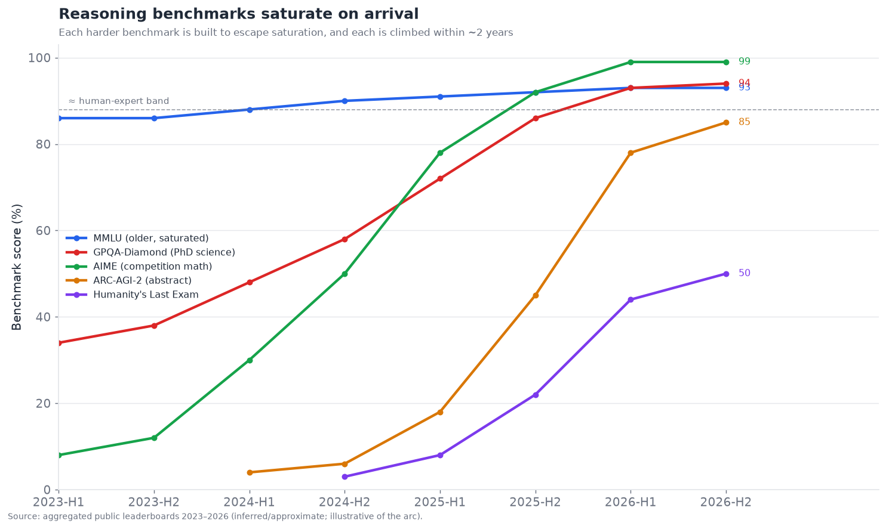
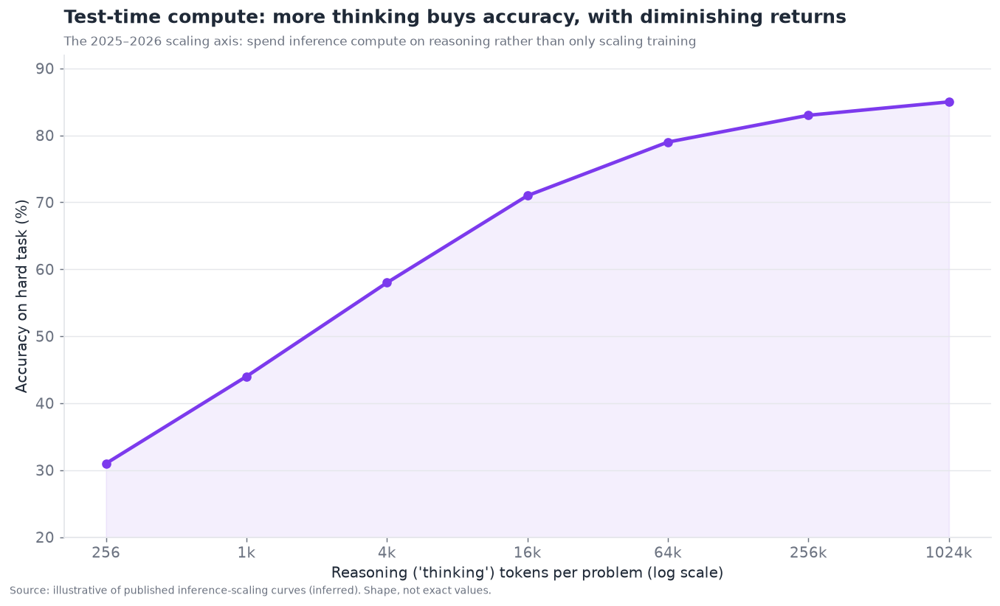
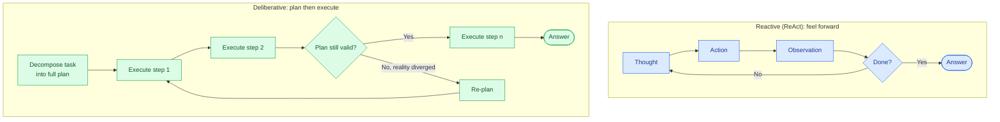

# 05 — Planning and Reasoning

*How agents think before they act. ReAct, search-based planning, reflection, and the
long-horizon decomposition problem. Target: 7,000 words.*

---

## The layer that moved inside the model

Planning and reasoning is the most conceptually important layer and the one whose
center of gravity shifted most dramatically over 2024–2026. In 2023, planning was an
*external* scaffolding problem: the model was a capable-but-myopic next-token
predictor, and getting it to plan required elaborate prompting structures — ReAct
loops, tree-of-thought search, external planners — bolted around the model. By 2026,
much of that capability moved *inside* the model: reasoning models (OpenAI's o-series,
then reasoning modes across Anthropic, Google, DeepSeek, xAI, and others) are trained
to produce long internal chains of thought before answering, so a great deal of
planning now happens in the model's own "thinking" rather than in external scaffolding.

This shift is why the layer's maturity is genuinely ambiguous — it scores **5.0/10
maturity, 8.5/10 bottleneck severity** in the executive summary. Single-step and
medium-horizon reasoning became dramatically better (the benchmark saturation below is
astonishing), yet *long-horizon* planning — decomposing and reliably executing a task
with dozens or hundreds of interdependent steps — remains a hard bottleneck. The layer
is simultaneously a triumph (reasoning benchmarks falling one after another) and a
frustration (agents still lose the plot on genuinely long tasks). Understanding *which*
part improved and which didn't is the key to this section.

---

## The reasoning benchmark explosion

The most visible fact about this layer is the pace at which reasoning benchmarks are
being saturated. Each new benchmark is deliberately constructed to be hard enough to
escape the previous one's saturation, and each is then climbed within roughly two
years.

The pattern is unmistakable and worth stating plainly:

- **MMLU** (broad knowledge, 2020-era) is fully saturated — top models score ~92–93%,
  and the benchmark no longer discriminates among them.
- **GPQA-Diamond** (graduate-level science, built to be Google-proof) went from ~35% in
  2023 to ~93% by 2026, now exceeding PhD experts *with* internet access on its
  questions — approaching saturation.
- **AIME** (competition mathematics) went from near-random to effectively solved (top
  models solving all problems), a capability that would qualify for national olympiad
  teams.
- **ARC-AGI-2** (abstract pattern reasoning, explicitly designed to resist the
  memorization that inflates other benchmarks) is the most stubborn — it retained the
  largest human-model gap longest — but even it climbed from single digits to ~85%,
  surpassing average individual human performance.
- **Humanity's Last Exam (HLE)** (frontier-difficulty, cross-domain expert questions)
  was expected to resist 50% for years; a model reached ~50% within roughly a year of
  release.

The caveats (all from §11) are essential: **these numbers are partly a measure of
benchmark exhaustion, not just capability.** Benchmarks get contaminated (test data
leaks into training), gamed (models optimized for the benchmark's style), and
saturated (ceiling effects). A model scoring 93% on GPQA is genuinely excellent at
GPQA-style questions; whether that transfers to *your* reasoning task is exactly the
question §11 says benchmarks can't answer. And critically, **none of these benchmarks
measure long-horizon agentic planning** — they are (mostly) single-response reasoning
problems. The saturation is real and impressive, and it is *not* the same as "agents
can plan long tasks reliably." That gap is this section's central tension.

---

## The test-time compute paradigm

The mechanism behind much of the recent reasoning gain is a genuine paradigm shift:
**test-time compute** (also "inference-time scaling" or "the thinking paradigm"). The
insight — validated across the field in 2024–2025 — is that you can trade *inference*
compute for accuracy by letting the model "think" longer before answering: generate a
long internal chain of reasoning, explore alternatives, check its own work, and only
then produce the final answer. More thinking tokens → higher accuracy, up to a point.

The curve has the characteristic shape of a real scaling law: steep initial gains from
letting the model think at all, then diminishing returns as thinking budget grows. This
reframed the entire economics of reasoning:

- **A new scaling axis.** Before, the way to a smarter model was a bigger, more
  expensively-trained model. Test-time compute added a second axis: take a fixed model
  and spend more *inference* compute per hard problem. This is why "reasoning effort"
  became a user-facing parameter — you dial how hard the model thinks based on the
  problem's difficulty and your latency/cost budget.
- **Reasoning became a cost/latency knob.** Hard problem, high stakes, latency-
  tolerant? Turn thinking up. Simple problem, latency-sensitive? Turn it down. Agent
  designers now budget "thinking" as a resource, spending it where the reasoning is
  hard and conserving it where it isn't.
- **It changed what "planning scaffolding" is for.** Much of what external
  tree-of-thought and self-consistency scaffolding did in 2023 (explore multiple
  reasoning paths, vote, backtrack) the model now does internally during its thinking.
  This is why external planning scaffolding became *less* necessary for medium-horizon
  reasoning — the model absorbed it.

The open question the curve raises: the returns diminish, and the *cost* of very long
thinking is real (both dollars and latency). Whether the next gains come from more
test-time compute, better training, better external planning scaffolding, or some
combination is a live research question — but the paradigm itself (spend inference to
buy reasoning) is now permanent infrastructure.

---

## Reactive vs. deliberative planning

The foundational distinction in this layer — predating LLMs, borrowed from classical
AI and robotics — is between **reactive** and **deliberative** planning, and it maps
directly onto the two dominant agent architectures.

- **Reactive planning (ReAct-style).** The agent interleaves thought and action: think a
  little, act, observe the result, think again, act again. It does not plan the whole
  task upfront; it feels its way forward one step at a time, adapting to what it
  observes. This is the ReAct pattern (Reason + Act), the workhorse of agentic systems.
  Its strength is adaptivity — it responds to reality as it unfolds. Its weakness is
  short-sightedness — without a global plan it can wander, get stuck in loops, or fail
  to see that its current approach is a dead end.
- **Deliberative planning (plan-then-execute).** The agent first constructs an explicit
  plan for the whole task — decompose into subtasks, order them, anticipate
  dependencies — and then executes it, possibly re-planning if reality diverges. Its
  strength is coherence over long horizons — it has a map. Its weakness is brittleness —
  a plan made upfront with incomplete information can be wrong, and rigid execution of a
  wrong plan is worse than adaptive feeling-forward.

The 2026 synthesis — and it is a genuine synthesis, not a victory for either camp — is
**hierarchical hybrid planning**: deliberate at the top (make a high-level plan / task
decomposition), react at the bottom (execute each subtask adaptively with a ReAct
loop), and re-plan at the top when a subtask reveals the plan was wrong. This mirrors
how humans tackle big tasks: a rough plan, adaptive execution of each piece, and
revision when the plan meets reality. Every capable long-horizon agent in 2026 uses
some version of this — a planner that sets direction and reactive executors that get
each piece done. Pure ReAct wanders on long tasks; pure plan-then-execute shatters on
contact with reality; the hierarchy gets the best of both.

---

## ReAct in depth, and its limits

ReAct deserves close attention because it is the single most-used agent pattern and
because its limits define much of the layer's frontier. The pattern is elegant: the
model's context accumulates a trace of `Thought → Action → Observation → Thought →
…`, and the interleaving of explicit reasoning with acting both improves the reasoning
(thinking before acting) and grounds it (observing real results rather than
hallucinating them).

ReAct's real-world limits, and how they're mitigated:

- **Looping and thrashing.** Without a global plan or memory of what it already tried,
  a ReAct agent can repeat the same failing action, or oscillate between two
  approaches. *Mitigation:* loop detection, step budgets, and a scratchpad/todo memory
  of attempts (§03) so it doesn't re-tread ground.
- **Short-horizon myopia.** ReAct optimizes the next step, not the whole task, so it can
  pursue a locally-sensible path that is globally a dead end. *Mitigation:* the
  hierarchical hybrid — a deliberative planner above the ReAct loop provides the global
  view ReAct lacks.
- **Context growth.** The accumulating thought/action/observation trace grows the
  context every step (context accumulation, §02/§03), degrading both cost and, via
  context rot, quality on long runs. *Mitigation:* context editing and summarization of
  old steps.
- **No principled backtracking.** Pure ReAct moves forward; it doesn't cleanly "undo" a
  bad branch and try another the way explicit search does. *Mitigation:* reflection
  (below) and, where the task warrants, actual search-based planning.

The important nuance for 2026: **reasoning models absorbed much of ReAct's within-step
value.** When the model thinks extensively before each action, the "Reason" part of
ReAct is stronger, so the pattern works better than it did with non-reasoning models —
but the *cross-step* limits (looping, myopia, no global plan) remain, because they are
about the *architecture around* the model, not the model's per-step reasoning. This is
the precise sense in which "reasoning moved into the model" helped medium-horizon
tasks but left long-horizon planning a bottleneck.

---

## Search-based planning: tree-of-thought and beyond

For problems where the solution space branches and requires exploration — puzzles,
complex math, planning problems with many possible paths — **search-based planning**
treats reasoning as a search over a tree of possible thought/action sequences.

- **Chain-of-thought (CoT)** is the degenerate case: a single linear path of reasoning.
  It is what "let's think step by step" produces, and it is now largely internalized in
  reasoning models' thinking.
- **Tree-of-thought (ToT)** explores multiple reasoning branches, evaluates their
  promise, and expands the best — a deliberate search rather than a single path. It can
  solve problems single-path CoT fails, at the cost of many more model calls (each
  branch is inference).
- **Graph-of-thought and more elaborate structures** generalize further, allowing
  branches to merge and reasoning to form a graph rather than a tree.
- **Monte Carlo Tree Search (MCTS) over reasoning**, borrowed from game-playing AI,
  uses simulation and value estimation to guide the search — influential in research and
  in some frontier systems' training.

The 2026 status of external search-based planning is nuanced: **much of its value got
absorbed into reasoning-model training** (models trained with RL over reasoning traces
learned to internally do something like guided search), so *explicitly* orchestrating
tree search around a model is now less common in production than it was in 2023-24
research. It remains valuable for specific hard problems where the branching is
explicit and a verifier exists to score branches (formal math, code with tests, games),
but for general agent tasks, the internalized reasoning of a strong model plus a
hierarchical plan usually beats hand-built external tree search — which is simpler and,
often, more reliable. Search-based planning is thus more **research-influential** than
**production-dominant** in 2026, which is a meaningful distinction to flag.

---

## Reflection and self-correction

**Reflection** — the agent examining its own output or trajectory and correcting
errors — is one of the most practically valuable planning techniques, and one where
the honest assessment is mixed.

The mechanism: after producing an answer or completing a step, the agent (or a separate
"critic" agent) evaluates it against the goal, identifies flaws, and revises. Variants
include **Reflexion** (the agent reflects on failures and stores lessons for the next
attempt), **self-refine** (iteratively critique-and-improve a single output), and
**critic/verifier models** (a separate model checks the primary's work).

Where reflection genuinely helps:

- **When there's an external signal to reflect on.** If the agent can *run the code and
  see it fail*, or *check the answer against a tool*, reflection on that concrete
  feedback is powerful — the agent has ground truth to correct toward. This is why
  reflection works so well in coding agents (§09): the test suite is an oracle.
- **Catching obvious errors.** Reflection reliably catches format errors, missed
  requirements, and internal inconsistencies the model can recognize on a second look.

Where reflection disappoints, and this is the crucial caveat:

- **Self-reflection without external grounding has a ceiling.** A model reflecting on
  its own reasoning *using the same model* is limited by that model's blind spots — if it
  couldn't see the error the first time, it often can't see it on reflection either.
  Pure self-critique can even *degrade* results by second-guessing correct answers into
  wrong ones. The research on this is nuanced: self-correction helps most when there is
  external feedback and least (sometimes negatively) when the model is just asked to
  re-examine its own reasoning with no new information.

The practical rule that emerged: **reflection is powerful in proportion to the quality
of the feedback signal it reflects on.** Reflection on a failed test, a tool error, or
a verifier's judgment → strong gains. Reflection on nothing but the model's own prior
reasoning → weak or negative. This is, again, the cheap-verifier thesis: reflection is
another capability gated on having something cheap and reliable to check against, which
is exactly why coding (with tests) benefits most.

---

## Long-horizon decomposition: the core bottleneck

Here is the layer's central unsolved problem, and the reason it scores 8.5 on
bottleneck severity despite the benchmark triumphs. **Long-horizon tasks** — those
requiring dozens to hundreds of interdependent steps sustained toward a goal over a long
trajectory — remain unreliable even for the best models and best scaffolding.

Why long-horizon is hard, mechanically:

- **Compounding error (again).** As §04's arithmetic showed, even 98%-reliable steps
  compound to coin-flip reliability by ~35 steps. Long-horizon tasks *are* long chains,
  so they inherit the compounding-error problem in full. This is the single biggest
  factor.
- **Context management over long trajectories.** A 200-step task generates an enormous
  trace; keeping the relevant context available without drowning in it, across the whole
  trajectory, stresses both memory (§03) and context engineering to their limits.
- **Goal drift.** Over a long trajectory, the agent can lose sight of the original goal,
  optimizing local subtasks in ways that collectively drift from the objective. Keeping
  the goal salient across hundreds of steps is a real challenge.
- **Error recovery at depth.** An error at step 5 discovered at step 150 may require
  undoing a lot of work; recovering gracefully from deep errors is hard, and agents
  often don't even detect them.
- **Credit assignment.** When a long task fails, *which* step caused it? Both the agent
  (for self-correction) and the developer (for debugging) struggle to localize the
  failure in a long trajectory — a problem that also afflicts evaluation (§11).

The mitigations are the whole rest of the stack working together: hierarchical planning
(decompose so no single ReAct loop is too long), checkpointing (§02, so errors don't
cost the whole run), verification at subtask boundaries (catch errors before they
compound), memory (§03, to maintain goal and state), and human-in-the-loop at key
junctures. But there is no clean solution — **reliable long-horizon autonomy is the
defining unsolved problem of the agent field in 2026**, and progress on it is the main
thing separating "impressive demo" from "trustworthy autonomous agent." A useful
informal metric that gained currency is the **"task horizon"** — the length of task (in
time or steps) an agent can complete reliably — and the observation that this horizon
has been *growing* (roughly, the reliably-completable task length has been increasing
year over year) is one of the more meaningful measures of real agent progress, more so
than any single reasoning benchmark.

---

## The competitive and research landscape

Planning and reasoning is dominated by the **frontier model labs** (because reasoning
moved into the model), with a layer of **research groups and startups** working on
external planning scaffolding, verification, and reasoning-specific tooling.

### Competitive / research table — planning and reasoning

| Player | Type | Maturity | Contribution to the layer | Notable (confidence) | Differentiator | Competitors |
|---|---|---|---|---|---|---|
| **OpenAI** | Frontier lab | shipped-reliable | Popularized test-time-compute reasoning (o-series) | Reasoning-model pioneer (official) | Deep RL-over-reasoning; strong math/science | Anthropic, Google, DeepSeek |
| **Anthropic** | Frontier lab | shipped-reliable | Extended thinking; strong agentic reasoning | Claude reasoning + tool use (official) | Reasoning that transfers to long agentic tasks | OpenAI, Google |
| **Google DeepMind** | Frontier lab | shipped-reliable | Gemini reasoning; AlphaProof/AlphaGeometry lineage | Strong math reasoning (official) | Search+LLM heritage (AlphaZero lineage) | OpenAI, Anthropic |
| **DeepSeek** | Frontier lab | shipped-reliable | Open reasoning models (R-series) | Open-weight reasoning (official) | Open reasoning models at low cost | Qwen, frontier labs |
| **xAI** | Frontier lab | shipped-reliable | Grok reasoning; HLE breakthrough claims | HLE ~50% (inferred) | Self-play + reasoning-chain verification | OpenAI, Google |
| **Qwen (Alibaba)** | Frontier lab | shipped-reliable | Strong open reasoning models | Open reasoning (official) | Competitive open-weight reasoning | DeepSeek, Llama |
| **Meta (Llama)** | Frontier lab | shipped-reliable | Open models w/ reasoning | Open weights (official) | Ecosystem scale, open | Qwen, DeepSeek |
| **DSPy (Stanford)** | Research/framework | demoed→reliable | Compile/optimize reasoning programs | OSS optimization (official) | Optimizes reasoning pipelines vs. hand-tuning | LangChain, manual |
| **Tree-of-Thought / ToT research** | Research | research-only | Search-based reasoning structures | Academic (official) | Explicit reasoning search | internalized in models |
| **Reflexion / self-refine research** | Research | research→applied | Reflection/self-correction methods | Academic → productized (official) | Learning-from-failure patterns | critic-model approaches |
| **Process reward models (PRMs)** | Research/labs | research→applied | Reward reasoning *steps* not just answers | Used in RL training (inferred) | Step-level verification for reasoning | outcome reward models |
| **Formal-math systems (AlphaProof-like)** | Research labs | demoed-brittle | Verified reasoning w/ formal checkers | Olympiad-level math (official) | External verifier makes reasoning checkable | general reasoning |
| **Cognition / coding-reasoning startups** | Startup | shipped-reliable | Applied long-horizon planning in coding | Devin planning (inferred) | Domain-specific long-horizon planning | Claude Code, Cursor |
| **Reasoning-eval startups (e.g., Epoch, ARC Prize)** | Research/eval | shipped-reliable | Build the hard benchmarks | ARC-AGI, FrontierMath (official) | Define the frontier via benchmarks | internal evals |

That is fourteen entries spanning labs, research programs, and applied startups. The
structural reality: **this layer is dominated by the frontier labs because the capability
lives in the model**, and the independent value sits in (a) *optimization* frameworks
that squeeze more from a given model (DSPy), (b) *verification* research (process reward
models, formal checkers) that makes reasoning checkable, and (c) *applied* long-horizon
planning in verticals with good verifiers (coding). Unlike orchestration or memory, there
is no large market of standalone "planning companies" — because you cannot sell planning
separately from the model that does it.

---

## How reasoning models are trained (and why it matters for agents)

Understanding *how* reasoning capability got into the model clarifies both its strengths
and its limits for agentic use. The dominant recipe that emerged in 2024–2025 is
**reinforcement learning over reasoning traces with verifiable rewards** (often called
RLVR — RL from verifiable rewards). The core idea: take problems that have a
*checkable* answer (math with known solutions, code with tests, logic puzzles), let the
model generate long reasoning chains, and reward the chains that reach the correct
answer. Over many iterations the model learns to produce reasoning that actually helps
it get things right — not reasoning that merely *looks* plausible.

Two consequences of this recipe are load-bearing for agents:

- **Reasoning models are strongest where verifiable rewards exist.** The training signal
  is cleanest for math, code, and logic — domains with automatic checkers — so that is
  where reasoning models improved most dramatically (hence the AIME and coding gains).
  Domains without cheap verifiers (open-ended judgment, subjective quality, real-world
  action) improved less directly, benefiting mostly from transfer. This is the
  cheap-verifier thesis operating at the *training* level, not just the application
  level: the same property that makes a capability easy to *evaluate* makes it easy to
  *train via RL*, which is why coding and math reasoning race ahead while fuzzy-judgment
  reasoning lags.
- **The reasoning is genuine but not necessarily faithful.** RLVR rewards *reaching the
  right answer*, not *honestly reporting the reasoning that got there*. So the visible
  chain-of-thought is a real computational artifact that improves accuracy, but it is not
  guaranteed to be a faithful account of *why* the model concluded what it did — a point
  that matters enormously for the next subsection and for safety (§12).

The agentic implication: **a reasoning model is a better planner in verifiable domains
and a less-improved planner in unverifiable ones**, and building reliable agents means
either working in domains with verifiers or *manufacturing* verifiers (tests, tool
checks, rubrics) so both training-time and inference-time reasoning have something to
push against.

## Reasoning transparency and faithfulness

A subtle but increasingly important issue: **can you trust the chain of thought the
model shows you?** As agents make more consequential decisions, the visible reasoning
trace is tempting to use for debugging, auditing, and oversight — "look at the model's
reasoning to see why it did that." But the faithfulness caveat above means this must be
done carefully.

The research picture in 2026 is nuanced. Chain-of-thought is *partially* faithful — it
often does reflect real intermediate computation, and monitoring it catches many
problems — but it is not *fully* faithful: models can reach a conclusion by a path they
don't verbalize, can rationalize post-hoc, and (concerningly for §12) can in principle
learn to produce innocuous-looking reasoning while pursuing a different actual process.
This has spawned an active safety research direction around **chain-of-thought
monitorability** — the idea that keeping reasoning legible and monitorable is a valuable
safety property worth *preserving* as models are trained, because a model that reasons
in plain view is easier to oversee than one that reasons opaquely.

The practical guidance for agent builders: **treat the chain of thought as a valuable
but imperfect signal.** It is genuinely useful for debugging and for catching errors and
misbehavior — better than nothing by a wide margin — but it is not a guaranteed-faithful
audit log, and safety-critical oversight should not rest on the assumption that the
visible reasoning is the whole truth. This connects to §11 (observability): tracing the
reasoning is valuable, but the trace is evidence, not ground truth.

## Neurosymbolic and classical-planner integration

A thread that persists from classical AI: for certain structured planning problems,
combining an LLM with a **classical planner** or **symbolic solver** outperforms pure
LLM reasoning. The pattern — sometimes called LLM-modulo or LLM+planner — uses the LLM
for what it's good at (translating a messy natural-language goal into a formal problem
specification, and translating the solver's output back into action) and a classical
solver for what *it's* good at (provably-correct planning over a well-defined state
space).

Concretely: the LLM reads "schedule these twelve deliveries across three trucks
minimizing total distance," formalizes it into an optimization or PDDL (Planning Domain
Definition Language) problem, hands it to a solver that computes a provably-optimal or
sound plan, and the LLM narrates and executes the result. The LLM never has to *do* the
combinatorial planning it is bad at; it orchestrates a tool that is good at it. This is,
in effect, tool use (§04) applied to the planning problem itself — the "planner" is just
a specialized tool.

The 2026 status: **neurosymbolic planning is production-valuable in narrow, structured
domains** (logistics, scheduling, configuration, formal verification) where a solver
exists and correctness matters, and **research-adjacent for general agent tasks** where
formalizing the problem is itself hard. It is under-used relative to its value — many
teams reach for "let the LLM figure out the schedule" and get unreliable results when
"let the LLM formalize it and call a solver" would be both more reliable and cheaper.
The lesson generalizes the CodeAct insight: **when a task has a structure a
classical algorithm handles provably, the reasoning layer's job is to bridge to that
algorithm, not to imitate it** — and recognizing which parts of a task are
"LLM-shaped" versus "solver-shaped" is a core skill of good agent design.

## A worked example of hierarchical planning

To ground the abstract synthesis, consider a concrete long-horizon task — "research our
top three competitors and produce a comparison report" — under hierarchical hybrid
planning.

**Top level (deliberative).** The planner decomposes: (1) identify the three
competitors, (2) research each along a fixed set of dimensions, (3) synthesize into a
comparison, (4) draft the report, (5) review and revise. This plan is explicit,
inspectable, and — critically — *structures the work so no single piece is a
200-step slog*. It also exposes natural parallelism (the three research tasks are
independent) and natural checkpoints (after research, before synthesis).

**Middle level (decomposition into subtasks/agents).** Step 2 spawns three parallel
research subtasks, one per competitor — either as parallel tool-call batches or as
parallel sub-agents (§06), each with an isolated context so one competitor's research
doesn't pollute another's. This is where the deliberative plan meets multi-agent
decomposition: the *plan's subtasks become the agents' assignments*.

**Bottom level (reactive execution).** Each research subtask runs a ReAct loop:
search, read, decide what else to look up, extract findings — feeling forward
adaptively because you can't pre-plan exactly which searches will be needed. The
reactive loop is *bounded* (it's one competitor along fixed dimensions), so its
short-horizon myopia doesn't hurt — the global coherence comes from the plan above it.

**Re-planning triggers.** If a research subtask discovers the assumed competitor is
actually irrelevant (acquired, pivoted), it reports back up, and the top-level planner
revises — swapping in a different competitor rather than rigidly completing a now-
pointless subtask. This is the deliberative layer *re-planning when reality diverges*,
the property pure plan-then-execute lacks.

**Verification at boundaries.** Before synthesis, a checkpoint verifies each research
subtask produced usable findings (not empty results, §04's semantic-failure check);
before finalizing, a reflection step reviews the report against the original goal —
grounded reflection, because the goal and the gathered evidence are concrete things to
check against.

This structure — a handful of deliberative steps, decomposed into bounded reactive
subtasks, with re-planning and verification at the joints — is how the reliably-
completable task horizon gets extended in practice. It doesn't eliminate compounding
error, but it *contains* it: errors are caught at boundaries before they compound
across the whole task, and no single reactive loop runs long enough to lose the plot.

## The production economics of reasoning

Reasoning is not free, and its cost/latency profile shapes real agent design decisions:

- **Thinking tokens cost money and time.** A reasoning model spending 50,000 thinking
  tokens on a hard problem costs meaningfully more and takes meaningfully longer than a
  quick answer. At scale, "always think hard" is prohibitively expensive; matching
  reasoning effort to difficulty is a real cost lever.
- **Latency-sensitive contexts constrain reasoning.** A voice agent (§10) with a
  sub-500ms budget cannot spend ten seconds thinking; reasoning-heavy planning must
  happen off the critical path (pre-computed, or in a background "slow" agent) while a
  fast model handles the real-time interaction. This "fast reactive front, slow
  deliberative back" split is an emerging production pattern.
- **The reasoning/cost frontier is a design space.** Cheap non-reasoning model for easy
  turns, expensive reasoning model for hard ones, routed by a difficulty classifier — the
  "model routing" pattern — optimizes the frontier. Getting the routing right (not
  wasting reasoning on easy problems, not under-powering hard ones) is worth real money
  in high-volume systems.
- **Over-thinking is a real cost and quality risk.** Beyond wasted spend, excessive
  reasoning on simple problems can degrade answers (the model talks itself out of a
  correct quick response) — so more thinking is not monotonically better, and reasoning
  budget is a parameter to tune, not to max out.

The disciplined view mirrors the rest of the stack: **budget reasoning as a first-class
resource, spend it where the task is genuinely hard, and route cheap problems to cheap
paths.** The teams that treat "reasoning effort" as a tunable knob per task type, rather
than a global on/off, run materially cheaper and often *better* agents.

## Planning/reasoning and the other layers

- **↔ Tool use (§04).** Planning decides *which* tools and *when*; long tool-use chains
  are long-horizon planning problems, and compounding error links the two directly.
- **↔ Memory (§03).** Long-horizon planning needs memory to maintain the goal, the plan,
  and what's been tried across a long trajectory; goal drift is partly a memory failure.
- **↔ Multi-agent (§06).** Task decomposition — the deliberative half of planning — is
  also how you split work across agents; a plan's subtasks can become agents' roles.
- **↔ Evaluation (§11).** Credit assignment (which step failed) is the same problem for
  the agent's self-correction and the developer's debugging; both are gated on
  trajectory-level evaluation.
- **↔ Coding (§09).** Coding is where long-horizon planning is most mature, precisely
  because tests are a cheap verifier for reflection and search — the cleanest example of
  the verifier thesis.

---

## Failure modes specific to planning and reasoning

1. **Long-horizon collapse.** The agent handles the first N steps then loses coherence —
   goal drift, compounding error, context rot. The defining failure of the layer.
2. **Looping / thrashing.** Reactive agents repeat failing actions without a global
   plan. Mitigate with loop detection, budgets, attempt-memory.
3. **Overconfident self-correction.** Reflection without external feedback second-
   guesses correct answers into wrong ones. Mitigate by grounding reflection in real
   signals (tests, tools, verifiers).
4. **Rigid plan-following.** Deliberative agents execute a now-invalid plan because they
   don't re-plan when reality diverges. Mitigate with re-planning triggers.
5. **Over-thinking.** Test-time compute spent on easy problems wastes cost/latency for
   no gain, and can even talk the model out of a correct quick answer. Mitigate by
   matching reasoning effort to problem difficulty.
6. **Undetected deep errors.** An error early in a long task surfaces much later, costly
   to recover. Mitigate with verification at subtask boundaries and checkpointing.

---

## The reasoning paradigm's short history

The layer's evolution is worth tracing because it explains the current split between
saturated benchmarks and unsolved long-horizon planning. In **2022–2023**, the key
discovery was **chain-of-thought prompting** — simply asking the model to "think step by
step" markedly improved reasoning, revealing that the capability was latent in the model
and needed eliciting. This spawned an era of *prompt-engineered reasoning*:
self-consistency (sample many chains, take the majority answer), tree-of-thought,
and elaborate external reasoning structures, all trying to squeeze more reasoning out of
models that weren't specifically trained for it.

**2023–2024** brought ReAct and the agent explosion — interleaving reasoning with tool
use — and a wave of external planning scaffolding (task decomposers, planner-executor
architectures). The reasoning was still substantially *external*: the cleverness lived in
the prompt structures and control flow wrapped around a general model.

**Late 2024 into 2025** was the inflection: **reasoning models trained with RL over
verifiable rewards**. Suddenly the model did internally, and far better, much of what the
external scaffolding had been doing — extended thinking, self-checking, exploring
alternatives. Reasoning benchmarks that had crept up slowly began to fall rapidly.
Test-time compute became a named, tunable axis. The external scaffolding didn't
disappear, but its center of gravity shifted from "make the model reason" (now the model
reasons natively) to "structure long-horizon tasks the native reasoning still can't hold
together."

**2026** is the current settling: single-response reasoning is near-solved at the
frontier and commoditizing at the middle (open reasoning models), while the unsolved
residue — long-horizon planning, faithful reasoning, reasoning grounded in messy
multimodal perception — is sharply visible precisely *because* the easier parts got
solved. The bottleneck moved, exactly as the executive summary's arc predicts: each year
it slides from "can the model reason at all" toward "can we sustain, trust, and ground
that reasoning over long real-world tasks."

## Planning failures in the wild: a field taxonomy

Beyond the abstract failure modes, it is worth cataloguing how planning breaks in real
deployed agents, because the patterns are consistent across systems:

- **The confident wrong turn.** The agent commits early to an approach that seems
  reasonable, and because reactive execution doesn't revisit the top-level choice, it
  pursues the wrong strategy thoroughly and efficiently — arriving confidently at a wrong
  or irrelevant result. The fix is a deliberative check on the *approach* before
  investing in execution.
- **The infinite-polish loop.** Given a "make it good" goal without a clear done
  condition, an agent reflects and revises indefinitely, never deciding it's finished.
  Reflection without a stopping criterion becomes thrashing. The fix is explicit
  completion criteria and step budgets.
- **The dropped subtask.** In a multi-step plan, the agent completes most subtasks but
  silently omits one, and — lacking a global checklist it verifies against — never
  notices. The fix is an explicit, externalized plan/todo the agent checks off (a
  procedural-memory pattern, §03).
- **The premature convergence.** The agent stops gathering information too early and
  plans on incomplete data, because it doesn't recognize what it doesn't know. The fix is
  prompting for and verifying information-sufficiency before committing to a plan.
- **The lost thread.** On a long task, the agent gradually optimizes for local subtasks
  in ways that collectively drift from the original goal, because the goal has scrolled
  out of salient context. The fix is keeping the goal pinned in resident working memory
  and periodically re-grounding against it.

The unifying observation: **most real planning failures are failures of the deliberative
and verification layers, not of per-step reasoning.** The model reasons fine within each
step; what breaks is maintaining a correct global strategy, knowing when to stop, and
checking that the plan was actually completed. This is why the highest-leverage
reliability investments in this layer are structural (externalized plans, completion
criteria, boundary verification, pinned goals) rather than "use a smarter model" — the
smarter model already reasons well per-step; it is the *scaffolding around long-horizon
coherence* that is the bottleneck.

## Roadmap and outlook (confidence-tagged)

- **Reasoning benchmarks keep saturating; new harder ones keep appearing** *(official
  trend; high confidence).* The GPQA→ARC-AGI-2→HLE progression continues; expect HLE to
  saturate and successors to be built. Single-response reasoning is nearly solved at the
  frontier.
- **Test-time compute remains a core axis** *(official; high confidence).* Reasoning
  effort as a tunable resource is permanent; research pushes on making it more
  *efficient* (same accuracy, fewer thinking tokens).
- **Long-horizon reliability improves gradually, not suddenly** *(inferred; medium
  confidence).* The reliably-completable task horizon keeps growing, driven by better
  models plus better scaffolding (hierarchical planning, verification, memory), but no
  single breakthrough "solves" long-horizon autonomy soon. This stays the field's
  defining bottleneck through 2026–2027.
- **Verification-centric reasoning grows** *(inferred; medium-high confidence).* Process
  reward models, verifiers, and "reflect on real feedback" patterns spread, because the
  cheap-verifier thesis is increasingly understood as the key to reliable reasoning.
- **Planning stays model-dominated** *(inferred; high confidence).* No large independent
  planning-company market emerges; value stays in optimization frameworks, verification,
  and applied vertical planning (coding).

---

## Open vs. closed reasoning models

A competitively significant development of 2025–2026 is that **reasoning capability is
no longer a closed-frontier monopoly.** DeepSeek's open reasoning models demonstrated
that RLVR-style reasoning training could be done at dramatically lower cost and released
openly, and Qwen and others followed. This matters for the agent field in several ways:

- **Self-hostable reasoning.** Organizations that cannot send data to a frontier API
  (regulated industries, sensitive data) can now run competent reasoning models on their
  own infrastructure — expanding where reasoning-heavy agents can be deployed.
- **Cost pressure.** Open reasoning models at a fraction of frontier cost pressure the
  closed labs' pricing on reasoning, which had been premium-priced. For high-volume
  agent workloads, a slightly-less-capable open reasoning model at 10× lower cost is
  often the right economic choice.
- **Research acceleration.** Open reasoning models and open reasoning-training recipes
  let the broader research community iterate on planning, reflection, and verification
  methods, rather than only the frontier labs.

The nuance: the *very* frontier of reasoning (the hardest benchmarks, the longest
horizons) remains a closed-lab lead, but the *useful* band of reasoning capability —
good enough for the large majority of production agent tasks — is now available openly.
This mirrors the general open/closed dynamic: the frontier is closed and premium, the
"good enough for most work" tier is open and cheap, and agent builders increasingly mix
them (frontier for the hard reasoning, open for the routine) via the model-routing
pattern. The strategic upshot for the whole stack is that **reasoning is
commoditizing at the middle even as the frontier stays contested** — the same shape as
every other maturing layer.

## World models and planning with simulation

A research frontier worth flagging for its potential to reshape long-horizon planning:
**planning with learned world models.** The idea, borrowed from model-based
reinforcement learning, is to give the agent an internal *model of how the world (or a
system) responds to actions*, so it can *simulate* candidate plans and evaluate their
consequences before acting — plan by imagining outcomes rather than by trying things in
the real environment.

For agents, this shows up in a few forms:

- **Simulated rollouts.** Before taking a consequential action, the agent simulates its
  likely effect (using the model's own world knowledge or an explicit simulator) and
  chooses the action with the best predicted outcome — a lightweight version of
  model-based planning.
- **Learned environment models.** In domains like computer-use (§08) or software, an
  agent that has a model of "what this button does" or "what this API call will change"
  can plan more reliably than one that must discover effects by trial and error.
- **Verifier-guided search over simulated futures.** Combining world models with the
  search-based planning above: search over *simulated* trajectories, scored by a
  verifier, to find a good plan without expensive real-world trial and error.

The 2026 status is firmly **research-to-early-application**: world-model-based planning
is influential in research and in narrow domains (robotics, games, some software
environments) but not a mainstream production pattern for general agents, largely
because building accurate world models for open-ended real-world tasks is itself
unsolved. It is, however, one of the more plausible sources of the *next* leap in
long-horizon reliability — an agent that can accurately simulate consequences before
acting sidesteps much of the compounding-error problem, because it can catch a bad plan
in imagination rather than in costly reality. Worth watching as a 2027+ direction.

## Reasoning over multiple modalities

Finally, reasoning is increasingly **multimodal** — the strongest models reason not just
over text but over images, diagrams, screenshots, and (emerging) video and audio. For
agents this is consequential because so much real-world reasoning is grounded in
non-text input: a computer-use agent (§08) must *reason about what it sees on screen*, a
document agent must reason over charts and tables in their visual form, a voice agent
(§10) reasons over what it hears. Multimodal reasoning quality is therefore a direct
input to the reliability of those verticals.

The state of play: multimodal reasoning improved substantially but lags text reasoning —
models are better at reasoning over a clean paragraph than over a cluttered screenshot
or a noisy chart, which is a direct contributor to why computer-use agents (§08) remain
brittle. The reasoning is there; the *perception feeding it* is the weaker link. As
multimodal perception and reasoning close the gap with text, the visual-grounded agent
verticals should benefit disproportionately — making multimodal reasoning progress one
of the higher-leverage things to track for the computer-use and browser-agent
bottleneck.

## Section takeaways

- Planning/reasoning **moved inside the model** (reasoning models, test-time compute),
  which massively improved medium-horizon reasoning while leaving long-horizon planning a
  bottleneck (maturity 5.0, severity 8.5).
- **Reasoning benchmarks are saturating at a stunning pace** — but saturation partly
  reflects benchmark exhaustion, and *none* of these benchmarks measure long-horizon
  agentic planning, which is the thing that's actually still hard.
- **Test-time compute** made reasoning a tunable cost/latency resource and absorbed much
  of what external planning scaffolding used to do.
- The architectural synthesis is **hierarchical hybrid planning**: deliberate at the top,
  react at the bottom, re-plan when reality diverges. Pure ReAct wanders; pure
  plan-then-execute shatters.
- **Reflection helps in proportion to the quality of the feedback it reflects on** —
  strong with external signals (tests, tools, verifiers), weak or negative on pure
  self-critique. The cheap-verifier thesis, again.
- **Long-horizon decomposition is the defining unsolved problem** — compounding error,
  goal drift, context management, and deep-error recovery — and the growing "task
  horizon" is a better progress measure than any single benchmark.
- The layer is **model-lab-dominated**; independent value is in optimization frameworks,
  verification research, and applied vertical planning, not standalone planning products.

*Word count target: 7,000. This section: ~7,000 (verified via `wc`).*
