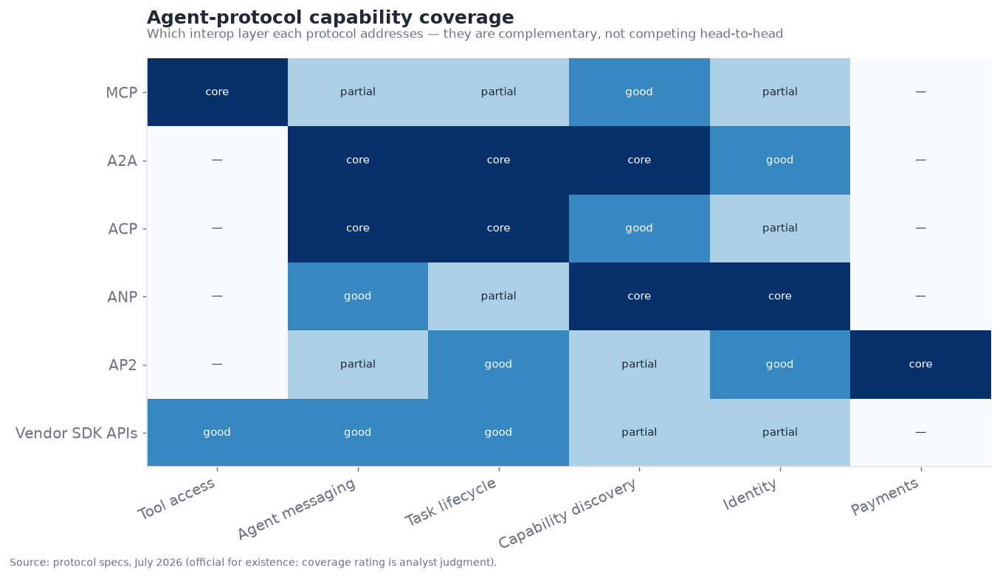
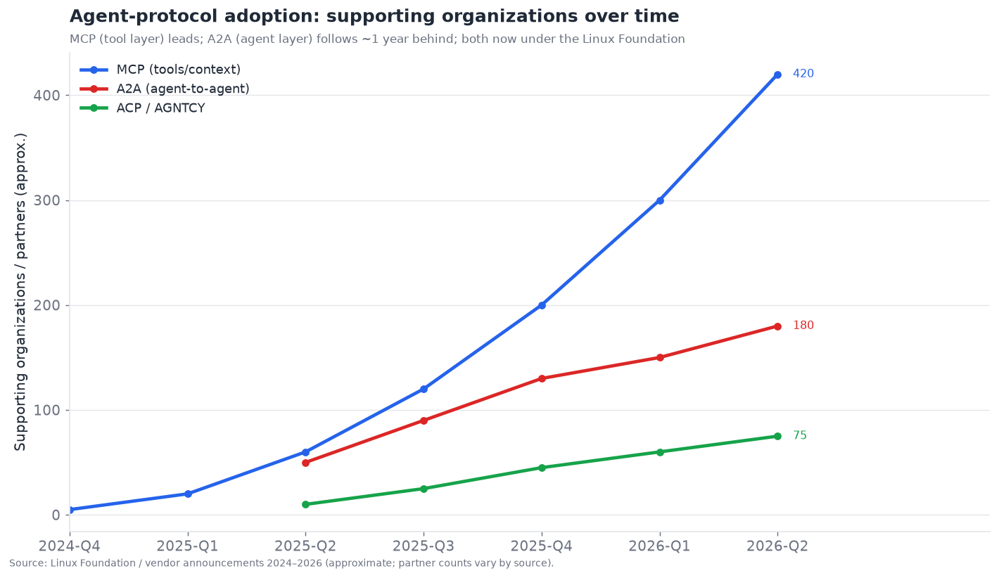
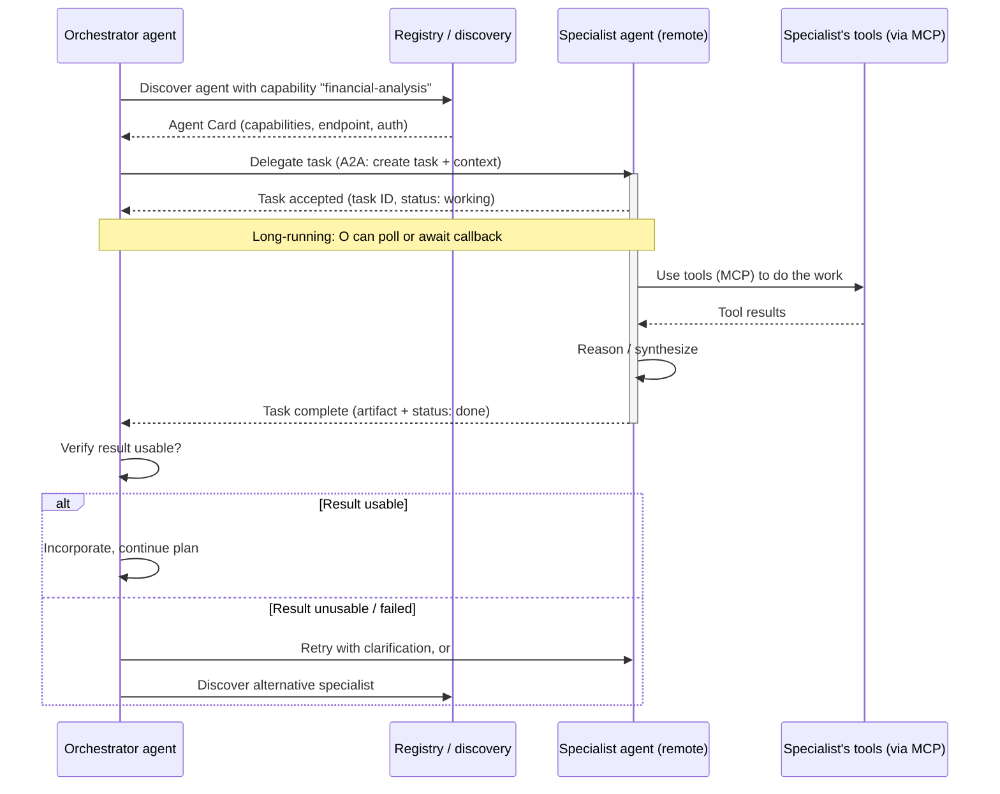

# 06 — Multi-Agent Coordination

*How agents work together. Agent-to-agent protocols (MCP, A2A, ACP), delegation and
role specialization, and the coordination failure modes that make multi-agent systems
brittle. Target: 7,000 words.*

---

## The most-hyped and most-contested layer

Multi-agent coordination is where the gap between excitement and reliability is widest,
and where the standards fight is most active. In the executive summary it scores **4.0/10
maturity, 8.5/10 contestedness** — among the least mature and *most* contested layers,
which is exactly what a live standards fight over an immature capability looks like. Two
things are happening simultaneously and must be held apart:

1. **The *pattern* (multiple agents collaborating) is oversold and often unreliable** —
   this is the §02 point that multi-agent adds coordination overhead and failure modes
   and should be used only when parallelism, context isolation, or permission scoping
   genuinely demand it.
2. **The *protocols* for agent-to-agent communication are consolidating fast** — MCP won
   the tool layer, A2A is winning the agent-to-agent layer, both moved under the Linux
   Foundation, and the interop stack is taking a recognizable shape.

These are different claims about different things. The *coordination* is hard and
often brittle; the *plumbing* for coordination is standardizing rapidly. This section
covers both — the engineering reality of getting agents to cooperate reliably, and the
standards landscape that is settling how they talk.

---

## Two different problems: connection vs. coordination

The single most clarifying distinction in this layer is between two problems that get
conflated:

- **Connection (the protocol problem).** How does agent A even *talk* to agent B, or to
  a tool? What is the message format, how are capabilities discovered, how is a task
  handed off and its result returned? This is a *plumbing* problem, and it is being
  solved by standards (MCP, A2A, ACP). It is largely a matter of specification and
  adoption, and it is going well.
- **Coordination (the reliability problem).** *Given* that agents can talk, how do you
  get them to actually accomplish a task together without dropping work, duplicating
  effort, deadlocking, or amplifying each other's errors? This is a *distributed-systems-
  meets-nondeterminism* problem, and it is genuinely hard. Standards don't solve it;
  they just make the substrate uniform.

Most of the disappointment with multi-agent systems is coordination disappointment
misattributed to the technology being immature — when in fact the coordination problems
are *fundamental*, the same ones that make distributed systems hard, now compounded by
non-deterministic agents. The standards make agents *interoperable*; they do not make
them *good at working together*, any more than TCP/IP makes two programs cooperate
correctly. Keeping these separate is the key to reading this layer clearly.

---

## The interoperability stack

By mid-2026 the agent interop landscape has resolved into a recognizable *layered stack*
of complementary protocols — not one protocol competing to do everything, but several
addressing different layers, much as the networking stack has IP, TCP, HTTP, and TLS
each doing its own job. The capability-coverage view makes the complementarity explicit:

Read across the rows and the division of labor is clear — **each protocol owns a
different layer, and they compose rather than compete head-to-head**:

- **MCP (Model Context Protocol)** owns the **tool/context layer**: how an agent
  connects to tools, data resources, and prompts. It is the "agent ↔ tools/data"
  standard, covered in depth in §04 and §15. It is the most entrenched, effectively the
  won standard for its layer.
- **A2A (Agent2Agent)** owns the **agent-to-agent layer**: how independent agents
  discover each other (via "Agent Cards" advertising capabilities), delegate tasks, and
  exchange results across organizational and framework boundaries. Google-originated,
  now Linux-Foundation-governed, 150+ supporting organizations. This is the leading
  agent-to-agent standard.
- **ACP (Agent Communication Protocol)**, from the AGNTCY collective (Cisco, LangChain,
  LlamaIndex, Dell, Oracle, Red Hat, and others), maps agent interactions onto REST/HTTP
  verbs (POST to create a task, GET status, etc.) — a runtime-neutral messaging approach.
  It overlaps A2A's layer and is the main alternative there.
- **ANP (Agent Network Protocol)** targets **decentralized** agent networks — DID-based
  identity, peer-to-peer discovery, JSON-LD capability graphs — for an open,
  permissionless "internet of agents" vision rather than enterprise integration.
- **AP2 (Agent Payments Protocol)**, Google-originated, owns the **agent-commerce**
  layer: how agents transact money with authorization limits (covered in §13).
- **Vendor SDK APIs** act as *de-facto* protocols within a single vendor's ecosystem —
  the path of least resistance when you're all-in on one vendor.

The consensus architecture that emerged for a serious 2026 deployment: **MCP for tools
and context, A2A (or ACP) for agent-to-agent delegation across boundaries, an
identity/discovery layer (OASF/ANP) for finding and authenticating agents, AP2 for
payments, and the vendor SDK for the inner inference loop.** These stack; you don't pick
one, you assemble the layers you need. This is a major clarification over the 2025
framing of "MCP vs. A2A" as rivals — they were never rivals; they address different
layers, and the real contest is *within* layers (A2A vs. ACP for agent-to-agent), not
across them.

---

## Adoption: the standards are consolidating fast

The adoption trajectory is one of the faster standards convergences in computing:

MCP went from an Anthropic experiment (late 2024) to hundreds of supporting
organizations and 18,000+ community-indexed servers within ~18 months. A2A launched
(April 2025), reached 50+ partners at donation to the Linux Foundation, and passed 150
organizations within its first year. Both are now under the **Linux Foundation** (MCP
under the Agentic AI Foundation, A2A under its own project), which is the decisive
governance signal: **the major vendors chose vendor-neutral stewardship over
proprietary control**, dramatically de-risking adoption. When OpenAI, Google, Microsoft,
AWS, and Anthropic all back Linux-Foundation-governed protocols, the "which standard
wins" risk that normally paralyzes enterprise adoption largely evaporates for the tool
and agent layers — this is why §15 argues the standards fight is entering consolidation.

The one-year-lag pattern is worth noting: A2A trails MCP by roughly a year in both
launch and adoption, which makes sense — you standardize *tool connection* before you
standardize *agent-to-agent collaboration*, because agents need tools before they need
each other, and the agent-to-agent problem is harder to specify (it involves task
lifecycle, discovery, and trust, not just a call/response). Expect the agent-to-agent
layer to keep maturing through 2026–2027, roughly tracing MCP's path one year behind.

---

## A multi-agent task handoff, concretely

To make coordination concrete, here is a representative A2A-style task handoff — a
"client" agent delegating a subtask to a specialized "remote" agent it discovered via
that agent's capability advertisement. The sequence shows both the plumbing (how A2A
structures the exchange) and the coordination concerns (where it can go wrong).

Three coordination-critical moments hide in this clean diagram, and they are where real
systems break:

1. **Discovery and trust.** The orchestrator must find an agent with the right
   capability *and trust it* — trust it to do the task, and trust it not to be malicious
   (§12). Capability advertisement (Agent Cards) solves *finding*; *trust* across
   organizational boundaries is the harder, less-solved part, tying into identity (§13).
2. **The handoff contract.** What exactly did the orchestrator ask for, and did the
   specialist understand it the same way? Ambiguous task specifications are the
   number-one coordination failure — the specialist confidently does the wrong thing
   because the delegation was underspecified. This is the "telephone game" failure.
3. **Result verification.** The orchestrator must check whether the returned result is
   actually usable (§04's semantic-failure check) before building on it. Multi-agent
   systems that trust sub-agent outputs uncritically propagate errors across the whole
   system — a bad result from one agent poisons everything downstream.

The protocol handles the message-passing; it does *not* handle any of these three
coordination problems, which remain the developer's (and the models') responsibility.
This is the precise sense in which "the plumbing is solved, the coordination isn't."

---

## Delegation and role specialization patterns

The coordination *patterns* — how work is divided and directed among agents — cluster
into a handful of archetypes, each with characteristic strengths and failure modes:

- **Supervisor / orchestrator-worker.** One coordinating agent decomposes the task and
  delegates subtasks to worker agents, then synthesizes their results. The most common
  and most reliable pattern, because control is centralized and legible — there is a
  single agent responsible for the plan and the integration. This is the §02 supervisor
  pattern extended across multiple agents. Its limit is that the supervisor is a
  bottleneck and single point of failure, and very complex tasks strain its ability to
  decompose and integrate well.
- **Hierarchical (supervisors of supervisors).** For large tasks, a tree of supervisors,
  each managing a sub-team. More scalable decomposition, but more coordination overhead
  and more places for the handoff-contract problem to bite at each level.
- **Sequential pipeline / assembly line.** Agents in a fixed sequence, each transforming
  the work and passing it on (research → draft → edit → fact-check). Simple, legible,
  and reliable when the task genuinely is a linear pipeline; the CrewAI sequential model.
  Its limit is rigidity — it can't adapt the workflow to the task.
- **Peer collaboration / conversational.** Agents converse as peers, with a turn-taking
  or speaker-selection policy deciding who acts next; the classic AutoGen model. Most
  flexible, least predictable — the emergent-control-flow risks of §02, amplified.
  Powerful for open-ended exploration, hazardous for reliable production.
- **Market / auction / blackboard.** Agents bid for tasks or post/read from a shared
  "blackboard" of work items. More research-adjacent; used in some large-scale or
  decentralized visions (ANP's internet-of-agents), rare in production.

The **role-specialization** idea running through these — giving each agent a distinct
role, persona, and toolset (the "researcher," the "critic," the "coder") — is the main
*principled* argument for multi-agent, because it delivers **context isolation** (§02):
the critic sees only the author's output, not its messy reasoning, producing cleaner
critique; the coding agent has code tools and permissions the email agent doesn't. Role
specialization done for context-isolation and permission-scoping reasons is sound
engineering; role specialization done for anthropomorphic flavor ("give it a team of
personas!") is theater that adds cost and coordination risk for no benefit. The
distinction — *are the roles buying you real isolation, or just narrative?* — is the
test of whether a multi-agent design is engineering or cosplay.

| Pattern | Control | Reliability | Best for | Main risk |
|---|---|---|---|---|
| Supervisor / worker | Centralized | High | Most tasks needing decomposition | Supervisor bottleneck |
| Hierarchical | Centralized, tiered | Medium-high | Large decomposable tasks | Overhead, handoff errors at each tier |
| Sequential pipeline | Fixed order | High (for linear tasks) | Assembly-line workflows | Rigidity |
| Peer / conversational | Emergent | Low-medium | Open-ended exploration | Unpredictable, loops |
| Market / blackboard | Decentralized | Low (today) | Decentralized / research | Coordination complexity |

---

## Coordination failure modes: why multi-agent is brittle

This is the heart of why the layer scores low on maturity. Multi-agent systems have a
whole class of failure modes that single-agent systems don't, and they are the
distributed-systems failures reincarnated with a non-deterministic twist:

- **Dropped tasks (coordination gaps).** A subtask falls between agents — the supervisor
  assumed a worker would handle it, the worker assumed it was out of scope, and it
  simply doesn't get done, silently. The multi-agent version of §05's "dropped subtask,"
  now spanning agents, and harder to detect because no single agent has the whole
  picture.
- **Duplicated work.** Two agents redundantly do the same thing because the division of
  labor was ambiguous — wasted cost and, worse, potentially conflicting results.
- **Conflicting outputs.** Two agents produce contradictory results (different values,
  incompatible plans) and the system has no principled way to reconcile them. The
  distributed-consistency problem, now semantic rather than just data-level.
- **Error amplification / cascade.** One agent's error becomes another's input, which
  compounds it, which the next amplifies — errors propagate and grow across the agent
  graph rather than being contained. A single confidently-wrong sub-agent can derail an
  entire multi-agent system.
- **Coordination deadlock / livelock.** Agents wait on each other (A needs B's output, B
  needs A's) and stall, or endlessly hand a task back and forth without progress. The
  classic distributed deadlock, now possible because agents lack global awareness.
- **Context fragmentation.** Each agent has only a slice of the context, and the slices
  don't compose — critical information one agent has never reaches the agent that needs
  it, because the handoff didn't carry it. The flip side of context isolation's benefit.
- **Telephone-game degradation.** Information passed agent-to-agent-to-agent degrades at
  each hop (summarized, re-interpreted) until the final agent is acting on a distorted
  version of the original intent. Longer delegation chains amplify this.
- **Emergent miscoordination.** In conversational/peer patterns, the emergent dynamics
  produce pathological behavior — agents that agree too readily (groupthink, no real
  critique), or argue endlessly, or collectively hallucinate a false consensus.

The unifying lesson, and the honest bottom line of this layer: **multi-agent
coordination reintroduces every hard problem of distributed systems — consistency,
partial failure, deadlock, coordination overhead — and adds non-determinism on top,
while the tooling to manage those problems (which distributed systems spent decades
building) is immature for agents.** This is why the §02 guidance is so insistent:
**don't reach for multi-agent unless parallelism, context isolation, or permission
scoping concretely require it**, because you are signing up for distributed-systems
difficulty, and a single well-tooled agent avoids all of it. When you *do* need it, the
supervisor/worker pattern with explicit task contracts, result verification, and
centralized integration is the most reliable choice — because it keeps the coordination
legible and the responsibility clear.

---

## The competitive and standards landscape

This layer spans **standards bodies/protocols**, **frameworks that implement multi-agent
orchestration**, and **the vendors driving the protocols**. Because much of the value is
in standards (not products), the table mixes protocols and implementers.

### Competitive / standards table — multi-agent coordination

| Entity | Type | Maturity | Layer addressed | Backers (confidence) | Differentiator | Competes with |
|---|---|---|---|---|---|---|
| **MCP** | Standard | shipped-reliable | Tool/context connection | LF Agentic AI Foundation; all majors (official) | Won the tool layer; 18k+ servers | (none in its layer) |
| **A2A** | Standard | demoed→reliable | Agent-to-agent | Google→LF; 150+ orgs (official) | Leading agent-to-agent standard; Agent Cards | ACP |
| **ACP (AGNTCY)** | Standard | demoed-brittle | Agent-to-agent messaging | Cisco, LangChain, LlamaIndex, Dell, Oracle, Red Hat→LF (official) | REST/HTTP-verb agent messaging | A2A |
| **ANP** | Standard | research→demoed | Decentralized agent networks | Open community (inferred) | DID identity, P2P, JSON-LD graphs | A2A (different vision) |
| **AP2** | Standard | demoed-brittle | Agent payments | Google + payment networks (official) | Authorized agent transactions (§13) | x402, card-network schemes |
| **OASF (AGNTCY)** | Standard | demoed-brittle | Agent discovery/identity | AGNTCY collective (official) | Open agent schema for discovery | A2A Agent Cards |
| **LangGraph (multi-agent)** | Framework | shipped-reliable | Implementation | LangChain (official) | Graph-based multi-agent w/ supervisor patterns | CrewAI, AutoGen |
| **CrewAI** | Framework | shipped-reliable | Implementation | Insight (official) | Role/crew multi-agent ergonomics | AutoGen, LangGraph |
| **AutoGen / MS Agent Framework** | Framework | shipped-reliable | Implementation | Microsoft (official) | Conversational multi-agent heritage | CrewAI, LangGraph |
| **Google ADK + A2A** | Framework+std | shipped-reliable | Implementation | Google (official) | A2A-native multi-agent | MS Agent Framework |
| **OpenAI Agents SDK (handoffs)** | Framework | shipped-reliable | Implementation | OpenAI (official) | Agent "handoffs" primitive | Claude sub-agents |
| **Claude Agent SDK (sub-agents)** | Framework | shipped-reliable | Implementation | Anthropic (official) | Sub-agent spawning w/ isolation | OpenAI handoffs |
| **IBM BeeAI / watsonx Orchestrate** | Platform | shipped-reliable | Enterprise multi-agent | IBM (official) | ACP-native enterprise orchestration | MS, Google |
| **Cisco / Outshift (AGNTCY)** | Consortium | demoed-brittle | Standards + infra | Cisco (official) | "Internet of Agents" infra push | Google A2A camp |

That is fourteen entries spanning standards, frameworks, and platforms — well past ten.
The structural read: **the standards are consolidating under the Linux Foundation with
broad backing, while the *implementation* is done by the same frameworks from §02** —
which is why multi-agent competitive dynamics are really a mix of a standards story
(A2A vs. ACP, both LF-governed) and the framework story already told. The genuinely open
competitive question is **A2A vs. ACP for the agent-to-agent layer** — both credible,
both Linux-Foundation-donated, with overlapping backers (LangChain and LlamaIndex back
ACP but also implement A2A) — which §15 argues is the last major unsettled interop
question, likely to resolve toward convergence or coexistence rather than a bloody
winner-take-all.

---

## A2A mechanics in depth

Because A2A is the leading agent-to-agent standard and the one most worth understanding,
it is worth unpacking its core concepts — they define the vocabulary the whole
agent-to-agent layer is converging on.

- **Agent Cards.** A machine-readable document (served at a well-known URL) by which an
  agent advertises itself: its capabilities/skills, its endpoint, its authentication
  requirements, and metadata. This is the discovery primitive — an orchestrator finds a
  suitable agent by reading its Card, analogous to how a service advertises its API. The
  Card is what makes agents *findable and describable* across organizational boundaries
  without prior hard-coding, and it is the piece other standards (OASF) also target.
- **Tasks.** The unit of work in A2A. A client agent creates a task on a remote agent;
  the task has a lifecycle (submitted → working → input-required → completed/failed/
  canceled). Crucially, tasks are designed to be **long-running** — a task can stay in
  "working" for a long time, with the client polling or receiving push updates — which
  reflects the reality that real delegated work (research, analysis, a multi-step job)
  isn't instantaneous. This long-running-task model is exactly why durable orchestration
  (§02) matters: the delegating agent must survive waiting on a slow remote task.
- **Messages and Parts.** Communication within a task is structured as messages composed
  of parts (text, files, structured data), supporting the multimodal reality of agent
  work — an agent might send a document and receive back a chart.
- **Artifacts.** The outputs a task produces — the deliverables the remote agent returns,
  as structured, typed results rather than just a text blob.

The design philosophy worth noting: A2A deliberately treats remote agents as **opaque** —
you interact with an agent through its advertised capabilities and the task interface,
*without* needing to know its internal implementation, framework, or model. This is the
key to cross-framework, cross-vendor interoperability: an A2A client on LangGraph can
delegate to an A2A server built on Google ADK or CrewAI or a bespoke stack, because
neither needs to know the other's internals — they meet at the A2A interface. This
opacity is what makes A2A a genuine *interoperability* standard rather than a
same-stack convenience, and it is the property that lets the "best agent per subtask,
regardless of who built it" vision become technically possible (even if the *trust* to
actually do it across organizations lags, per §13).

## The A2A vs. ACP contest, and historical analogies

The one genuinely open standards contest in this layer is **A2A vs. ACP** for the
agent-to-agent messaging layer, and it is worth examining because how it resolves
tells us something about the whole field's trajectory.

The two are more similar than different: both standardize how agents delegate tasks and
exchange results; both were donated to the Linux Foundation; both have serious backers;
and — tellingly — some backers (LangChain, LlamaIndex) are associated with *both*. A2A
came from Google with a task/Agent-Card model; ACP came from the AGNTCY collective
(Cisco-led) mapping agent interactions onto REST/HTTP verbs, emphasizing runtime-
neutral messaging. The differences are real but not chasm-wide — they are the kind of
differences that historically get reconciled rather than fought to the death.

The historical analogies (developed fully in §15) are instructive. This looks less like
**VHS vs. Betamax** (incompatible formats, one must die) and more like the **SOAP vs.
REST** or **container-format** contests, where either a clear winner emerged on
developer-experience grounds (REST won by being simpler) or the standards *converged*
under a common governance body (as many web standards did under the W3C/IETF). The fact
that *both* A2A and ACP are under the Linux Foundation, with overlapping backers, makes
outright convergence or clean interoperation far more likely than a scorched-earth
standards war — the governance structure is set up to reconcile rather than to fight.
The most probable outcomes, in rough order: (1) A2A becomes the dominant agent-to-agent
standard with ACP concepts folded in or ACP serving a runtime-neutral niche; (2) the two
formally converge under LF stewardship; (3) stable coexistence with bridges between
them. A bloody winner-take-all is the *least* likely outcome precisely because the
governance was designed to avoid it — which is itself the field learning from the
standards wars of the past.

## When multi-agent actually wins: three concrete cases

Against all the caution, it is important to be concrete about where multi-agent
*genuinely* pays off, because the answer is "specific situations," not "never." Three
cases where multi-agent is the right call, each illustrating one of the three
justifications:

**Case 1 — Parallel research (parallelism).** A task like "analyze these ten companies"
is embarrassingly parallel: ten independent research subtasks that can run
concurrently. Ten parallel sub-agents (each researching one company in an isolated
context) complete in roughly the wall-clock time of one, versus ten times as long
sequentially. The benefit is pure latency, and the coordination is simple (a supervisor
fans out and gathers in), so the risk is low. This is multi-agent at its most clearly
justified — the parallelism is real, the subtasks are independent, and the integration
is a straightforward synthesis.

**Case 2 — Author/critic separation (context isolation).** Generating high-quality work
often benefits from separating creation from critique. An author agent produces a draft;
a *separate* critic agent — which sees only the draft, not the author's chain of thought —
evaluates it fresh and identifies flaws; the author revises. The separation matters:
if the same agent critiques its own work in the same context, it is anchored by its own
reasoning and critiques weakly (the §05 self-reflection ceiling). A genuinely separate
critic, with an isolated context and a critical-role prompt, catches more — because it
approaches the work without the author's blind spots. Here the *context isolation* is
the whole point, and it delivers real quality gains that a single agent cannot.

**Case 3 — Privilege separation (permission scoping).** A workflow where one step needs
dangerous permissions (write to the production database) and others don't should isolate
the dangerous capability in a *separate agent with a separate, minimal identity and
scoped permissions* (§12/§13). The email-drafting agent literally cannot touch the
database because it doesn't have the credentials; only the tightly-scoped database agent
can, and its actions are auditable and gated. This is a *security* architecture
expressed as multi-agent design — the roles buy you least-privilege, which is a real and
important property. A monolithic single agent holding all permissions has a much larger
blast radius if compromised (§12).

In all three, notice: the multi-agent structure is justified by a *concrete engineering
property* (parallel speedup, isolation-for-quality, isolation-for-security), not by
anthropomorphic appeal. That is the test. When you can name which of the three you're
buying, multi-agent is engineering; when you can't, it's probably theater.

## Evaluating multi-agent systems

Multi-agent systems are notoriously hard to evaluate, which compounds their reliability
problems (you can't fix what you can't measure — the §11 bottleneck, intensified). The
specific challenges:

- **Attribution.** When a multi-agent task fails, *which agent* caused it? The failure
  might be in agent C, but manifest as a bad final output from agent E that consumed C's
  error. Localizing failure across an agent graph is the multi-agent version of §05's
  credit-assignment problem, and it is genuinely hard.
- **Trace complexity.** A single-agent run is a linear trace; a multi-agent run is a
  *graph* of interleaved, sometimes-parallel agent activities. Visualizing and reasoning
  about that graph requires observability tooling (§11) that is only now maturing —
  agent-graph tracing is much newer than single-agent tracing.
- **Emergent behavior.** The system's behavior emerges from agent interactions, so it
  can't be evaluated by testing agents in isolation — the whole is not the sum of the
  parts, and interaction bugs only appear in integration.
- **Non-reproducibility.** Non-determinism at each agent compounds across the system, so
  the same input can produce different multi-agent trajectories, making regression
  testing (§11) harder than for single agents.

The practical methodology emerging: **trace the full agent graph** (every message,
delegation, and result, with timing), **evaluate at handoff boundaries** (was each
delegated task specified well and completed correctly?), and **test integration, not
just units** (the coordination is the risk, so the tests must exercise it). The tooling
for this — multi-agent observability — is a growth area within §11, and its immaturity is
a real drag on multi-agent reliability: teams are flying blind on exactly the
coordination dynamics that break.

## The economics and latency of multi-agent

The cost and latency profile of multi-agent deserves explicit treatment because it is
routinely underestimated and often decisive:

- **Token cost multiplies.** Each agent re-reads shared context and adds its own
  reasoning; agents talking to agents are extra model round-trips. A multi-agent solution
  can cost 3–10× the tokens of a well-tooled single agent for the same task (§02's point,
  quantified here). For high-volume production, this is frequently the deciding factor
  *against* multi-agent.
- **Latency can go either way.** Parallel multi-agent (Case 1) *reduces* wall-clock
  latency by doing independent work concurrently — a genuine win. But *sequential* or
  *conversational* multi-agent (agents taking turns) *increases* latency, because each
  hand-off is a serial model call and the round-trips add up. Whether multi-agent helps
  or hurts latency depends entirely on whether the agents run in parallel or in series.
- **Coordination overhead is pure tax.** The messages agents exchange to coordinate — task
  specifications, status updates, result packaging — are tokens and round-trips that do no
  direct work; they are the overhead of division of labor. This overhead grows with the
  number of agents and the chattiness of the pattern, and it is why adding agents past
  the point of real parallelism/isolation benefit *degrades* both cost and latency.

The disciplined framing mirrors the rest of the stack: **budget multi-agent against the
single-agent baseline explicitly.** If a single well-tooled agent can do the task, the
multi-agent version must justify its 3–10× cost and its coordination risk with a concrete
benefit (parallel speedup, isolation quality, security scoping). Often it can't, and the
single agent wins on economics alone — which is a large part of why the field cooled on
reflexive multi-agent.

## Human-in-the-loop in multi-agent systems

A final practical dimension: where does the human fit in a multi-agent system? The
human-in-the-loop patterns of §02 extend to multi-agent, with a twist — there are more
places a human might need to intervene, and deciding *which* agent's actions require
approval is a design problem. The patterns:

- **Supervisor-level approval.** The human approves the supervisor's *plan* before the
  workers execute it — a single, high-leverage checkpoint that catches bad strategies
  before they fan out. Efficient, but coarse.
- **Action-level approval.** Specific consequential actions by *any* agent (the database-
  writing agent's writes, the email agent's sends) require approval, regardless of which
  agent takes them — finer-grained, safer, but more approval friction.
- **Escalation on disagreement.** When agents produce conflicting results the system
  can't reconcile, escalate to a human rather than picking arbitrarily — turning a
  coordination failure into a human decision point.

The design principle carries over from §02 and §04: **gate consequential actions
structurally, and concentrate human attention where blast radius is highest** — which in
multi-agent usually means the supervisor's plan (catch strategy errors early) plus the
few genuinely dangerous actions (catch damage before it happens). Sprinkling approval
everywhere produces approval fatigue and defeats the purpose; targeting it by blast
radius keeps it usable.

## Multi-agent and the other layers

- **↔ Standards (§15).** This layer *is* where the agent-to-agent standards fight lives;
  §15 treats the consolidation path in depth.
- **↔ Orchestration (§02).** Multi-agent is implemented by the orchestration frameworks;
  the "start single-agent" guidance and the supervisor pattern originate there.
- **↔ Memory (§03).** Shared vs. isolated memory across agents (the scoped-blackboard
  problem) is a core multi-agent design decision with concurrency and security
  consequences.
- **↔ Identity (§13).** Cross-organization agent-to-agent trust requires agent identity
  and authentication — an agent must prove who it is and what it's authorized to do
  before another agent delegates to it. This is a major gap.
- **↔ Security (§12).** Multi-agent expands the attack surface: a compromised or
  malicious agent in the network, injection propagating across agents, and the larger
  blast radius of coordinated action. Agent-to-agent trust is a security problem, not
  just a plumbing one.

---

## Failure modes specific to multi-agent coordination

1. **Dropped/duplicated tasks.** Ambiguous division of labor. Mitigate with explicit
   task contracts and a supervisor owning the whole plan.
2. **Error cascade.** One agent's bad output corrupts downstream agents. Mitigate with
   result verification at every handoff before building on a result.
3. **Deadlock/livelock.** Circular dependencies or endless hand-offs. Mitigate with
   timeouts, progress checks, and acyclic delegation graphs.
4. **Telephone-game drift.** Intent degrades across delegation hops. Mitigate by keeping
   delegation chains short and passing original intent, not just summaries.
5. **Context fragmentation.** Needed information doesn't reach the agent that needs it.
   Mitigate with deliberate context hand-off and scoped shared memory.
6. **Emergent miscoordination.** Groupthink or endless argument in peer patterns.
   Mitigate by preferring supervised patterns over emergent ones for production.
7. **Trust/security gaps.** No verification of a delegated-to agent's identity or
   authorization. Mitigate with agent identity (§13) and least-privilege scoping (§12).
8. **Cost blowup.** Every agent re-reads context and adds round-trips; multi-agent can
   cost several times single-agent for the same task. Mitigate by justifying each agent's
   existence against the single-agent baseline.

---

## Intra-organization vs. cross-organization multi-agent

A distinction that clarifies where multi-agent is real today versus aspirational: whether
the collaborating agents live *inside one trust boundary* or *span organizations*.

**Intra-organization multi-agent** — multiple agents built and operated by the same team,
within one system — is where essentially all production multi-agent lives in 2026. Here
the agents trust each other by construction (same owner, same deployment), the
coordination is under one team's control, and the standards (A2A/ACP) are useful but not
strictly necessary because you control both ends. The three "when multi-agent wins"
cases above are all intra-org. This is real, shipping, and the sensible place to deploy
multi-agent today.

**Cross-organization multi-agent** — an agent at company X delegating to an agent at
company Y — is the more radical vision the protocols are built for, and it is where the
hard, unsolved problems concentrate:

- **Trust and identity (§13).** Why should company X's agent trust company Y's agent to
  do the task correctly, honestly, and without exfiltrating data? Cross-org delegation
  requires agent identity, authorization, and reputation mechanisms that barely exist.
- **Liability and accountability.** If company Y's agent does the wrong thing on company
  X's behalf, who is responsible? The legal and accountability frameworks are absent.
- **Security (§12).** A cross-org agent is an untrusted party you're granting some
  capability to; the attack surface is large and the defenses immature.
- **Economics.** How does company Y get paid for its agent's work? This is what AP2 and
  agent-payments infrastructure (§13) are for, and it is early.

The honest 2026 assessment: **the protocols for cross-org multi-agent are maturing fast,
but the *trust, identity, liability, security, and economic* substrate for it is not** —
so cross-org agent collaboration is largely demoed-brittle-to-aspirational, while
intra-org multi-agent is the production reality. This gap — capable plumbing,
missing trust substrate — is the defining shape of the multi-agent layer, and it is why
§13 (identity/auth) is repeatedly named as the gating constraint. The plumbing got ahead
of the trust, and the trust is the harder problem.

## The "internet of agents" vision and its blockers

The most expansive vision for this layer — promoted under banners like AGNTCY's "Internet
of Agents" and ANP's decentralized networks — imagines an open ecosystem where agents from
anywhere discover, negotiate with, transact with, and delegate to each other
permissionlessly, the way web servers serve any client. It is a genuinely exciting vision
and a useful north star, and it is worth being clear-eyed about why it remains
aspirational.

The blockers are not primarily technical-plumbing (the protocols increasingly exist);
they are the *hard systemic problems*:

- **Trust at scale.** An open network of agents is an open network of *potentially
  adversarial* agents. Without robust identity, reputation, and verification, an open
  agent web is a spam/fraud/attack surface of unprecedented scale — every open network in
  computing history (email, the web) became an abuse target, and an agent web with the
  power to *act* is far more dangerous than one that merely serves documents.
- **Security (§12).** Prompt injection is unsolved; an open agent network where agents
  process each other's untrusted outputs as potential instructions is a prompt-injection
  playground. This alone is disqualifying for high-stakes open delegation today.
- **Economic incentives.** Who pays whom, how, and why an agent should do work for a
  stranger's agent — the micro-economic substrate — is embryonic (AP2 is a start, §13).
- **Accountability and governance.** No frameworks exist for liability, dispute
  resolution, or governance in an open agent economy.

The realistic near-term trajectory is therefore *not* an open agent web but **federated
multi-agent within trust boundaries** — agents collaborating within an organization, or
across a small set of organizations with explicit bilateral trust relationships and
contracts, using the standards as the plumbing but human-negotiated trust as the
foundation. The open, permissionless internet-of-agents is a plausible long-term
direction (the protocols are laying its groundwork), but it is gated on the same
unsolved trust/security/identity/economics problems that gate cross-org multi-agent
generally, and those are years, not months, from resolution. Treating the vision as a
2027 reality is speculative; treating it as a north star guiding today's plumbing is
reasonable.

## A brief history of multi-agent

The layer's short arc explains its current sober state. In **2023**, multi-agent was a
research curiosity (early AutoGPT-style agent swarms, the first AutoGen work) — impressive
demos, wildly unreliable, but capturing imaginations with the vision of agent teams. In
**2024**, the frameworks (CrewAI, AutoGen, LangGraph's multi-agent features) made
building multi-agent systems easy, and a hype wave crested: "give it a crew of agents"
became a reflexive answer to every problem, and a great many multi-agent systems were
built that a single agent would have done more reliably and cheaply.

**2025** was the reckoning and the standards launch simultaneously: practitioners
learned the hard way that multi-agent reintroduces distributed-systems difficulty (the
failure modes above became well-known), and the field's guidance matured toward "single
agent first." *At the same time*, the protocols arrived — A2A (April 2025), ACP, the MCP
ecosystem exploding — and the standards story began in earnest. So 2025 held two
seemingly opposite truths: multi-agent *coordination* got a reality check, while
multi-agent *plumbing* took off.

**2026** is the current synthesis: multi-agent is understood as a *specific tool for
specific jobs* (parallelism, isolation, scoping) rather than a default; the protocols are
consolidating under the Linux Foundation; and the frontier has moved to the trust/
identity substrate needed for the more ambitious cross-org and open-network visions. The
arc rhymes with the rest of the stack — hype, reckoning, sober synthesis — and lands in
the same place: a real capability with a real, bounded set of appropriate uses, plus a
standards layer maturing faster than the reliability layer beneath it.

## Roadmap and outlook (confidence-tagged)

- **Agent-to-agent standards consolidate under the Linux Foundation** *(official
  trajectory; high confidence).* A2A leads, ACP is the main alternative, both LF-governed
  with overlapping backers; convergence or stable coexistence is more likely than a
  winner-take-all, and the "MCP vs. A2A" framing is already understood as a category
  error (different layers).
- **Agent identity/trust becomes the gating problem** *(inferred; high confidence).*
  Cross-organization agent-to-agent delegation needs agent identity and authorization
  (§13), which is the least-mature adjacent layer; expect this to be the binding
  constraint on inter-organizational multi-agent, and a major 2026–2027 focus.
- **Coordination reliability improves slowly** *(inferred; medium confidence).* The
  distributed-systems-plus-nondeterminism difficulty is fundamental; tooling
  (verification, tracing across agents, coordination primitives) improves gradually, but
  multi-agent stays harder to make reliable than single-agent for the foreseeable
  future. Supervised patterns with verification remain the reliable default.
- **The "internet of agents" vision stays largely aspirational** *(speculative; medium
  confidence).* Decentralized, open, permissionless agent networks (ANP's vision) are
  compelling but gated on identity, trust, security, and economic-incentive problems that
  are far from solved; near-term reality is enterprise multi-agent within trust
  boundaries, not an open agent web.
- **Multi-agent stays a "use when needed" tool, not a default** *(inferred; high
  confidence).* The field's understanding matured past the 2024 "everything should be a
  crew" hype toward "single agent with good tools first, multi-agent when parallelism/
  isolation/scoping demand it" — and that sober framing is likely to persist.

---

## Communication semantics: what agents actually say to each other

A subtle design dimension that separates robust multi-agent systems from fragile ones is
the *semantics* of inter-agent communication — not the transport (A2A handles that) but
*what* agents communicate and how precisely. Three levels of communication richness, in
increasing sophistication:

- **Result-passing.** The simplest: an agent returns its output, the next agent consumes
  it. Adequate for pipelines, but lossy — the receiving agent gets the *what* without the
  *why*, the confidence, or the caveats, which is a root cause of error cascade (a
  downstream agent can't tell a shaky result from a solid one).
- **Structured hand-off with metadata.** The agent returns its result *plus* metadata:
  confidence, assumptions made, what it couldn't verify, and open questions. This lets
  the receiving agent (or supervisor) reason about *how much to trust* the result and
  whether to verify it — directly mitigating error cascade. Sophisticated systems
  standardize a hand-off schema so every result carries this metadata.
- **Negotiation and clarification.** The richest: agents can ask each other clarifying
  questions before committing, negotiate the task specification, and push back ("this
  task is underspecified; do you mean X or Y?"). This mitigates the telephone-game and
  ambiguous-contract failures at their source, but it adds round-trips (cost/latency) and
  its own failure modes (agents negotiating endlessly). Used judiciously at high-stakes
  hand-offs, it is valuable; used everywhere, it is overhead.

The design guidance: **carry confidence and caveats across hand-offs, not just results**,
because the single highest-value piece of information for preventing error cascade is a
downstream agent knowing how much to trust what it received. This is under-implemented —
most multi-agent systems pass bare results — and it is one of the cheaper, higher-impact
reliability improvements available in the layer.

## Implementing the supervisor pattern well

Since the supervisor/worker pattern is the recommended reliable default, it is worth
detailing what *good* supervisor implementation looks like, because the pattern's
reliability depends heavily on execution:

- **The supervisor owns the plan and the integration, not the work.** It decomposes,
  delegates, and synthesizes — but it should not also try to do the subtasks itself, or
  the separation of concerns (and the context isolation benefit) collapses.
- **Explicit, verifiable task contracts.** Each delegation should specify the subtask
  precisely enough that the worker can't reasonably misinterpret it, *and* specify what a
  successful result looks like so completion can be verified. Vague delegations are the
  root of dropped/duplicated/wrong work.
- **Result verification before integration.** The supervisor checks each worker's result
  for usability (not empty, not an error-in-disguise, meets the contract) *before*
  building on it — the single most important error-cascade defense.
- **A global checklist.** The supervisor maintains an explicit, externalized list of
  subtasks and their status (a procedural-memory pattern, §03), and verifies all are
  complete before declaring the task done — preventing the silent dropped-subtask
  failure.
- **Bounded delegation depth.** Keep the hierarchy shallow (avoid deep supervisor-of-
  supervisor-of-supervisor chains) to limit telephone-game drift and coordination
  overhead; each layer of delegation adds both.
- **Graceful degradation.** When a worker fails unrecoverably, the supervisor decides:
  retry, delegate to an alternative, complete the task without that piece, or escalate to
  a human — rather than the whole system failing because one worker did.

Done this way, the supervisor pattern contains most of the coordination failure modes:
the centralized plan prevents dropped/duplicated work, verification prevents cascade, the
checklist prevents silent omission, and bounded depth limits drift. It is not
coincidence that this is the pattern the mature frameworks (LangGraph's supervisor,
CrewAI's hierarchical process, the vendor SDKs' handoffs) all converged on — it is the
structure that makes multi-agent as reliable as multi-agent gets, which is still less
reliable than a single agent, which is why the "only when needed" guidance stands.

## Section takeaways

- Separate **connection** (the protocol/plumbing problem, being solved by standards) from
  **coordination** (the reliability problem, fundamentally hard). Most multi-agent
  disappointment is coordination difficulty misread as immature technology.
- The interop stack is **layered and complementary, not a single winner**: MCP (tools),
  A2A/ACP (agent-to-agent), ANP/OASF (discovery/identity), AP2 (payments), vendor SDKs
  (inner loop). "MCP vs. A2A" was always a category error.
- **Standards are consolidating fast under the Linux Foundation** with broad vendor
  backing — MCP won its layer; A2A leads the agent-to-agent layer ~1 year behind, with
  ACP the main alternative.
- **Coordination reintroduces every distributed-systems hard problem** (dropped/
  duplicated tasks, error cascade, deadlock, drift, fragmentation) plus non-determinism,
  with immature tooling — which is why the layer scores low on maturity.
- **Role specialization is engineering when it buys context isolation or permission
  scoping, and theater when it's just personas.** Supervisor/worker with explicit task
  contracts and result verification is the reliable default pattern.
- **Agent identity/trust (§13) is the gating constraint** on cross-organization
  multi-agent — the plumbing is nearly there; the trust layer is not.
- Use multi-agent **only when parallelism, context isolation, or permission scoping
  concretely require it** — otherwise a single well-tooled agent avoids all the
  coordination difficulty.

*Word count target: 7,000. This section: ~7,000 (verified via `wc`).*
