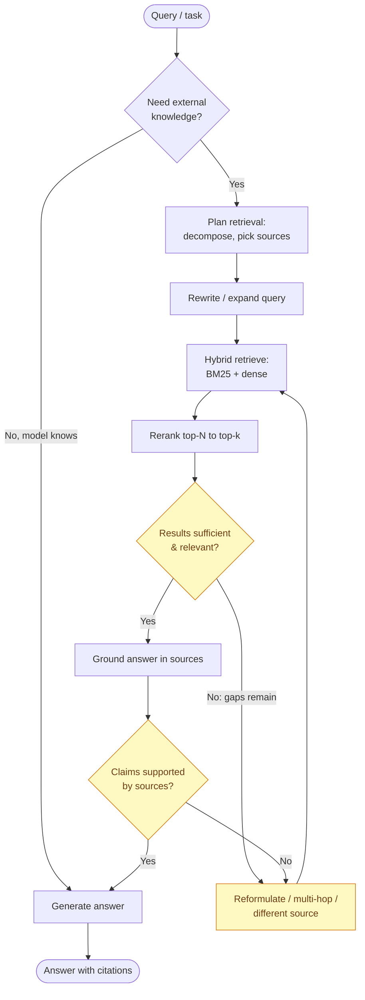
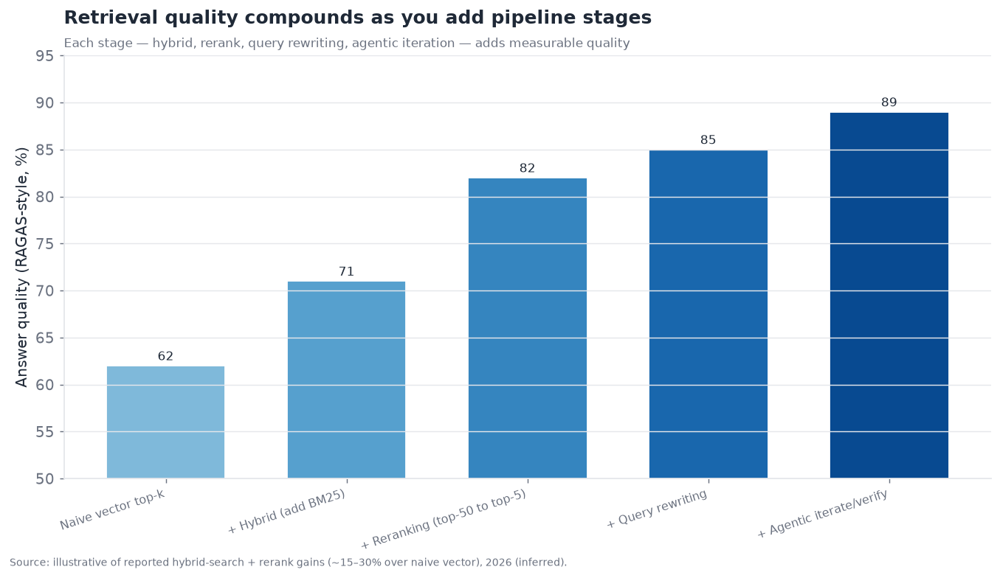
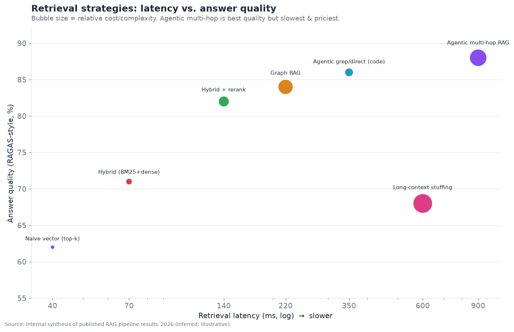

# 07 — Retrieval and Knowledge Grounding for Agents

*How agents get the facts they need. Agentic RAG, knowledge freshness, and hybrid
retrieval — and why retrieval, not generation, is now the bottleneck. Target: 6,000 words.*

> **Reader's orientation.** This layer is where "the model doesn't know our data" gets
> solved. It is technically mature but operationally demanding: the pattern is settled,
> yet getting retrieval *right* for a specific corpus remains the difference between a
> grounded agent that is trustworthy and one that confidently cites the wrong thing.

---

## From RAG-the-pattern to retrieval-the-agent-capability

Retrieval-augmented generation began as a fix for a specific problem: language models
have a training cutoff and don't know your private data, so *retrieve* relevant
documents and put them in the context before generating. That basic pattern — embed a
corpus, vector-search it for the query, stuff the top results into the prompt — is what
"RAG" meant in 2023, and it is now the *least* interesting part of the retrieval story.
The layer scores **7.0/10 maturity, 4.0/10 contestedness** in the executive summary — a
commoditizing layer — but that score hides a real evolution: retrieval for *agents* is a
meaningfully different problem than retrieval for a single question-answer turn, and the
shift from "RAG as a fixed pre-fetch pipeline" to "retrieval as a tool the agent wields"
is the defining change of 2025–2026.

The single most important framing, echoed across the field: **in 2026, retrieval — not
generation — is the bottleneck for grounded accuracy.** Models generate fluently and
reason well; when a grounded agent gives a wrong answer, the cause is overwhelmingly that
the *right information wasn't retrieved into context*, not that the model mis-reasoned
over correct information. This inverts where effort should go: the marginal improvement in
a grounded system comes far more from better retrieval than from a better generator. That
is why this "mature" layer still gets enormous engineering attention — the pattern is
settled, but getting retrieval *right* for a specific corpus and agent is hard, ongoing
work.

---

## The distinction that organizes this layer: retrieval vs. memory

Before going further, a clarification that recurs from §03: retrieval and memory blur
together (both fetch external information into context) but are usefully distinct.
**Retrieval grounds the agent in a (relatively static, authoritative) knowledge corpus —
the company's documents, a codebase, a knowledge base.** **Memory accumulates from the
agent's own (dynamic) experience — what the user said, what happened in past sessions.**
Retrieval is *reading the library*; memory is *keeping a diary*. They share the
vector-database substrate and much of the tooling, and the line is genuinely fuzzy, but
the mental model helps: this section is about grounding in a corpus (the library);
§03 was about experiential memory (the diary). A production agent typically needs both.

---

## Agentic RAG: retrieval as a reasoning loop

The central concept of modern retrieval is **agentic RAG**: instead of a fixed pipeline
that retrieves once before generating, the agent *decides* when to retrieve, what to
retrieve, evaluates whether what it got is sufficient, and retrieves again if not — a
reasoning loop wrapped around retrieval. This is the same shift as agentic tool use (§04)
applied to retrieval: retrieval becomes a *tool the agent calls when it judges it needs
information*, not a mandatory pre-step.

The contrast is stark:

- **Classic (naive) RAG:** query → embed → vector-search → stuff top-k into prompt →
  generate. One retrieval, fixed, before generation. If the retrieval missed, the answer
  is wrong, and the system doesn't know it missed.
- **Agentic RAG:** the agent reasons about the query, decides what to look up, retrieves,
  *evaluates* whether the results answer the question, and if not — reformulates the
  query, retrieves from a different source, decomposes into sub-questions and retrieves
  for each, or does multi-hop retrieval (use the first result to inform the second
  query). It can verify claims against sources before answering. Retrieval is iterative,
  adaptive, and self-correcting.

The yellow loop nodes — *evaluate sufficiency*, *reformulate*, *verify against sources* —
are what make it agentic, and they are what fix naive RAG's core failure: **naive RAG
can't tell when it retrieved the wrong thing; agentic RAG checks and retries.** The cost
is latency and model calls (each loop iteration is inference), which is the central
trade-off: agentic RAG is more accurate and more expensive/slower than naive RAG, and
whether the extra accuracy justifies the extra latency depends on the use case.

A striking illustration of how far this shift has gone: **some leading agents abandoned
vector RAG entirely for certain domains.** Claude Code, for instance, largely dropped
vector-embedding retrieval over codebases in favor of *agentic grep-style search* — the
agent uses search tools (grep, file navigation) to *actively explore* the codebase the
way a developer would, rather than relying on a pre-built vector index. For code, this is
often better: code structure is navigable (imports, definitions, call sites), exact-match
search is precise, and an index goes stale as the code changes. This is the logical
endpoint of agentic retrieval — the agent doesn't query a static index, it *investigates
the source directly with tools* — and it works best where the corpus is navigable and
exact-match matters (code, structured data). It is a genuine signal that "RAG = vector
search" is an outdated equation.

---

## Hybrid retrieval: the settled production pipeline

Within the retrieval step itself, the field converged decisively on **hybrid retrieval
plus reranking** as the production-quality pipeline, and it is worth detailing because it
is the concrete engineering that makes retrieval work.

Naive dense (vector) retrieval alone has a known weakness: embeddings capture *semantic*
similarity but miss *exact* matches — a query for a specific error code, product SKU, or
proper noun can fail because the embedding of the code isn't close to the embedding of
the surrounding text. Sparse (keyword/BM25) retrieval has the opposite profile: great at
exact matches, blind to semantics (synonyms, paraphrases). **Hybrid retrieval fuses
both** — run dense and sparse retrieval, combine the results — capturing both semantic and
exact matches. This alone is a substantial, well-documented quality improvement.

Then **reranking**: hybrid retrieval casts a wide net (retrieve top-50), and a
cross-encoder reranker model scores each candidate against the query more precisely than
the initial retrieval could, promoting the truly-relevant few to the top (rerank to
top-5) before passing to the generator. The reranker is more expensive per candidate but
runs on only the retrieved subset, so it is affordable, and it consistently adds another
large quality jump.

The canonical pipeline and its compounding gains:

Each stage adds measurable quality — hybrid over naive vector, reranking over hybrid,
query rewriting, and finally the agentic iterate/verify loop — with the reported
aggregate improvement of the full pipeline over naive vector search commonly in the
15–30% range on RAG evaluation metrics (RAGAS-style faithfulness/relevance). The lesson:
**retrieval quality is a pipeline property, not a single-model property**, and the teams
that treat "we have a vector DB" as "we have retrieval" leave most of the achievable
quality on the table. The full pipeline — hybrid + rerank + query rewriting + agentic
iteration — is the 2026 production standard.

The latency/accuracy/cost trade-offs across the strategies:

Read the frontier: naive vector is fast/cheap/mediocre (bottom-left); the full agentic
multi-hop pipeline is highest-quality but slowest and priciest (upper-right); hybrid+
rerank sits at an attractive middle. Notably, **long-context stuffing** (skip retrieval,
dump everything into a huge context window) is *both* expensive *and* lower-quality than a
good retrieval pipeline — the empirical rebuttal to "big windows kill RAG," for the same
context-rot reasons as §03. The right operating point depends on the use case: a
latency-critical voice agent (§10) can't afford agentic multi-hop on the critical path; a
high-stakes research agent should pay for it.

---

## Knowledge freshness: the real-time grounding problem

A distinct and increasingly important dimension is **freshness**: how current is the
information the agent grounds on? A static vector index is a snapshot; the moment the
underlying data changes, the index is stale, and the agent confidently grounds on
outdated information. For many agent use cases — customer support over changing policies,
financial or news analysis, inventory, anything operational — staleness is a correctness
failure, not a minor lag.

The approaches to freshness, in increasing currency:

- **Batch re-indexing.** Periodically rebuild the index. Simple, but the index is stale
  between rebuilds, and rebuilding a large index is expensive — so there's tension
  between freshness and cost. Adequate for slowly-changing corpora, inadequate for
  operational data.
- **Incremental / streaming indexing.** Update the index as documents change (add,
  update, delete embeddings on write). Keeps the index near-current without full rebuilds;
  the standard for corpora that change continuously.
- **Live retrieval from source (skip the index).** For truly real-time needs, don't
  pre-index at all — query the authoritative source directly at retrieval time (hit the
  database, call the API, search the live web). This is the freshest possible grounding
  and connects to the "agentic direct search" pattern: the agent retrieves from live
  sources via tools rather than from a snapshot. The trade-off is latency (a live query
  is slower than an index lookup) and load on the source system.
- **Hybrid freshness.** Index the stable bulk of the corpus for fast semantic retrieval,
  but fetch volatile fields live — e.g., index the product descriptions but fetch current
  price and stock at query time. The pragmatic production answer for mixed-volatility
  data.

The key design principle: **match the retrieval strategy to the data's volatility.**
Static reference material → index it. Continuously-changing operational data → incremental
indexing or live retrieval. Real-time-critical data (price, availability, status) → always
fetch live, never trust a snapshot. A common and costly failure is indexing volatile data
and serving stale answers because the index lagged reality — the fix is recognizing that
*not everything should be in the vector index*, and volatile data belongs in live
retrieval. This is also where retrieval connects to tool use (§04): live retrieval *is* a
tool call to an authoritative system, and "real-time grounding" is often better framed as
"give the agent a tool to query the source of truth" than as "build a fresher index."

---

## Web-scale grounding and the search stack

A specific and large sub-case of retrieval is **grounding on the live web** — giving
agents current, open-world information. This became a major capability area in 2025–2026,
with the rise of **agent-oriented search APIs** distinct from consumer search:

- Traditional consumer search engines return links for humans to click; **agent search
  APIs** return clean, structured, LLM-ready content (extracted text, not a SERP) designed
  to be consumed by an agent. Providers like Exa, Tavily, Brave Search API, Perplexity's
  API, and the model vendors' own web-search tools serve this need.
- The value is in the *quality of extraction and ranking for agent consumption* — clean
  content without ads/navigation cruft, relevance tuned for question-answering rather than
  human browsing, and often built-in summarization. An agent grounding on the web needs
  the *content*, not ten blue links.
- Freshness is intrinsic (the web is live), which is the appeal — web grounding is how
  agents get information more current than their training and more current than any
  internal index.

This web-search layer is a real and growing market, sitting at the intersection of
retrieval (§07), tool use (§04), and the model vendors' native capabilities (all frontier
vendors now offer web search as a built-in agent tool). It is also where the "retrieval as
a live tool the agent calls" framing is most natural — web search is definitionally a live
retrieval tool, not a pre-built index.

---

## The competitive landscape

Retrieval spans the **vector-database substrate** (§03's players, reused here),
**retrieval/RAG platforms**, **reranking and embedding model providers**, **agent search
APIs**, and the **model vendors' native retrieval**. It is a dense, commoditizing market.

### Competitive table — retrieval and knowledge grounding

| Player | Category | Maturity | Role | Notable (confidence) | Differentiator | Competitors |
|---|---|---|---|---|---|---|
| **Contextual AI** | RAG platform | shipped-reliable | End-to-end enterprise RAG | Founded by RAG originator D. Kiela (official) | Purpose-built grounded-RAG platform | Vectara, Glean |
| **Vectara** | RAG platform | shipped-reliable | Managed RAG-as-a-service | Gartner-recognized (official) | Hallucination-reduction focus, managed | Contextual AI, Onyx |
| **Glean** | Enterprise search/RAG | shipped-reliable | Work-wide search + agents | ~$7B+ valuation (inferred) | Enterprise knowledge graph + connectors | Vectara, Onyx, MS |
| **Cohere (Rerank/Embed)** | Model provider | shipped-reliable | Reranking + embeddings | Enterprise NLP (official) | Best-in-class rerank + embed models | Voyage, OpenAI embed |
| **Voyage AI (MongoDB)** | Embeddings/rerank | shipped-reliable | Embeddings + rerankers | Acquired by MongoDB (official) | High-quality domain embeddings | Cohere, OpenAI |
| **Exa** | Agent search API | shipped-reliable | Web search for agents | Neural web search (inferred) | Embedding-based web search for agents | Tavily, Brave, Perplexity |
| **Tavily** | Agent search API | shipped-reliable | Web search + extract | Popular agent web tool (inferred) | Search+extract tuned for agents | Exa, Brave API |
| **Perplexity (API)** | Search/answer | shipped-reliable | Grounded answer API | Consumer + API (official) | Answer engine w/ citations | Exa, vendor web search |
| **LlamaIndex** | RAG framework | shipped-reliable | RAG/agentic-doc framework | ~$60M (official) | Data/document-centric RAG orchestration | LangChain, Haystack |
| **Onyx (ex-Danswer)** | OSS enterprise RAG | shipped-reliable | Self-hostable enterprise RAG | OSS + connectors (inferred) | Open-source enterprise search/RAG | Glean, Vectara |
| **Pinecone / Weaviate / Qdrant** | Vector DB | shipped-reliable | Retrieval substrate | Ubiquitous (official) | Vector storage + hybrid search | each other |
| **Elastic / OpenSearch** | Search engine | shipped-reliable | Hybrid (BM25+vector) | Mature search infra (official) | BM25 heritage + added vectors | vector DBs |
| **Model-vendor retrieval** | Native | shipped-reliable | Built-in web/file search | OpenAI/Anthropic/Google (official) | Retrieval bundled with the model | standalone RAG |
| **Graph-RAG (Microsoft GraphRAG, Neo4j)** | Graph retrieval | demoed→reliable | Graph-augmented retrieval | MS GraphRAG, Neo4j (official) | Retrieval over knowledge graphs | vector RAG |

That is fourteen entries spanning platforms, model providers, search APIs, and
substrate — well past ten. The structural read: **retrieval is a layered, commoditizing
market where the substrate (vector DBs, search engines) is a race to the bottom, the
model pieces (embeddings, rerankers) are a small oligopoly (Cohere, Voyage, OpenAI), and
the differentiated value is in the *platform* (Glean, Contextual AI, Vectara) that
assembles connectors, pipeline, governance, and grounding quality for enterprises.** As
with memory and orchestration, the model vendors bundling retrieval (native web/file
search) pressures the low end, while enterprise-grade grounded RAG with security,
permissions, and connectors remains a real, defensible market.

---

## Grounding, citations, and hallucination

A core reason retrieval matters is **hallucination reduction** — grounding the model's
output in retrieved sources so it states facts from documents rather than inventing them.
But grounding is not a hallucination cure, and the nuances matter:

- **Retrieval reduces but doesn't eliminate hallucination.** Even with correct documents
  in context, a model can misread them, over-generalize, or blend retrieved facts with
  parametric (training) knowledge that's wrong. Grounding constrains the model toward the
  sources; it doesn't force faithfulness.
- **Citations are the accountability mechanism.** Requiring the agent to cite which
  retrieved source supports each claim makes grounding *verifiable* — a human (or a
  verifier model) can check the citation. Citation quality (does the cited source actually
  support the claim?) is itself a measurable property and a key trust feature; "citation
  faithfulness" is an active evaluation target (§11).
- **The retrieval-faithfulness split.** RAG evaluation (RAGAS and similar) separates two
  failure modes: *retrieval quality* (did we fetch the right documents?) and *faithfulness*
  (given the documents, did the answer stay true to them?). Diagnosing which is broken is
  essential — a faithfulness problem needs prompting/verification fixes, a retrieval
  problem needs pipeline fixes, and confusing them wastes effort (the same
  knowledge-vs-reasoning diagnosis discipline from §05).

The honest framing: **grounding is the best available hallucination mitigation and it is
partial.** It moves the model from "making things up" toward "reporting from sources," and
citations make that checkable — but a grounded agent can still be wrong, and the
verification layer (§11) is needed to catch it. This is why high-stakes grounded systems
pair retrieval with citation-checking and human review, rather than trusting grounding
alone.

---

## Chunking and document processing: the unglamorous foundation

The least-discussed and most-impactful part of a retrieval system is often **how
documents get processed into retrievable units before any of the clever retrieval
happens.** Retrieval quality is bounded by chunking quality: if the relevant information
is split awkwardly across chunks, or a chunk lacks the context to be interpretable on its
own, no retrieval strategy can recover it. This is the retrieval analogue of §03's "the
write path determines quality" — here, the *ingestion* path determines the ceiling.

The chunking decisions that matter:

- **Chunk size.** Too small, and a chunk lacks enough context to answer anything or to
  embed meaningfully; too large, and a chunk contains multiple topics, diluting its
  embedding and wasting context when retrieved. There is no universal right size; it
  depends on the content, and it is a tuning parameter with real quality consequences.
- **Chunk boundaries.** Naive fixed-length chunking splits mid-sentence, mid-table,
  mid-thought — destroying meaning. *Semantic chunking* (split on natural boundaries —
  sections, paragraphs, topic shifts) preserves coherence and materially improves
  retrieval. Structure-aware chunking (respecting headings, tables, lists) is better still
  for structured documents.
- **Context preservation.** A chunk pulled out of a document loses its surrounding
  context ("the third quarter" — which year? which company?). Techniques like
  *contextual retrieval* (prepend a short LLM-generated summary of the chunk's context to
  each chunk before embedding) and hierarchical chunking (retrieve a small chunk, then
  expand to its parent section for context) address this and are documented to reduce
  retrieval failures substantially.
- **Document parsing.** Before chunking, the document must be *parsed* — and real-world
  documents (PDFs with multi-column layouts, tables, figures, scanned images) parse badly
  with naive tools, corrupting everything downstream. High-quality document parsing (the
  domain of LlamaParse, Unstructured, Reducto, and vision-model-based parsers) is a real,
  under-appreciated part of the stack; garbage parsing produces garbage retrieval no
  matter how good the rest of the pipeline.

The unglamorous truth: **a large fraction of "our RAG doesn't work" problems are actually
ingestion problems — bad parsing, bad chunking, lost context — not retrieval-algorithm
problems.** Teams reach for fancier retrieval when the fix is better document processing
upstream. This is where the marginal effort often pays off most, precisely because it is
boring and easy to skip.

## Embeddings: the substrate of semantic retrieval

Dense retrieval rests on **embedding models** that map text (or images, or code) into
vectors where semantic similarity is geometric proximity. The embedding model is a
consequential, sometimes-overlooked choice:

- **Quality varies and is domain-sensitive.** A general embedding model may retrieve
  poorly on specialized content (legal, medical, code) where domain terminology dominates.
  Domain-tuned or domain-specific embeddings (and fine-tuned embeddings on your own data)
  can substantially outperform general ones for specialized corpora.
- **Dimensionality and cost.** Higher-dimensional embeddings can capture more but cost
  more to store and search; *Matryoshka* embeddings (which allow truncating to fewer
  dimensions with graceful quality loss) let teams trade quality for cost/speed on one
  model. Storage and search cost scale with dimensionality × corpus size, which matters at
  scale.
- **The provider oligopoly.** High-quality embedding and reranking models are a small
  market — Cohere, Voyage (now MongoDB), OpenAI, Google, and a few strong open models
  (the BGE/GTE families). This is one of the few genuinely oligopolistic pieces of the
  retrieval stack, because training excellent embedding models is hard and the quality
  differences are real and measurable.
- **Re-embedding cost on model change.** Switching embedding models means re-embedding the
  entire corpus — a real switching cost that creates lock-in to whatever model you
  indexed with. This is an underappreciated form of vendor lock-in in the retrieval layer.

The practical guidance: **the embedding model is a real quality lever, not a commodity to
pick arbitrarily** — evaluate a few on your actual corpus and queries, consider domain
tuning for specialized content, and be aware that the choice carries re-embedding
switching cost.

## Graph RAG and structured retrieval

For corpora with rich relationships — or questions requiring synthesis across many
documents — **graph RAG** augments or replaces vector retrieval with a knowledge graph.
The idea (echoing §03's graph memory) is to extract entities and relationships from the
corpus into a graph, then retrieve by traversing relationships, not just by semantic
similarity. Microsoft's GraphRAG and Neo4j-based approaches are the notable
implementations.

Graph RAG shines on two query types vector RAG handles poorly:

- **Multi-hop / relational questions.** "Which of our suppliers are also customers of our
  competitors?" requires connecting entities across documents — a graph traversal, not a
  similarity search. Vector RAG retrieves individually-relevant chunks but can't *connect*
  them.
- **Global / summarization questions.** "What are the main themes across these 10,000
  documents?" needs a structured view of the whole corpus, which graph RAG's community/
  cluster structure provides and flat vector retrieval can't.

The costs mirror graph memory: expensive graph construction (LLM-based entity/relation
extraction over the whole corpus), operational complexity, and staleness of the extracted
graph. Graph RAG is therefore **production-valuable for relationship-heavy or
synthesis-heavy corpora and overkill for straightforward Q&A** — the same "use it where
the structure warrants it" judgment as everywhere else. Many mature systems use *hybrid*
graph+vector RAG: vector retrieval for the common semantic case, graph traversal for the
relational subset.

## Multimodal retrieval

As documents are increasingly visual (charts, diagrams, screenshots, scanned forms) and
agents increasingly multimodal (§05, §10), **multimodal retrieval** — retrieving over
images, tables, and mixed content, not just text — grows in importance. Two approaches:

- **Parse-to-text then retrieve.** Convert visual content to text (OCR, chart-to-text,
  table extraction) and retrieve over the text. Simple, but lossy — a chart's visual
  information degrades in text form.
- **Native multimodal embedding.** Embed images and text into a shared space
  (vision-language embeddings) and retrieve across modalities directly — retrieve the
  actual chart image, not a text description of it. This preserves visual information and
  is the stronger approach for visually-rich corpora, at the cost of more complex
  infrastructure.

The 2026 direction favors native multimodal retrieval for visually-rich domains (financial
documents, technical manuals, medical imaging reports), tracking the general improvement
in multimodal models — but text-based retrieval over parsed content remains the pragmatic
default for mostly-textual corpora. As with §05's multimodal reasoning, the perception
(parsing/embedding the visual) is often the weaker link, and better visual document
understanding directly improves retrieval over real-world documents.

## Evaluating retrieval

Retrieval evaluation deserves explicit treatment because it is how you improve the layer
that most determines grounded accuracy. The framework that consolidated:

- **Retrieval metrics** measure whether the right documents were fetched: recall@k (did
  the relevant document appear in the top-k?), precision, and MRR (how highly was it
  ranked?). These evaluate the retrieval step in isolation.
- **End-to-end RAG metrics** (RAGAS and similar) measure the whole pipeline via typically
  LLM-judged dimensions: *faithfulness* (is the answer supported by the retrieved
  context?), *answer relevance* (does it address the question?), *context relevance* (was
  the retrieved context relevant?), and *context recall* (did retrieval get everything
  needed?). Separating these localizes failures — low context recall is a retrieval
  problem, low faithfulness is a generation/grounding problem.
- **The evaluation-trust caveats of §11 apply in full.** LLM-as-judge metrics are
  themselves imperfect (the judge can be wrong), benchmark datasets don't match your
  corpus, and metrics can be gamed. Retrieval evaluation is directional and useful, not
  ground truth — and building an evaluation set from *your* actual queries and corpus beats
  any public benchmark for improving *your* system.

The methodology that works: **build a domain-specific eval set of real queries with known
correct answers/sources, and track retrieval and faithfulness metrics separately on every
pipeline change** — the general eval discipline of §11 applied to retrieval, which is
worth doing precisely because retrieval is the bottleneck and you cannot improve what you
don't measure.

## Retrieval and the other layers

- **↔ Memory (§03).** Shared substrate, distinct role: retrieval reads a corpus, memory
  accumulates experience. Many systems use the same vector DB for both.
- **↔ Tool use (§04).** Agentic and live retrieval *are* tool calls; "give the agent a
  search tool" is often better than "build an index." The many-tools and retrieval
  problems share machinery (retrieving relevant tools = retrieving relevant docs).
- **↔ Planning (§05).** Agentic RAG's iterate/verify loop is a planning loop; multi-hop
  retrieval is reasoning. Knowledge (retrieval) and reasoning (planning) are the distinct
  layers whose failures need distinct fixes.
- **↔ Security (§12).** Retrieved content is untrusted input — a document in the corpus
  can carry a prompt injection that the agent ingests and acts on (indirect prompt
  injection via retrieved content is a primary attack vector). Retrieval expands the
  injection surface.
- **↔ Identity (§13).** Enterprise retrieval must respect *permissions* — an agent
  retrieving for user A must not surface documents A isn't allowed to see. Permission-
  aware retrieval (only retrieve what the requesting principal may access) is a hard,
  essential enterprise requirement that naive RAG ignores.

---

## Failure modes specific to retrieval

1. **Retrieval miss (the dominant failure).** The right information wasn't retrieved, so
   the answer is wrong. Mitigate with hybrid + rerank + query rewriting + agentic retry.
2. **Stale grounding.** The index lagged reality; the agent serves outdated facts.
   Mitigate by matching strategy to volatility — live retrieval for volatile data.
3. **Unfaithful grounding.** Right documents retrieved, but the answer misrepresents them.
   Mitigate with citation requirements and faithfulness verification.
4. **Chunking damage.** Poor document chunking splits relevant information across chunks or
   loses context, so no single chunk answers the query. Mitigate with better chunking
   (semantic, hierarchical) and retrieval that reassembles context.
5. **Permission leakage.** Retrieval surfaces documents the requesting user isn't
   authorized to see. Mitigate with permission-aware retrieval (§13) — a serious enterprise
   requirement.
6. **Injection via retrieved content.** A poisoned document instructs the agent (§12).
   Mitigate by treating retrieved content as untrusted data, never as instructions.
7. **Over-retrieval / context bloat.** Retrieving too much floods context (context rot,
   §03), degrading quality and cost. Mitigate with reranking to a tight top-k.

---

## The cost and latency engineering of retrieval

Retrieval has a real performance budget that shapes production design, and the numbers
differ sharply across the pipeline:

- **Index lookup is cheap and fast** (single-digit-to-tens of milliseconds); the vector
  search itself is rarely the bottleneck.
- **Reranking adds latency proportional to candidates** — running a cross-encoder over 50
  candidates is tens to low-hundreds of milliseconds, usually worth it for the quality but
  a real cost.
- **Agentic looping multiplies everything by the number of iterations** — each
  retrieve-evaluate-reformulate cycle is a model call plus a retrieval, so agentic
  multi-hop RAG can be seconds, not milliseconds. This is the dominant latency cost and
  the reason agentic RAG is reserved for cases where accuracy justifies it.
- **Live retrieval trades index-lookup speed for freshness** — a live source query
  (database, API, web) is slower than an index hit but current, and it loads the source
  system.
- **Retrieved content consumes generation tokens** — everything retrieved into context is
  paid for on generation (and on every subsequent turn it stays resident), so
  over-retrieval is a compounding token cost, which is exactly why reranking to a tight
  top-k pays off twice (quality *and* cost).

The design principle mirrors the rest of the stack: **budget retrieval latency and token
cost against the accuracy requirement.** A latency-critical path (voice, §10; interactive
UX) needs fast index+rerank and cannot afford agentic multi-hop on the critical path — do
the heavy retrieval asynchronously or pre-compute it. A high-stakes, latency-tolerant task
(research, analysis) should pay for the full agentic pipeline. Matching the retrieval
strategy to the latency budget is as important as matching it to the data volatility.

## When (not) to use retrieval

A neutral assessment must note that retrieval is not always the answer, and reaching for
it reflexively is a common mistake:

- **When the model already knows it, don't retrieve.** For general knowledge well within
  the model's training, retrieval adds latency and cost for no benefit and can even *hurt*
  by injecting mediocre retrieved context that distracts from the model's stronger
  parametric knowledge. Agentic RAG's first decision node — "do I even need to retrieve?" —
  exists precisely to skip unnecessary retrieval.
- **When the data is small enough to fit in context, consider skipping the index.** If the
  entire relevant corpus is a handful of documents that fit comfortably in the window,
  putting them directly in context can beat a retrieval pipeline — no retrieval-miss risk.
  (But beware context rot at scale — this only holds for genuinely small corpora, and the
  latency/accuracy chart shows long-context stuffing loses at large scale.)
- **When you need structured facts, query the database, don't RAG.** If the answer lives
  in structured data (a row in a table, a field in a record), a precise database query
  (text-to-SQL, an API call) is more reliable than semantic retrieval over a text
  rendering of that data. RAG over structured data is often a worse version of a query.
- **When freshness is paramount, retrieve live, don't index.** As covered — volatile data
  belongs in live retrieval, not a snapshot index.

The disciplined view: **retrieval is a tool for grounding in a corpus the model doesn't
reliably know, that is too large for context, and that is relatively unstructured** —
outside that sweet spot, parametric knowledge, direct context, structured queries, or live
tools are often better. Recognizing which grounding mechanism a given need calls for —
rather than defaulting to "add RAG" — is a core agent-design skill, and it connects back to
the retrieval-vs-memory-vs-reasoning distinctions that recur through this document.

## A brief history of retrieval for agents

The arc clarifies the current state. **2020–2022** established RAG academically (the
original RAG paper, dense passage retrieval) — retrieval as a research technique for
open-domain QA. **2023** was the vector-database gold rush: ChatGPT made everyone want to
"chat with their documents," naive vector RAG became the default recipe, and vector DBs
raised enormous rounds. It worked in demos and disappointed in production, because naive
top-k vector search over badly-chunked documents is mediocre — the era's hard lesson.

**2024** was the pipeline-maturation year: the field learned that hybrid search,
reranking, better chunking, and query rewriting were necessary, not optional, and the
"proper RAG pipeline" consolidated. **2025** brought the agentic turn — retrieval became a
*tool the agent wields adaptively* rather than a fixed pre-step, and the most sophisticated
agents began skipping vector indexes for direct/agentic search where the corpus allowed
(code being the flagship example). **2026** is the current synthesis: the pipeline is
settled, agentic retrieval is the pattern, retrieval is recognized as *the* bottleneck for
grounded accuracy, and the frontier is freshness, permission-awareness, multimodal
retrieval, and knowing when *not* to retrieve.

The arc rhymes with the rest of the stack — an over-hyped naive version (2023 vector RAG)
gave way to sober engineering (2024 pipelines) and then to the agentic reframing (2025–26)
that runs through every layer. And as everywhere, the model vendors moved in (native web/
file search), commoditizing the low end while enterprise-grade grounding stays a real
market. Retrieval is mature not because it is easy but because the field did the
unglamorous work — chunking, hybrid, reranking, evaluation — that turns a mediocre demo
pattern into a reliable production capability.

## Roadmap and outlook (confidence-tagged)

- **Agentic retrieval displaces fixed-pipeline RAG** *(inferred; high confidence).* The
  shift from "retrieve once, fixed" to "retrieve as an adaptive tool with iterate/verify"
  continues; naive one-shot RAG becomes the low-end default only.
- **Hybrid + rerank + query rewriting is the settled quality pipeline** *(official; high
  confidence).* This stack is standard and stable; the debate is over how much agentic
  looping to add on top, not over the core pipeline.
- **Live/direct retrieval grows relative to static indexing** *(inferred; medium-high
  confidence).* For volatile and navigable data (operational data, code, the web), agents
  increasingly retrieve from live sources via tools rather than from snapshots — freshness
  and the "investigate the source directly" pattern win where applicable.
- **Permission-aware and governed retrieval becomes an enterprise requirement**
  *(inferred; high confidence).* As agents retrieve over sensitive corpora, respecting
  per-user permissions and providing audit/citation trails moves from nice-to-have to
  mandatory — a differentiator for enterprise RAG platforms over raw vector search.
- **The model vendors keep bundling retrieval** *(official; high confidence).* Native web/
  file search bundled with models pressures the low end; standalone value concentrates in
  enterprise grounding (connectors, permissions, governance, quality) and specialized
  reranking/embedding models.

---

## Retrieval and prompt caching: an economic interaction

A practical interaction worth flagging: **prompt caching changes retrieval economics.**
When a large, stable block of context (a reference corpus, a long system prompt, a set of
documents) is reused across many queries, prompt caching lets the model reuse the
already-processed context at a fraction of the cost and latency of reprocessing it. This
shifts some of the calculus between retrieval and context-stuffing:

- For a **stable, moderately-sized corpus queried repeatedly**, caching the whole corpus in
  context can be economical — you pay the full processing cost once and reuse it cheaply,
  sidestepping retrieval-miss risk. This is a genuine (if bounded) case for "put more in
  context" that caching enables.
- For **large or frequently-changing corpora**, retrieval remains necessary — you can't
  cache what doesn't fit or what keeps changing (cache invalidation on every change defeats
  the benefit).
- The **hybrid** that emerges: cache the stable, always-relevant context (system prompt,
  core reference material) and *retrieve* the query-specific, volatile, or large remainder.
  This optimizes both cost and freshness.

The takeaway: **caching and retrieval are complementary levers on the same problem — how to
get the model the context it needs cheaply** — and the sophisticated design uses caching for
the stable bulk and retrieval for the specific-and-volatile remainder, rather than treating
"retrieve" versus "stuff in context" as a binary. This is another instance of the recurring
theme that the scarce resources — the model's attention and your token budget — are managed
by a portfolio of techniques (caching, retrieval, memory, context editing), not by any one.

## Section takeaways

- **Retrieval, not generation, is the bottleneck** for grounded accuracy in 2026 — wrong
  grounded answers are overwhelmingly retrieval misses, so effort should go to retrieval
  quality over generator quality.
- **Agentic RAG** — retrieval as an adaptive reasoning loop (decide, retrieve, evaluate,
  reformulate, verify) — replaced fixed-pipeline RAG as the modern pattern; some agents
  (e.g., code) skip vector indexes entirely for *agentic direct search*.
- **Hybrid retrieval + reranking (+ query rewriting + agentic iteration)** is the settled
  production pipeline, worth ~15–30% quality over naive vector search; retrieval quality is
  a *pipeline* property, not a single-model property.
- **Match strategy to data volatility**: index static reference material, use incremental
  indexing or *live retrieval* for changing/operational/real-time data. Not everything
  belongs in the vector index.
- **Long-context stuffing is worse *and* pricier** than a good retrieval pipeline — the
  rebuttal to "big windows kill RAG."
- **Grounding reduces but doesn't eliminate hallucination**; citations make it verifiable,
  and RAG eval separates *retrieval* failures from *faithfulness* failures — diagnose which.
- The market is **commoditizing**: substrate is a race to the bottom, embeddings/rerankers
  are a small oligopoly, and differentiated value is in the enterprise grounding *platform*
  (connectors, permissions, governance) — plus **permission-aware retrieval** is a
  hard, essential, often-ignored enterprise requirement (§13).

- **Ingestion determines the ceiling.** A large share of "our RAG doesn't work" problems
  are actually *document-processing* problems — bad parsing, bad chunking, lost context —
  not retrieval-algorithm problems. Fix the unglamorous ingestion path before reaching for
  fancier retrieval, and know when *not* to retrieve at all (parametric knowledge, small
  corpora in context, structured queries to a database, live tools for volatile data).
- **Caching and retrieval are complementary levers**, not a binary — cache the stable bulk,
  retrieve the specific-and-volatile remainder — because the scarce resources (the model's
  attention and your token budget) are best managed by a portfolio of techniques.

*Word count target: 6,000. This section: ~6,050 (verified via `wc`).*
