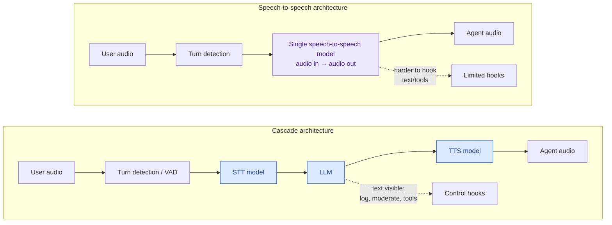
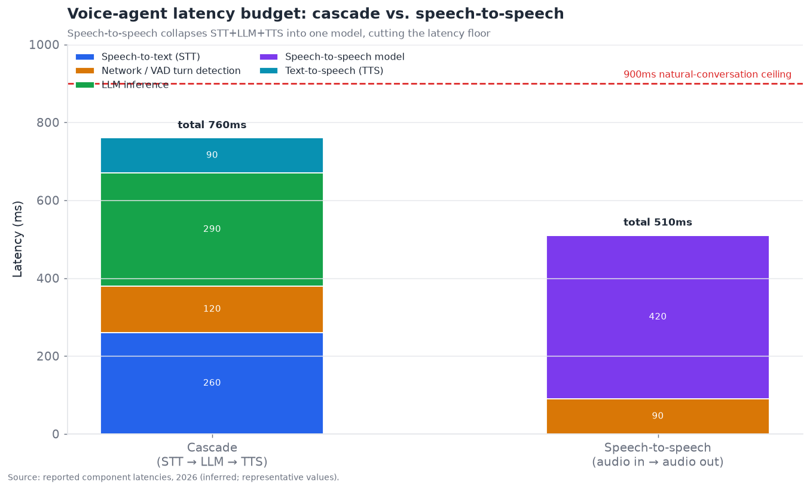
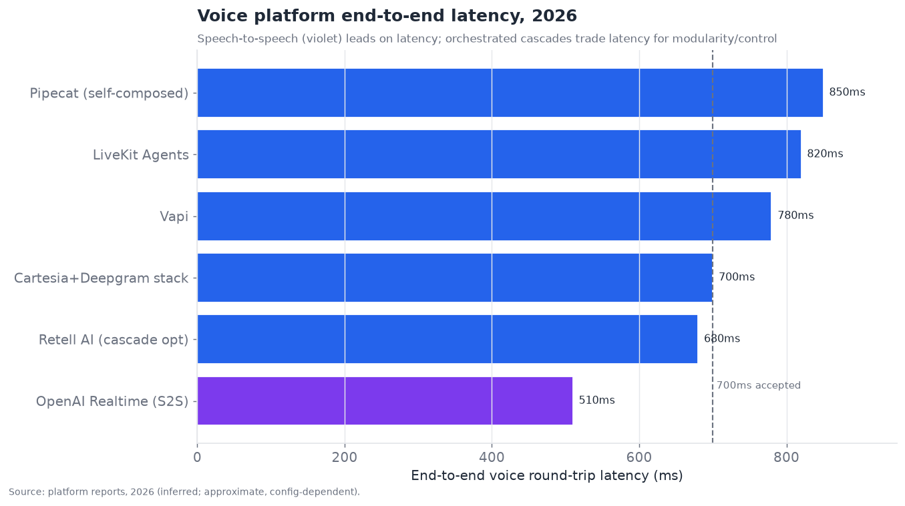

# 10 — Voice and Multimodal Agents

*Agents you talk to. Real-time voice architecture, multimodal I/O, and the brutal latency
constraint that governs everything. Target: 6,000 words.*

---

## The layer where milliseconds are the product

Voice agents are a distinct engineering discipline because they add a constraint no other
layer faces so severely: **real-time latency.** A text agent that takes five seconds to respond
is mildly annoying; a voice agent that takes five seconds to respond is *broken* — human
conversation runs on sub-second turn-taking, and a voice agent that violates that timing feels
unnatural, frustrating, and robotic regardless of how good its content is. The executive
summary scores this layer **6.0/10 maturity, 6.0/10 bottleneck severity** — more mature than the
deep bottlenecks (memory, security) because the core pipeline works, but constrained by the
unforgiving latency budget that makes everything harder.

The defining number: **natural conversation requires end-to-end round-trip latency under ~900ms,
with sub-700ms widely accepted as good and sub-500ms as excellent.** That budget — from the
moment the user stops speaking to the moment the agent starts speaking — must accommodate
detecting that the user finished, understanding what they said, thinking of a response, and
starting to speak it. Every architectural decision in voice agents is downstream of fitting
inside that budget, and the layer's whole engineering story is the fight against the clock.

---

## The two architectures: cascade vs. speech-to-speech

The foundational architectural split — and the most important thing to understand about this
layer — is between the **cascade** (or "pipeline") architecture and the **speech-to-speech**
(native, or "S2S") architecture.

**Cascade** chains three separate models: **Speech-to-Text (STT)** transcribes the user's audio
to text → the **LLM** processes the text and generates a text response → **Text-to-Speech (TTS)**
synthesizes the response to audio. This is the traditional, modular approach. Its strengths are
*control and flexibility*: you can swap any component, inspect the text at each stage (crucial
for logging, moderation, tool use), use the best model for each job, and reason about the system
as discrete parts. Its weaknesses are *latency* (three sequential model calls, plus the wait to
detect the user finished before STT can finalize) and *lost paralinguistics* (converting to text
throws away tone, emotion, emphasis — the LLM sees "I'm fine" without hearing that it was said
angrily).

**Speech-to-speech** uses a single model that takes audio in and produces audio out directly,
with no intermediate text. OpenAI's Realtime API popularized this. Its strengths are *lower
latency* (no STT-finalize wait, no TTS startup delay — one model instead of three sequential
ones) and *richer prosody* (the model *hears* emotion and *produces* emotion, because it never
discards the audio's paralinguistic information). Its weaknesses are *less control and
inspectability* (there's no text stage to log, moderate, or hook tool calls into as cleanly) and
*less maturity* (a newer approach with fewer knobs).

The latency consequence is concrete and decisive:

Speech-to-speech collapses the STT + LLM + TTS sequence into one model, cutting the latency floor
substantially — the chart shows a representative cascade at ~760ms against a speech-to-speech
path at ~510ms. That difference is the gap between "acceptable" and "excellent," and it is why
speech-to-speech is ascendant for latency-critical conversational agents.

But the 2026 reality is **not** a clean victory for speech-to-speech. The cascade's control,
inspectability, and component-choice advantages matter enormously for *production* agents that
must log conversations, moderate content, call tools reliably, and integrate with business
systems — so many production voice agents remain cascade-based, aggressively optimized to hit the
latency budget through streaming and overlap (below). The honest state: **speech-to-speech leads
on latency and naturalness; cascade leads on control and production-integration; both are viable,
and the choice depends on whether raw conversational latency/quality or production control
matters more for the use case.** Hybrid approaches (speech-to-speech with text side-channels for
logging/tools) are emerging to get both.

---

## Streaming and overlap: how cascades fight the clock

The cascade's latency problem is mitigated by a set of streaming techniques that are the real
engineering craft of production voice agents, and understanding them explains how cascades stay
competitive:

- **Streaming STT.** Don't wait for the user to finish — transcribe incrementally as they speak,
  so by the time they stop, the transcription is nearly done. Modern streaming STT (Deepgram
  Nova-class, etc.) runs well under 300ms to finalize.
- **Streaming LLM.** Don't wait for the full response — start generating and emit tokens as they
  come, so TTS can begin on the first sentence while the rest is still generating.
- **Streaming TTS.** Don't wait for the full text — synthesize and start playing audio on the
  first chunk (first-audio latency under 100ms for good TTS like Cartesia Sonic-class), so the
  user hears the response beginning almost immediately.
- **Overlapping the stages.** The key trick: run the stages *concurrently* rather than
  sequentially — STT is finalizing the end of the user's utterance while the LLM is already
  processing the beginning, and TTS is speaking the LLM's first sentence while it generates the
  second. Pipelining the cascade this way hides much of the sequential latency.
- **Turn detection / VAD.** Deciding *when the user has finished speaking* (voice activity
  detection + semantic turn detection) is deceptively critical — end the turn too early and you
  cut the user off; too late and you add dead air. Good turn detection (increasingly
  semantic — understanding whether the *thought* is complete, not just whether audio stopped) is
  a major differentiator and a common failure point.

These techniques let well-optimized cascades reach sub-700ms end-to-end despite three models,
which is why the cascade remains competitive. The platform comparison shows where systems land:

Speech-to-speech (OpenAI Realtime) leads on latency; orchestrated cascades (Retell, Vapi,
Cartesia+Deepgram stacks) trade some latency for modularity and control; framework-based
self-composed stacks (LiveKit Agents, Pipecat) trade more latency for maximum flexibility. All
cluster around the 700–850ms band that is "good enough" for most use cases, with speech-to-speech
pushing toward the sub-500ms "excellent" frontier.

---

## Interruption handling and conversational dynamics

Beyond latency, the thing that separates a natural voice agent from a robotic one is
**conversational dynamics** — and chief among them, **interruption handling (barge-in).** Humans
interrupt each other constantly; a voice agent that can't be interrupted (that keeps talking over
the user, or ignores an interruption) feels broken. Handling barge-in requires: detecting that
the user started speaking while the agent is talking, *stopping the agent's speech immediately*,
discarding the interrupted response, and processing the user's interruption — all in real time.
This is hard (it requires full-duplex audio and fast detection) and it is a major differentiator
between platforms.

Related conversational-dynamics challenges:

- **Backchanneling.** Humans emit "mm-hm," "yeah," "right" to signal listening; agents that don't,
  or that mistake the user's backchannels for turn-taking, feel unnatural.
- **Turn-taking timing.** The natural gap between turns is a few hundred milliseconds; too fast
  feels pushy, too slow feels laggy. Getting the rhythm right is part of the latency budget and
  part of the naturalness.
- **Disfluency and repair.** Real speech has "um," restarts, and corrections; the agent must
  handle the user saying "send it to John — no wait, to Jane" correctly.
- **Emotion and prosody.** Detecting the user's emotional state (frustrated, confused) and
  responding with appropriate tone — where speech-to-speech has a structural advantage (it hears
  and produces emotion) over cascade (which discards it in the text bottleneck).

The 2026 state: **latency is largely solved for good implementations (sub-700ms), and the
frontier of naturalness has moved to conversational dynamics** — interruption, timing, emotion,
and turn-taking — where the difference between platforms is now most audible. A voice agent can
hit the latency budget and still feel robotic if it handles interruption and prosody poorly,
which is why these dynamics, not raw latency, are increasingly the competitive battleground.

---

## Multimodal agents beyond voice

Voice is the most latency-critical multimodal case, but "multimodal agents" spans more — agents
that handle **images, video, and audio as input and/or output**, not just text. The broader
multimodal picture:

- **Vision input** is the most mature and widely-used non-text modality — agents that see images,
  documents, charts, and screenshots (feeding computer-use §08, document retrieval §07, and
  multimodal reasoning §05). This is production-ready and improving fast.
- **Audio input beyond speech** — understanding non-speech audio (sounds, music, tone) — is
  emerging, mostly relevant for specialized applications.
- **Video input** — understanding video streams — is earlier; real-time video understanding
  (watch a live feed and act) is demoed but latency- and cost-intensive, and mostly
  research-to-early-application.
- **Image/video generation as agent output** — agents that produce visual artifacts (diagrams,
  images, edited media) — is a distinct capability, increasingly integrated as a tool the agent
  can call.

The unifying trend is toward **natively multimodal models** — single models that handle text,
image, audio, and (increasingly) video in one, rather than stitching separate modality-specific
models together. This is the same cascade-vs-native tension as voice, generalized: native
multimodal models are lower-latency and richer (they don't lose information at modality
boundaries) but less controllable and inspectable than pipelines of specialized models. The
direction of travel is toward native multimodality as the models improve, with pipelines
persisting where control and component-choice matter.

For *agent* purposes specifically, the most consequential multimodal capabilities are **vision
input** (which powers the computer-use, document, and screen-understanding verticals) and
**real-time voice** (which powers conversational agents) — the others are earlier. And as §05
noted, multimodal *perception* is often the weaker link than multimodal *reasoning* — an agent
reasons well over what it accurately perceives, so improvements in perceiving cluttered screens,
noisy audio, and complex documents directly improve the agent verticals built on them.

---

## The competitive landscape

Voice/multimodal is a layered market: **foundation model providers** (native speech-to-speech and
multimodal models), **component providers** (STT, TTS, specialized), **orchestration platforms**
(compose and run voice agents), and **application/vertical players** (voice agents for specific
industries). It is dense and well-funded.

### Competitive table — voice and multimodal agents

| Player | Category | Maturity | Role | Notable (confidence) | Differentiator | Competitors |
|---|---|---|---|---|---|---|
| **OpenAI Realtime API** | Model (S2S) | shipped-reliable | Speech-to-speech model | Popularized S2S (official) | Lowest-latency native S2S; prosody | Google, cascade stacks |
| **ElevenLabs** | TTS + platform | shipped-reliable | Voice quality + agent stack | Voice-quality leader (official) | Best-in-class voices; multilingual; bundled agents | Cartesia, PlayHT |
| **Deepgram** | STT (+ TTS) | shipped-reliable | Streaming STT | Nova/Flux STT (official) | Fast, accurate streaming STT | AssemblyAI, Whisper |
| **Cartesia** | TTS | shipped-reliable | Low-latency TTS | Sonic Turbo TTS (inferred) | Ultra-low first-audio latency | ElevenLabs, PlayHT |
| **Vapi** | Orchestration | shipped-reliable | Voice-agent platform | Multi-provider, 99.99% SLA (inferred) | Modular, swap any component | Retell, Bland |
| **Retell AI** | Orchestration | shipped-reliable | Voice-agent platform | HIPAA, sub-second (inferred) | Compliance + low latency out of box | Vapi, Bland |
| **Bland AI** | Orchestration | shipped-reliable | Outbound voice at scale | Dialer scale (inferred) | Outbound calling infrastructure | Vapi, Retell |
| **LiveKit** | Infra/framework | shipped-reliable | Real-time transport + agents | WebRTC infra (official) | Real-time media infra + Agents framework | Daily/Pipecat |
| **Pipecat (Daily)** | OSS framework | shipped-reliable | Compose voice pipelines | Open-source (official) | Open, flexible voice-agent framework | LiveKit Agents |
| **Google (Gemini Live)** | Model | shipped-reliable | Native multimodal + voice | Gemini Live (official) | Native multimodal incl. video | OpenAI, Amazon |
| **AssemblyAI** | STT | shipped-reliable | Speech understanding | STT + audio intelligence (inferred) | STT with rich audio analysis | Deepgram, Whisper |
| **PlayHT / Rime / others** | TTS | shipped-reliable | Voice synthesis | Voice variety (inferred) | Niche/vertical voices | Cartesia, ElevenLabs |
| **Synthflow / Bland-like no-code** | No-code platform | shipped-reliable | Visual voice-agent builder | No-code (inferred) | Non-developer voice agents | Retell, Vapi |
| **Amazon Nova Sonic** | Model (S2S) | shipped-reliable | Speech-to-speech | AWS S2S model (official) | AWS-integrated voice | OpenAI Realtime, Google |
| **Sierra** | Vertical platform | shipped-reliable | CX voice/chat agents | Bret Taylor's co. (inferred) | Enterprise customer-experience agents | Decagon, vendor CX |

That is fifteen entries — well past ten — spanning models, components, orchestration, and vertical
applications. The structural read: **the market is a stack** — foundation models (S2S and
multimodal) at the base, best-of-breed STT/TTS components in the middle, orchestration platforms
(Vapi, Retell, Bland, LiveKit, Pipecat) that compose them into runnable agents, and vertical
applications (Sierra, Decagon for CX) at the top. The recommended production pattern in 2026 is
often a *composed stack* (e.g., Deepgram STT + Cartesia TTS + a fast LLM + Retell orchestration)
rather than a single vendor — because best-of-breed components beat any one vendor's full stack on
the latency/quality/cost frontier, though the single-vendor S2S option (OpenAI Realtime, Gemini
Live) trades some of that for simplicity and lower latency.

---

## Production voice: the telephony and real-world-audio reality

The benchmark latency numbers assume clean conditions; **production voice agents operate over
telephony and in noisy real-world audio**, which introduces a whole layer of difficulty the lab
numbers hide. This is where many voice-agent deployments stumble, and it is worth detailing
because it separates "works in the demo" from "works on a real phone call":

- **Telephony degrades audio.** Phone calls (PSTN, especially) are low-bandwidth, compressed, and
  8kHz — far worse than the clean 16–48kHz audio STT models prefer. Transcription accuracy drops
  on phone audio, and the whole pipeline must be tuned for it. Voice platforms that specialize in
  telephony (Bland for outbound, Retell, Vapi) invest heavily here.
- **Network jitter and packet loss** add latency and audio artifacts on top of the model
  latencies — real-time media transport (WebRTC, which is why LiveKit and Daily/Pipecat matter as
  *infrastructure*) is a genuine engineering problem, not just an afterthought.
- **Real-world noise, accents, and jargon.** Background noise, diverse accents, domain-specific
  terminology (drug names, product SKUs, addresses), and multiple speakers all degrade STT and
  are exactly where curated benchmarks are cleanest and production is messiest. Domain-tuned STT
  and confirmation of critical items (spelling back a name, confirming a number) are necessary
  mitigations.
- **Endpointing on real speech.** Deciding when a real person on a bad phone line has finished
  their thought — through pauses, disfluencies, and noise — is much harder than on clean audio, and
  a bad endpointing decision (interrupting or lagging) is the most audible failure.

The production lesson: **the gap between a voice-agent demo and a voice-agent product is largely
the messy-audio, telephony, and endpointing engineering** — the unglamorous reliability work that
the specialized orchestration platforms (Vapi, Retell, Bland) exist to handle. A team building
voice on raw models often underestimates this and ships something that works in the office and
fails on a real customer call from a noisy environment. This is the voice analogue of §07's
"ingestion determines the ceiling" and §08's "real websites are hostile" — the real world is
harder than the benchmark, and the production value is in handling that.

## The economics of voice agents

Voice agents have a distinctive cost structure that shapes where they're deployed:

- **Per-minute pricing.** Voice is typically priced per minute of conversation (bundling STT +
  LLM + TTS + orchestration + telephony), commonly in the **$0.05–$0.15/minute** range for the
  full stack (ElevenLabs' bundled offering around $0.08–$0.12/min is representative). This is a
  fundamentally different economic model than text agents' per-token pricing, and it makes voice
  agents' cost *predictable per call* but *significant at scale* (a call center doing millions of
  minutes).
- **The cost/quality/latency trilemma.** Cheaper components (smaller LLMs, cheaper TTS) reduce
  cost but risk quality and latency; the best components cost more. The recommended production
  stacks (fast small LLM like GPT-5 mini or Gemini Flash + efficient STT/TTS) are chosen to hit
  the latency budget *and* control cost — you generally can't afford a large, slow, expensive
  reasoning model on the real-time path.
- **The reasoning-on-the-critical-path problem.** Because a big reasoning model blows the latency
  budget, voice agents use *fast* models for the real-time turn and push heavy reasoning off the
  critical path (pre-computed, or a slower background process) — the "fast front, slow back" split
  from §05. This constrains how "smart" a real-time voice agent can be in the moment, which is a
  genuine limitation: voice agents are conversationally fast but often less deeply reasoned than a
  text agent that can afford to think.
- **ROI concentrates in high-volume, labor-replacing use cases.** Voice agents make the most
  economic sense replacing or augmenting high-volume human phone work (support triage, appointment
  scheduling, outbound qualification) where the per-minute cost is far below the human
  alternative — which is why customer experience and telephony-heavy verticals are the commercial
  center of gravity.

## Enterprise voice: customer experience and vertical agents

The largest commercial application of voice agents is **customer experience (CX)** — support,
service, and sales calls — and a set of players target it specifically, connecting this layer to
enterprise platforms (§14):

- **Sierra** (co-founded by Bret Taylor) and **Decagon** are the notable enterprise CX-agent
  companies, building voice-and-chat agents that handle customer interactions end-to-end for
  brands, with the enterprise governance, integration, and reliability that regulated CX requires.
  They raised large rounds on the thesis that AI agents will handle a large fraction of customer
  interactions.
- **Vertical specialization** matters because CX has domain requirements: healthcare voice agents
  need HIPAA compliance (Retell's out-of-the-box HIPAA is a selling point), financial services
  need their compliance regime, and each vertical has its own scripts, integrations, and
  regulatory constraints.
- **The human-handoff requirement.** Enterprise voice agents must gracefully escalate to a human
  when they hit their limits (the caller is upset, the request is out of scope, a high-stakes
  decision is needed) — the human-in-the-loop pattern (§02) as a *handoff to a live agent*, which
  is a core CX-agent capability and a trust requirement (customers must be able to reach a human).

The state of enterprise voice: **CX voice agents are crossing from pilot into production for
well-scoped, high-volume interactions** (Tier-1 support, scheduling, order status, qualification)
while the long tail of complex, emotional, or high-stakes interactions still routes to humans — the
same short-horizon-works/long-horizon-and-complex-doesn't pattern, expressed in customer service.
This is one of the more commercially mature agent applications precisely because the use case is
well-scoped and the ROI (versus human call-handling cost) is clear.

## The safety, trust, and ethics dimension of voice

Voice raises safety and ethics concerns sharper than text, because a human voice carries trust,
emotion, and identity in ways text doesn't:

- **Disclosure.** Should a voice agent disclose that it's an AI? Increasingly, yes — both
  ethically and, in some jurisdictions, legally (regulations requiring AI disclosure in calls are
  emerging). An agent that convincingly passes as human without disclosure is manipulative, and
  the more natural voice agents become, the sharper this issue.
- **Voice cloning and consent.** The technology to clone a specific person's voice (ElevenLabs and
  others) is powerful and dangerous — enabling both legitimate uses (a person's own voice for their
  agent) and abuse (impersonation, fraud, deepfake voice scams). Consent, watermarking, and
  authentication of synthetic voice are active concerns, and voice-based fraud (scam calls using
  cloned voices) is a real and growing threat that the identity layer (§13) and society more
  broadly are grappling with.
- **Emotional manipulation.** A voice agent that reads and responds to emotion can build rapport —
  and can exploit it. An emotionally persuasive agent in a sales or persuasion context raises
  manipulation concerns that a text bot doesn't, because voice's emotional bandwidth is higher.
- **Accessibility and inclusion.** Conversely, voice agents have genuine accessibility benefits
  (for users who can't type, or prefer speech), and doing voice well across accents, languages, and
  speech differences is an inclusion issue — poor performance on non-standard speech excludes
  users.

The ethics posture that's emerging: **disclose AI status, obtain consent for voice cloning,
watermark synthetic voice, and guard against emotional manipulation** — but the tooling and
regulation are immature, and the abuse potential (voice fraud especially) is a serious,
under-addressed risk that grows as voice agents become more natural and widespread. This is a
place where the capability (natural, emotional, cloned voice) is ahead of the safeguards.

## Evaluating voice agents

Voice-agent evaluation is multidimensional and harder than text evaluation (§11), because you're
measuring not just *what* was said but *how* the conversation went:

- **Task success** — did the agent accomplish the goal (booking made, question answered, issue
  resolved)? The bottom-line metric, but it misses the conversational quality.
- **Latency metrics** — end-to-end round-trip, and its components (STT, LLM, TTS, turn detection) —
  measurable and critical, since latency violations are the most common failure.
- **Conversational quality** — naturalness, interruption handling, appropriate turn-taking, tone —
  much harder to measure objectively, often requiring human evaluation or specialized models, and
  where the "feels robotic despite hitting latency" problems live.
- **Transcription accuracy** — STT word error rate on the actual audio conditions (telephony,
  noise, accents), which upstream-determines everything.
- **Escalation appropriateness** — did the agent hand off to a human when it should have, and not
  when it shouldn't? A key CX metric.

The methodology mirrors the rest of the stack: **measure task success and latency (objective),
plus conversational quality (harder, often human-judged), on realistic audio conditions** — and,
critically, evaluate on *real telephony/noisy audio*, not clean studio audio, since that's where
production lives. As everywhere, you cannot improve voice-agent quality you cannot measure, and
voice's multidimensional, partly-subjective quality makes honest measurement especially hard —
another instance of the §11 evaluation bottleneck, sharpened by real-time multimodal complexity.

## A brief history of voice agents

The arc explains the current inflection. **Before 2024**, voice agents were the domain of IVR
("press 1 for billing") and brittle, scripted voice bots — frustrating, rigid, and universally
disliked, because the underlying speech and language tech couldn't handle natural conversation.
The cascade existed but was slow and robotic.

**2024** brought two shifts: STT/TTS quality jumped (Whisper-class STT, neural TTS approaching
human quality), and — pivotally — **OpenAI's Realtime API introduced production speech-to-speech**,
demonstrating that a single model could converse in near-real-time with natural prosody. This
reframed what voice agents could be, from scripted IVR to genuine conversation. A wave of
orchestration platforms (Vapi, Retell, Bland) and component providers (Cartesia, Deepgram's
newer models) emerged to make production voice agents buildable.

**2025** was the production-scaling year: latency dropped below the naturalness threshold for good
implementations, telephony integration matured, enterprise CX agents (Sierra, Decagon) raised big
and deployed, and the cascade-vs-S2S architectural debate crystallized. **2026** is the current
state: latency largely solved for good stacks, the frontier moved to conversational dynamics and
naturalness, native multimodality advancing, and voice established as a mainstream agent interface
for high-volume customer-facing use cases — with the safety/ethics issues (disclosure, cloning,
manipulation) becoming pressing exactly as the technology becomes convincing. The arc — from
hated IVR to genuine conversation — is one of the more visible agent-driven transformations in
everyday life, and it is still early in its commercial expansion.

## Voice/multimodal and the other layers

- **↔ Memory (§03).** Voice's hard latency budget rules out slow memory lookups on the critical
  path — memory must be pre-fetched or kept in fast working memory, constraining memory
  architecture from above.
- **↔ Planning/reasoning (§05).** Reasoning-heavy planning can't happen in the sub-second turn
  budget; the "fast reactive front, slow deliberative back" split (a fast model for real-time
  turns, heavier reasoning off the critical path) is the voice-specific pattern.
- **↔ Tool use (§04).** Voice agents call tools (check an order, book an appointment), but tool
  latency eats the budget — fast tools or async handling ("let me check that for you" while the
  tool runs) are needed.
- **↔ Computer-use / multimodal reasoning (§05, §08).** Vision input powers screen understanding
  and document work; perception quality gates those verticals.
- **↔ Enterprise platforms (§14).** Voice agents for customer service/CX are a major enterprise
  agent application (Sierra, Decagon, and the CX platforms), connecting this layer to §14.

---

## Failure modes specific to voice/multimodal

1. **Latency budget violation.** Total round-trip exceeds ~900ms; conversation feels broken.
   Mitigate with streaming, overlap, S2S, fast components.
2. **Turn-detection errors.** Cutting the user off (too-early turn end) or dead air (too-late).
   Mitigate with semantic turn detection.
3. **Interruption-handling failure.** Agent talks over the user or ignores barge-in. Mitigate
   with full-duplex audio and fast interruption detection.
4. **Prosody loss (cascade).** Emotion/tone discarded in the text bottleneck, producing
   tone-deaf responses. Mitigate with S2S or emotion-aware components.
5. **STT errors compounding.** Mis-transcription (accents, noise, jargon) corrupts everything
   downstream. Mitigate with domain-tuned STT and confirmation of critical items.
6. **Tool latency stalls.** A slow tool call creates dead air. Mitigate with async handling and
   verbal acknowledgment while waiting.
7. **Multimodal perception errors.** Misreading an image/document/screen (§05/§08). Mitigate with
   better perception and verification.

---

## On-device and edge voice

An emerging dimension worth flagging is **on-device voice processing** — running some or all of
the voice pipeline locally on the user's device rather than in the cloud. The motivations are
latency, privacy, and cost:

- **Latency.** Local processing eliminates the network round-trip to the cloud, which is pure
  latency savings on top of the model latencies — potentially decisive for the sub-500ms frontier.
  Wake-word detection and voice-activity detection already run on-device universally.
- **Privacy.** Processing voice locally (never sending audio to the cloud) is a strong privacy
  guarantee, valuable for sensitive contexts and for regulatory compliance. On-device STT means
  the raw audio never leaves the device.
- **Cost and offline.** Local processing avoids per-minute cloud costs and works offline — relevant
  for embedded and consumer devices.

The constraint is that **on-device models are smaller and less capable** than cloud models, so
the trade is capability for latency/privacy/cost. The emerging pattern is *hybrid*: run the
latency-critical, privacy-sensitive pieces (wake word, VAD, sometimes STT) on-device, and the
heavy reasoning in the cloud — or use a capable small on-device model for common cases and
escalate to the cloud for hard ones. As on-device models improve and hardware (NPUs in phones,
laptops, and dedicated devices) advances, more of the voice pipeline moves local, which will push
the latency frontier further and address the privacy concerns that cloud voice raises. This is
earlier than cloud voice but a meaningful direction, especially for consumer hardware and
privacy-sensitive verticals.

## Real-time video and embodied agents

The frontier of multimodal agents extends toward **real-time video understanding** and
**embodied agents** — agents that perceive and act in the physical or streaming-visual world in
real time. This is the earliest and most research-adjacent part of the layer, but worth mapping:

- **Real-time video input** — an agent watching a live camera feed or screen-share and responding
  (Gemini Live's video mode is an early production example) — enables use cases like visual
  assistance ("what am I looking at?"), live monitoring, and richer computer-use (watching the
  screen as video rather than discrete screenshots). It is latency- and compute-intensive, and
  currently more demoed than deployed at scale.
- **Embodied/robotics agents** — agents controlling physical robots, perceiving via cameras and
  sensors and acting via actuators — are a distinct and much harder domain (real-world physics,
  safety, real-time control) mostly outside this document's software-agent scope, but converging
  with it as the same foundation-model reasoning increasingly drives robotic action. The
  vision-language-action (VLA) model line is the bridge.
- **The latency and safety stakes rise** in these domains: a video/embodied agent acting in real
  time on the physical world has both a harder latency constraint (physical dynamics don't wait)
  and higher safety stakes (physical actions can cause physical harm) than any software agent.

The state of play: **real-time video understanding is early-production (Gemini Live) and
embodied agents are research-to-early-application**, both gated on latency, compute, and — for
embodied — safety. They are the leading edge of "multimodal agents" and where the next several
years of multimodal capability will develop, but they are not yet mainstream production agent
technology. They matter here as the trajectory: the same agent architecture (perceive, reason,
act) is extending from text to voice to vision to real-time video to physical embodiment, with
latency and safety constraints tightening at each step.

## Voice as the interface that changes agent design

A closing observation about why voice matters beyond its own vertical: **voice is the interface
that most forces the rest of the stack to be fast**, and that pressure shapes agent design
broadly. A text agent can hide latency (the user waits, reads, tolerates a spinner); a voice
agent cannot — the latency is *audible* as dead air. This makes voice the most demanding
integration test for the whole stack's real-time performance, and it drives architectural
patterns that then benefit other agents:

- The **"fast reactive front, slow deliberative back"** split (§05) — a fast model for real-time
  interaction, heavy reasoning off the critical path — was sharpened by voice and applies to any
  latency-sensitive agent.
- **Pre-computation and caching** of likely-needed context (§07) is forced by voice's budget and
  helps any interactive agent.
- **Async tool handling** ("let me check that for you" while a tool runs) is a voice necessity
  that generalizes to any agent calling slow tools.
- **Streaming everything** (partial results as they're produced) is a voice requirement that
  improves the perceived responsiveness of text agents too.

So voice is not just an application; it is a *forcing function* for real-time agent architecture,
and the techniques it demands propagate to interactive agents generally. As voice becomes a more
common agent interface, its latency discipline raises the bar for responsiveness across the whole
field — much as coding (§09) is the forcing function for reliability and verification, voice is
the forcing function for latency and real-time responsiveness.

## Roadmap and outlook (confidence-tagged)

- **Speech-to-speech gains share for latency-critical conversation** *(official trend; high
  confidence).* Native S2S models keep improving on latency and prosody; cascade persists where
  control/inspectability/component-choice matter, with hybrids bridging the two.
- **The frontier moves from latency to conversational dynamics** *(inferred; high confidence).*
  Latency is largely solved for good implementations; interruption handling, turn-taking, emotion,
  and naturalness are where competition now concentrates.
- **Native multimodality becomes the default** *(inferred; medium-high confidence).* Single
  models handling text/image/audio/video replace stitched pipelines where control isn't
  paramount, tracking model improvement.
- **Composed best-of-breed stacks remain competitive with single-vendor** *(inferred; medium
  confidence).* Orchestration platforms (Vapi, Retell, LiveKit, Pipecat) composing best components
  hold their ground against single-vendor S2S, especially where control and cost matter.
- **Voice agents scale in customer-facing verticals** *(inferred; high confidence).* CX, support,
  scheduling, and outbound applications (Sierra, Decagon, Bland) grow as latency and naturalness
  cross the "acceptable" threshold — voice becomes a mainstream agent interface for these use
  cases.

---

## Section takeaways

- Voice adds a constraint no other layer faces so severely: **real-time latency** — natural
  conversation needs sub-~900ms round-trip (sub-700ms good, sub-500ms excellent), and every
  architectural choice serves that budget.
- The core split is **cascade (STT→LLM→TTS: control, inspectability, component choice) vs.
  speech-to-speech (one model: lower latency, richer prosody, less control)** — both viable,
  choice depends on whether latency/naturalness or production control matters more; hybrids emerge.
- **Streaming and overlapping the pipeline** keep cascades competitive (sub-700ms despite three
  models); good **turn detection** is a deceptively critical differentiator.
- **Latency is largely solved for good implementations; conversational dynamics** (interruption/
  barge-in, turn-taking timing, emotion/prosody) are the new frontier of naturalness.
- Multimodal beyond voice: **vision input is mature and powers key verticals** (computer-use,
  documents), video is earlier; the trend is toward **native multimodal models** over stitched
  pipelines, and **perception is often the weaker link than reasoning**.
- The market is a **stack** (models / components / orchestration / vertical apps), and a
  **composed best-of-breed stack** often beats a single vendor on the latency/quality/cost
  frontier — though single-vendor S2S trades that for simplicity and the lowest latency.

*Word count target: 6,000. This section: ~6,000 (verified via `wc`).*
