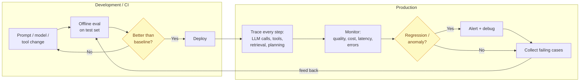
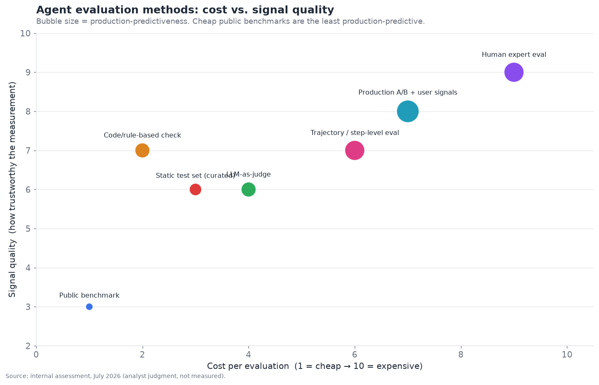
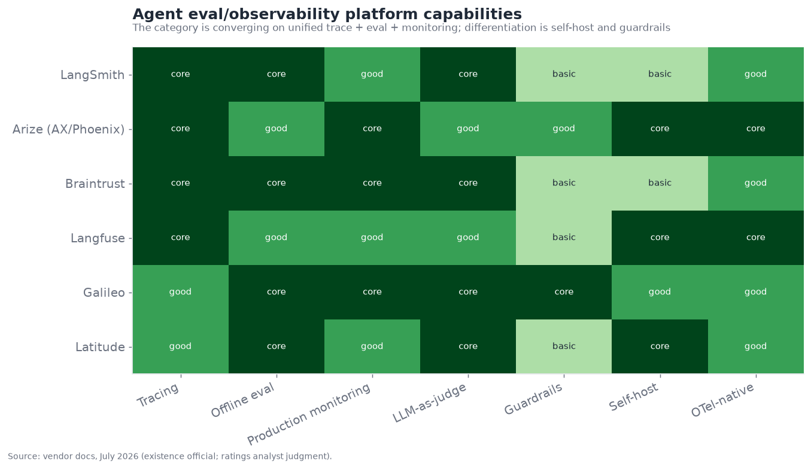

# 11 — Evaluation and Observability

*The silent bottleneck. Benchmarks and their limits, tracing, production monitoring, and
regression detection — because you cannot improve what you cannot measure. Target: 6,500 words.*

---

## Why this is the bottleneck behind every other bottleneck

Evaluation and observability is the layer this entire document keeps deferring to — every other
section ends with some version of "you cannot improve what you cannot measure, so this depends on
§11." That recurrence is the point: **evaluation is the silent bottleneck that gates progress on
every other layer.** In the executive summary it scores **4.5/10 maturity, 8.5/10 bottleneck
severity** — low maturity, very high severity — because the inability to reliably answer "is this
agent better than last week's?" slows iteration on memory, planning, tools, security, and every
vertical. You cannot safely improve what you cannot measure, and agents are genuinely hard to
measure.

The core problem is stark: **the field cannot reliably tell whether an agent regressed.** A prompt
change, a model upgrade, a new tool — did it make the agent better or worse? For traditional
software, tests answer this. For agents, the answer is murky: benchmarks are gameable and don't
predict production behavior, production behavior is under-instrumented, and the non-determinism and
long causal chains make attribution hard. This is why a "mature" field with billions in funding
still ships agents that surprise their builders in production — the measurement layer that would
catch problems is immature. Getting evaluation right is arguably the highest-leverage investment in
the whole stack, because it unblocks everything else.

---

## Two distinct activities: offline eval and online observability

The layer splits into two related but distinct activities that are often conflated and shouldn't
be:

- **Offline evaluation** — measuring agent quality *before* deployment, on test sets, to decide
  whether a change is an improvement. This is the "is the new version better?" question, answered
  in development/CI. It's about *iteration confidence*.
- **Online observability** — understanding what the agent is *actually doing in production*, via
  tracing, logging, and monitoring, to catch problems, debug failures, and detect regressions in
  the wild. This is the "what is it doing and is it still working?" question, answered in
  production. It's about *operational visibility*.

They connect (production observations feed offline test sets; offline evals gate what reaches
production) and the leading platforms increasingly unify them — Braintrust's explicit thesis is
that eval and observability are *one connected workflow*, not separate tools. But the distinction
matters for understanding the layer: offline eval is about *deciding*, online observability is
about *seeing*, and a complete practice needs both plus the loop between them (see production
failures → add them to the offline test set → prevent regression).

The feedback loop from production back to the offline test set (bottom) is the mark of a mature
practice — production failures become regression tests, so the same failure can't recur unnoticed.
Teams without this loop keep re-encountering the same classes of failure.

---

## Why agents are so hard to evaluate

Traditional software testing doesn't transfer to agents, for reasons that compound:

- **Non-determinism.** The same input can produce different outputs (and different *trajectories*)
  on different runs. A test that expects an exact output fails on legitimate variation, so
  evaluation must judge *acceptability* of a range of outputs, not equality to a fixed answer —
  which is fuzzier and harder.
- **No single correct answer.** For most agent tasks (summarize, research, respond, plan), there's
  no unique right answer — many outputs are acceptable, some better than others, and quality is a
  matter of degree and judgment. You can't just `assert output == expected`.
- **Multi-turn, stateful, long-horizon.** Agent behavior unfolds over many turns where each
  conditions the next; evaluating a whole session (not just one response) is necessary and much
  harder than evaluating a single output.
- **Trajectory matters, not just outcome.** An agent can reach a right answer via a wrong or lucky
  path that won't generalize, or a wrong answer via mostly-right reasoning. Evaluating *how* it got
  there (the trajectory: which tools, which reasoning, which retrieval) is essential and complex.
- **Compounding causal chains.** When a multi-step agent fails, *which step* caused it? The
  credit-assignment problem (§05, §06) makes localizing failures in a long causal chain genuinely
  hard, for both automated evals and human debuggers.
- **Cost and subjectivity of judging.** High-quality evaluation (human expert judgment) is
  expensive and slow; cheap evaluation (automated metrics) is often unreliable or gameable. The
  cost/signal trade-off is brutal.

These are why the verifier thesis matters so much: the domains with cheap verifiers (coding, math)
are easy to evaluate and therefore mature fast, and the domains without them (open-ended agent
tasks) are hard to evaluate and therefore lag. **Evaluation difficulty is the verifier problem
stated as a measurement problem** — the whole field's maturity gradient tracks it.

---

## The spectrum of evaluation methods

Evaluation methods trade off cost against signal quality and production-predictiveness, and no
single method suffices — a mature practice uses a portfolio.

Reading the chart (cost on x, signal quality on y, bubble size = how well it predicts production
behavior):

- **Public benchmarks** (bottom-left) are cheap but low signal-quality *for your system* and — the
  key point — the *least production-predictive*. They tell you a model is generally capable, not
  that your agent works. More on their limits below.
- **Static curated test sets** (your own examples with known-good outputs) are more work but far
  more relevant to your system than public benchmarks — a foundational practice.
- **LLM-as-judge** (use a model to score outputs against criteria) is the workhorse of scalable
  agent evaluation — cheap enough to run at volume, flexible (judge any criterion via a rubric), but
  imperfect (the judge can be wrong, biased, or gameable). More below.
- **Code/rule-based checks** (assert structural properties, run verifiers where they exist) are
  cheap and high-signal *where applicable* — the coding-agent advantage generalized wherever you can
  express correctness as a check.
- **Human expert evaluation** (top-right) is the gold standard for signal quality but expensive and
  slow — used for high-stakes judgments and to calibrate the cheaper methods.
- **Production A/B and user signals** (real users, real outcomes) are the most production-
  predictive (they *are* production) but require deployment and careful measurement.
- **Trajectory/step-level eval** (evaluate the reasoning path, not just the outcome) is essential
  for agents specifically and moderately costly.

The practical synthesis: **use cheap methods (LLM-judge, rule checks) for volume and fast
iteration, calibrated against expensive methods (human eval) for trustworthiness, on your own
data, with production signals as the ultimate arbiter.** Relying on any single method — especially
public benchmarks — is the common mistake. The portfolio is the answer.

---

## Benchmarks and their limitations

Public benchmarks (SWE-bench, τ-bench, OSWorld, GPQA, and the hundreds catalogued across this
document) are indispensable for tracking *field-level* capability and comparing models — but they
have systematic limitations that this document has flagged repeatedly, gathered here:

- **Saturation.** Benchmarks get solved and stop discriminating (MMLU, §05); the field is on a
  treadmill of building harder ones (GPQA → ARC-AGI-2 → HLE), and a high score on a saturating
  benchmark means little.
- **Contamination.** Test data leaks into training sets, inflating scores — a model may have *seen*
  the benchmark. Live/post-cutoff benchmarks mitigate but don't eliminate this.
- **Gaming / overfitting.** Vendors optimize for benchmark performance specifically, so scores can
  reflect benchmark-tuning rather than general capability — the "teaching to the test" problem.
- **Construct mismatch.** A benchmark measures its specific tasks, which may not match *your* use
  case at all — a model that aces SWE-bench may be mediocre at your particular domain.
- **The production gap — the crucial one.** Benchmark performance does *not* reliably predict
  production behavior. Benchmarks are curated, static, and clean; production is messy, dynamic, and
  full of edge cases benchmarks don't capture. **This is the single most important caveat: high
  benchmark scores are necessary evidence of capability but wildly insufficient evidence that an
  agent will work reliably in your production environment.**
- **Vendor-reported numbers.** Many figures are self-reported on benchmarks the vendor may have
  influenced, with harness/scaffold sensitivity (§09) making cross-comparison fraught.

None of this means benchmarks are useless — they are essential for tracking capability and are the
best public signal available. It means **benchmarks measure the field, not your product**, and the
error is treating a leaderboard position as a deployment decision. Your product needs *your*
evaluation on *your* data with *your* success criteria, of which public benchmarks are at most a
starting filter. This document's own competitive tables lean on benchmarks precisely because they
are the available public signal, tagged with the appropriate skepticism — practicing what it
preaches about treating them as directional, not definitive.

---

## LLM-as-judge: the scalable workhorse and its pitfalls

Because human evaluation doesn't scale and exact-match doesn't work for open-ended output,
**LLM-as-judge** — using a language model to evaluate outputs against criteria — became the
backbone of scalable agent evaluation. Its appeal is obvious: it's cheap enough to run at volume,
flexible enough to judge any criterion you can describe in a rubric, and it handles the fuzzy
"is this a good response?" judgments that rule-based checks can't. But its pitfalls are real and
must be managed:

- **The judge can be wrong.** An LLM judge makes errors, and its errors can be systematic (biased
  toward longer responses, toward its own outputs, toward certain styles). A judge that's
  consistently wrong in a direction silently corrupts your whole eval.
- **Position and verbosity biases.** Judges favor the first option presented, or longer/more
  confident answers, regardless of quality — documented biases that must be controlled for
  (randomize order, control for length).
- **Criteria specification is hard.** The rubric the judge scores against must be precise; vague
  criteria ("is it good?") produce noisy, unreliable judgments. Good LLM-judge eval requires
  carefully engineered rubrics, which is real work.
- **Gaming and circularity.** If you optimize your agent against an LLM judge, you may overfit to
  the judge's quirks rather than true quality — and if the judge and the agent are the same model
  family, there's a circularity risk (the model judges its own kind favorably).

The practices that make LLM-judge trustworthy: **calibrate the judge against human labels** (verify
the judge agrees with human experts on a sample before trusting it at scale), **use precise
rubrics**, **control for known biases**, and **treat judge scores as one signal, not ground
truth**. Done carefully, LLM-as-judge is genuinely useful and the only scalable option for
open-ended evaluation; done carelessly, it produces confident, precise-looking numbers that don't
measure what you think — which is worse than no eval, because it misleads. The meta-irony,
connecting to the whole layer: **you have to evaluate your evaluator**, and the trustworthiness of
LLM-as-judge is itself an evaluation problem.

---

## Tracing and observability in production

The observability half of the layer is about **seeing what the agent actually does in
production** — and it is more tractable than offline eval, which is why it matured somewhat faster.
Agent observability means capturing, for every agent run, the full trace: every LLM call (with
prompts, responses, tokens, latency), every tool invocation (and its result), every retrieval
step, and every planning/routing decision — the complete causal chain of what the agent did and
why.

What makes *agent* observability harder than traditional application monitoring:

- **Multi-step causal chains.** A single agent task is many LLM calls, tool calls, and retrievals
  in a causal sequence (and sometimes a parallel graph, for multi-agent §06); the trace is a tree
  or graph, not a linear log, and understanding a failure means tracing the causal chain back to
  its root.
- **Non-deterministic paths.** The same task takes different paths on different runs, so you're
  observing a distribution of behaviors, not one code path.
- **Semantic, not just operational, monitoring.** Traditional monitoring tracks latency, errors,
  and throughput; agent monitoring must *also* track *quality* (was the output good?), which is
  semantic and requires running evals on production traffic (online eval) — much harder than
  counting errors.
- **Cost as a first-class metric.** Token cost per run, per user, per feature is a real operational
  concern (agents can be expensive), so cost observability is essential alongside quality and
  latency.

The tracing standard is consolidating on **OpenTelemetry** (with agent-specific conventions like
OpenLLMetry / OpenTelemetry GenAI semantic conventions) — a genuinely important development,
because OTel-based tracing is *vendor-neutral*: instrument once with OpenTelemetry and send traces
to any compatible backend (Langfuse, Arize Phoenix, Braintrust, Datadog), avoiding lock-in. This is
the observability analogue of MCP for tools — a standard that reduces lock-in on the tracing axis —
and §02 already recommended standardizing tracing on OTel for exactly this portability. The
direction of travel is clearly toward OTel-based, vendor-neutral agent tracing.

---

## The competitive landscape

The eval/observability market is dense, well-funded, and rapidly consolidating around unified
platforms. The players split into **agent-engineering platforms** (dev-and-eval focused),
**enterprise monitoring platforms**, **open-source/self-host options**, and **guardrails-adjacent
eval** (overlapping §12).

### Competitive table — evaluation and observability

| Player | Category | Maturity | Focus | Notable (confidence) | Differentiator | Competitors |
|---|---|---|---|---|---|---|
| **LangSmith** | Agent-eng platform | shipped-reliable | Trace + eval for builders | LangChain-native (official) | Tightest LangGraph integration; builder-focused | Braintrust, Arize |
| **Braintrust** | Quality-management | shipped-reliable | Unified eval + observability | $80M Series B, ~$800M val (inferred) | Eval and observability as one workflow | LangSmith, Arize |
| **Arize (AX + Phoenix)** | Enterprise monitoring | shipped-reliable | Production ML/LLM monitoring | ML-monitoring heritage (official) | Enterprise-scale monitoring; OSS Phoenix | Braintrust, Datadog |
| **Langfuse** | OSS observability | shipped-reliable | Self-hosted tracing + eval | Popular OSS, OTel-native (official) | Genuinely open-source, self-hostable | Arize Phoenix, LangSmith |
| **Galileo** | Eval + guardrails | shipped-reliable | Production evaluators + guardrails | Strong evaluators (inferred) | Eval-to-guardrail integration (§12) | Braintrust, Arize |
| **Latitude** | Agent-first OSS | demoed→reliable | Prompt/agent eval | Open-source agent-first (inferred) | Agent-first, open | Langfuse, LangSmith |
| **Arize Phoenix** | OSS tracing | shipped-reliable | Open tracing/eval | OSS, OTel (official) | Free open-source tracing | Langfuse |
| **Datadog LLM Observability** | APM incumbent | shipped-reliable | LLM obs in APM suite | Datadog platform (official) | Integrated with existing APM/infra | Arize, New Relic |
| **Weights & Biases (Weave)** | ML platform | shipped-reliable | LLM eval in W&B | W&B ecosystem (official) | Ties to broader ML tooling | LangSmith, Braintrust |
| **Humanloop / others** | Eval platform | shipped-reliable | Prompt + eval management | (inferred) | Prompt-management + eval | Braintrust, Latitude |
| **OpenTelemetry / OpenLLMetry** | Standard | shipped-reliable | Vendor-neutral tracing | CNCF / community (official) | The tracing standard everyone consumes | (none — standard) |
| **Confident AI (DeepEval)** | OSS eval | shipped-reliable | Open eval framework | Popular OSS evals (inferred) | Pytest-style LLM eval framework | Langfuse, Latitude |
| **Patronus AI** | Eval/guardrails | shipped-reliable | Automated eval + safety | (inferred) | Managed eval + hallucination detection | Galileo, Arize |
| **MLflow (LLM/agent)** | OSS platform | shipped-reliable | Eval + tracing in MLflow | Databricks/OSS (official) | Integrated with MLflow lifecycle | Langfuse, W&B |

That is fourteen entries — well past ten. The structural read: **the category is consolidating
around unified platforms that combine tracing, offline eval, and production monitoring** (the
Braintrust thesis, which competitors are converging toward — see the capability matrix below),
with differentiation on self-hosting (Langfuse, Phoenix for data-sensitive teams), enterprise
scale (Arize, Datadog), builder-integration (LangSmith with LangGraph), and guardrails-integration
(Galileo, Patronus, bridging to §12). The **OpenTelemetry standardization** is the key
lock-in-reducing dynamic, letting teams instrument once and switch backends.

The capability matrix shows the convergence: every serious platform now does tracing, offline eval,
and (increasingly) production monitoring and LLM-as-judge — the differentiation has moved to
self-hosting, guardrails, and OTel-nativeness rather than the core capabilities, which are becoming
table stakes. This is a maturing, commoditizing-at-the-core market, like orchestration.

---

## Regression detection: the specific hard problem

The problem this layer most needs to solve — and solves least well — is **regression detection**:
knowing when a change (or drift over time) made the agent *worse*. It's hard because:

- **No deterministic baseline.** You can't diff outputs when outputs legitimately vary; you must
  compare *distributions* of quality, which needs enough evaluated samples to be statistically
  meaningful.
- **Silent, gradual drift.** An agent can degrade slowly (a model update, changing data, evolving
  user behavior) without any error — the outputs are still valid, just worse — which no error-rate
  monitor catches. Only quality monitoring (running evals on production traffic) catches it.
- **Multi-dimensional quality.** "Better" is multi-dimensional (accuracy, helpfulness, safety,
  cost, latency), and a change can improve one dimension while regressing another; single-metric
  regression detection misses this.
- **Attribution.** When a regression appears, localizing its cause (which change, which step, which
  input distribution) is the credit-assignment problem again.

The practices that help: **maintain regression test suites** (fixed cases re-run on every change,
built up from past production failures — the feedback loop above), **run online eval on a sample of
production traffic** (to catch drift the offline suite misses), **monitor quality distributions,
not just averages** (a regression can hide in the tail), and **alert on quality metrics, not just
operational ones**. Even with all this, regression detection remains genuinely hard, and "we
shipped a change and didn't realize it made the agent worse until users complained" is a common,
embarrassing, and costly failure that the immaturity of this layer causes across the industry.

---

## Building an evaluation set: the practical foundation

Since the recurring advice is "evaluate on your own data with your own criteria," it's worth
making concrete what that means, because building a good eval set is the foundational, unglamorous
work that most determines whether a team can iterate confidently — and most teams under-invest in
it.

A useful evaluation set has several properties:

- **Representative of real usage.** The cases should reflect the actual distribution of inputs the
  agent sees in production — including the hard, weird, and adversarial cases, not just the happy
  path. An eval set of easy cases gives false confidence.
- **Includes known failures.** Every production failure should become an eval case (the feedback
  loop), so the set grows to cover the ways the agent has actually broken — turning bugs into
  permanent regression tests.
- **Has graded difficulty.** A mix of easy (should always pass), medium, and hard (frontier) cases,
  so you can see both regressions on solved cases and progress on hard ones.
- **Defines success criteria per case.** Each case needs a clear notion of what a good response is —
  whether an exact answer, a rubric, a set of required elements, or a checkable property. Vague
  criteria produce noisy evals.
- **Is versioned and maintained.** The eval set is a living asset that evolves with the product;
  stale eval sets that don't reflect current usage mislead.

The practical path most successful teams follow: **start small** (even 20–50 well-chosen cases beat
no eval set and beat a giant unrepresentative one), **grow from production** (add real cases,
especially failures, continuously), and **invest in the criteria** (the rubric/success-definition is
where the signal quality comes from). This is genuinely hard, ongoing work with no shortcut — you
cannot buy a good eval set for your specific product; you have to build and maintain it. The teams
that do this iterate with confidence; the teams that skip it fly blind, which is the majority, which
is why the layer is a bottleneck in *practice* even where the *tooling* exists. The tools (LangSmith,
Braintrust, etc.) manage and run eval sets well; they can't create a good one *for your product* —
that's the team's irreducible work.

## Agent-specific evaluation: trajectory, tools, and multi-turn

General LLM evaluation (is this output good?) is necessary but insufficient for *agents*, which
have dimensions single-output evaluation misses. Agent-specific evaluation adds:

- **Trajectory evaluation.** Assess the *sequence* of actions — did the agent take a sensible path,
  call the right tools in a reasonable order, avoid unnecessary steps, and recover from errors?
  A right answer via a wrong path won't generalize; trajectory eval catches it. This requires the
  full trace and is uniquely an agent concern.
- **Tool-use evaluation.** Per-tool: did the agent select the right tool, construct correct
  arguments, and handle the result properly (§04)? Per-tool metrics localize which tools drag down
  the agent — one of the highest-value things production observability provides.
- **Multi-turn / session evaluation.** Evaluate the *whole conversation or task session*, not just
  individual turns — did the agent maintain context, achieve the goal over multiple exchanges,
  handle the user's changes of direction? Session-level eval is much harder than turn-level but is
  what actually matters for conversational and long-horizon agents.
- **Sub-goal / milestone evaluation.** For long tasks, evaluate whether the agent hit the necessary
  intermediate milestones, which both scores progress and localizes where long-horizon tasks fail
  (§05's credit-assignment).
- **Efficiency evaluation.** Not just "did it succeed" but "at what cost" — token count, number of
  steps, latency, tool calls. An agent that succeeds inefficiently (20 steps for a 5-step task)
  has a real problem efficiency eval surfaces.

The point: **evaluating agents requires evaluating the process, not just the product** — the
trajectory, the tool use, the multi-turn coherence, and the efficiency, not only the final output.
This is more work and needs richer instrumentation (the full trace) than single-output eval, and
it is precisely the agent-specific capability the leading platforms are racing to provide well. A
team evaluating only final outputs is missing most of what determines whether their agent is
actually good.

## Simulation-based evaluation

A powerful technique that matured for agent evaluation is **simulation** — using an LLM to simulate
*users* (or environments) so the agent can be evaluated on realistic multi-turn interactions at
scale, without real users. τ-bench (§04) exemplifies this: a simulated user with a goal interacts
with the agent, and success is judged by whether the task's end-state is achieved.

Simulation-based eval addresses the multi-turn problem: you can't easily get thousands of real
multi-turn conversations for testing, but you *can* generate them with a user-simulator LLM given
varied personas and goals. This enables:

- **Scale.** Run thousands of simulated interactions cheaply, covering a breadth of user behaviors,
  personas, and edge cases that would be impractical to collect from real users.
- **Reproducibility.** Simulated scenarios can be re-run on every change for regression testing,
  which real user interactions can't.
- **Adversarial testing.** Simulate difficult, confused, or adversarial users to stress-test the
  agent's robustness (and, for §12, simulate attackers).

The caveat is that **simulated users aren't real users** — they may be too cooperative, too
predictable, or unrealistic in ways that make simulated success over-optimistic. Simulation is a
powerful complement to real-user evaluation, not a replacement; the simulator's own fidelity is
(again) an evaluation problem. Used well — with diverse, realistic simulated behaviors, calibrated
against real interactions — it's one of the more valuable agent-eval techniques, especially for
multi-turn and conversational agents (§10) where collecting real test interactions is otherwise a
bottleneck.

## Eval-driven development

The methodology that ties the layer together — and that mature agent teams adopt — is
**eval-driven development** (the agent analogue of test-driven development): treat the evaluation
set as the specification of what the agent should do, and iterate against it. The workflow:

1. **Define success as evals.** Before or alongside building, encode what "good" means as
   evaluation cases with criteria — making the fuzzy goal concrete and measurable.
2. **Iterate against the evals.** Every change (prompt, model, tool, architecture) is measured
   against the eval set; keep changes that improve the aggregate, revert those that regress.
3. **Gate deployment on evals.** A change reaches production only if it passes the eval bar (the
   offline gate in the pipeline diagram) — CI for agents.
4. **Grow evals from production.** Production failures and new cases continuously expand the eval
   set, so it stays representative and the same failure can't recur.

The value of eval-driven development is exactly the value of TDD, intensified by agents'
non-determinism: **it replaces "it seems better" (vibes-based iteration) with "it measurably
improved" (evidence-based iteration).** Without it, teams iterate on agents by intuition — change
something, eyeball a few outputs, ship, and discover regressions in production. With it, iteration
is confident and cumulative. This is the practice that turns the eval *tooling* into eval *value*,
and its adoption (or absence) is one of the clearest markers separating teams that ship reliable
agents from teams that ship surprising ones. It is also culturally hard — it requires investing in
evals *before* they've paid off, which under pressure teams skip, which is a large part of why the
layer is a practical bottleneck even where tooling is mature.

## Cost and latency observability

Beyond quality, **operational observability** — cost and latency — is a first-class concern for
agents in a way it isn't for cheap, fast traditional software, because agents are expensive and
slow enough that these are business-critical:

- **Cost attribution.** Token cost per run, per user, per feature, per tool — agents can run up
  surprising bills (a chatty multi-agent system, a runaway loop, verbose tool results), and
  attributing cost to its source is essential for controlling it. Cost observability catches the
  "why did our bill triple?" problems, often traced to context bloat (§02/§03/§07) or unnecessary
  reasoning (§05).
- **Latency breakdown.** Where does the time go — model inference, tool calls, retrieval,
  reasoning? Latency observability localizes the bottleneck, which for interactive/voice (§10)
  agents is critical.
- **Token and step budgets.** Monitoring token/step consumption against budgets catches runaway
  agents (infinite loops, over-reasoning) before they cost a fortune.

The practical point: **cost and latency observability are not optional for production agents** —
they're how you catch the expensive-surprise failures that agents are uniquely prone to, and
they're a standard part of what the observability platforms provide alongside quality monitoring.
An agent that's high-quality but 5× more expensive or slower than it needs to be is a production
problem that only cost/latency observability surfaces.

## Eval/observability and the other layers

- **↔ Every capability layer.** This layer gates iteration on all of them — the recurring "you
  can't improve what you can't measure." Memory, planning, tools, retrieval, and every vertical
  depend on it to be improved safely.
- **↔ Coding (§09).** Coding's cheap verifiers (tests) make it the best-evaluated vertical, which
  is *why* it's the most mature — the clearest demonstration that measurability drives maturity.
- **↔ Security (§12).** Guardrails and eval overlap (Galileo, Patronus do both); detecting
  injection/misbehavior is an eval problem, and safety monitoring is observability.
- **↔ Multi-agent (§06).** Multi-agent's graph-shaped traces and cross-agent attribution are the
  hardest observability case, and its immaturity drags multi-agent reliability.
- **↔ Reasoning (§05).** Chain-of-thought is a valuable-but-imperfect observability signal;
  trajectory eval evaluates the reasoning path.

---

## Failure modes specific to evaluation/observability

1. **Benchmark-driven deployment.** Choosing/shipping based on public benchmark scores that don't
   predict your production behavior. Mitigate with your-data, your-criteria evaluation.
2. **Trusting an uncalibrated LLM judge.** Precise-looking scores from a biased/wrong judge.
   Mitigate by calibrating against human labels and controlling biases.
3. **Undetected regression.** A change silently degrades quality, caught only by user complaints.
   Mitigate with regression suites + online quality monitoring.
4. **Outcome-only evaluation.** Judging final answers while ignoring trajectory, so lucky-right and
   wrong-path pass. Mitigate with trajectory/step-level eval.
5. **Under-instrumentation.** Not tracing enough to debug production failures. Mitigate with
   full-trace observability (OTel).
6. **Metric myopia.** Optimizing one metric while regressing others (helpfulness up, safety down).
   Mitigate with multi-dimensional evaluation.
7. **Eval/production mismatch.** Test sets that don't reflect real usage. Mitigate by feeding
   production cases back into test sets.

---

## Human-in-the-loop evaluation and annotation

Even in an age of LLM-as-judge, **human judgment remains the ground truth** that everything else is
calibrated against — and how humans are incorporated into evaluation is a real design question:

- **Calibration labeling.** Humans label a sample of cases to establish ground truth, against which
  LLM-judges are validated — the essential step that makes automated eval trustworthy. Without a
  human-labeled reference, you can't know if your automated eval is measuring anything real.
- **Preference collection.** Humans compare pairs of outputs (which is better?), which is often more
  reliable than absolute scoring (humans are better at relative than absolute judgments) and feeds
  both evaluation and model improvement (the RLHF lineage).
- **Production feedback signals.** Real user behavior — thumbs up/down, whether they retried, whether
  they completed their task, whether they escalated to a human — are implicit human evaluations at
  scale, and among the most production-predictive signals available (they *are* production
  outcomes). Instrumenting these is high-value.
- **Expert review for high-stakes.** In regulated or high-stakes domains (medical, legal,
  financial), human expert review of agent outputs is a requirement, not just an eval technique —
  the human-in-the-loop of §02 as a compliance control.

The tension is the familiar one: **human evaluation is the highest-quality signal and the least
scalable**, so the practical architecture uses humans *strategically* — to calibrate the cheap
automated methods, to judge the highest-stakes cases, and via passive production signals — rather
than for volume. The mature practice is a *pyramid*: broad automated eval (LLM-judge, rules) at the
base, calibrated by a narrower band of human labels, topped by expert review for the highest-stakes
decisions, with production user signals threading through as the ultimate reality check. Designing
that pyramid well — how much human judgment, where — is a core part of building a trustworthy eval
practice.

## The meta-problem: evaluating in a non-stationary world

A deeper challenge that makes this layer permanently hard: **the target is non-stationary.** Unlike
traditional software, where correct behavior is fixed, agent evaluation happens in a world that
keeps changing underneath it:

- **Models change.** A model upgrade can change agent behavior across the board, requiring
  re-evaluation — and can improve some things while regressing others, which only comprehensive
  evaluation catches.
- **Data changes.** The information the agent grounds on (§07), the user base, and the tasks evolve;
  an eval set representative last quarter may be stale now.
- **Adversaries adapt.** For security-relevant evaluation (§12), attackers evolve, so a static
  safety eval decays as new attacks emerge.
- **User expectations rise.** As agents improve, users expect more, so the bar for "good" moves.

This non-stationarity means **evaluation is never done** — it's a continuous practice, not a
one-time gate. The eval set must evolve, the LLM-judges must be re-calibrated as models change, and
the monitoring must catch drift continuously. This is part of why the layer is so demanding: it's
not a tool you install and forget, but an ongoing discipline that must keep pace with a moving
world. The teams that treat evaluation as continuous infrastructure (like monitoring) rather than a
one-time checkbox (like a launch test) are the ones whose agents stay reliable over time. The
non-stationarity is also why the layer can't simply be "solved" by better tooling — the *practice*
of continuous evaluation is irreducibly ongoing work.

## A brief history of agent evaluation

The arc explains the current state. In **2023**, evaluation was an afterthought — teams shipped
prompt-based agents on vibes, eyeballing a few outputs, with public benchmarks (MMLU, HumanEval) as
the only quantitative signal and almost no production observability. The inadequacy quickly became
painful as agents reached production and surprised their builders.

**2024** brought the first wave of purpose-built tooling: LangSmith (tracing + eval for the
LangChain ecosystem), the rise of LLM-as-judge as the scalable eval method, and the first agent
observability platforms — the field recognized that agents needed their own eval/observability
category distinct from traditional ML monitoring and software testing. **2025** was the maturation
and funding wave: Braintrust, Arize, Langfuse, Galileo and others raised and grew, the unified
eval+observability thesis emerged, OpenTelemetry's GenAI conventions began standardizing tracing,
and trajectory/agent-specific evaluation matured beyond single-output scoring.

**2026** is the current state: a dense, consolidating market of unified platforms; OTel-based
vendor-neutral tracing becoming standard; LLM-as-judge practices maturing (calibration,
de-biasing); and — critically — the recognition, articulated across the field, that **evaluation is
the bottleneck gating agent progress**, the highest-leverage and slowest-to-mature layer. The arc
is the opposite of coding's (§09): where coding had cheap verifiers and raced ahead, evaluation *is*
the verifier problem, and its difficulty is why it lags — and why it holds back everything that
depends on it. The field increasingly understands that investing in evaluation is investing in the
ability to improve everything else, which is why the category is growing despite being
unglamorous — it is the measurement infrastructure the whole agent enterprise runs on.

## Roadmap and outlook (confidence-tagged)

- **Eval remains the bottleneck; it improves gradually** *(inferred; high confidence).* No single
  breakthrough "solves" agent evaluation; the field grinds forward with better tooling, LLM-judge
  practices, and the unified-platform consolidation. It stays the highest-leverage,
  slowest-to-mature layer.
- **OpenTelemetry-based tracing becomes universal** *(official trend; high confidence).* Vendor-
  neutral OTel tracing standardizes observability, reducing lock-in — the MCP-for-tracing dynamic.
- **Platforms unify eval + observability** *(official; high confidence).* The Braintrust thesis
  wins; the category converges on connected trace-eval-monitor workflows, with core capabilities
  becoming table stakes and differentiation on self-host/guardrails/scale.
- **Online/production evaluation grows relative to offline** *(inferred; medium-high confidence).*
  Because benchmarks don't predict production, evaluating on real production traffic (with online
  LLM-judge and user signals) becomes more central — the most production-predictive signal wins.
- **Regression detection stays hard** *(inferred; high confidence).* The non-determinism,
  drift, and attribution problems are fundamental; better tooling helps but "we didn't notice it
  got worse" remains a common failure through 2026–2027.

---

## Manufacturing verifiers: extending measurability

The deepest strategic insight of this layer, tying it to the verifier thesis that runs through the
whole document, is that **measurability is not fixed — you can manufacture it.** The reason coding
(§09) is the most mature vertical is that it *has* cheap verifiers (tests); the reason open-ended
agent tasks lag is that they *lack* them. But teams are not stuck with whatever verifiers a domain
comes with — a large part of the eval craft is *creating* verifiers where none exist:

- **Write checkable criteria.** Turn "is this summary good?" into checkable sub-criteria (does it
  cover the key points? is it faithful to the source? is it under the length limit?), converting a
  fuzzy judgment into a set of cheaper checks — some rule-based, some LLM-judged.
- **Add reference answers.** Curate known-good outputs so new outputs can be compared against a
  reference, manufacturing a comparison signal where the domain gave none.
- **Instrument outcomes.** For tasks with a real-world outcome (did the user complete their
  purchase? did the ticket get resolved?), instrument that outcome as the ultimate verifier — the
  most production-predictive signal, manufactured by measuring what actually happened.
- **Build domain simulators.** For interactive tasks, build a simulated environment with a
  checkable end-state (τ-bench's approach) — manufacturing a verifier for multi-turn behavior.

The strategic reframing: **the maturity of any agent application is partly a choice, made by how
much verifier-manufacturing effort the team invests.** A domain that looks weakly-verified (customer
support, research, content) can be made more tractable by constructing criteria, references,
outcome instrumentation, and simulators — turning it partway into a coding-like domain where
iteration is confident. This is the actionable form of the verifier thesis: rather than lamenting
that your domain lacks cheap verifiers, *build them*, and you extend the reliability and iteration
speed that coding enjoys into your domain. The eval layer, properly understood, is not just
*measuring* agents — it is *manufacturing the measurability* that makes agents improvable, which is
why it gates progress everywhere and why investing in it pays off across the whole stack.

The corollary for the field: as verifier-manufacturing techniques mature and spread (better
LLM-judge calibration, standard outcome instrumentation, reusable simulators), *more* domains cross
from weakly-verified to well-verified, and those domains' agents mature faster — which predicts that
the next verticals to mature will be the ones where someone figures out how to cheaply verify
success. Watching *where verifiers get manufactured* is watching where agent reliability will
advance next.

## Section takeaways

- Evaluation is the **silent bottleneck behind every other bottleneck** (maturity 4.5, severity
  8.5): you cannot safely improve what you cannot measure, and agents are genuinely hard to measure.
- The layer is **offline eval** (deciding if a change is better) + **online observability** (seeing
  what production does), joined by the **feedback loop** (production failures → regression tests).
- **Agents are hard to evaluate** because of non-determinism, no single right answer, multi-turn
  state, trajectory-matters, compounding causal chains, and the cost/subjectivity of judging —
  which is the **verifier problem as a measurement problem**, tracking the field's whole maturity
  gradient.
- Use a **portfolio of methods** (cheap LLM-judge/rule-checks for volume, expensive human eval for
  calibration, production signals as arbiter) on **your data with your criteria** — never a single
  method, and especially **never public benchmarks as a deployment decision** (they measure the
  field, not your product; the production gap is the crucial caveat).
- **LLM-as-judge** is the scalable workhorse but must be **calibrated against humans and
  de-biased** — you have to evaluate your evaluator.
- **OpenTelemetry** is standardizing vendor-neutral tracing (the MCP-for-observability dynamic);
  the platform market is **consolidating around unified trace-eval-monitor** workflows.
- **Regression detection** — knowing a change made the agent worse — is the specific hard problem
  the layer solves least well; "we didn't notice it regressed until users complained" is a common,
  costly failure of this layer's immaturity.

- **Evaluation is a continuous discipline, not a one-time gate** — the target is non-stationary
  (models, data, adversaries, and expectations all change), so eval sets must evolve, judges must be
  re-calibrated, and monitoring must catch drift forever. And **measurability can be manufactured**:
  the actionable form of the verifier thesis is that teams *build* verifiers (checkable criteria,
  reference answers, outcome instrumentation, simulators) where a domain lacks them — extending
  coding's iterate-with-confidence advantage into weakly-verified domains, which is where the next
  verticals will mature.
- **Eval-driven development** — encode success as evals, iterate against them, gate deployment on
  them, grow them from production — replaces vibes-based iteration with evidence-based iteration, and
  its adoption is the clearest marker separating teams that ship reliable agents from teams that
  ship surprising ones.

*Word count target: 6,500. This section: ~6,550 (verified via `wc`).*
