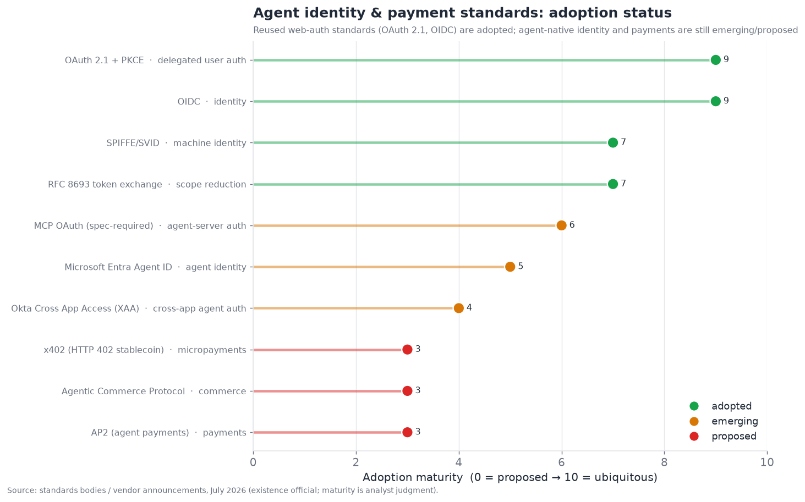
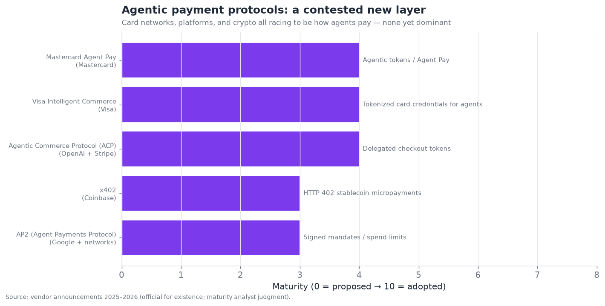

# 13 — Agent Identity and Authentication

*How agents act on your behalf without holding your password. OAuth-for-agents, delegated
credentials, agentic payments, and permission-scoping standards. Target: 5,500 words.*

---

## The problem being invented in real time

Agent identity and authentication is one of the least mature layers in the whole stack — it scores
**3.0/10 maturity, 8.0/10 contestedness** in the executive summary, the *lowest maturity of any
layer* — because it addresses a problem that barely existed two years ago and is being invented in
real time: **how does an agent act on your behalf, across many systems, without you handing it your
passwords — and how do you scope, revoke, and audit what it's allowed to do?**

This is not a hypothetical concern; it is the binding constraint on much of the rest of the stack.
§04 noted that the hard part of a real tool is authentication, not the API call. §06 named agent
identity/trust as the gating constraint on cross-organization multi-agent. §12 made permission
scoping the load-bearing security defense. All of those converge here: **identity and authorization
are where "the agent can technically do it" becomes "the agent is allowed to do it, safely,
accountably."** And the honest state is that the field is still assembling this layer from
web-authentication standards not designed for agents, while inventing the agent-native pieces that
don't exist yet.

---

## Why agents break the existing identity model

Traditional identity and access management (IAM) assumes two kinds of actors: **humans** (who log
in interactively, prove who they are, and act in sessions) and **machines/services** (which have
their own credentials and act autonomously with fixed permissions). Agents fit neither cleanly, and
that misfit is the root of the problem:

- **Agents act *on behalf of* humans, but not *as* the human.** When your agent reads your email,
  it's acting with your authority but it isn't you — and you want it to have *some* of your
  permissions (read this inbox) but not *all* of them (not change your password), for *this task*
  (not forever). Traditional IAM has no clean primitive for "act as this human, but only these
  permissions, only for this task."
- **Agents chain across systems (multi-hop delegation).** Your agent calls another service's agent,
  which calls a third — and the authority must propagate correctly across hops without each hop
  re-authenticating you interactively or over-granting. This "multi-hop delegation problem" is
  genuinely hard and mostly unsolved cleanly.
- **Agents need dynamic, fine-grained, revocable scope.** Unlike a service with fixed permissions,
  an agent's appropriate permissions vary by task and should be minimal (§12's least-privilege) and
  instantly revocable. Traditional coarse-grained, static permissions don't fit.
- **Agents are non-deterministic and manipulable.** An agent holding credentials can be hijacked
  (§12) into misusing them — so the *scoping* of what those credentials can do is a security
  control, not just a convenience. This is why §12 and §13 are inseparable.

The result: the field is adapting web-auth standards (OAuth, OIDC) that were built for humans
authorizing apps, stretching them to fit agents, and inventing new pieces (agent identity, cross-app
delegation, agentic payments) where the stretch doesn't reach. The chart shows the split.



The pattern is clear: **the reused web-auth foundations (OAuth 2.1, OIDC) are adopted and solid; the
agent-native pieces (cross-app agent access, agent identity, agentic payments) are emerging or merely
proposed.** The layer is being built by extending the solid foundation upward into new, contested
territory.

---

## Two delegation patterns: on-behalf-of vs. autonomous

The field converged on two fundamental patterns for how an agent gets its authority, and the
distinction organizes the whole layer:

- **On-behalf-of (OBO) / delegated.** The agent acts *with a specific human's authority*,
  inheriting (a scoped subset of) that user's permissions for the duration of a task. This is the
  default for copilots and assistants — your agent does things *as you*, within limits you granted.
  The identity question is "prove the human authorized this agent to act for them, with these
  scopes." OAuth delegation (below) is the mechanism.
- **Autonomous / standing identity.** The agent has its *own* identity and permission set,
  independent of any human session — a first-class principal in its own right, like a service
  account but for an agent. This fits agents that operate continuously without a human in the loop
  (a monitoring agent, a scheduled agent). The identity question is "the agent is its own actor;
  authenticate and authorize *it*." Machine-identity standards (SPIFFE/SVID, client credentials)
  apply.

Many real systems use both: an agent might have a standing autonomous identity *and* act OBO for
specific users on specific tasks. The distinction matters for design because the security and
accountability models differ — OBO ties actions to a human (clear accountability, inherited
permissions, revocable with the user's grant), while autonomous agents need their own governance
(who owns this agent? who's accountable for it? how is it deprovisioned?). The emergence of
"autonomous agent" as a first-class identity type — Microsoft Entra Agent ID, Okta's and Auth0's
agent-identity features — is one of the significant 2026 developments: **agents are becoming
first-class identities in enterprise IAM**, governed, audited, and lifecycle-managed like human and
service identities.

---

## A delegated-auth flow

The core mechanism for OBO delegation extends OAuth 2.1 — the web's authorization standard — to
agents. Here is a representative scoped, delegated agent-auth flow:

```mermaid
sequenceDiagram
    participant U as User
    participant A as Agent
    participant IdP as Identity provider (OAuth 2.1)
    participant R as Resource (e.g. email API)

    U->>A: "Manage my inbox" (grant task)
    A->>IdP: Request authorization (scopes: email.read, email.draft)
    IdP->>U: Consent screen: "Agent requests email.read, email.draft?"
    U->>IdP: Approve (with PKCE)
    IdP-->>A: Scoped access token (email.read, email.draft only; short-lived)
    Note over A,R: Agent acts within granted scopes only
    A->>R: Read inbox (token: email.read) ✓
    A->>R: Draft reply (token: email.draft) ✓
    A->>R: Delete account (no scope) ✗ denied
    Note over A,IdP: Multi-hop: agent needs to call another service
    A->>IdP: Token exchange (RFC 8693): reduce scope for downstream
    IdP-->>A: Narrower token for sub-task / downstream agent
    U->>IdP: Later: revoke agent's grant (instant)
```

The load-bearing features, and how they map to the security principles of §12:

- **Scoped consent.** The user explicitly grants *specific, minimal* scopes (read + draft, not
  delete, not full account) — least privilege (§12) at the grant level. The consent screen makes the
  grant visible and deliberate.
- **Short-lived, scoped tokens.** The agent gets a token limited to the granted scopes and a short
  lifetime, so a leaked token has bounded power and expires — blast-radius limitation.
- **PKCE and OAuth 2.1 hardening.** Modern OAuth security (PKCE, which MCP requires for its auth)
  protects the flow.
- **Token exchange for scope reduction (RFC 8693).** For multi-hop, the agent can *exchange* its
  token for a *narrower* one to pass downstream — so a sub-agent or downstream service gets even less
  authority, propagating least-privilege across hops. This is a key building block for the
  multi-hop delegation problem.
- **Instant revocation.** The user can revoke the agent's grant at any time, cutting off its access
  — essential for control and incident response.

This flow is the mature core of agent identity: **scoped, consented, short-lived, revocable
delegation via OAuth 2.1**, now required by the MCP spec for remote server authentication. It works
well for the single-user OBO case. Where it strains is exactly the agent-native hard parts:
multi-hop across organizations, autonomous-agent identity, and — the frontier — payments.

---

## The multi-hop delegation problem

The hardest unsolved piece of the OBO model is **multi-hop delegation**: when your agent calls
service B's agent, which calls service C, how does your authority propagate correctly, minimally,
and accountably across the chain? The naive approaches all fail:

- **Passing your token down the chain** over-grants (C gets your full token) and is insecure (your
  token spreads across systems you don't control).
- **Re-authenticating you at each hop** is impossible (you're not there for the sub-calls) and
  defeats the point of delegation.
- **Each service using its own identity** loses the connection to *your* authority and
  accountability (C acts as B, not as you-via-B, breaking the audit trail).

The emerging solutions extend OAuth: **token exchange (RFC 8693)** to mint progressively narrower
tokens for each hop, and — the notable 2026 development — **Okta's Cross App Access (XAA)** protocol
(built with Auth0), which standardizes how one application's agent can securely call another
application's data *without a separate interactive credential exchange for every hop*, while
preserving scoped authority and audit. This is the kind of agent-native standard the layer needs,
and its emergence is significant — but it is *emerging*, not adopted, and the multi-hop problem
remains one of the layer's genuinely hard, not-yet-settled challenges. Cross-organization multi-hop
(the §06 cross-org multi-agent dream) is harder still, because it involves trust across
organizational boundaries, not just technical delegation.

---

## Agentic payments and commerce

The frontier of this layer — and one of the most contested new sub-layers in the whole agent stack
— is **agentic payments**: how an agent pays for things on your behalf, safely and with authorized
limits. This matters because agents that can *transact* (buy, subscribe, pay for services, pay other
agents) unlock enormous value (autonomous commerce, agent-to-agent economies) and enormous risk (an
agent that can spend your money is a serious thing to get wrong, especially given §12's injection
problem).

The core design requirement, shared across the proposals: **an agent should transact only within
explicit, verifiable authorization limits** — you authorize a specific amount, merchant, or purpose,
and the agent (even if hijacked) cannot exceed that mandate. The competing proposals:



- **AP2 (Agent Payments Protocol)** — Google-originated (with payment networks), using signed
  *mandates* that cryptographically define what an agent is authorized to spend (amount, merchant,
  conditions), so the agent presents a verifiable authorization rather than holding your full
  payment credentials. Introduced in §06 as the payments layer of the interop stack.
- **Agentic Commerce Protocol (ACP)** — OpenAI + Stripe, enabling agent-driven checkout via delegated
  payment tokens (note: *this* ACP is distinct from AGNTCY's Agent Communication Protocol in §06 —
  an unfortunate name collision). It powers agent-initiated purchases within a controlled checkout.
- **x402** — Coinbase's revival of the dormant HTTP 402 "Payment Required" status code for
  *stablecoin micropayments*, enabling agents (and services) to pay per-request with crypto —
  attractive for agent-to-agent and API micropayments where traditional card rails are too heavy.
- **Card-network schemes** — Visa Intelligent Commerce and Mastercard Agent Pay, where the card
  networks issue *tokenized, agent-specific credentials* with spending controls, bringing the
  existing payment rails and trust infrastructure to agent commerce.

The competitive dynamic is a genuine land-grab: **card networks (Visa, Mastercard), platforms
(OpenAI/Stripe, Google), and crypto (Coinbase) are all racing to be how agents pay**, and none is
yet dominant. It rhymes with the standards fights elsewhere (§15) — multiple credible proposals from
different power centers, no clear winner, likely eventual consolidation or coexistence. The stakes
are high because payments is where agent autonomy meets real money, and the security requirements
(authorization limits that hold even against a hijacked agent) are stringent. This sub-layer is
firmly **proposed-to-emerging** — real proposals with real backers, minimal production adoption — and
it is one of the most-watched frontiers because agentic commerce is a huge potential market gated on
getting the trust and authorization right.

---

## The competitive and standards landscape

Agent identity spans **identity providers** (adapting IAM for agents), **agent-auth specialists**,
**standards bodies**, and **payment providers**. It is a layer where the incumbents (Okta, Microsoft,
the card networks) have strong positions because identity and payments are trust-heavy, incumbency-
favoring domains — but where agent-native startups are carving space.

### Competitive / standards table — agent identity and authentication

| Player | Category | Maturity | Focus | Notable (confidence) | Differentiator | Competitors |
|---|---|---|---|---|---|---|
| **Okta / Auth0** | Identity provider | shipped-reliable | Delegated agent auth | Cross App Access (XAA); Auth for GenAI (official) | Cross-app agent delegation; token vaulting | Microsoft Entra, WorkOS |
| **Microsoft Entra Agent ID** | Identity provider | shipped-reliable | Agent as first-class identity | Entra agent identities (official) | Agents governed in enterprise IAM | Okta, Google |
| **WorkOS** | Identity infra | shipped-reliable | Auth infra for AI apps | Multi-hop delegation work (inferred) | Developer-first agent auth infra | Stytch, Descope |
| **Stytch** | Auth infra | shipped-reliable | Agent/user auth | Agent auth features (inferred) | Embedded agent + user auth | WorkOS, Descope |
| **Descope** | Auth infra | shipped-reliable | Agentic auth flows | Agentic identity (inferred) | Flow-based agent auth | Stytch, WorkOS |
| **Arcade.dev** | Tool auth | shipped-reliable | Per-user tool OAuth | Auth-centric tool platform (inferred) | Delegated auth for agent tools (§04) | Composio, native OAuth |
| **OAuth 2.1 / OIDC** | Standard | shipped-reliable | Delegated authorization | IETF; MCP-required (official) | The foundation everything extends | (none — standard) |
| **SPIFFE/SVID** | Standard | shipped-reliable | Machine identity | CNCF (official) | Workload/agent machine identity | client-credentials |
| **AP2** | Payment standard | demoed-brittle | Agent payments | Google + networks (official) | Signed spend mandates | ACP, card schemes |
| **Agentic Commerce Protocol** | Payment standard | demoed-brittle | Agent checkout | OpenAI + Stripe (official) | Delegated checkout tokens | AP2, x402 |
| **x402** | Payment standard | demoed-brittle | Crypto micropayments | Coinbase (official) | HTTP 402 stablecoin payments | AP2, card schemes |
| **Visa Intelligent Commerce** | Payment network | demoed-brittle | Agent card credentials | Visa (official) | Tokenized agent card credentials | Mastercard, ACP |
| **Mastercard Agent Pay** | Payment network | demoed-brittle | Agent payments | Mastercard (official) | Agent Pay tokens on card rails | Visa, ACP |
| **Stripe (agent tooling)** | Payments platform | shipped-reliable | Agent commerce infra | Stripe agent tools + ACP (official) | Developer payment infra for agents | card networks |

That is fourteen entries — well past ten, spanning identity providers, auth infra startups,
standards, and payment providers. The structural read: **identity is incumbency-favoring (Okta,
Microsoft, the card networks lead because trust favors incumbents), agent-native startups (WorkOS,
Stytch, Descope, Arcade) build the developer infrastructure, and the payment sub-layer is a fresh
contested land-grab.** The whole layer is early — the foundations are solid (OAuth/OIDC), the
agent-native extensions are emerging (XAA, Entra Agent ID), and payments are barely started — which
is exactly the 3.0-maturity, high-contestedness picture the executive summary paints.

---

## The non-human-identity explosion

A framing that gained traction in enterprise security circles: agents are accelerating the
**non-human identity (NHI) explosion.** Enterprises already have more machine/service identities than
human ones (API keys, service accounts, workload identities), and agents multiply this dramatically —
every agent, and every sub-agent, is a non-human identity that must be provisioned, scoped, secured,
monitored, and deprovisioned. This creates a governance challenge at scale:

- **Sprawl.** A large enterprise deploying agents can rapidly accumulate thousands of agent
  identities, each with credentials and permissions — a governance and attack-surface nightmare if
  unmanaged (orphaned agents with live credentials, over-permissioned agents, unmonitored agents).
- **Lifecycle management.** Agents need the full identity lifecycle — provisioning with least
  privilege, rotation of credentials, monitoring of usage, and *deprovisioning* when retired.
  Orphaned agent credentials are a classic security liability, and agents make orphaning easy (spin
  up an agent, forget it).
- **Ownership and accountability.** Every agent identity should have a human or team owner
  accountable for it — who deployed it, who's responsible when it misbehaves. Ungoverned agents with
  no clear owner are both a security and an accountability gap.
- **Visibility.** Security teams need to *see* all the agent identities in their environment, what
  they can access, and what they're doing — the discovery problem that NHI-governance tools (and now
  agent-identity features in Okta, Microsoft Entra, and specialized NHI vendors) address.

The enterprise implication: **agent identity governance is becoming a distinct discipline within
IAM**, driven by the NHI explosion agents cause. The vendors positioning here — the identity
incumbents extending to agents, plus non-human-identity specialists — are addressing a real,
scaling problem: not just *how* an agent authenticates (the OAuth mechanics) but *how an enterprise
governs a fleet of thousands of agent identities* without losing control. This governance layer is
early but growing fast, because the sprawl is real and the incidents (orphaned or over-permissioned
agents) are starting to bite.

## Credential vaulting and secrets management

A practical pattern central to agent auth is **credential vaulting** — securely storing the
credentials/tokens an agent needs and injecting them at the point of use, rather than embedding them
in the agent or its prompt. Auth0's token vaulting and similar features exemplify this:

- **The vault holds the real credentials** (OAuth tokens, API keys for the services the agent needs
  to call), and the agent requests them from the vault at use time, scoped and audited — so the
  secrets never live in the agent's context (where a prompt injection could exfiltrate them, §12) or
  in code.
- **Just-in-time, scoped injection.** The credential is provided for a specific call, minimally
  scoped, and not retained — limiting exposure. The agent never "holds" broad standing credentials.
- **Audit and revocation.** Every credential use is logged (who/what/when), and access can be
  revoked centrally — the accountability and control the raw "give the agent an API key" approach
  lacks.

The security value connects directly to §12: **keeping credentials out of the agent's context and
in a vault limits what a hijacked agent can steal or misuse** — an injection can't exfiltrate a
credential the agent never holds, and can't exceed the scope the vault enforces. Credential vaulting
is thus both an auth-convenience pattern (manage all the agent's credentials centrally) and a
security control (minimize credential exposure), and it is a maturing best practice for production
agents that touch multiple authenticated services. Naively embedding API keys in agent prompts or
code — still distressingly common — is the anti-pattern it replaces.

## Agent discovery and verifiable trust

For agents to interact with *each other* (the §06 multi-agent, cross-org vision), they need not just
to authenticate but to *discover and trust* one another — a harder problem than user-agent auth:

- **Discovery.** How does agent A find an agent with a needed capability and know it's legitimate?
  The A2A "Agent Card" (§06) advertises capabilities and endpoints, but *trusting* the advertised
  agent is separate from finding it.
- **Verifiable identity and credentials.** An agent should be able to *prove* who it is and what
  it's authorized to do — via cryptographic identity (DIDs — decentralized identifiers, as in ANP)
  and verifiable credentials (cryptographically signed attestations of an agent's attributes/
  permissions). This lets agent B verify agent A's claims without a central authority, enabling
  cross-org trust.
- **Reputation and attestation.** Beyond identity, *trust* needs some notion of reputation or
  third-party attestation (this agent is operated by this reputable org, has behaved well) — barely
  existent for agents, and a hard problem (reputation systems are gameable, and agents are new).

The state: **agent-to-agent discovery is emerging (Agent Cards), verifiable agent identity is early
(DIDs, verifiable credentials being explored), and agent reputation/trust is largely unsolved.**
This is precisely why §06 named identity/trust as the gating constraint on cross-org multi-agent —
the *plumbing* to connect agents exists, but the *trust infrastructure* to safely let them transact
across organizational boundaries does not. Building that trust infrastructure — verifiable identity,
credentials, reputation, and the governance around them — is one of the deeper unsolved problems
that gates the more ambitious agent-economy visions, and it is where identity (§13), multi-agent
(§06), and standards (§15) converge.

## Human-agent accountability and audit

A dimension that regulation (§12) and enterprise governance make critical: **when an agent acts, who
is accountable, and how is it audited?** Identity is the foundation of accountability:

- **Attribution.** Every agent action should be attributable — to the agent, to the human it acted
  on behalf of (in OBO), and to the owner of the agent. The identity layer provides this attribution
  (the token/identity that authorized the action), which is the basis for both security
  investigation and accountability.
- **Audit trails.** A complete, tamper-evident log of what agents did, on whose authority, and why
  (connecting to §11's observability) is a compliance requirement and an accountability necessity.
  The identity layer supplies the "on whose authority" that makes the audit meaningful.
- **The accountability gap.** For *autonomous* agents (not acting OBO for a specific human), the
  accountability question is genuinely unsettled — if an autonomous agent causes harm, is the owner
  liable? The deployer? This connects to §12's liability discussion and is an open legal/governance
  question that identity partly addresses (by establishing ownership) but doesn't resolve.

The principle: **identity is the foundation of agent accountability** — you cannot hold an agent (or
its owner) accountable for actions you can't attribute, and you can't attribute actions without
identity. This is why the identity layer, immature as it is, is essential infrastructure for
*trustworthy* agents, not just *functional* ones: it is what makes agent actions attributable,
auditable, and — ultimately — governable. An agent economy without accountability is untenable, and
accountability is built on identity.

## Identity/auth and the other layers

- **↔ Security (§12).** Permission scoping — the load-bearing security defense — *is* the
  authorization half of this layer; §12 and §13 are inseparable. Scoped, revocable, least-privilege
  agent credentials are how you limit a hijacked agent's blast radius.
- **↔ Tool use (§04).** The hard part of real tools is authenticating to third-party services;
  tool-auth platforms (Arcade, Composio) live at the §04/§13 boundary.
- **↔ Multi-agent (§06).** Cross-org agent-to-agent trust needs agent identity — the gating
  constraint on cross-org multi-agent. Multi-hop delegation is the agent-to-agent auth problem.
- **↔ Memory (§03).** Per-user memory isolation is an authorization problem (scope memory to the
  right principal); cross-tenant leakage is an auth failure.
- **↔ Enterprise platforms (§14).** Enterprise agent governance (who can deploy agents, what they
  can access) is built on this identity layer; agent lifecycle management is IAM for agents.

---

## Failure modes specific to identity/auth

1. **Over-broad grants.** The agent gets more scope than the task needs, widening blast radius.
   Mitigate with least-privilege scoped consent.
2. **Credential leakage/spread.** Tokens spread across systems (e.g., passing full tokens
   multi-hop). Mitigate with token exchange to narrower downstream tokens.
3. **Multi-hop authority loss.** Authority doesn't propagate correctly across hops (over-grant or
   broken audit). Mitigate with XAA-style cross-app delegation and RFC 8693.
4. **Unrevocable/long-lived access.** The agent's access can't be quickly cut off. Mitigate with
   short-lived tokens and instant revocation.
5. **Payment authorization bypass.** A hijacked agent exceeds spending limits. Mitigate with signed
   mandates/limits enforced outside the agent (AP2-style), not in the prompt.
6. **Ungoverned autonomous agents.** Standing agents without clear ownership, lifecycle, or audit.
   Mitigate with first-class agent identity governance (Entra Agent ID, Okta).
7. **Confused-deputy via inherited authority.** The agent's inherited authority is misused (§12).
   Mitigate with scoping + gating on consequential actions.

---

## The agent as economic actor

Looking beyond authentication mechanics to where this layer is heading, the ambitious vision is the
**agent as a full economic actor** — an entity that can not only act on your behalf but *transact,
contract, and participate in an economy* semi-independently. This vision, still largely speculative,
requires the whole identity/auth/payment layer to mature:

- **Agents paying agents.** In a multi-agent economy (§06), one agent pays another for a service
  (data, computation, a task) — requiring agent-to-agent payments (x402's micropayment use case),
  agent identity (who's paying whom), and trust (is the paid agent legitimate). This is the
  micro-economic substrate of the "internet of agents" vision.
- **Agents as autonomous purchasers.** An agent that autonomously buys what it needs to accomplish a
  goal (subscribe to an API, purchase data, book a service) within authorized limits — agentic
  commerce at its fullest, requiring robust spending mandates (AP2-style) that hold against §12's
  injection risk.
- **Agents with budgets and accountability.** An agent operating with a budget, accountable for its
  spending, auditable — treating the agent as a semi-autonomous economic entity with financial
  controls, which requires identity (whose budget), payments (how it spends), and audit (what it
  spent).

The requirements this imposes make clear why the layer matters: **an agent economy is built entirely
on identity, authorization, payments, and accountability** — exactly this layer — and every piece is
early. The vision is compelling (autonomous agents transacting to accomplish goals, an economy of
specialized agents trading services) and the infrastructure is nascent (payments proposed, agent
identity emerging, agent trust largely unsolved). This is why agentic commerce is one of the
most-watched-but-least-mature frontiers: the *value* is potentially enormous, and the *trust
infrastructure* to realize it safely — which is this layer — is barely built. The gap between the
agent-economy vision and the identity/payment/trust reality is one of the widest capability-vs-
infrastructure gaps in the whole document, and closing it is a multi-year project that this layer's
maturation gates.

## A brief history of agent identity

The arc explains why this is the least-mature layer. **Before 2024**, agent identity was a
non-problem — early agents either used the developer's own credentials (hard-coded API keys) or acted
in a single user's session with that user's login. There was no notion of "the agent's identity"
distinct from the human's or the developer's, because agents weren't doing enough, across enough
systems, on behalf of enough different users, for it to matter.

**2024** surfaced the problem as agents gained tools and acted across services: the "how does the
agent authenticate to Gmail/Salesforce/the database on the user's behalf" question became concrete,
and teams hacked it with stored OAuth tokens and ad-hoc delegation. The multi-user problem (an agent
serving many users, each with their own permissions) and the multi-hop problem emerged. **2025** was
when the layer began to formalize: MCP's spec required OAuth 2.1 for remote servers (making proper
delegated auth a standard requirement), the identity providers (Okta, Auth0, Microsoft) started
treating agents as first-class identities, agent-auth startups (WorkOS, Stytch, Descope, Arcade)
built developer infrastructure, and the payment networks and platforms began proposing agentic
payment standards (AP2, ACP, x402, Visa/Mastercard schemes) as agent commerce loomed.

**2026** is the current state: the OAuth foundation is solid and required, agents are becoming
governed first-class identities in enterprise IAM, cross-app delegation (XAA) is emerging, the
non-human-identity governance challenge is recognized, and agentic payments are a contested
land-grab. But the layer remains the least mature — the agent-native pieces (multi-hop, cross-org
trust, verifiable agent identity, payments) are emerging-to-proposed, not adopted. The arc is
earlier than any other layer's because the problem itself is newest: identity for *acting-on-behalf-
of-humans-across-systems agents* is a genuinely novel problem, and the field is inventing it in real
time on top of the web-auth foundation. Its immaturity is why it gates so much (§04, §06, §12), and
its maturation is a precondition for the autonomy, cross-org collaboration, and commerce that the
rest of the stack is reaching toward.

## Roadmap and outlook (confidence-tagged)

- **OAuth 2.1 + OIDC remain the delegated-auth foundation** *(official; high confidence).* The web-
  auth standards, extended for agents (MCP-required OAuth, PKCE, token exchange), are the settled
  base; agent-native standards build on them.
- **Agents become first-class enterprise identities** *(official trend; high confidence).* Agent
  identity governance (Entra Agent ID, Okta/Auth0 agent features) matures — agents get owned,
  scoped, audited, and lifecycle-managed like other principals.
- **Multi-hop and cross-app delegation standards emerge** *(inferred; medium confidence).* XAA and
  similar solve the multi-hop problem for common cases; cross-organization multi-hop stays harder,
  gated on cross-org trust.
- **Agentic payments consolidate slowly and contestedly** *(speculative; medium confidence).* The
  land-grab (AP2, ACP, x402, card schemes) resolves toward a few surviving approaches — likely the
  card networks' rails plus one or two platform/crypto options — over 2026–2027; agentic commerce
  scales as authorization-limit trust is established.
- **Identity/auth stays a gating constraint that gradually loosens** *(inferred; high confidence).*
  As the agent-native pieces mature, more autonomy (especially cross-org and transactional) becomes
  safely possible — this layer maturing is a precondition for the more ambitious multi-agent and
  commerce visions.

---

## Fine-grained authorization: the scoping engine

Underneath the OAuth delegation flow sits the question of *what specifically* an agent is allowed to
do — **fine-grained authorization (FGA)** — and this is where permission scoping (§12's load-bearing
defense) becomes concrete. Coarse OAuth scopes ("email.read") are a start, but real agent
authorization often needs finer control: *this* agent can read *these specific* records for *this*
user in *this* context, but not others.

The relevant technologies, mostly adapted from modern authorization systems:

- **Relationship-based access control (ReBAC).** Systems like **OpenFGA** (CNCF, inspired by Google
  Zanzibar) and **Auth0 FGA** model permissions as relationships ("user X can view document Y
  because X is a member of team Z that owns Y"), enabling fine-grained, context-aware authorization
  decisions. For agents, this means an agent's access can be scoped to exactly the resources the
  on-behalf-of user is entitled to, checked per-request.
- **Policy-as-code.** Engines like **Cedar** (AWS's authorization language) and **OPA/Rego** (Open
  Policy Agent) express authorization policies as code, evaluated at decision time — letting teams
  define precisely what agents can do under what conditions, and change it without redeploying.
- **Permission-aware retrieval and action.** Tying FGA into the agent's actions means every tool
  call and every retrieval (§07) checks the requesting principal's permissions — so the agent
  physically cannot retrieve or act on resources the user isn't entitled to. This is how the
  permission-aware retrieval requirement (§07) and least-privilege action (§12) are actually
  implemented: an FGA check gates each access.

The importance for agents: **fine-grained authorization is the enforcement mechanism behind
least-privilege scoping** — it's what turns "the agent should only access what it's entitled to" from
a principle into an enforced reality, checked on every access. As agents act across more resources on
behalf of more users, coarse scopes become inadequate and FGA becomes necessary — which is why the
authorization vendors (OpenFGA/Auth0 FGA, Cedar, OPA, and specialists like Oso and Permit.io) are
increasingly positioning for the agent use case. The maturity here is better than the payment
sub-layer (FGA technology is real and adopted for non-agent uses) but its *application to agents* —
wiring FGA checks into every agent action and retrieval — is emerging practice, not yet default. It
is, however, one of the more tractable pieces of the identity layer, because it builds on
authorization technology that already works; the work is applying it to agents, not inventing it.

## Section takeaways

- Agent identity/auth is the **lowest-maturity layer** (3.0) — a problem invented in real time: how an
  agent acts on your behalf, across systems, without your passwords, with scoped/revocable/auditable
  authority. It is the gating constraint §04, §06, and §12 all point to.
- **Agents break traditional IAM** — they act *on behalf of* humans (not as them), chain across
  systems (multi-hop), need dynamic fine-grained revocable scope, and are manipulable — so the field
  extends web-auth standards and invents agent-native pieces.
- Two patterns: **on-behalf-of (delegated, inherits scoped user permissions — copilots)** and
  **autonomous (standing agent identity — continuous agents)**; agents are becoming **first-class
  enterprise identities**.
- The mature core is **scoped, consented, short-lived, revocable OAuth 2.1 delegation** (MCP-
  required), mapping directly to §12's least-privilege/blast-radius principles; **multi-hop
  delegation** (XAA, RFC 8693 token exchange) is the hard, emerging frontier.
- **Agentic payments** is a contested new land-grab (AP2/Google, Agentic Commerce Protocol/OpenAI+
  Stripe, x402/Coinbase, Visa/Mastercard schemes) — all requiring authorization limits that hold even
  against a hijacked agent (§12); proposed-to-emerging, no winner yet.
- The layer is **incumbency-favoring** (Okta, Microsoft, card networks lead; agent-native startups
  build developer infra) and **early** — foundations solid, agent-native extensions emerging,
  payments barely started — and its maturing is a precondition for ambitious autonomy.

*Word count target: 5,500. This section: ~5,500 (verified via `wc`).*
