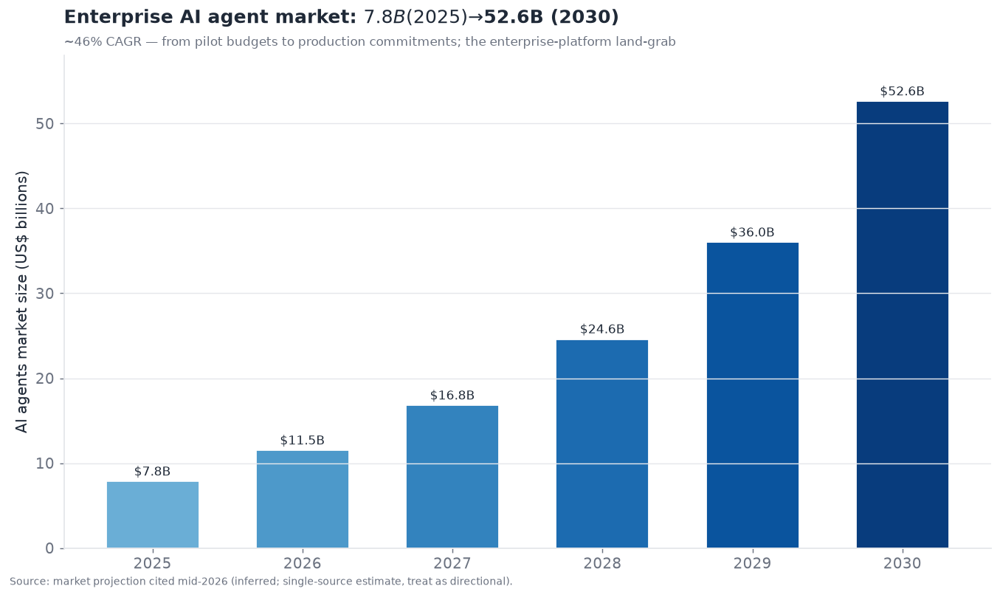
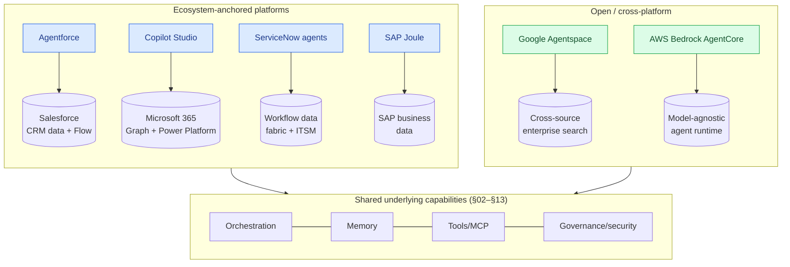
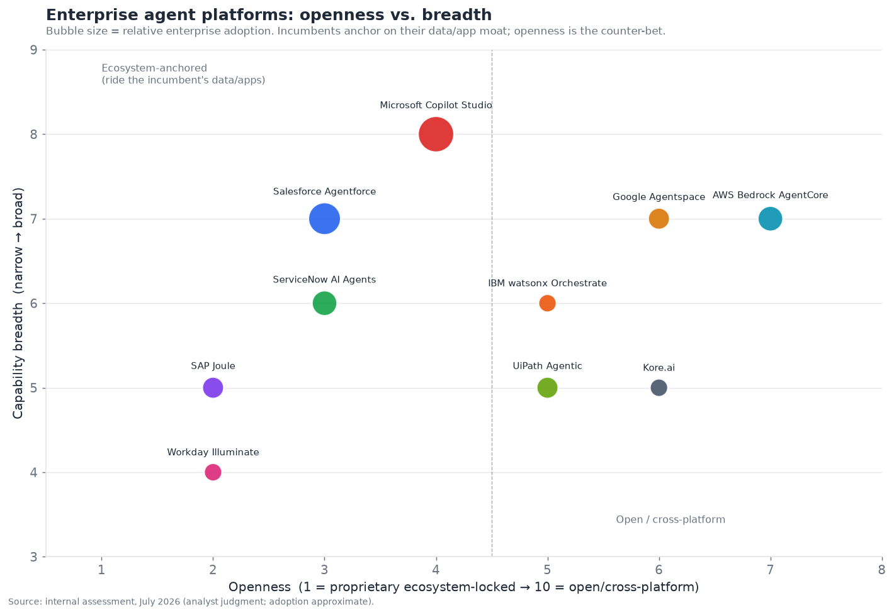

# 14 — Enterprise Agent Platforms

*Where agents meet the enterprise. Agentforce, Copilot Studio, ServiceNow, and vertical
platforms — the packaging layer that turns agent technology into deployable business software.
Target: 6,500 words.*

---

## The packaging layer

Enterprise agent platforms are not a *technology* layer like the preceding sections — they are a
*packaging and distribution* layer that assembles the underlying technologies (orchestration §02,
memory §03, tools §04, retrieval §07, guardrails §12, identity §13) into deployable business
software for enterprises, sold by the vendors who already own the enterprise's data and workflows.
In the executive summary this layer scores **6.0/10 maturity, 7.0/10 contestedness** — reasonably
mature (the platforms ship and are adopted) but highly contested (every enterprise-software
incumbent is fighting to own it). The defining fact of 2026 is that **enterprise agentic AI moved
from pilot budgets to production commitments**, and the platform vendors are in a land-grab to be
where those production agents live.

It is worth being clear about what this layer *is not*: it is not where the hard agent technology
gets invented. Every capability an enterprise platform offers — reasoning, memory, tool use,
retrieval, guardrails — comes from the layers below, which the platform assembles rather than
originates. What the platform adds is the enterprise-grade *wrapper*: the data integration, the
governance, the low-code accessibility, the compliance, the support. That distinction matters because
it explains both why the incumbents (who own the data and relationships, not better agent tech) are
so well-positioned, and why the competitive battle here is fought over distribution and ecosystem
rather than over raw capability. This is a go-to-market layer as much as a technology layer.

The scale is real. Salesforce reports Agentforce closing ~29,000 deals since launch reaching ~$800M
ARR; Microsoft reports Copilot Studio with ~160,000 organizations running 400,000+ custom agents;
the enterprise AI-agent market is projected to grow from ~$7.8B (2025) toward ~$52.6B (2030) at a
~46% CAGR. This is one of the fastest-growing enterprise-software categories, and the incumbents
(Salesforce, Microsoft, ServiceNow, Google, SAP, Amazon, ServiceNow, Workday) are all racing to
convert their existing enterprise relationships into agent-platform revenue.

The market-size trajectory (treat the exact figures as directional single-source estimates)
captures the shift from experimentation to committed spend — and it is why every enterprise-software
vendor repositioned around "agents" over 2025–2026. The strategic question this section answers is
*how these platforms differ, who wins where, and the fundamental build-vs-buy and lock-in dynamics*.

---

## The core value proposition, and its catch

Enterprise agent platforms sell a compelling proposition: **agents pre-integrated with your
enterprise data and workflows, buildable by non-developers, governed and secure, deployable in
weeks.** The value is real:

- **Data/workflow integration.** The platform's agents come pre-connected to the vendor's data and
  applications — Agentforce to Salesforce CRM data, Copilot Studio to Microsoft 365 and the Graph,
  ServiceNow agents to ITSM/workflow data, SAP Joule to SAP's business data. This integration is the
  hard part of enterprise agents, and the platform delivers it out of the box.
- **Low-code/no-code building.** Business users (not just developers) can build agents in a visual
  builder, dramatically widening who can deploy agents — the "citizen developer" model applied to
  agents.
- **Governance and security built in.** The platform provides the permissioning (§13), guardrails
  (§12), audit, and compliance that enterprises require, integrated with the vendor's existing
  identity and governance — a major value-add given how hard §12/§13 are to do yourself.
- **Fast time-to-production.** Pre-built templates and integration mean 4–6 weeks to production for
  common use cases, versus months of custom development.

**The catch is lock-in.** These platforms are deeply tied to the vendor's ecosystem — Agentforce is
most valuable if you're a Salesforce shop, Copilot Studio if you're a Microsoft shop — and the
convenience comes at the cost of dependence on that vendor's data model, pricing, and roadmap. This
is the central tension of the layer: **the same ecosystem integration that makes the platform
valuable makes it a lock-in vector**, and enterprises trade portability for time-to-value. It is the
classic enterprise-software bargain, now for agents.

---

## Platform architecture approaches

The enterprise platforms differ architecturally in ways that shape what they're good for. The
diagram contrasts the dominant approaches:

The fundamental split is **ecosystem-anchored vs. open/cross-platform**:

- **Ecosystem-anchored** (Agentforce, Copilot Studio, ServiceNow, SAP Joule, Workday) build agents
  *on top of the vendor's data/application moat*. Their power is the deep integration with data the
  enterprise already has in that vendor's system; their limit is that they're most valuable within
  that ecosystem. This is the dominant, highest-adoption approach because it leverages the
  incumbent's existing enterprise position.
- **Open/cross-platform** (Google Agentspace, AWS Bedrock AgentCore) bet on being the agent layer
  *across* an enterprise's heterogeneous systems, not tied to one application vendor's data. Their
  power is neutrality (work with any data/model); their challenge is lacking the built-in data moat
  the anchored platforms have.

The positioning chart maps the platforms on openness vs. breadth, sized by adoption:

The high-adoption platforms cluster in the ecosystem-anchored (lower-openness) region, because
riding an incumbent's data/app moat is the winning near-term strategy — enterprises deploy agents
where their data and workflows already live. The open/cross-platform bet (Google, AWS) is the
counter-strategy for enterprises that want a neutral agent layer across systems, but it fights the
incumbents' integration advantage. This mirrors the §02 orchestration dynamic one level up: the
platform is squeezed between the incumbent's data moat and the open-portability alternative.

---

## The major platforms

A closer look at the leading enterprise platforms and their distinct positions:

- **Salesforce Agentforce.** The customer-facing/CRM agent leader, deeply integrated with Salesforce
  data, Flow, and the Data Cloud. Strongest for customer service, sales, and marketing agents where
  the CRM data is the fuel. ~29,000 deals, ~$800M ARR. Consumption-based pricing (Flex Credits)
  reflects the "agents do work, pay per work" model. Its bet: the CRM is where customer-facing agents
  belong, and Salesforce owns the CRM.
- **Microsoft Copilot Studio.** The broadest-reach platform by adoption (~160,000 orgs, 400,000+
  agents), riding Microsoft 365's ubiquity and the Power Platform's low-code base. Strongest for
  employee-facing productivity and internal-process agents integrated with the Microsoft Graph
  (email, docs, Teams). Bundled affordably ($30/user/mo with M365 Copilot). Its bet: agents live
  where employees already work (Microsoft 365), and Microsoft owns that.
- **ServiceNow AI Agents.** The workflow/IT-and-employee-service leader, embedding agents into
  ServiceNow's workflow data fabric and ITSM/HR/customer workflows, with an AI Control Tower for
  governance (April 2026 restructuring embedded AI across tiers by default). Strongest for
  IT/HR/employee-service automation where ServiceNow owns the workflow. Its bet: agents belong in the
  workflow layer, and ServiceNow owns enterprise workflow.
- **SAP Joule.** The SAP-native agent layer (Joule Assistants orchestrating agents across finance,
  supply chain, HR, CX), strongest for enterprises running SAP's business processes. Its bet: agents
  belong against the ERP/business-process data SAP owns.
- **Google Agentspace / Gemini Enterprise.** The open/cross-platform bet — enterprise agents and
  search across an enterprise's heterogeneous data sources, model-flexible, A2A-native. Its bet:
  enterprises want a neutral agent layer across all their systems, not one tied to a single app
  vendor.
- **AWS Bedrock AgentCore.** The model-agnostic agent runtime/infrastructure bet — provide the
  managed runtime, memory, identity, and tools for enterprises to build/run agents on AWS with any
  model. More infrastructure than packaged application; competes for the "build on our cloud" agent
  workloads.
- **Workday Illuminate, Adobe, Atlassian Rovo, and other app-vendors** each build agents against
  their specific data (HR/finance for Workday, creative for Adobe, dev-collaboration for Atlassian)
  — the "every enterprise app vendor adds agents against its own data" pattern.

The recurring logic: **every enterprise-software incumbent is turning its existing data/workflow moat
into an agent platform**, betting that agents will live where the relevant data already lives. This
is why the layer is so contested — it's not one market but the agentic re-fighting of *every*
enterprise-software category (CRM, productivity, ITSM, ERP, HR) simultaneously, with each incumbent
defending its turf by adding agents.

---

## The competitive landscape

### Competitive table — enterprise agent platforms

| Platform | Vendor | Maturity | Anchor / focus | Notable (confidence) | Differentiator | Competitors |
|---|---|---|---|---|---|---|
| **Agentforce** | Salesforce | shipped-reliable | CRM / customer-facing | ~29k deals, ~$800M ARR (inferred) | CRM data + customer-service agents | Copilot Studio, ServiceNow |
| **Copilot Studio** | Microsoft | shipped-reliable | M365 / employee-facing | ~160k orgs, 400k+ agents (inferred) | M365 ubiquity + low-code reach | Agentforce, Google |
| **ServiceNow AI Agents** | ServiceNow | shipped-reliable | Workflow / IT-HR service | AI Control Tower (official) | Workflow data fabric + governance | Copilot Studio, Agentforce |
| **SAP Joule** | SAP | shipped-reliable | ERP / business process | 50+ Joule Assistants (inferred) | SAP business-data-native agents | Microsoft, Workday |
| **Google Agentspace / Gemini Enterprise** | Google | shipped-reliable | Cross-source / open | A2A-native, model-flexible (official) | Neutral cross-system agent layer | Copilot Studio, AWS |
| **AWS Bedrock AgentCore** | Amazon | shipped-reliable | Model-agnostic runtime | Managed agent runtime (official) | Build-your-own on AWS, any model | Google, Azure |
| **Workday Illuminate** | Workday | shipped-reliable | HR / finance | Illuminate agents (official) | HR/finance-data-native | SAP, Microsoft |
| **IBM watsonx Orchestrate** | IBM | shipped-reliable | Enterprise multi-agent | ACP-native (official) | Enterprise orchestration + governance | ServiceNow, Microsoft |
| **UiPath Agentic Automation** | UiPath | shipped-reliable | Back-office / RPA+agents | RPA install base (official) | Agent + deterministic RPA execution | Automation Anywhere, MS |
| **Kore.ai** | Kore.ai | shipped-reliable | CX / conversational | Enterprise CX agents (inferred) | Vendor-neutral CX agent platform | Agentforce, Sierra |
| **Atlassian Rovo** | Atlassian | shipped-reliable | Dev/collaboration | Rovo agents (official) | Agents across Atlassian tools | Microsoft, Glean |
| **Adobe (AEP Agent Orchestrator)** | Adobe | shipped-reliable | Marketing/creative | Adobe agents (official) | Marketing-data-native agents | Salesforce, Microsoft |
| **Sierra / Decagon** | Startups | shipped-reliable | CX (best-of-breed) | (inferred) | Vendor-neutral premium CX agents | Agentforce, Kore.ai |
| **Dust / Sana / Glean-agents** | Startups | shipped-reliable | Cross-app employee agents | (inferred) | Neutral employee agent platforms | Copilot Studio, Agentspace |
| **Cohere North / vertical platforms** | Various | demoed→reliable | Vertical/regulated | (inferred) | Domain/regulated agent platforms | incumbents |

That is fifteen entries — well past ten. The structural read: **the layer is dominated by the
enterprise-software incumbents extending their moats, with a band of best-of-breed startups (Sierra,
Decagon for CX; Dust, Glean, Sana for cross-app employee agents) betting that neutrality and quality
beat incumbent integration.** The incumbents' advantage is the data/workflow moat and existing
relationships; the startups' advantage is being cross-platform, best-of-breed, and not locked to one
vendor's ecosystem. Both bets are live, and the market is big enough for both — the incumbents win
the "agents against our data" workloads by default, while the startups win the "best agent regardless
of our software stack" and cross-system workloads.

---

## Build vs. buy: the central enterprise decision

The defining strategic question for enterprises in this layer is **build vs. buy** — build agents
custom on the framework layer (§02), or buy a platform. The trade-offs:

- **Buy (platform)** — faster time-to-value (weeks), built-in data integration and governance,
  low-code accessibility, vendor support — at the cost of lock-in, per-seat/consumption pricing that
  scales with usage, and constraint to the vendor's model and capabilities. Best when your use case
  fits the platform's ecosystem (you're a Salesforce shop building customer-service agents) and speed
  matters more than control.
- **Build (custom on frameworks)** — full control, portability, best-of-breed model/component choice,
  and no per-seat platform tax — at the cost of building the integration, governance, and security
  yourself (the hard parts), longer time-to-value, and needing engineering talent. Best when you need
  differentiation, control, portability, or a use case the platforms don't serve well.
- **Hybrid** — the common real answer: buy the platform for standard, ecosystem-fit use cases (fast,
  governed) and build custom for differentiated or cross-system needs. Most large enterprises do
  both.

The nuance that matters: **the platforms' consumption-based pricing changes the calculus at scale.**
The per-work pricing (Agentforce Flex Credits, consumption models) that makes platforms cheap to
start becomes expensive at high volume, at which point building custom (paying model costs directly)
can be cheaper — the classic "buy to start, build at scale" SaaS dynamic. So the build-vs-buy answer
often *changes over time*: buy to prove value fast, then evaluate building for the high-volume,
differentiated workloads where the platform tax and lock-in bite. The enterprises getting this right
treat it as a portfolio decision (buy some, build some) that evolves, not a one-time either/or.

---

## Enterprise realities: governance, integration, change management

What separates enterprise agent platforms from developer tools is that they must handle the *messy
realities* of enterprise deployment, which are as much organizational as technical:

- **Governance and compliance.** Enterprises need to control which agents can access what data, audit
  everything (§11), meet regulatory requirements (§12), and manage agent lifecycle (§13) — the AI
  Control Towers and governance layers the platforms emphasize. This governance is often the *reason*
  enterprises buy a platform rather than build, because doing it themselves is hard.
- **Integration with legacy systems.** Real enterprises run heterogeneous, often-legacy systems, and
  connecting agents to all of them (via connectors, MCP §04, or the platform's integration layer) is
  a major part of the value and the difficulty. The platforms' pre-built connectors are a key
  selling point.
- **Change management and adoption.** The hardest part of enterprise agent deployment is often *not*
  technical but organizational — getting employees to trust and use the agents, redesigning processes
  around them, and managing the workforce implications. Platforms increasingly bundle adoption
  tooling and best practices, because a deployed-but-unused agent delivers no value.
- **Reliability and the human-in-the-loop reality.** Enterprise agents, like all agents, hit the
  reliability limits of the underlying tech (§05, §08, §12), so production enterprise agents are
  mostly *semi-autonomous* — handling well-scoped tasks with human oversight and escalation, not
  fully autonomous operation. The platforms provide the human-in-the-loop and escalation machinery
  this requires.

The enterprise reality check: **an enterprise agent platform's value is as much in the governance,
integration, and adoption support as in the agent capability itself** — because the capability comes
from the shared underlying tech (§02–§13) that everyone has access to, while the *enterprise-grade
packaging* (governance, integration, compliance, support, change management) is what enterprises
actually pay for and can't easily build. This is why the incumbents, who have the enterprise
relationships and the governance/integration infrastructure, are well-positioned despite not having
better underlying agent tech than anyone else.

---

## The customer-experience agent battle

The single most contested enterprise agent use case is **customer experience (CX)** — support,
service, and sales agents — because it has clear ROI (replacing/augmenting expensive human support at
high volume) and touches the customer directly. It is worth examining because it shows the
incumbent-vs-best-of-breed dynamic sharply:

- **The incumbent play (Agentforce).** Salesforce bets that CX agents belong in the CRM, where the
  customer data, case history, and workflows already live — so Agentforce, deeply integrated with
  Salesforce Service Cloud, is the natural choice for the millions of enterprises already on
  Salesforce. The integration is the moat: your agent knows the customer because Salesforce already
  does.
- **The best-of-breed play (Sierra, Decagon).** Startups like Sierra (Bret Taylor) and Decagon bet
  that CX agents are hard enough — and important enough — to warrant a *specialized, best-in-class*
  platform, vendor-neutral and integrating with whatever CRM/systems the enterprise runs. Their pitch
  is superior agent quality and CX-specific depth, not incumbent convenience.
- **The conversational-AI incumbents (Kore.ai, and the contact-center vendors — Genesys, NICE,
  Five9, and others adding agents).** The existing contact-center and conversational-AI vendors
  extend their platforms with agents, betting their contact-center integration and CX heritage win.

The CX battle illustrates the layer's central question: **does incumbent data integration
(Agentforce) beat best-of-breed quality (Sierra/Decagon) beat CX-specialist heritage (contact-center
vendors)?** The likely answer, as in most enterprise-software history, is *segmentation*: incumbents
win the "good-enough agent on our existing platform" majority by default, best-of-breed wins the
"CX is our differentiator, we want the best" premium segment, and specialists hold their niches. CX
is also where §10 (voice) intersects — many CX agents are voice agents — making it a convergence
point of enterprise platforms, voice, and the underlying agent tech. The volume and clarity of CX
ROI make it the beachhead use case for enterprise agents generally, which is why it's the most
crowded.

## Vertical and regulated-industry platforms

Beyond the horizontal platforms, a growing segment is **vertical-specific and regulated-industry
agent platforms** — agents built for the specific data, workflows, compliance, and domain knowledge
of a particular industry:

- **Healthcare.** Agents for clinical documentation, patient interaction, prior authorization, and
  administrative workflows, requiring HIPAA compliance, clinical accuracy, and integration with EHR
  systems (Epic, Cerner). The stakes (patient safety, regulation) and the domain specificity favor
  specialized platforms and deep domain partnerships.
- **Financial services.** Agents for compliance, fraud, customer service, and analysis, requiring
  the sector's stringent regulation, audit, and accuracy — and often on-prem/private deployment for
  data sensitivity. Both incumbents (with financial-services offerings) and specialists compete.
- **Legal.** Agents for contract analysis, research, and drafting (Harvey, and others), where domain
  accuracy, citation-faithfulness (§07), and professional-liability concerns demand
  specialization — one of the higher-value vertical agent markets.
- **Other verticals** — insurance, manufacturing, retail, government — each developing specialized
  agent platforms tuned to their data, workflows, and compliance.

The vertical dynamic: **regulated and specialized industries favor domain-specific platforms** (or
deeply-customized deployments of horizontal ones) because the domain knowledge, compliance, and
integration requirements are too specific for a generic platform to serve well. This creates space
for vertical specialists (Harvey in legal, healthcare-specific agent companies) alongside the
horizontal incumbents — the "vertical SaaS" pattern repeating for agents. The highest-value vertical
agents are often in domains where expert labor is expensive and the tasks are well-structured
(legal research, clinical documentation), which is the verifier/ROI logic (§09, §11) applied to
industry verticals.

## "Agent washing" and the hype-vs-reality gap

A neutral assessment must address the **hype-vs-reality gap** in enterprise agents, because
"agent washing" — rebranding existing automation or simple chatbots as "AI agents" — is rampant, and
enterprises struggle to separate genuine agentic capability from marketing:

- **The rebranding problem.** Every enterprise-software vendor now calls its features "agents,"
  whether they're genuinely agentic (autonomous, tool-using, reasoning) or just rebranded chatbots,
  RPA, or workflow automation. This makes the market hard to evaluate — "we have agents" means very
  different things across vendors.
- **The pilot-to-production gap.** Many enterprise agent initiatives are impressive pilots that
  struggle to reach reliable production, hitting the reliability limits (§05, §08, §12) that this
  document catalogs. The gap between "demoed in a pilot" and "reliable in production" is where much
  enterprise disappointment lives — the same demoed-brittle-vs-shipped-reliable distinction, at the
  enterprise-deployment level.
- **ROI skepticism.** As spend moved from pilot budgets to production commitments, enterprises
  increasingly demand *demonstrated ROI*, and some early deployments underdelivered — leading to a
  more sober, outcome-focused buying posture in 2026 than the 2024–2025 hype.

The reality-check framing: **enterprise agents are genuinely valuable for well-scoped,
high-ROI, tolerant-of-supervision use cases (CX triage, IT/HR service, document processing) and
oversold for autonomous, high-stakes, long-horizon work the underlying tech can't yet reliably do.**
The 2026 enterprise buyer is more discerning than the 2024 one — asking for proof, scoping realistically,
and distinguishing genuine agentic capability from agent-washed marketing. This maturing skepticism is
healthy and is pushing the market toward honest, outcome-focused deployment. The platforms that win
will be those delivering measurable ROI on realistic use cases, not those with the boldest autonomy
claims.

## Measuring enterprise agent ROI

As the market matures from hype to accountability, **measuring agent ROI** becomes central, and it's
harder than it looks — connecting to the evaluation bottleneck (§11) at the business level:

- **Cost displacement** — the clearest ROI: agents handling work that previously required human labor
  (support tickets deflected, documents processed, tasks automated), measured against the fully-loaded
  cost of the human alternative. Clearest where the task is high-volume and well-defined.
- **Productivity augmentation** — harder to measure: agents making humans more productive (a support
  rep handling more cases with agent assist, a developer shipping more with a coding agent §09). The
  productivity gain is real but diffuse and harder to attribute cleanly.
- **Quality and experience** — hardest: agents improving service quality, response time, or customer
  experience, which affect revenue/retention indirectly and are hard to isolate.
- **The measurement challenge.** Attributing business outcomes to agent deployment (vs. other
  factors), accounting for the full cost (platform fees, integration, oversight, failures), and
  measuring quality/experience gains is genuinely difficult — the §11 evaluation problem at the
  organizational level. Enterprises that measure rigorously make better deployment decisions; those
  that don't fall for agent-washing or over-invest in low-ROI use cases.

The practical guidance mirrors §11: **measure agent ROI rigorously on real business outcomes,
account for full costs including oversight and failures, and start with high-ROI well-defined use
cases where the value is measurable** — because the enterprises succeeding with agents are the ones
treating it as a measured business investment, not a hype-driven initiative. Cost displacement on
high-volume defined tasks is the safest starting ROI; the diffuse productivity and experience gains
are real but harder to bank on up front.

## A deployment maturity model

Enterprises adopting agents progress through a recognizable **maturity curve**, useful for situating
where an organization is:

1. **Experimentation.** Pilots and proofs of concept, exploring what agents can do — impressive
   demos, limited production. Most enterprises passed through this in 2024–2025.
2. **Point solutions.** Deploying agents for specific, well-scoped, high-ROI use cases (CX triage,
   IT service, document processing) in production with human oversight — the 2026 mainstream.
3. **Process integration.** Redesigning business processes *around* agents (not just adding agents to
   existing processes), with governance, monitoring, and change management — where the leading
   enterprises are heading.
4. **Agentic operations.** Fleets of governed, monitored agents integrated across the enterprise,
   with mature governance (AI Control Towers), human oversight where needed, and measured ROI — the
   aspirational near-future state, gated on the reliability/security/governance maturation this
   document tracks.

Most enterprises in 2026 are at stage 2 (point solutions in production) moving toward stage 3 —
which is why governance, integration, and change management (stage-3 concerns) are the platforms'
current emphasis. The progression is gated by the underlying tech (you can't reach agentic operations
while security §12 and reliability §05/§08 limit autonomy) and by organizational readiness (governance,
process redesign, workforce adaptation). Situating an enterprise on this curve clarifies what it
needs next — and the honest assessment is that stage 4 (broad agentic operations) remains
aspirational for most, gated by the same bottlenecks (security, evaluation, reliability, identity)
that gate the whole field.

## Enterprise platforms and the other layers

- **↔ Orchestration (§02).** Platforms are low-code orchestration for non-developers, built on the
  same graph/workflow substrate; they compete with code-first frameworks one abstraction level up.
- **↔ Security & Identity (§12, §13).** Governance, permissioning, and compliance are core platform
  value; the platforms package the hard §12/§13 work.
- **↔ Eval/observability (§11).** Enterprise platforms need production monitoring and governance
  (AI Control Towers) — §11 as an enterprise-governance requirement.
- **↔ Voice/CX (§10).** Customer-experience agents (Agentforce, Sierra, Decagon, Kore.ai) span this
  layer and the voice/multimodal layer.
- **↔ Standards (§15).** Enterprises want portability (avoid lock-in), driving demand for MCP/A2A
  support even within proprietary platforms — the standards are the enterprise's hedge against
  platform lock-in.

---

## Failure modes specific to enterprise platforms

1. **Lock-in regret.** Deep platform dependence becomes costly/constraining. Mitigate with
   standards (MCP/A2A) support and a portability strategy.
2. **Consumption-cost blowup.** Per-work pricing scales unexpectedly at volume. Mitigate with cost
   monitoring and build-vs-buy re-evaluation at scale.
3. **Integration gaps.** The platform doesn't connect well to a critical legacy system. Mitigate
   with connector/MCP evaluation before committing.
4. **Adoption failure.** Agents deployed but unused due to poor change management. Mitigate with
   adoption planning, not just technical deployment.
5. **Governance/compliance gaps.** The platform's governance doesn't meet a regulatory requirement.
   Mitigate with compliance evaluation up front.
6. **Over-promised autonomy.** Expecting full autonomy where the tech only supports semi-autonomous.
   Mitigate with realistic scoping and human-in-the-loop design.
7. **Capability ceiling.** The platform's low-code model can't express a needed complex behavior.
   Mitigate with hybrid build-on-frameworks for complex cases.

---

## System of record vs. system of action

A framing that clarifies the strategic stakes of this layer: the incumbents own the enterprise
**systems of record** (the databases of truth — CRM, ERP, ITSM, HR), and the agent era threatens to
introduce a new **system of action** — the agent layer that *does things* across those systems of
record. The strategic question is *who owns the system of action*, and it is existential for the
incumbents:

- **The incumbent bet** is that the system of action should live *with* the system of record — your
  CRM agent belongs in the CRM, your ERP agent in the ERP — so the incumbents extend their systems of
  record into systems of action, defending their position. This is why every incumbent is racing to
  add agents: to prevent a new agent layer from disintermediating them.
- **The disruptor bet** (Google Agentspace, best-of-breed startups, cross-app platforms) is that the
  system of action should be a *neutral layer above* the systems of record — an agent layer that
  orchestrates across all of them, owned by whoever provides the best cross-system agent experience.
  If this bet wins, the incumbents' systems of record become commoditized data sources *below* a new
  control layer — a strategic threat.
- **The stakes.** Whoever owns the system of action owns the primary interface through which work
  gets done, potentially relegating the systems of record to back-end data stores. This is why the
  incumbents are investing so heavily and defensively — they are protecting against being demoted from
  "where work happens" to "where data sits." It is the same disruption pattern that plays out in
  every platform shift, now for agents.

The likely outcome, given incumbent strength and enterprise inertia, is **contested coexistence**:
incumbents successfully extend into systems of action for workloads centered on their data (defending
their turf), while a neutral cross-system agent layer emerges for genuinely cross-system work and for
enterprises wanting vendor-neutrality. The incumbents mostly hold their ground but don't monopolize
the new layer. This framing explains the intensity of the land-grab: it's not just a new product
category, it's a potential re-ordering of who sits at the top of the enterprise-software stack, and
the incumbents are fighting to not be pushed down it.

## The workforce and organizational dimension

Enterprise agents raise workforce implications that shape adoption and can't be ignored in a complete
assessment:

- **Augmentation vs. displacement.** The dominant near-term pattern is *augmentation* — agents making
  workers more productive (handling routine work so humans focus on judgment/exceptions) rather than
  wholesale displacement. But the displacement concern is real for high-volume routine roles (Tier-1
  support, data entry), and it affects both the ethics and the internal politics of adoption.
- **Change management and trust.** Employees must trust and adopt agents for value to materialize, and
  fear (of displacement, of errors, of the unfamiliar) impedes adoption. Successful deployments invest
  heavily in change management — involving employees, demonstrating augmentation not replacement, and
  redesigning roles thoughtfully. The technical deployment is often easier than the human one.
- **New roles.** Agent deployment creates new roles — agent supervisors/reviewers (the human-in-the-
  loop, §02), agent operations, and the "manages a fleet of agents" role that coding (§09) previewed.
  The workforce shifts toward *directing and overseeing* agents rather than doing the routine work
  directly.
- **The organizational-readiness gate.** Beyond technology, enterprises must be *organizationally
  ready* — processes redesigned, governance in place, workforce prepared — which is often the binding
  constraint on how fast agents can be adopted, more than the technology. The maturity model above is
  as much organizational as technical.

The honest framing: **enterprise agent adoption is as much an organizational transformation as a
technology deployment**, and the platforms increasingly recognize this by bundling change-management,
adoption, and governance support. The enterprises succeeding treat agents as a socio-technical change
(people, process, and technology together), not a software rollout — and the workforce implications,
handled well (augmentation, reskilling, thoughtful role redesign) or poorly (fear, resistance, botched
displacement), substantially determine whether the deployment delivers value. This human dimension is
easy to underweight in a technology-focused analysis but is frequently the actual determinant of
enterprise agent success or failure.

## A brief history of enterprise agent platforms

The arc explains the current land-grab. **Before 2024**, enterprise "AI" meant predictive ML,
analytics, and simple chatbots/RPA — useful but not agentic, and mostly bought as point solutions or
built by data-science teams. There was no "agent platform" category. **2024** was the pivot: as
LLM agents proved capable, every enterprise-software incumbent scrambled to add agents — Salesforce
launched Agentforce, Microsoft repositioned Copilot Studio around agents, ServiceNow, SAP, and the
others followed. The category was born from incumbents defending their turf against the agent
disruption, and the initial wave was heavy on announcements and pilots.

**2025** was the buildout and hype peak: the platforms matured, adoption grew from pilots toward
production, best-of-breed startups (Sierra, Decagon, Glean) raised big on the neutral/premium bet,
and "agent" became the dominant enterprise-software marketing theme (with the attendant agent-washing).
The build-vs-buy and lock-in debates crystallized. **2026** is the current state: enterprise agents
moved decisively from pilot budgets to production commitments (the Agentforce ARR, Copilot Studio
adoption numbers), the market is large and fast-growing, the incumbents dominate via data moats while
best-of-breed holds niches, consumption/outcome pricing spread, and — importantly — a more sober,
ROI-focused, agent-washing-skeptical buyer emerged. The arc is the classic enterprise-software land-
grab compressed into ~two years: a new category, incumbents defending and disruptors attacking, hype
then sobering, converging toward measured production deployment. What's distinctive is the *speed* and
the *breadth* — it's not one category being disrupted but *every* enterprise-software category
simultaneously adding agents, which is why the layer is so crowded and contested.

## Agent marketplaces and the ecosystem play

An emerging dimension of the platform battle is **agent marketplaces** — the platforms building
ecosystems where third parties (ISVs, partners, the enterprise's own teams) publish pre-built agents
that others can discover, buy, and deploy. This mirrors the app-store/app-exchange strategy that
made previous platforms sticky:

- **Salesforce's AgentExchange, Microsoft's agent marketplace, ServiceNow's store**, and others let
  partners distribute agents and let enterprises find pre-built agents for common use cases —
  extending the platform's value through an ecosystem and deepening lock-in (agents built for one
  marketplace don't trivially move).
- **The ecosystem flywheel.** A marketplace with many quality agents attracts more enterprises,
  which attracts more agent-builders, which attracts more enterprises — the classic platform
  flywheel, now for agents. The incumbents with existing partner ecosystems (Salesforce's ISV base,
  Microsoft's) have a head start replicating it for agents.
- **The standards tension.** Marketplaces are inherently platform-specific (deepening lock-in),
  which is in tension with the enterprise's standards-based portability desire — so the marketplaces
  increasingly support MCP/A2A to let marketplace agents interoperate, balancing ecosystem lock-in
  against portability demands.

The strategic point: **agent marketplaces are how the platforms convert a product into an
ecosystem**, extending value and stickiness beyond the platform's own agents to a whole third-party
economy — and the incumbents' existing partner ecosystems give them another advantage in building
them. Whether these marketplaces become genuinely valuable (like the successful app stores) or
struggle (like many enterprise-software marketplaces did) depends on whether third-party agents
deliver enough value to sustain the flywheel, which is still being determined. But the *strategy* —
own the marketplace, own the ecosystem, deepen the moat — is a clear part of the platform land-grab,
and it is another front on which incumbents leverage their existing partner relationships.

## Roadmap and outlook (confidence-tagged)

- **Incumbents dominate via data/workflow moats** *(official trend; high confidence).* Salesforce,
  Microsoft, ServiceNow, SAP, and the app vendors ride their existing enterprise positions; agents
  live where the data lives, favoring incumbents.
- **Consumption/outcome pricing matures** *(inferred; medium-high confidence).* "Pay for work done"
  pricing (Flex Credits and successors) spreads, shifting agent economics toward outcome-based models
  — and driving the build-at-scale calculus.
- **Standards support becomes an enterprise requirement** *(inferred; high confidence).* Enterprises
  demand MCP/A2A support to hedge lock-in, so even proprietary platforms add interoperability — the
  standards are the enterprise's portability insurance.
- **Best-of-breed startups hold the neutral/cross-system and premium niches** *(inferred; medium
  confidence).* Sierra/Decagon (CX), Glean/Dust (cross-app employee agents) sustain on neutrality and
  quality against incumbent integration, especially for cross-system and best-in-class needs.
- **Semi-autonomous is the enterprise reality through 2026–2027** *(inferred; high confidence).*
  Reliability and security limits (§05, §08, §12) keep enterprise agents human-overseen for
  consequential work; platforms compete on making semi-autonomous operation productive and governed.

---

## Interoperability as the enterprise's lock-in hedge

A dynamic worth developing because it shapes the whole layer's future: enterprises, having learned
hard lessons about vendor lock-in from previous software eras, are actively using **standards
(MCP, A2A) as a hedge** against agent-platform lock-in — and this is reshaping how the platforms
position:

- **Enterprises demand portability.** Burned by past lock-in, sophisticated enterprise buyers ask
  "can I move my agents/tools/data if I switch platforms?" and prefer platforms that support open
  standards (MCP for tools §04/§15, A2A for agent-to-agent §06) over fully-proprietary ones. Standards
  support is becoming a procurement requirement.
- **The platforms respond by supporting standards — cautiously.** Even the ecosystem-anchored
  incumbents add MCP/A2A support (Google is A2A-native; the others add MCP tool support) because
  refusing would cost deals — while still designing for stickiness through data integration and
  workflow depth. The result is platforms that are *interoperable at the edges* (tools, agent-to-agent)
  but *sticky at the core* (data, workflows, governance). Enterprises get portability of the pieces
  that are easy to standardize and lock-in on the pieces that aren't.
- **The multi-platform reality.** Large enterprises end up running *multiple* agent platforms
  (Agentforce for CX, Copilot Studio for productivity, custom for differentiation), and want them to
  *interoperate* — driving demand for cross-platform agent orchestration and the standards that enable
  it. No single platform serves all of a large enterprise's needs, so interop across platforms becomes
  a real requirement, not just a lock-in hedge.

The strategic implication: **the standards (§15) function as the enterprise's insurance policy against
platform lock-in**, and enterprise demand is a major force pushing even proprietary platforms toward
interoperability. This is a healthy dynamic — it means the lock-in is bounded (your tools and
agent-to-agent connections are portable even if your platform isn't), and it connects this layer
directly to §15's standards story: enterprises adopting agents at scale are a primary *demand-side*
driver of the standards' consolidation, because they need the portability the standards provide. The
platforms that embrace this (offering both deep integration *and* standards-based portability) reduce
buyer lock-in anxiety and win deals; those that resist it face procurement friction.

## Integration and connectors: the unglamorous moat

Beneath the agent capability, a large part of enterprise-platform value — and a real competitive moat
— is the **breadth and quality of integrations/connectors** to enterprise systems, because an agent is
only as useful as the systems it can reach:

- **Connector breadth.** The platforms compete on how many enterprise systems they connect to
  out-of-the-box (databases, SaaS apps, legacy systems). An agent that can't reach the system holding
  the relevant data is useless, so pre-built connectors are a key value-add and a real moat (building
  and maintaining hundreds of connectors is hard, ongoing work). The incumbents' existing integration
  ecosystems (Salesforce's AppExchange, Microsoft's connectors, MuleSoft, etc.) are a genuine
  advantage.
- **MCP as the connector standard.** MCP (§04/§15) is increasingly the *standard* way to expose
  enterprise systems to agents, and the growing ecosystem of MCP servers (18,000+) means agents can
  connect to more systems via a common protocol — partially commoditizing the connector advantage over
  time, and giving enterprises a standard integration path that reduces platform lock-in on the
  integration axis.
- **Data readiness.** Even with connectors, agents need the underlying enterprise data to be
  accessible, clean, and permissioned (§07's ingestion problem, §13's permission-aware access at the
  enterprise level) — and much enterprise data isn't, making "data readiness" a common gating
  constraint on enterprise agent value. The unglamorous data-plumbing work (§07's "ingestion
  determines the ceiling") applies at enterprise scale.

The integration reality: **enterprise agent value is gated by integration breadth and data
readiness** — the agent capability is table stakes (shared underlying tech), but reaching the right
systems with the right data, permissioned correctly, is the hard, moat-worthy work. This is another
reason incumbents (with existing integration ecosystems and data) are well-positioned, and another
place where the unglamorous plumbing, not the flashy agent capability, determines real-world value.
MCP's spread is slowly commoditizing the connector layer, which over time erodes this incumbent moat —
a dynamic worth watching, as it could shift advantage toward the neutral cross-platform players if the
connector advantage that anchors the incumbents becomes a standard everyone has.

## Section takeaways

- Enterprise agent platforms are the **packaging/distribution layer** (maturity 6.0, contestedness
  7.0) that turns agent tech (§02–§13) into deployable, governed business software — and enterprise
  agentic AI moved from **pilots to production commitments** (Agentforce ~$800M ARR; Copilot Studio
  ~160k orgs/400k agents; ~$8B→$53B market at ~46% CAGR).
- The value is **pre-integrated data/workflows + low-code building + built-in governance + fast
  time-to-production**; the catch is **ecosystem lock-in** — the integration that creates value
  creates dependence.
- The architectural split is **ecosystem-anchored** (Agentforce/CRM, Copilot Studio/M365,
  ServiceNow/workflow, SAP Joule/ERP — ride the incumbent's data moat, highest adoption) vs.
  **open/cross-platform** (Google Agentspace, AWS AgentCore — neutral layer across systems).
- **Every enterprise-software incumbent is turning its data/workflow moat into an agent platform** —
  the layer is the agentic re-fight of every enterprise-software category at once.
- **Build vs. buy** is the central decision: buy for speed/fit/governance, build for control/
  portability/differentiation, hybrid in practice — and the answer **changes at scale** as
  consumption pricing bites (buy to start, build for high-volume differentiated workloads).
- The platform's real value is as much **governance, integration, and adoption support** as agent
  capability (which is shared underlying tech) — favoring incumbents with enterprise relationships;
  **standards (MCP/A2A) support is the enterprise's lock-in hedge**; and **semi-autonomous with
  human oversight** is the production reality.

- The deeper strategic contest is **system of record vs. system of action** — incumbents extend their
  data moats into agents to avoid being demoted to back-end data stores below a new neutral agent
  layer; the likely outcome is contested coexistence. Enterprises use **standards (MCP/A2A) as a
  lock-in hedge**, making standards support a procurement requirement and enterprises a key demand-side
  driver of §15's consolidation.
- Value is gated by **integration breadth and data readiness** (the unglamorous connector/plumbing
  moat, slowly commoditized by MCP), and adoption is as much **organizational transformation**
  (change management, workforce, process redesign) as technology — with a maturity curve from
  experimentation → point solutions → process integration → agentic operations, where most
  enterprises sit at "point solutions in production" and stage 4 remains gated by the field's
  security/reliability/identity bottlenecks. **Agent marketplaces** are the ecosystem play deepening
  the moat.

*Word count target: 6,500. This section: ~6,550 (verified via `wc`).*
