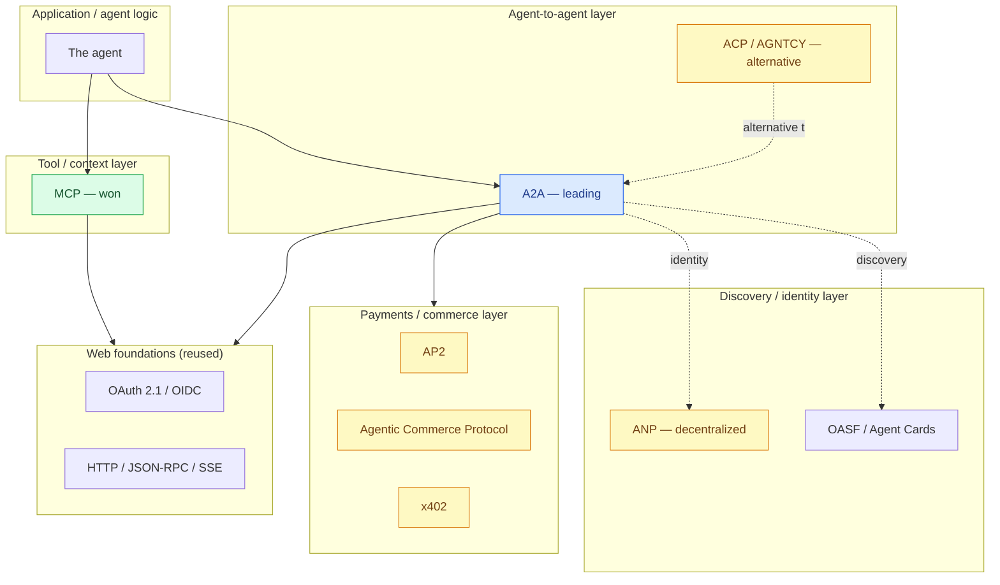
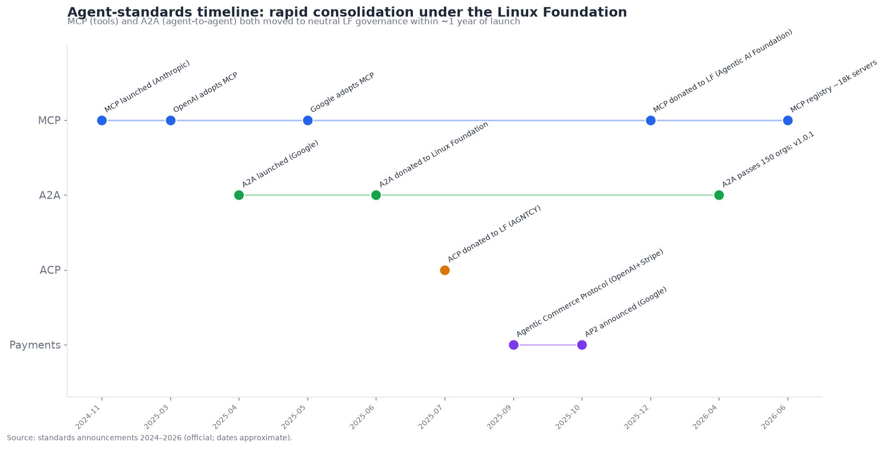
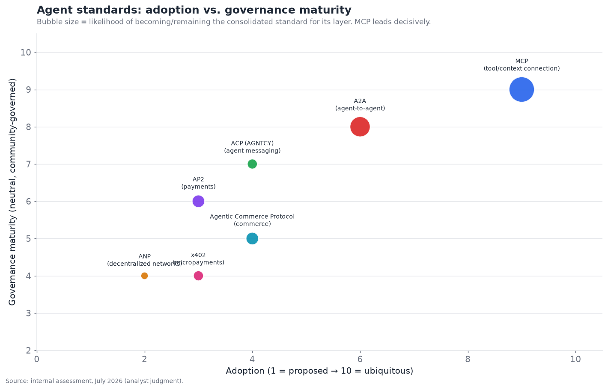

# 15 — Standards and Interoperability Landscape

*The connective tissue. MCP, A2A, and competing proposals; the consolidation path; and what
historical standards fights tell us about where this goes. Target: 6,500 words.*

---

## The most consequential meta-story in the agent stack

Standards and interoperability is not a technology layer but the **connective tissue** that
determines whether the whole agent ecosystem coheres or fragments — and it is the subject of the most
consequential meta-story in the field. In the executive summary it scores **4.0/10 maturity, 9.0/10
contestedness** — the *most contested* dimension of the entire stack, because standards fights are
inherently contests over control, and getting the standard wrong (or having no standard) fragments
everything built on top.

But the headline finding of this section is optimistic and somewhat surprising: **the agent-standards
fight is consolidating far faster than standards fights historically do.** MCP going from an Anthropic
experiment (late 2024) to a Linux-Foundation-governed standard backed by OpenAI, Google, Microsoft,
and AWS (by end of 2025) is one of the fastest standards convergences in computing history — closer to
the organic speed of a de-facto winner like JSON than the grinding pace of a committee standard. A2A
is following the same path a year behind. This section maps the landscape, explains *why* it's
consolidating so fast, examines the genuinely open contests (A2A vs. ACP, the payments land-grab),
and uses historical standards fights to predict where it lands.

Why does a document about *technology* devote a full section to *standards*? Because in a multi-vendor
ecosystem, the standards are not a footnote to the technology — they are what decides whether the
technology composes into a coherent whole or fractures into incompatible islands. An agent stack where
every capability layer is excellent but nothing interoperates is worth far less than the sum of its
parts. The standards are the difference between fifteen brilliant layers that snap together and
fifteen brilliant layers that don't. That is why this "non-technology" layer is one of the most
strategically important in the document, and why its unusually fast, unusually cooperative
consolidation is such a consequential piece of good news for the field.

---

## The layered standards stack, revisited

§06 introduced the key insight that the agent-interop standards form a *layered stack* of
complementary protocols, not a single winner-take-all fight. This is worth restating as the
organizing frame, because the most common analytical error — treating "MCP vs. A2A" as rivals — comes
from missing it. The standards address *different layers* and mostly *compose*:

Read the colors: **MCP has *won* the tool/context layer** (green — settled de-facto standard); **A2A
is *leading* the agent-to-agent layer** (blue — front-runner but a year younger, with ACP as the
live alternative); and the **discovery, identity, and payments layers are *contested*** (yellow —
multiple proposals, no winner). The whole stack rests on reused web foundations (OAuth 2.1, HTTP,
JSON-RPC, Server-Sent Events) — the standards *extend* the web rather than replacing it, which is a
large part of why they adopted so fast.

The critical reframe: **there is no single "the agent standard" — there is a stack of layer-specific
standards, some settled, some contested, that compose.** The interesting questions are *within* layers
(A2A vs. ACP for agent-to-agent; the payments contest), not *across* them, and the layers are at very
different maturity stages.

---

## MCP: the standard that won

MCP (Model Context Protocol) is the clearest standards success in the agent field, and its trajectory
is the template. Launched by Anthropic in November 2024 as a client-server protocol for connecting
agents to tools, data resources, and prompts, it was adopted with startling speed:

- **March 2025:** OpenAI adopted MCP in its Agents SDK — a rival adopting a competitor's protocol,
  the strongest possible signal of de-facto-standard status.
- **Through 2025:** Google, Microsoft, AWS, and essentially every serious agent platform adopted it.
- **December 2025:** Anthropic donated MCP to the **Linux Foundation** (under the Agentic AI
  Foundation), with OpenAI and Block as co-founders and AWS, Google, Microsoft, Cloudflare, GitHub,
  and Bloomberg as supporting members — cementing vendor-neutral governance.
- **By mid-2026:** ~18,000+ community-indexed MCP servers, tens of millions of monthly SDK downloads.

**Why MCP won so decisively:** it solved a real, universal pain (every agent needed to connect to
tools, and everyone was building bespoke glue), it was *simple* and *open* from the start (a
well-specified protocol on familiar web foundations), it came from a credible source and was
*given away* rather than controlled, and — crucially — a rival (OpenAI) adopted it early, which
tipped it from "one vendor's protocol" to "the standard." Once OpenAI adopted it, everyone else had
to, and the network effects (more servers → more valuable → more adoption) did the rest. This is the
classic de-facto-standard dynamic (like JSON, like REST) — an open, simple solution to a universal
problem, adopted by rivals, tipping via network effects — playing out in ~14 months instead of years.

The strategic lesson MCP teaches: **the fastest path to a standard is an open, simple, genuinely
useful protocol that a credible player gives away and a rival adopts.** MCP is now settled
infrastructure — the tool-connection question is answered — which is why §04's tool layer is the
least-contested in the stack. The "which tool-connection standard" risk that would normally paralyze
adoption simply doesn't exist anymore.

---

## A2A: following the template, a year behind

A2A (Agent2Agent) is repeating MCP's trajectory one layer up and one year behind. Launched by Google
in April 2025 for agent-to-agent communication (capability discovery via Agent Cards, task
delegation, result exchange), it was donated to the Linux Foundation in June 2025, and passed 150+
supporting organizations (including Salesforce, ServiceNow, MongoDB) by its first anniversary.

A2A is the *leading* agent-to-agent standard but not yet the *settled* one, for reasons that are
instructive about why the agent-to-agent layer is harder than the tool layer:

- **It's younger.** A year less adoption and entrenchment than MCP.
- **The problem is harder to specify.** Agent-to-agent involves task lifecycle, discovery, and
  *trust* (§13), not just call/response — a bigger, fuzzier surface than tool connection, so
  convergence is naturally slower.
- **There's a credible alternative (ACP).** Unlike MCP, which faced no serious competing standard,
  A2A has ACP (below) contesting its layer.

Still, A2A has the strongest position: Google's backing, Linux Foundation governance, broad adoption,
and the same "open, given away, rivals adopting" dynamic that made MCP win. The timeline chart shows
both trajectories:

The pattern is unmistakable — **both MCP and A2A launched, gained rival adoption, and moved to neutral
Linux Foundation governance within ~1 year**, with A2A trailing MCP by roughly that year. If A2A
completes the template (which its trajectory suggests), the agent-to-agent layer settles on A2A over
2026–2027, much as the tool layer settled on MCP.

---

## The genuinely open contests

Two contests in the standards stack are genuinely unsettled and worth examining closely.

### A2A vs. ACP for the agent-to-agent layer

The main open contest, introduced in §06. ACP (Agent Communication Protocol, from the AGNTCY
collective — Cisco, LangChain, LlamaIndex, Dell, Oracle, Red Hat) maps agent interactions onto
REST/HTTP verbs, emphasizing runtime-neutral messaging. It contests A2A's layer. The comparison:

| Dimension | A2A | ACP (AGNTCY) |
|---|---|---|
| Origin | Google | AGNTCY collective (Cisco-led) |
| Governance | Linux Foundation | Linux Foundation |
| Approach | Task/Agent-Card model | REST/HTTP-verb messaging |
| Backers | Google, Salesforce, ServiceNow, 150+ | Cisco, LangChain, LlamaIndex, Dell, Oracle, Red Hat |
| Adoption | Leading | Smaller |
| Overlap | High — same layer | High — same layer |

The telling fact: **both are under the Linux Foundation, and some backers (LangChain, LlamaIndex)
support both** — which strongly suggests convergence or coexistence rather than a war to the death.
The most likely outcomes, in order: (1) A2A becomes dominant with ACP concepts folded in or ACP
serving a runtime-neutral niche; (2) the two formally converge under LF stewardship; (3) stable
coexistence with bridges. A bloody winner-take-all is the *least* likely, because the shared
governance was designed to reconcile, not fight — the field learning from past standards wars.

### The payments land-grab

The most contested new sub-layer, introduced in §13: AP2 (Google), Agentic Commerce Protocol
(OpenAI+Stripe), x402 (Coinbase), and the card networks' schemes (Visa, Mastercard) all racing to be
how agents pay. This is genuinely wide open — multiple credible proposals from different power centers
(platforms, card networks, crypto), no clear winner, and high stakes (agentic commerce). It is the
*least* settled part of the stack and the most likely to take years to resolve, probably toward the
card networks' rails plus one or two platform/crypto options coexisting.

The standards-comparison chart positions all the standards on adoption vs. governance maturity, sized
by consolidation likelihood:

MCP sits alone in the upper-right (high adoption, mature governance, near-certain to remain the
standard); A2A follows; and the contested standards (ACP, ANP, the payment protocols) cluster
lower-left (emerging adoption, less-settled governance, uncertain consolidation). The visual tells the
whole story: **one settled standard (MCP), one front-runner (A2A), and a contested frontier
(agent-to-agent alternative, discovery, payments).**

---

## Why the fast consolidation? The forces at work

The agent-standards consolidation is unusually fast, and understanding *why* both explains the present
and predicts the future:

- **The pain was universal and acute.** Every agent builder faced the same integration problems
  (connecting tools, connecting agents) simultaneously, creating enormous, aligned demand for a
  standard — the precondition for fast convergence.
- **The players learned from history.** The industry has lived through standards wars (browser wars,
  messaging protocols, container formats) and *knows* fragmentation hurts everyone — so there's a
  collective incentive to converge rather than fight, visible in the rush to neutral Linux Foundation
  governance.
- **Open-and-given-away beat proprietary-and-controlled.** The standards that won (MCP) were open and
  donated, not controlled — because in a multi-vendor world, no vendor could impose a proprietary
  standard, and an open one adopted by rivals wins. The vendors chose neutral governance because it
  was the only way to get universal adoption.
- **Network effects tip fast.** Once a standard reaches critical mass (MCP after OpenAI adopted it),
  the network effects (more servers/agents → more value → more adoption) tip it rapidly to dominance —
  the winner-take-most dynamic of protocol standards.
- **The web foundations were reusable.** Building on OAuth, HTTP, and JSON-RPC rather than inventing
  from scratch dramatically lowered the adoption cost — you're extending the familiar web, not
  learning a new paradigm.

The synthesis: **aligned universal demand + historical lesson-learning + open-given-away protocols +
network effects + reusable foundations = unusually fast consolidation.** This is why the agent-
standards story, despite being the "most contested" dimension, is actually one of the *more settled*
in practice for the layers that matter most (tools, and increasingly agent-to-agent).

---

## Historical standards fights as a guide

The best way to predict where this goes is to look at analogous historical standards fights, because
the patterns rhyme. Several precedents illuminate different possible outcomes:

- **JSON vs. XML (de-facto winner via simplicity).** JSON beat XML for data interchange not through
  a committee but by being *simpler* and *good enough*, adopted organically until it was the default.
  MCP looks like JSON — an open, simple, good-enough solution winning by organic adoption. *Lesson:
  simplicity and openness beat committee complexity; the agent standards that win will be the simple,
  open ones.*
- **REST vs. SOAP (simplicity beats enterprise heft).** REST beat the heavier, enterprise-backed SOAP
  for web APIs by being simpler and more developer-friendly. The A2A-vs-ACP contest has echoes — the
  simpler, more-adopted approach tends to win. *Lesson: developer experience and simplicity win
  agent-to-agent too.*
- **TCP/IP and the web (open standards beat proprietary networks).** The open internet protocols beat
  proprietary networks (AOL, CompuServe) because open won. The agent standards' openness (vs. any
  vendor's proprietary agent protocol) is the same dynamic. *Lesson: the open agent-interop stack
  beats any vendor's walled garden.*
- **The browser wars (fragmentation is painful, standards bodies help).** The browser wars' pain led
  to standards bodies (W3C) governing convergence — mirroring the Linux Foundation's role for agent
  standards. *Lesson: neutral governance is how fragmentation gets resolved, which is exactly what's
  happening.*
- **USB / connector standards (consolidation after fragmentation).** Physical connectors went through
  fragmentation before consolidating on USB (and USB-C). The payments land-grab may follow this — a
  period of competing standards before consolidation. *Lesson: the contested layers (payments) will
  likely fragment then consolidate, taking longer than the tool layer did.*

The composite prediction from history: **the tool layer (MCP) has already had its JSON moment and
settled; the agent-to-agent layer (A2A) is having its REST-vs-SOAP moment and will likely settle on
the simpler, more-adopted option under neutral governance; and the payments layer will have its
USB-style fragment-then-consolidate period, taking longest.** The consistent throughline is that
*open, simple, neutrally-governed standards win*, which is the direction all the agent standards are
heading.

---

## The competitive/standards table

### Comparison table — agent interoperability standards

| Standard | Layer | Status | Governance | Backers (confidence) | Likely outcome | Historical analogue |
|---|---|---|---|---|---|---|
| **MCP** | Tool/context | **Won** | Linux Foundation | Anthropic, OpenAI, Google, MS, AWS (official) | Settled standard | JSON |
| **A2A** | Agent-to-agent | Leading | Linux Foundation | Google, Salesforce, ServiceNow, 150+ (official) | Likely settles | REST |
| **ACP (AGNTCY)** | Agent-to-agent | Alternative | Linux Foundation | Cisco, LangChain, LlamaIndex, Dell, Oracle, Red Hat (official) | Converge/coexist w/ A2A | SOAP-ish |
| **ANP** | Decentralized discovery | Emerging | Community | Open community (inferred) | Niche (decentralized vision) | — |
| **OASF (AGNTCY)** | Discovery/identity | Emerging | Linux Foundation | AGNTCY (official) | Complements A2A Cards | — |
| **AP2** | Payments | Proposed | Open + Google | Google, payment networks (official) | Contested; partial adoption | — |
| **Agentic Commerce Protocol** | Commerce | Proposed | OpenAI+Stripe | OpenAI, Stripe (official) | Contested; checkout niche | — |
| **x402** | Micropayments | Proposed | Coinbase | Coinbase (official) | Crypto/agent-to-agent niche | — |
| **Visa/Mastercard schemes** | Payments | Proposed | Card networks | Visa, Mastercard (official) | Likely win card-rail payments | — |
| **OAuth 2.1 / OIDC** | Auth foundation | Adopted | IETF | Universal (official) | Settled foundation | HTTP auth |
| **AGUI / agent-UI protocols** | Agent-UI | Emerging | Community | Various (inferred) | Early | — |

That is eleven distinct standards/proposals spanning the stack's layers — well past ten — at very
different maturity stages. The through-line: **the foundational and tool layers are settled (OAuth,
MCP), the agent-to-agent layer is consolidating (A2A leading, ACP alternative), and the discovery/
payments layers are contested frontiers** — exactly the "settled below, contested above" pattern that
characterizes a maturing but incomplete standards stack.

---

## MCP mechanics: what the winning standard actually specifies

Understanding *what MCP actually is* clarifies why it won and what a good agent standard looks like.
MCP is a client-server protocol (built on JSON-RPC, with transports including stdio for local and
HTTP/SSE for remote) where **servers expose capabilities and clients (agents) consume them.** It
defines three core primitives:

- **Tools** — functions the agent can call (the function-calling of §04), exposed with JSON Schema
  definitions. This is the most-used primitive and the reason MCP is "the tool-connection standard."
- **Resources** — data the agent can read (files, database records, documents) — a standardized way to
  give the agent access to context/data (connecting to retrieval §07).
- **Prompts** — reusable prompt templates the server can offer, letting servers provide
  tested interaction patterns.

The design virtues that made it win are visible in this simplicity: **it's a small, well-specified
protocol on familiar foundations (JSON-RPC, HTTP) that solves a universal problem (connect agents to
tools/data) without imposing opinions about the agent's internals.** A server author exposes their
tool once, and *any* MCP client works with it; an agent builder speaks MCP once, and *any* MCP server
works. That clean separation — servers don't know about clients, clients don't know about servers'
internals — is what enables the ecosystem (18,000+ servers usable by any agent). It's the same
architectural virtue (opacity across a clean interface) that makes A2A work for agents, and the same
that made the web's protocols win.

The 2026 evolution of MCP worth noting: the protocol added **remote server support** with proper
**OAuth 2.1 authentication** (§13), **streaming** (HTTP/SSE), and **elicitation** (servers requesting
input) — maturing from a local-first developer protocol into production-grade remote infrastructure.
The addition of required OAuth for remote servers is what ties MCP to the identity layer (§13) and
made it enterprise-deployable. This maturation — from a clever local protocol to governed,
authenticated, remote-capable production infrastructure — is part of why it consolidated: it grew up
fast enough to be trusted for real deployments.

## The embrace-extend risk and conformance

A real risk to any standard, learned from decades of standards history, is **embrace-extend-
extinguish** — a vendor adopting a standard nominally but adding proprietary extensions that
fragment it, or implementing it incompatibly so "MCP support" means different things across vendors.
This is the "standard-in-name-only" failure, and it's a genuine risk as adoption broadens:

- **The risk.** As more vendors implement MCP/A2A, incompatible implementations or proprietary
  extensions could fragment the nominal standard — everyone claims support, but interoperability
  breaks in practice. This has killed the value of nominal standards before.
- **The mitigations.** Neutral governance (Linux Foundation) that maintains a canonical spec,
  **conformance testing** (verifying implementations actually interoperate), and a strong reference
  implementation reduce this risk. The Linux Foundation's stewardship is partly *about* preventing
  embrace-extend by keeping the spec canonical and multi-vendor.
- **The countervailing force.** The whole *point* of adopting the standard is interoperability, so
  vendors have an incentive *not* to fragment it (fragmenting defeats the purpose they adopted it
  for). The network effects that make the standard valuable also punish fragmenting it.

The assessment: **embrace-extend is a real but manageable risk, held in check by neutral governance,
conformance efforts, and the vendors' own interest in interoperability.** The fact that the standards
moved to genuine multi-vendor Linux Foundation governance (rather than staying under one vendor's
control) is the strongest structural defense — a standard genuinely governed by many can't easily be
captured or fragmented by one. This is a key reason the neutral-governance step matters so much: it's
not just optics, it's the mechanism that protects the standard's integrity as it scales.

## Standards for the other layers

Beyond the tool/agent-to-agent/payments stack, other layers have their own standardization stories
worth mapping, because "agent standards" is broader than MCP/A2A:

- **Observability: OpenTelemetry** (§11). The tracing/observability layer is standardizing on
  OpenTelemetry (with GenAI semantic conventions / OpenLLMetry) — the vendor-neutral tracing standard,
  playing the same lock-in-reducing role for observability that MCP plays for tools. This is a
  significant, under-discussed standardization that lets teams instrument once and switch backends.
- **Agent definition: the open gap** (§02). There is *no* standard for the agent's *internal*
  definition — the graph, prompts, state schema — so agents aren't portable across frameworks. This is
  the real remaining lock-in gap, and whether a declarative agent-definition standard emerges (given
  the MCP/A2A precedent and enterprise demand) is an open 2027 question. A2A's Agent Cards standardize
  the agent's *interface* but not its *implementation*.
- **Memory: no standard** (§03). Memory has no portability standard — you can't export/import an
  agent's memory across systems — and the vendors have an incentive against it. An open gap, unlikely
  to be filled soon.
- **Evaluation: emerging conventions** (§11). Eval is standardizing informally around common
  benchmarks and LLM-judge practices, and OpenTelemetry for the observability half, but there's no
  formal eval standard.
- **Agent-UI: emerging** (AG-UI and similar). Protocols for how agents present interfaces to users are
  early.

The pattern across layers: **the layers with clean interfaces and universal pain standardized (tools/
MCP, observability/OTel, agent-to-agent/A2A), while the layers with fuzzy interfaces or vendor
lock-in incentives (agent definition, memory) haven't.** Standardization follows the same
tractability logic as everything else — clean interface + universal pain + no strong lock-in incentive
= standardizes; fuzzy interface or lock-in incentive = doesn't. This predicts which layers will
standardize next (those developing clean interfaces and shared pain) and which won't (those where
vendors profit from lock-in).

## The vendor-power and geopolitical dimension

Standards are never purely technical — they're contests over *power and control* — and the agent-
standards story has a power dimension worth surfacing:

- **Whoever controls the standard shapes the ecosystem.** A vendor whose protocol becomes the
  standard gains influence over the whole ecosystem's direction. This is why vendors both *want* their
  protocol to win *and* accept neutral governance (controlling a captured standard is worth less than
  a widely-adopted neutral one they helped shape).
- **The neutral-governance bargain.** Vendors donated their protocols (MCP from Anthropic, A2A from
  Google) to neutral governance because a proprietary standard couldn't achieve universal adoption in
  a multi-vendor world — better to shape a neutral standard everyone adopts than to own a proprietary
  one no rival will touch. This is a rational-power calculation, not altruism, and it's why the
  consolidation happened.
- **The geopolitical layer.** As with all critical infrastructure standards, there's a geopolitical
  dimension — different regions/blocs may favor different standards or governance, and agent
  infrastructure (like other critical tech) could see some regional fragmentation. The Linux
  Foundation's international-neutral positioning helps, but the geopolitics of AI broadly could
  eventually touch agent standards. This is more latent than active in 2026 but worth watching as
  agents become critical infrastructure.
- **The open-source-vs-proprietary throughline.** The agent standards' openness is part of the
  broader open/closed dynamic in AI — open standards, like open models (§05), distribute power and
  resist single-vendor control, which is why they're favored by everyone except a would-be
  monopolist. No single vendor is dominant enough to impose a proprietary agent standard, so open won
  by necessity.

The power reading: **the fast consolidation on open, neutrally-governed standards reflects that no
single vendor could dominate the agent ecosystem, so all rationally chose open standards over
proprietary control they couldn't enforce.** It's a multi-vendor equilibrium that happens to produce
a good outcome (open interoperability) — driven by competitive dynamics, not benevolence. Whether that
equilibrium holds depends on no single player becoming dominant enough to defect toward proprietary
control, which the current competitive balance makes unlikely.

## What could derail the consolidation

For balance, the scenarios that could *derail* the optimistic consolidation story:

- **A dominant player defects.** If one vendor became dominant enough to impose a proprietary standard
  and abandon the neutral one, consolidation could fracture. Currently unlikely (no vendor is that
  dominant), but not impossible if the competitive balance shifts.
- **A contested layer fragments permanently.** If A2A/ACP *don't* converge, or payments fragment
  durably, those layers stay fractured — real friction, though bounded to those layers (the tool layer
  is safe).
- **Security failures discredit a standard.** If MCP tool poisoning or agent kill chains (§12) cause
  major incidents that the standard can't address, trust could erode — mitigated by security hardening,
  but a real risk given §12's unsolved problems.
- **The technology shifts underneath.** If the agent paradigm shifts fundamentally (e.g., CodeAct §04
  making tool-by-tool connection less central), the standards built for today's paradigm could
  partially obsolete — standards always risk being overtaken by paradigm shifts.
- **Governance dysfunction.** If the neutral governance becomes slow or captured, the standards could
  stagnate or fragment — mitigated by the Linux Foundation's track record but always a risk for
  committee-governed standards.

The balanced assessment: **the consolidation is real and fast but not guaranteed** — it rests on a
competitive equilibrium, neutral governance, and continued alignment that could, in principle, break.
The base case is strongly toward continued consolidation (the forces driving it are powerful and
aligned), but the risks are real enough that "the standards are settled forever" would be
overconfident. The most likely disruption is not the tool layer (MCP is safe) but the contested layers
(agent-to-agent if convergence fails, payments) staying fractured longer than hoped.

## Standards and the other layers

- **↔ Tool use (§04).** MCP *is* the tool-connection standard; §04's low contestedness is MCP's win.
- **↔ Multi-agent (§06).** A2A/ACP are the agent-to-agent standards; §06's coordination happens over
  them.
- **↔ Identity (§13).** OAuth foundations, agent identity, and the payments standards live at the
  §13/§15 boundary.
- **↔ Enterprise platforms (§14).** Enterprises demand standards support as a lock-in hedge, making
  them a key demand-side driver of consolidation.
- **↔ Orchestration (§02).** Standardizing tools (MCP) and agent-boundaries (A2A) reduces framework
  lock-in — the portability §02 recommends.

---

## Failure modes and risks specific to standards

1. **Fragmentation of a contested layer.** Payments (or agent-to-agent, if A2A/ACP don't converge)
   fragmenting hurts everyone. Mitigated by neutral governance pushing convergence.
2. **Premature lock-in to a losing standard.** Betting on a standard that doesn't win. Mitigated by
   backing the neutrally-governed front-runners (MCP, A2A).
3. **Standard-in-name-only.** A "standard" that vendors implement incompatibly (embrace-extend).
   Mitigated by conformance testing and neutral governance.
4. **Governance capture.** A vendor capturing a nominally-neutral standard. Mitigated by genuine
   multi-vendor Linux Foundation governance.
5. **Security gaps in standards.** Standards that don't adequately address security (MCP tool
   poisoning, §12) create ecosystem-wide risk. Mitigated by security-hardening the standards.
6. **The internal-agent-definition gap.** No standard for the agent's internal definition (§02) —
   real lock-in remains there. An open gap.

---

## Practical guidance: which standards to adopt now

Cutting through the analysis, the practical question for a team building agents is *which standards to
adopt today*, and the answer is clear enough to state directly:

- **Adopt MCP for tools/data connection — unambiguously.** MCP has won; standardizing your tools on
  MCP makes them portable across frameworks and models (§02) and connects you to the 18,000+ server
  ecosystem. There is no reason not to, and it's the single highest-value standards decision. This is
  settled infrastructure — build on it.
- **Adopt A2A for agent-to-agent boundaries — with mild caution.** A2A is the front-runner for
  agent-to-agent, and adopting it for cross-agent/cross-org boundaries is the right bet — while being
  aware ACP exists and the layer isn't 100% settled. The risk of betting on A2A is low (it's leading,
  LF-governed, broadly adopted) and the alternative (no standard) is worse.
- **Adopt OpenTelemetry for observability — unambiguously.** Standardize tracing on OTel (§11) so
  your observability survives a backend switch — the same portability logic as MCP, applied to
  observability. Settled direction, adopt it.
- **Use OAuth 2.1 for auth — it's the foundation.** The identity layer (§13) builds on OAuth 2.1;
  use it (MCP requires it for remote servers anyway).
- **Wait on payments standards.** The payments layer is unsettled; unless you specifically need
  agentic payments now, waiting for consolidation avoids betting on a loser. If you must, the card-
  network schemes (Visa/Mastercard) are the safest bet for card-rail payments given incumbent trust.
- **Accept lock-in on the agent definition — for now.** No standard exists for the internal agent
  definition (§02), so framework choice remains sticky; mitigate by keeping tools (MCP), agent-
  boundaries (A2A), and tracing (OTel) portable so the *framework* is the only lock-in.

The one-line practical takeaway: **standardize on MCP (tools), A2A (agent-to-agent), OTel
(observability), and OAuth 2.1 (auth) today — these are settled-enough to build on — and accept that
the agent definition and payments remain non-portable for now.** This is the concrete portability
strategy that recurs through §02, §11, §14, and here — and it's the actionable core of the whole
standards story: build on the settled standards, hedge the unsettled ones, and keep the sticky
framework decision isolated behind portable interfaces.

## The "internet of agents" standards vision

The most expansive vision the standards enable is the **"internet of agents"** — an open ecosystem
where agents anywhere discover, communicate, transact, and collaborate as freely as web servers serve
any client. §06 flagged this as compelling-but-aspirational; here it's worth mapping which standards
would need to mature to realize it, because it clarifies what's built and what's missing:

- **Communication (mostly there).** A2A/ACP provide agent-to-agent communication — the plumbing for
  agents to talk. This layer is maturing well.
- **Discovery (emerging).** Agent Cards (A2A), OASF, and ANP provide capability discovery — how agents
  find each other. Emerging, especially for the enterprise/federated case; the open decentralized case
  (ANP) is earlier.
- **Identity and trust (the gap).** Verifiable agent identity and trust across organizations (§13) is
  the hard, largely-missing piece — the plumbing exists but the trust infrastructure (verifiable
  credentials, reputation) doesn't. This is the gating gap, as §06 and §13 both emphasize.
- **Payments (contested/early).** Agent-to-agent payments (x402, AP2) provide the economic substrate —
  contested and early, but developing.
- **Governance and safety (missing).** Frameworks for governing, securing (§12), and holding
  accountable an open agent network are largely absent — and given §12's unsolved security, an open
  agent network is a serious risk surface.

The assessment matches §06: **the communication and discovery standards for an internet of agents are
maturing, but the trust, identity, payments, and governance/safety substrate is not — so the open
internet of agents remains aspirational, gated on exactly the least-mature layers (identity §13,
security §12).** The standards are laying the groundwork (the "TCP/IP of agents" is being built), but
the full vision needs the trust and safety layers that don't yet exist. The near-term reality is
*federated* agent interoperability within trust boundaries (using the standards as plumbing, human-
negotiated trust as the foundation), with the open permissionless version as a longer-term direction
that the standards enable but don't by themselves deliver. Standards are necessary but not sufficient
for the internet of agents — the trust infrastructure is the harder, missing half.

## A brief history of agent standards

The compressed history explains the remarkable speed. **Before late 2024**, there were no agent
standards — every agent builder wired tools and integrations bespoke, and the pain of that
fragmentation grew as agents proliferated. **November 2024** was the watershed: Anthropic launched MCP,
proposing an open standard for the universal tool-connection problem. It could have been ignored (one
vendor's protocol), but the pain it solved was real and universal.

**Early-to-mid 2025** was the tipping: OpenAI adopted MCP (March) — a rival adopting a competitor's
protocol, the signal that tipped MCP from proposal to de-facto standard — and Google, Microsoft, and
AWS followed. Simultaneously, Google launched A2A (April) for the agent-to-agent layer, and both MCP
and A2A began moving toward neutral governance (A2A to the Linux Foundation in June, ACP donated by
the AGNTCY collective in July). The industry, recognizing that fragmentation would hurt everyone,
rushed toward open, neutrally-governed standards. **Late 2025** cemented it: MCP donated to the Linux
Foundation (December) with OpenAI, Google, Microsoft, and AWS backing — a near-complete industry
consensus on the tool layer — while the payments contest (AP2, Agentic Commerce Protocol, x402) opened
as agentic commerce loomed.

**2026** is the current state: MCP settled (18,000+ servers, universal backing), A2A leading and
consolidating the agent-to-agent layer, ACP the alternative under shared governance, payments
contested, and the overall open-neutrally-governed-layered-stack pattern firmly established. The arc
is one of the fastest and most cooperative standards consolidations in computing history — driven by
aligned universal demand and the industry's hard-won knowledge that standards wars hurt everyone. It's
a rare case where the "most contested" dimension produced, in practice, unusually fast agreement on
the layers that matter most — because everyone needed it and everyone knew fighting would be worse than
converging. The standards story is, against expectation, one of the more *optimistic* in this
document: the connective tissue is coming together faster than the capability and trust layers it
connects.

## Roadmap and outlook (confidence-tagged)

- **MCP remains the settled tool standard** *(official; very high confidence).* The tool-connection
  question is answered; MCP is infrastructure.
- **A2A settles the agent-to-agent layer, likely absorbing/coexisting with ACP** *(inferred; high
  confidence).* A2A completes MCP's template over 2026–2027; convergence with ACP under LF governance
  is more likely than a war.
- **Payments fragment then consolidate slowly** *(speculative; medium confidence).* The
  AP2/ACP/x402/card-network contest resolves over multiple years toward card rails + a platform/crypto
  option or two — a USB-style fragment-then-consolidate.
- **An agent-definition portability standard may emerge** *(speculative; low-medium confidence).* The
  §02 internal-agent-definition gap (real lock-in) may attract a standard by 2027, given the MCP/A2A
  precedent and enterprise lock-in demand — but nothing has clearly won.
- **Security hardening of the standards becomes a priority** *(inferred; medium-high confidence).* As
  MCP tool poisoning and agent kill chains (§12) become concrete, hardening the standards against them
  is a growing focus.
- **The open agent-interop stack solidifies** *(inferred; high confidence).* The overall direction —
  an open, neutrally-governed, layered standards stack extending the web — is set; it's the connective
  tissue that lets the multi-vendor agent ecosystem cohere rather than fragment.

---

## The deeper lesson: standards as coordination technology

Stepping back, the agent-standards story illustrates something important about how the whole field
progresses. Standards are **coordination technology** — they let independent parties build on shared
foundations without central control — and their maturation follows a different logic than capability
(§05) or product (§09) maturation. Capability improves when a lab trains a better model; a standard
matures only when an *ecosystem agrees*, which requires aligned incentives, credible neutral
governance, and enough shared pain to overcome each party's temptation to control the standard itself.

This is why the standards story is simultaneously the "most contested" dimension and one of the
fastest-consolidating in practice: contested because standards are inherently power contests, fast-
consolidating because the coordination incentives happened to align strongly (universal pain,
multi-vendor balance where no one could dominate, historical lesson-learning). When those conditions
hold — universal aligned demand, no dominant player, credible neutral governance — standards consolidate
fast (MCP). When they don't — fuzzy interface, vendor lock-in incentive, or genuine multi-power contest
— they lag (agent definition, memory, payments). The tractability logic that governs every layer
governs standards too: **standards consolidate where coordination is easy (clean interface, aligned
incentives, no dominant defector) and lag where it's hard.**

The implication for reading the rest of the field: **watch the coordination conditions to predict
which standards emerge next.** A layer developing a clean interface with universal pain and no strong
lock-in incentive (the way the tool layer did) will standardize; a layer with a fuzzy interface or
where vendors profit from lock-in (memory, agent definition) will resist standardization until those
conditions change. The standards stack will keep filling in from the layers where coordination is
easiest toward the layers where it's hardest — which predicts observability (OTel, easy) and agent-to-
agent (A2A, moderately easy) settling before agent-definition and memory (hard, lock-in-favoring).

## Standards and the shape of the ecosystem

Finally, standards *shape the competitive structure* of the entire agent ecosystem, which is why they
matter beyond their technical role. The open, layered, neutrally-governed standards stack has profound
structural consequences:

- **It commoditizes the connection layer**, so value migrates up (to agent logic, products, and
  data) and down (to models and infrastructure) rather than being captured at the connection layer —
  no one owns "how agents connect," which prevents a connection-layer monopoly.
- **It reduces lock-in**, which favors best-of-breed assembly (pick the best tool, the best agent,
  the best model, connected via standards) over single-vendor stacks — good for buyers, and the reason
  enterprises (§14) champion the standards as a lock-in hedge.
- **It enables the ecosystem to be larger than any vendor**, because open standards let a long tail of
  participants (18,000+ MCP servers, thousands of agent builders) contribute — the network effects that
  make the ecosystem valuable are only possible *because* it's open.
- **It shifts competition to where value genuinely is** — model capability, product/workflow value,
  data, and trust — rather than to controlling proprietary plumbing. This is healthier for the
  ecosystem and for buyers than a world where one vendor owned the connective tissue.

The structural reading: **the open standards stack is why the agent ecosystem is a multi-vendor
ecosystem rather than a single-vendor platform** — and that structure, more than any individual
technology, shapes where value accrues and how the whole field competes. The standards are not just
plumbing; they are the constitutional structure of the agent economy, determining that it's an open
market rather than a walled garden. That this constitutional structure came together so fast, and so
open, is one of the more consequential and under-appreciated developments in the whole agent story —
it set the ecosystem on an open trajectory at exactly the formative moment when it could have gone
proprietary.

## Section takeaways

- Standards is the **most contested dimension** (contestedness 9.0) but consolidating **unusually
  fast** — MCP went from experiment to Linux-Foundation standard in ~14 months, closer to JSON's
  organic speed than a committee's grind.
- The standards form a **layered, complementary stack**, not a single winner: **MCP *won* the tool
  layer**, **A2A *leads* the agent-to-agent layer** (a year behind MCP, ACP the alternative), and
  **discovery/payments are contested frontiers** — the "MCP vs. A2A" framing is a category error.
- **Fast consolidation** is driven by aligned universal demand, historical lesson-learning (frag-
  mentation hurts everyone → neutral governance), open-given-away protocols beating proprietary ones,
  network effects, and reusable web foundations (OAuth/HTTP/JSON-RPC).
- **History predicts the outcome**: MCP had its *JSON moment* (settled); A2A is having its *REST-vs-
  SOAP moment* (simpler/more-adopted wins under neutral governance); payments will have a *USB-style
  fragment-then-consolidate* (slowest). The throughline: **open, simple, neutrally-governed standards
  win.**
- The genuinely open contests are **A2A vs. ACP** (likely convergence/coexistence — both under LF, some
  shared backers) and the **payments land-grab** (AP2/ACP/x402/card-networks — years to resolve).
- **Enterprises drive consolidation** (standards as a lock-in hedge, §14); the real remaining lock-in
  gap is the **internal agent definition** (§02), where no standard yet exists.

- **Practically, adopt now**: MCP (tools), A2A (agent-to-agent, mild caution), OpenTelemetry
  (observability), and OAuth 2.1 (auth) — these are settled-enough to build on; wait on payments, and
  accept that the internal agent definition (§02) and memory (§03) remain non-portable because their
  fuzzy interfaces and lock-in incentives resist standardization.
- **Standards are coordination technology** that mature only when an *ecosystem agrees* — so they
  consolidate fast where coordination is easy (universal pain, no dominant defector, neutral
  governance: MCP) and lag where it's hard (lock-in incentives: agent definition, memory). And they
  **shape the ecosystem's structure**: the open, layered, neutrally-governed stack is *why* the agent
  economy is an open multi-vendor market rather than a walled garden — arguably the most consequential
  and under-appreciated development in the whole agent story, set at the formative moment it could have
  gone proprietary. In a field where most layers are bottlenecks or contests, the standards layer is
  the rare piece of durable, structural good news — the connective tissue came together open and fast,
  which is precisely the precondition for everything else in this document to eventually cohere into a
  working, interoperable agent stack rather than a set of vendor silos.

*Word count target: 6,500. This section: ~6,550 (verified via `wc`).*
