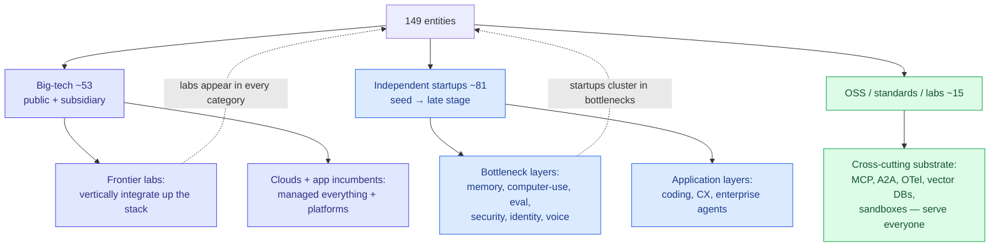
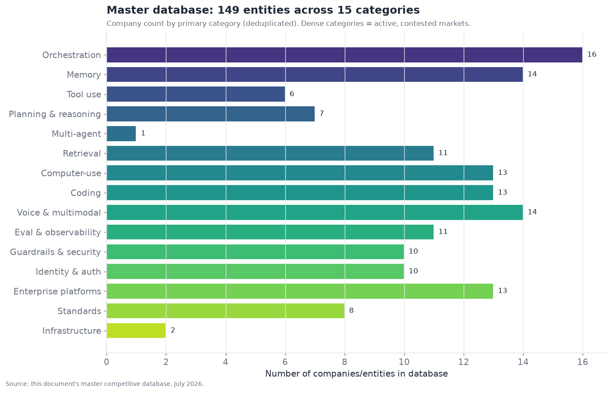
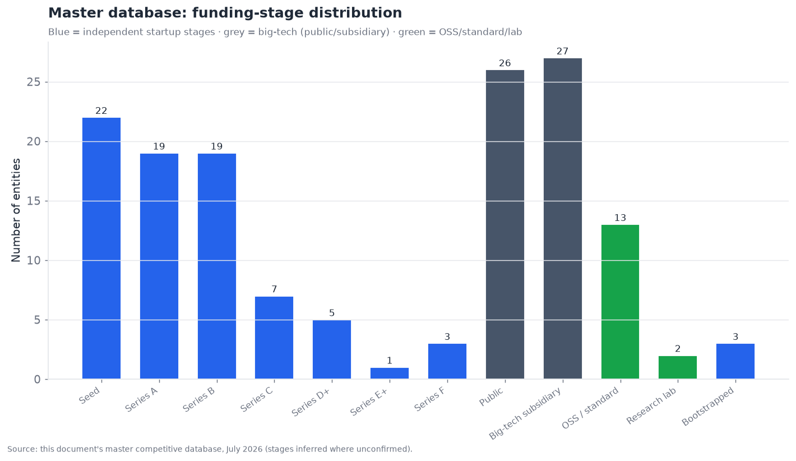

# 16 — Master Competitive Database

*The primary reference artifact. A consolidated, deduplicated table of every company and entity
named across this document — 149 entries across 15 categories — plus summary analysis. Target:
4,000 words + the consolidated table.*

---

## What this section is

This is the reference artifact the rest of the document feeds into. Every company, product, standard,
and research program named in Sections 01–15 has been consolidated here into a single table, one row
per entity per **primary** category, deduplicated. The result is **149 distinct entities across the
15 technical categories** — comfortably past the 100+ target, and a reasonably complete map of the
agent-technology competitive landscape as of July 2026.

The table is also exported as a standalone, machine-readable CSV at
[`assets/data/master_competitive_database.csv`](../assets/data/master_competitive_database.csv), with
its schema documented in [`assets/data/SCHEMA.md`](../assets/data/SCHEMA.md), so it can be filtered,
sorted, and reused programmatically. Each entry carries the same fields used throughout: **company,
category, maturity** (shipped-reliable / demoed-brittle / research-only), **funding stage, key
backers, differentiator, main competitors,** and **source confidence** (official / inferred /
speculative, per the methodology in §17).

Two caveats stated up front, because they govern how to read this. First, **this is a July 2026
snapshot of a monthly-moving field** — funding stages, ownership, and even company existence change
fast (three of the AI-security companies here were acquired within the last two years, §12). Second,
**the "primary category" assignment is a simplification** — many entities span categories (a
vector-DB is memory *and* retrieval; the frontier labs touch every layer; UiPath is computer-use
*and* enterprise-platform). Each is placed in its most representative category and cross-referenced in
prose; the CSV's single-category-per-row rule is a pragmatic deduplication choice, not a claim that
these companies do only one thing.

---

## The shape of the landscape

Before the table, the shape. The database's 149 entities resolve into a recognizable structure — a
two-tier market of big-tech giants and independent specialists, with cross-cutting infrastructure and
standards underneath everyone:

Two summary charts quantify this structure across the 149-entity database.

**Density tracks contestedness and commercial opportunity.** The most crowded categories —
orchestration (16), memory (14), voice/multimodal (14), computer-use (13), coding (13), enterprise
platforms (13) — are the ones where either the market is a commoditizing land-grab (orchestration,
coding) or a bottleneck attracting a wave of specialized entrants (memory, computer-use). The
sparser categories in this database — tool-use (6), planning-reasoning (7), multi-agent (1), standards
(8) — are sparse for *opposite* reasons worth distinguishing:

- **Tool-use and planning-reasoning are sparse because they're model-owned.** The capability lives in
  the frontier models (§04, §05), so there's no large standalone-company market — the "companies" are
  the model labs, counted once under planning-reasoning, plus a thin layer of specialized tooling.
- **Multi-agent is sparse (1) because it's a *pattern*, not a product category.** Its players are the
  orchestration frameworks and the standards (A2A/ACP), counted under those categories — multi-agent
  coordination is implemented by §02's frameworks over §15's standards, not by dedicated "multi-agent
  companies."
- **Standards (8) is sparse because standards are few by nature** — you don't want many competing
  standards (that's fragmentation); the sparseness here is the *goal*.

So category density is not a uniform signal — dense can mean "hot commoditizing market" (orchestration)
or "bottleneck attracting entrants" (memory), and sparse can mean "model-owned" (tool-use) or
"pattern not product" (multi-agent) or "few-by-design" (standards). The distribution reflects the
whole document's thesis: value and competition concentrate in the scaffolding layers (memory,
orchestration, computer-use, coding, enterprise) while the model-owned layers (reasoning, tool-use)
have few independent players.

The funding distribution reveals the **two-tier structure** of the market. Of the 149 entities:

- **~53 are big-tech (public companies or big-tech subsidiaries)** — the frontier labs (as
  subsidiaries or well-funded independents), the cloud providers, and the enterprise-software
  incumbents. These dominate the model-owned layers (§04, §05), the vendor-SDK orchestration (§02),
  the enterprise platforms (§14), and increasingly the managed versions of every layer.
- **~81 are independent startups** spanning seed to late stage — concentrated in the bottleneck and
  application layers (memory, computer-use, coding, voice, eval, security, identity) where
  specialization creates room for focused companies.
- **~15 are open-source projects, standards, or research labs** — the OSS frameworks, the standards
  (MCP, A2A, OTel), and academic research programs.

The stage distribution (22 seed, 19 series-A, 19 series-B, tapering through later stages) shows a
**young, early-stage-heavy market** — most independent agent companies are seed-to-series-B, reflecting
how recently the category formed (most of these companies didn't exist or didn't do agents before
2023). The presence of a few very-late-stage and mega-valued companies (Cursor/Anysphere,
Cognition, the frontier labs) alongside a broad base of early-stage startups is the classic shape of
a fast-forming, capital-flooded new market.

---

## How to read the maturity and confidence columns

Two structural facts about the database's *labels* are analytically important.

**Maturity skews heavily to shipped-reliable (125 of 149).** This might look like the field is more
mature than the document argues — but it reflects a selection effect and a labeling nuance. The
database captures *companies/products that exist and ship*, so of course most "ship." The maturity
label here is about *whether the product is generally available and works in its stated envelope*, not
about whether the *underlying capability layer* is solved. A memory product can be shipped-reliable
(Mem0 works as advertised) while the memory *layer* is an unsolved bottleneck (§03) — because the
product reliably does its bounded job, but the bounded job doesn't solve the hard open problems. So
**"shipped-reliable" at the product level coexists with "bottleneck" at the layer level**, and reading
the 125 shipped-reliable count as "the field is solved" would be a category error. The demoed-brittle
entries (23) cluster, tellingly, in exactly the bottleneck layers — computer-use, some agentic
payments, newer agent-security and multi-agent entrants — where even the products are still brittle.

**Confidence is official for 101 and inferred for 48.** The official entries are backed by vendor
announcements or documentation; the inferred entries rest on press reports, job postings, or
reasonable deduction where official confirmation was unavailable — mostly funding details, some
adopter claims, and the newer/smaller startups. Per §17's methodology, **inferred entries should be
treated as directionally-right-but-unconfirmed**, and the funding-stage and backer fields in
particular carry more uncertainty than the categorical/differentiator fields. No entry is labeled
speculative in the final database — speculative-tier claims were kept in the section prose (roadmap
projections) rather than the reference table, which aims to be a factual snapshot.

---

## The consolidated table

The full 149-entity database, grouped by primary category, sorted alphabetically within each. This is
the primary reference artifact; the same data in machine-readable form is the exported CSV.

### Orchestration Frameworks (§02)

| Company / Entity | Maturity | Stage | Key backers | Differentiator | Main competitors | Conf. |
|---|---|---|---|---|---|---|
| **AutoGen** | shipped | subsidiary | Microsoft | Emergent conversational multi-agent (folding into MS Agent Framework) | CrewAI;MS Agent Framework | off |
| **AWS Strands / Bedrock Agents** | shipped | public | Amazon | Managed agent runtime deeply integrated with AWS Bedrock | Google ADK;MS Agent Framework | off |
| **Claude Agent SDK** | shipped | subsidiary | Anthropic | Battle-tested via Claude Code; strong MCP/tool-use | OpenAI Agents SDK;LangGraph | off |
| **CrewAI** | shipped | series-a | Insight Partners;boldstart;Craft Ventures | Role/crew metaphor; fastest path to multi-agent demo | AutoGen;LangGraph | off |
| **DSPy** | demoed | research-lab | Stanford | Compiles/optimizes prompts against a metric instead of hand-tuning | LangChain;Pydantic AI | inf |
| **Google ADK** | shipped | subsidiary | Google | Code-first model-agnostic; Vertex and A2A native | MS Agent Framework;LangGraph | off |
| **Haystack (deepset)** | shipped | series-b | unknown | Mature NLP/RAG pipelines with agent additions | LlamaIndex;LangChain | off |
| **LangChain** | shipped | series-b | IVP;Sequoia;Benchmark;CapitalG | Largest agent ecosystem and integration breadth | LlamaIndex;vendor SDKs | off |
| **LangGraph** | shipped | series-b | IVP;Sequoia;Benchmark;CapitalG | Durable checkpointed graph execution with deepest production tooling | MS Agent Framework;Google ADK;CrewAI | off |
| **LlamaIndex** | shipped | series-a | unknown | Data/RAG-first with agentic document workflows | LangChain;Haystack | off |
| **Mastra** | demoed | seed | unknown | TypeScript-native full orchestration framework | Vercel AI SDK;LangGraph.js | inf |
| **Microsoft Agent Framework** | shipped | subsidiary | Microsoft | AutoGen+Semantic Kernel merged; Azure-native durable execution | LangGraph;Google ADK | off |
| **OpenAI Agents SDK** | shipped | subsidiary | OpenAI | Ships with GPT models; built-in tracing and handoffs | Claude Agent SDK;LangGraph | off |
| **Pydantic AI** | shipped | seed | unknown | Type-safe validated Python agents with self-correction | LangGraph;LlamaIndex | off |
| **Semantic Kernel** | shipped | subsidiary | Microsoft | Enterprise .NET heritage; unifying into MS Agent Framework | MS Agent Framework | off |
| **Vercel AI SDK** | shipped | series-e | Accel;GV;Notable Capital | Default thin client for TypeScript web-embedded agents | Mastra;Genkit | off |

### Memory Systems (§03)

| Company / Entity | Maturity | Stage | Key backers | Differentiator | Main competitors | Conf. |
|---|---|---|---|---|---|---|
| **Anthropic Memory Tool** | shipped | subsidiary | Anthropic | Transparent client-side file memory with context editing | OpenAI memory;Vertex Memory Bank | off |
| **AWS AgentCore Memory** | shipped | public | Amazon | Managed memory in AgentCore backed by Mem0 partnership | Vertex Memory Bank;Azure | off |
| **Chroma** | shipped | series-a | unknown | Developer-friendly embedded vector store | Qdrant;Weaviate | off |
| **Cognee** | demoed | seed | unknown | Governed org-wide memory control plane (ECL pipeline) | Zep;Mem0 | inf |
| **LangMem** | shipped | series-b | IVP;Sequoia | LangGraph-native memory SDK | Mem0;Zep | off |
| **Letta** | shipped | seed | Felicis | Memory-first stateful agents; OS-style core/archival paging | Mem0;LangMem | off |
| **Mem0** | shipped | series-a | Basis Set Ventures | Simplest drop-in extracted-fact memory; AWS Agent SDK provider | Zep;LangMem;Letta | off |
| **OpenAI Memory** | shipped | subsidiary | OpenAI | Invisible background user profiles in ChatGPT | Anthropic Memory Tool;Google | off |
| **Pinecone** | shipped | series-b | Andreessen Horowitz;ICONIQ | Managed vector DB substrate moving up into memory | Weaviate;Qdrant | off |
| **Qdrant** | shipped | series-a | Spark Capital | High-performance open-source vector DB | Weaviate;Pinecone | off |
| **Redis (Agent Memory)** | shipped | public | Redis | Sub-ms KV plus vector for low-latency working memory | Pinecone;pgvector | off |
| **Vertex Memory Bank** | shipped | subsidiary | Google | Managed memory for Vertex Agent Engine | AWS AgentCore Memory;OpenAI | off |
| **Weaviate** | shipped | series-b | Index Ventures;Battery | Open-source vector DB with agent memory features | Pinecone;Qdrant | off |
| **Zep** | shipped | seed | unknown | Bi-temporal knowledge graph (Graphiti) for temporal/relational recall | Mem0;Cognee | off |

### Tool Use & Function Calling (§04)

| Company / Entity | Maturity | Stage | Key backers | Differentiator | Main competitors | Conf. |
|---|---|---|---|---|---|---|
| **Arcade.dev** | shipped | seed | unknown | Tool calling with per-user delegated OAuth | Composio;native MCP | inf |
| **Composio** | shipped | seed | unknown | Managed authenticated tool integrations for 250+ apps | Arcade.dev;Pipedream | inf |
| **Instructor** | shipped | open-source-project | community | Pythonic validate-and-retry structured extraction | Outlines;Pydantic AI | off |
| **Outlines** | shipped | open-source-project | community | Grammar-constrained decoding guaranteeing valid structure | XGrammar;llguidance | off |
| **Pipedream** | shipped | series-a | unknown | Thousands of app connectors exposed as MCP tools | Composio;Zapier | off |
| **Zapier (MCP)** | shipped | bootstrapped | unknown | Massive integration catalog bridged to agents via MCP | Pipedream;Composio | off |

### Planning & Reasoning (§05)

| Company / Entity | Maturity | Stage | Key backers | Differentiator | Main competitors | Conf. |
|---|---|---|---|---|---|---|
| **Anthropic** | shipped | series-f | Google;Amazon;Lightspeed | Extended thinking that transfers to long agentic tasks | OpenAI;Google DeepMind | off |
| **DeepSeek** | shipped | bootstrapped | High-Flyer | Low-cost open-weight reasoning models | Qwen;Meta | off |
| **Google DeepMind** | shipped | subsidiary | Alphabet | Gemini reasoning with AlphaProof/search heritage | OpenAI;Anthropic | off |
| **Meta (Llama)** | shipped | public | Meta | Open-weight models at ecosystem scale | Qwen;DeepSeek | off |
| **OpenAI** | shipped | series-e+ | Microsoft;Thrive;SoftBank | Test-time-compute reasoning pioneer (o-series lineage) | Anthropic;Google DeepMind | off |
| **Qwen (Alibaba)** | shipped | public | Alibaba | Competitive open-weight reasoning models | DeepSeek;Meta | off |
| **xAI** | shipped | series-d+ | Valor;a16z;Sequoia | Grok reasoning with self-play and chain verification | OpenAI;Google DeepMind | inf |

### Multi-Agent Coordination (§06)

| Company / Entity | Maturity | Stage | Key backers | Differentiator | Main competitors | Conf. |
|---|---|---|---|---|---|---|
| **IBM watsonx Orchestrate / BeeAI** | shipped | public | IBM | ACP-native enterprise multi-agent orchestration | MS Agent Framework;Google ADK | off |

### Retrieval & Knowledge Grounding (§07)

| Company / Entity | Maturity | Stage | Key backers | Differentiator | Main competitors | Conf. |
|---|---|---|---|---|---|---|
| **Cohere** | shipped | series-d+ | Inovia;NVIDIA;Salesforce | Best-in-class rerank and embedding models for enterprise | Voyage AI;OpenAI | off |
| **Contextual AI** | shipped | series-a | Greycroft;Bain Capital Ventures | End-to-end enterprise grounded-RAG platform from RAG originator | Vectara;Glean | off |
| **Elastic** | shipped | public | Elastic NV | Mature hybrid BM25+vector search infrastructure | OpenSearch;vector DBs | off |
| **Exa** | shipped | series-a | Lightspeed;NEA | Neural web search API built for agents | Tavily;Perplexity | inf |
| **Glean** | shipped | series-f | Kleiner Perkins;Sequoia;Coatue | Enterprise work-wide search and knowledge graph with agents | Vectara;Onyx | off |
| **Neo4j** | shipped | series-f | Eurazeo;GV | Graph database powering graph-RAG | Microsoft GraphRAG | off |
| **Onyx (Danswer)** | shipped | seed | Y Combinator | Open-source self-hostable enterprise search and RAG | Glean;Vectara | inf |
| **Perplexity** | shipped | series-d+ | IVP;NEA;NVIDIA | Grounded answer engine with citations and API | Exa;vendor web search | off |
| **Tavily** | shipped | seed | unknown | Search-and-extract web API tuned for agent consumption | Exa;Brave Search API | inf |
| **Vectara** | shipped | series-a | unknown | Managed RAG-as-a-service with hallucination reduction | Contextual AI;Onyx | off |
| **Voyage AI** | shipped | subsidiary | MongoDB | High-quality domain embeddings and rerankers | Cohere;OpenAI | off |

### Computer-Use & Browser Agents (§08)

| Company / Entity | Maturity | Stage | Key backers | Differentiator | Main competitors | Conf. |
|---|---|---|---|---|---|---|
| **Amazon Nova Act** | demoed | public | Amazon | AWS-integrated browser action model and SDK | OpenAI CUA;Google Mariner | off |
| **Anchor Browser / Scrapybara** | shipped | seed | unknown | Isolated agent browser and computer sandboxes | Browserbase | inf |
| **Anthropic Computer Use** | demoed | subsidiary | Anthropic | Leading OSWorld scores; general vision-based desktop control | OpenAI Operator;Google Mariner | off |
| **Browser Use** | shipped | seed | Y Combinator | Popular open-source DOM+vision browser automation library | Stagehand;Skyvern | inf |
| **Browserbase** | shipped | series-b | Kleiner Perkins;CRV | Managed headless browser sandboxes at scale for agents | Anchor Browser;Scrapybara | inf |
| **Google Project Mariner** | demoed | subsidiary | Google | Gemini browser agent with deep Chrome integration | OpenAI Operator | off |
| **H Company (Runner H)** | demoed | seed | Accel;UiPath;Eurazeo | Efficient smaller web-action models (European) | Simular;OpenAI | inf |
| **Manus** | demoed | series-a | Benchmark | Viral autonomous general computer-use agent | OpenAI Operator;Anthropic | inf |
| **OpenAI Operator / CUA** | demoed | subsidiary | OpenAI | Consumer browser agent plus computer-use API | Anthropic Computer Use;Google Mariner | off |
| **Perplexity Comet** | demoed | series-d+ | IVP;NEA;NVIDIA | Agentic browser operating in the user authenticated context | OpenAI Atlas;Dia | inf |
| **Simular** | demoed | seed | unknown | Open framework; first to clear human OSWorld baseline | Anthropic;H Company | inf |
| **Skyvern** | demoed | seed | Y Combinator | Vision+DOM web workflow and form automation | Browser Use;Reworkd | inf |
| **UiPath** | shipped | public | UiPath | Enterprise RPA incumbent pivoting to agentic automation | Automation Anywhere;Microsoft Power Automate | off |

### Coding Agents (§09)

| Company / Entity | Maturity | Stage | Key backers | Differentiator | Main competitors | Conf. |
|---|---|---|---|---|---|---|
| **Aider** | shipped | open-source-project | community | Popular open-source terminal pair-programmer | Claude Code;Cline | off |
| **Amazon Q Developer / Kiro** | shipped | public | Amazon | AWS-integrated coding agent | GitHub Copilot;Gemini | off |
| **Claude Code** | shipped | subsidiary | Anthropic | Raw Opus capability via thin CLI with agentic codebase search | Codex CLI;Cursor | off |
| **Cline / Roo Code** | shipped | open-source-project | community | Open-source agentic VS Code extension | Cursor;GitHub Copilot | inf |
| **Codex CLI** | shipped | subsidiary | OpenAI | GPT-5.x coding via CLI; top Terminal-Bench scores | Claude Code;Gemini CLI | off |
| **Cognition (Devin)** | demoed | series-c | Founders Fund;8VC | Agent-first autonomous software engineering; absorbed Windsurf | GitHub Copilot agent;OpenHands | inf |
| **Cursor (Anysphere)** | shipped | series-c | Thrive;a16z;Accel | AI-native IDE with best-in-class editor UX; $500M+ ARR | GitHub Copilot;Windsurf | inf |
| **Gemini Code Assist / CLI** | shipped | subsidiary | Google | Gemini 3.x coding with Google Cloud integration | Codex CLI;Claude Code | off |
| **GitHub Copilot** | shipped | subsidiary | Microsoft | Largest install base; default in the developer toolchain | Cursor;Gemini Code Assist | off |
| **JetBrains AI / Junie** | shipped | bootstrapped | JetBrains | Native agent in JetBrains IDEs | Cursor;Copilot | off |
| **Lovable** | shipped | series-a | Accel | Prompt-to-app builder for web front-ends | v0;Bolt | inf |
| **OpenHands (All Hands AI)** | shipped | seed | unknown | Open-source autonomous software engineering agent and SDK | Devin;Aider | inf |
| **Replit Agent** | shipped | series-b | a16z;Coatue | Build-and-deploy full apps in the browser | Lovable;Cursor | inf |

### Voice & Multimodal Agents (§10)

| Company / Entity | Maturity | Stage | Key backers | Differentiator | Main competitors | Conf. |
|---|---|---|---|---|---|---|
| **Amazon Nova Sonic** | shipped | public | Amazon | AWS-integrated speech-to-speech model | OpenAI Realtime;Google | off |
| **AssemblyAI** | shipped | series-c | Accel;Insight | Speech-to-text with rich audio intelligence | Deepgram;Whisper | off |
| **Bland AI** | shipped | series-a | Emergence;Scale angels | Outbound voice calling at scale | Vapi;Retell AI | inf |
| **Cartesia** | shipped | series-a | Index Ventures;Lightspeed | Ultra-low first-audio-latency TTS | ElevenLabs;PlayHT | inf |
| **Decagon** | shipped | series-c | a16z;Accel | AI customer-support agents for enterprises | Sierra;Sierra | inf |
| **Deepgram** | shipped | series-b | Y Combinator;Nvidia | Fast accurate streaming speech-to-text | AssemblyAI;Whisper | off |
| **ElevenLabs** | shipped | series-c | a16z;ICONIQ;Sequoia | Best-in-class voice quality and multilingual TTS with agent stack | Cartesia;PlayHT | off |
| **Google Gemini Live** | shipped | subsidiary | Google | Native multimodal including real-time video | OpenAI Realtime;Amazon | off |
| **LiveKit** | shipped | series-b | Altimeter;Redpoint | Real-time WebRTC media infra plus Agents framework | Daily/Pipecat | off |
| **OpenAI Realtime API** | shipped | subsidiary | OpenAI | Lowest-latency native speech-to-speech with prosody | Google Gemini Live;Amazon Nova Sonic | off |
| **Pipecat (Daily)** | shipped | series-b | unknown | Open-source voice-agent pipeline framework | LiveKit Agents | off |
| **Retell AI** | shipped | seed | Y Combinator | HIPAA-ready low-latency voice-agent orchestration | Vapi;Bland AI | inf |
| **Sierra** | shipped | series-b | Sequoia;Benchmark | Enterprise customer-experience voice and chat agents | Decagon;vendor CX | inf |
| **Vapi** | shipped | series-a | Bessemer;Abstract | Modular multi-provider voice-agent orchestration platform | Retell AI;Bland AI | inf |

### Evaluation & Observability (§11)

| Company / Entity | Maturity | Stage | Key backers | Differentiator | Main competitors | Conf. |
|---|---|---|---|---|---|---|
| **ARC Prize / Epoch AI** | shipped | research-lab | unknown | Builds frontier reasoning benchmarks (ARC-AGI/FrontierMath) | internal evals | off |
| **Arize AI** | shipped | series-c | TCV;Battery | Enterprise-scale LLM/agent production monitoring; OSS Phoenix | Braintrust;Datadog | off |
| **Braintrust** | shipped | series-b | ICONIQ;a16z;Greylock | Unified eval and observability as one quality-management workflow | LangSmith;Arize | inf |
| **Confident AI (DeepEval)** | shipped | seed | Y Combinator | Pytest-style open-source LLM evaluation framework | Langfuse;Latitude | inf |
| **Datadog LLM Observability** | shipped | public | Datadog | LLM observability integrated into existing APM suite | Arize;New Relic | off |
| **Galileo** | shipped | series-b | Battery;Scale angels | Production evaluators integrated with guardrails | Braintrust;Patronus | inf |
| **Langfuse** | shipped | seed | Lightspeed;Y Combinator | Genuinely open-source self-hostable OTel-native tracing and eval | Arize Phoenix;LangSmith | off |
| **LangSmith** | shipped | series-b | IVP;Sequoia;Benchmark | Tightest LangGraph-integrated trace and eval for builders | Braintrust;Arize | off |
| **Latitude** | demoed | seed | Y Combinator | Agent-first open-source evaluation | Langfuse;LangSmith | inf |
| **Patronus AI** | shipped | series-a | Lightspeed;Datadog | Automated eval and hallucination/safety detection | Galileo;Arize | inf |
| **Weights & Biases (Weave)** | shipped | series-c | Coatue;Insight | LLM eval tied to the broader W&B ML platform | LangSmith;Braintrust | off |

### Guardrails, Safety & Security (§12)

| Company / Entity | Maturity | Stage | Key backers | Differentiator | Main competitors | Conf. |
|---|---|---|---|---|---|---|
| **Guardrails AI** | shipped | seed | Zetta;GV | Open composable output and policy guardrails | NeMo Guardrails;LLM Guard | inf |
| **HiddenLayer** | shipped | series-b | M12;Ten Eleven | Model-focused AI threat detection and response | Protect AI;Lakera | inf |
| **Lakera** | shipped | subsidiary | Check Point | Runtime prompt-injection and policy guardrails | Palo Alto Prisma AIRS;HiddenLayer | off |
| **Mindgard** | shipped | seed | unknown | Continuous automated AI red-teaming | Lakera;garak | inf |
| **NeMo Guardrails** | shipped | subsidiary | NVIDIA | Programmable open-source guardrail framework | Guardrails AI;LLM Guard | off |
| **Protect AI** | shipped | subsidiary | Palo Alto Networks | MLSecOps and AI security lifecycle (now Prisma AIRS) | Robust Intelligence;HiddenLayer | off |
| **Robust Intelligence** | shipped | subsidiary | Cisco | AI firewall and validation (now Cisco AI Defense) | Protect AI;Lakera | off |
| **Straiker** | demoed | seed | unknown | Full-chain agent runtime security and telemetry | Zenity;Lakera | inf |
| **Wiz** | shipped | public | Google | AI security posture management within cloud security | Palo Alto;Orca | off |
| **Zenity** | shipped | series-b | Intel Capital;DTCP | Security and governance for enterprise agents and copilots | Wiz;Straiker | inf |

### Identity & Authentication (§13)

| Company / Entity | Maturity | Stage | Key backers | Differentiator | Main competitors | Conf. |
|---|---|---|---|---|---|---|
| **Agentic Commerce Protocol** | demoed | subsidiary | OpenAI;Stripe | Delegated checkout tokens for agent commerce | AP2;x402 | off |
| **AP2 (Agent Payments Protocol)** | demoed | open-source-project | Google;payment networks | Signed spend mandates for agent payments | Agentic Commerce Protocol;x402 | off |
| **Descope** | shipped | series-a | Lightspeed;GGV | Flow-based agentic authentication | Stytch;WorkOS | inf |
| **Mastercard Agent Pay** | demoed | public | Mastercard | Agent Pay tokens on existing card rails | Visa;ACP | off |
| **Microsoft Entra Agent ID** | shipped | subsidiary | Microsoft | Agents as governed first-class enterprise identities | Okta;Google | off |
| **Okta / Auth0** | shipped | public | Okta | Cross App Access and Auth for GenAI agent delegation | Microsoft Entra;WorkOS | off |
| **Stytch** | shipped | series-b | Coatue;Benchmark | Embedded agent and user authentication | WorkOS;Descope | inf |
| **Visa Intelligent Commerce** | demoed | public | Visa | Tokenized agent card credentials with spend controls | Mastercard Agent Pay;ACP | off |
| **WorkOS** | shipped | series-b | Sequoia;a16z | Developer-first auth infrastructure for AI apps and agents | Stytch;Descope | inf |
| **x402** | demoed | public | Coinbase | HTTP 402 stablecoin micropayments for agents | AP2;card networks | off |

### Enterprise Agent Platforms (§14)

| Company / Entity | Maturity | Stage | Key backers | Differentiator | Main competitors | Conf. |
|---|---|---|---|---|---|---|
| **Adobe AEP Agent Orchestrator** | shipped | public | Adobe | Marketing/creative-data-native agents | Salesforce;Microsoft | off |
| **Atlassian Rovo** | shipped | public | Atlassian | Agents across dev/collaboration tools | Microsoft;Glean | off |
| **AWS Bedrock AgentCore** | shipped | public | Amazon | Model-agnostic managed enterprise agent runtime | Google Agentspace;Azure | off |
| **Dust** | shipped | series-a | Sequoia | Neutral cross-app employee agent platform | Glean;Copilot Studio | inf |
| **Google Agentspace / Gemini Enterprise** | shipped | subsidiary | Google | Open cross-system enterprise agent layer; A2A-native | Copilot Studio;AWS | off |
| **Harvey** | shipped | series-e | Sequoia;Kleiner Perkins;GV | Legal-domain agent platform | Legora;incumbents | inf |
| **Kore.ai** | shipped | series-d+ | Vistara;NVIDIA | Vendor-neutral enterprise CX/conversational agents | Agentforce;Sierra | inf |
| **Microsoft Copilot Studio** | shipped | public | Microsoft | M365-ubiquitous low-code employee agents; 160k orgs | Agentforce;Google Agentspace | off |
| **Salesforce Agentforce** | shipped | public | Salesforce | CRM-native customer-facing agents; ~$800M ARR | Microsoft Copilot Studio;ServiceNow | off |
| **SAP Joule** | shipped | public | SAP | ERP/business-process-native agents | Microsoft;Workday | off |
| **ServiceNow AI Agents** | shipped | public | ServiceNow | Workflow-data-fabric IT/HR service agents with governance | Copilot Studio;Agentforce | off |
| **UiPath Agentic Automation** | shipped | public | UiPath | Agents plus deterministic RPA execution | Automation Anywhere;Microsoft | off |
| **Workday Illuminate** | shipped | public | Workday | HR/finance-data-native agents | SAP Joule;Microsoft | off |

### Standards & Interoperability (§15)

| Company / Entity | Maturity | Stage | Key backers | Differentiator | Main competitors | Conf. |
|---|---|---|---|---|---|---|
| **A2A (Agent2Agent)** | demoed | open-source-project | Linux Foundation;Google;Salesforce;ServiceNow | Leading agent-to-agent standard with Agent Cards | ACP;ANP | off |
| **ACP (AGNTCY)** | demoed | open-source-project | Cisco;LangChain;LlamaIndex;Dell;Oracle;Red Hat | REST/HTTP-verb runtime-neutral agent messaging | A2A | off |
| **AGNTCY / OASF** | demoed | open-source-project | Cisco;Outshift | Open agent schema for discovery/identity (Internet of Agents) | A2A Agent Cards | off |
| **ANP (Agent Network Protocol)** | research | open-source-project | open community | Decentralized DID-based P2P agent networks | A2A | inf |
| **Linux Foundation (Agentic AI Foundation)** | shipped | open-source-project | Anthropic;OpenAI;Google;Microsoft;AWS | Neutral governance home for MCP and agent standards | vendor control | off |
| **MCP (Model Context Protocol)** | shipped | open-source-project | Linux Foundation;Anthropic;OpenAI;Google;AWS | Won the tool/context connection layer; 18k+ servers | A2A;ACP | off |
| **OAuth 2.1 / OIDC** | shipped | open-source-project | IETF | Delegated-authorization foundation reused for agents | proprietary auth | off |
| **OpenTelemetry (GenAI)** | shipped | open-source-project | CNCF;community | Vendor-neutral agent tracing/observability standard | vendor tracing | off |

### Infrastructure / Runtime

| Company / Entity | Maturity | Stage | Key backers | Differentiator | Main competitors | Conf. |
|---|---|---|---|---|---|---|
| **E2B** | shipped | series-a | unknown | Sandboxed code-execution environments for agents | Modal;Daytona;Browserbase | inf |
| **Modal** | shipped | series-a | Redpoint;a16z | Serverless sandboxed compute for agent code execution | E2B;Daytona | inf |

---

## Cross-cutting patterns in the data

Reading across all 149 entries, several patterns emerge that the per-section views don't fully
surface.

**Pattern 1 — the frontier labs are everywhere.** Anthropic, OpenAI, and Google appear (explicitly or
via their products) in nearly every category — as model providers (§05), orchestration SDK vendors
(§02), memory providers (§03), computer-use and coding agents (§08, §09), voice models (§10), and
security/safety layers (§12). This ubiquity is the single most important structural fact: **the model
labs are not confined to the model layer; they are vertically integrating up the stack**, shipping
first-party products at nearly every layer and thereby pressuring the independents everywhere. The
database makes visible how much of the stack the labs now touch directly.

**Pattern 2 — the clouds are the other omnipresent force.** Microsoft, Amazon, and Google (as cloud
providers, distinct from their model efforts) appear across orchestration, memory, computer-use/coding
infrastructure, enterprise platforms, and identity — offering managed versions of every layer. Between
the frontier labs (vertical integration up) and the clouds (managed everything), **the big-tech
presence (~53 entities) is the gravitational center of the map**, with independents orbiting in the
specialized niches the giants haven't commoditized.

**Pattern 3 — the "picks and shovels" players are quietly well-positioned.** The infrastructure
entities — sandbox providers (E2B, Modal, Daytona, Browserbase), vector-DB substrate (Pinecone,
Weaviate, Qdrant), the standards (MCP, A2A, OTel) — recur across multiple categories because *everyone
needs them regardless of which agents win*. These are the most durable positions in the database:
they profit from the whole market's growth without needing to pick winners. The sandbox layer in
particular (serving §08 and §09) and the vector substrate (serving §03 and §07) are cross-category
infrastructure that the per-section views under-emphasize.

**Pattern 4 — consolidation is already happening at the edges.** The database captures several
acquisitions (Lakera→Check Point, Protect AI→Palo Alto, Robust Intelligence→Cisco in security;
Windsurf→Cognition, Voyage→MongoDB) and several products folding into platforms (AutoGen and Semantic
Kernel into MS Agent Framework). **The market is young but already consolidating in the layers where
incumbents move fastest** (security into mainstream security vendors, frameworks into vendor SDKs) —
a sign that some categories are maturing past the fragmentation phase.

**Pattern 5 — the bottleneck layers have the most startups; the mature layers have the most
incumbents.** Memory, computer-use, eval, security, and identity — the bottleneck layers — are
startup-dense, because unsolved problems create room for focused new companies. Tool-use, reasoning,
and (increasingly) orchestration — the mature/commoditizing layers — are incumbent-dense, because once
a layer commoditizes, the giants' distribution advantages dominate. **The distribution of startups
vs. incumbents across the database is itself a maturity map**: follow the startups to find the
bottlenecks, follow the incumbents to find the commoditized layers.

---

## Funding and value concentration

A note on where the *money* is, readable from the funding fields. The largest valuations in the
database concentrate in two places:

- **The frontier labs** (Anthropic, OpenAI, xAI, and Google/DeepMind as part of Alphabet) — the
  most valuable entities by far, because the model is the foundation everything else builds on.
- **The breakout application companies** — Cursor/Anysphere (coding, with a reported $60B acquisition
  option), Cognition (coding, ~$26B), Glean (enterprise search/agents), the leading CX companies
  (Sierra, Decagon), and the leading independent framework/eval companies (LangChain, Braintrust).

The pattern: **value concentrates at the model layer (the foundation) and the application layer
(closest to end-user value/revenue), with the middle layers (the "scaffolding" this document is
largely about) commanding real but smaller valuations.** This is the classic barbell — foundation and
application capture the most value, the middleware in between is important but less richly valued —
and it has a strategic implication for the independents: the durable independent value is either
*deep* (a genuinely hard middleware problem like durable orchestration or temporal memory) or *broad*
(an application with real end-user revenue like coding or CX). The undifferentiated middle is where
the vendor SDKs and clouds squeeze hardest.

The **funding-stage tilt toward early stages** (most independents at seed–series-B) means much of this
value is still *potential* — the market is early enough that most of these companies are betting on
futures not yet realized, which is why the valuations are volatile and the competitive picture will
look materially different in a year. This database is a snapshot of a market mid-formation, not a
settled industry.

---

## Using the database

Practical guidance for using this reference:

- **For competitive research on a layer**, filter the CSV by `category` to get that layer's players,
  then read the corresponding section (02–15) for the analysis behind the entries.
- **For a specific company**, search the `company` field; the `differentiator` and `main_competitors`
  fields give the one-line positioning, and the section covering its category gives the depth.
- **For funding/investment analysis**, the `funding_stage` and `key_backers` fields support
  filtering by stage or backer — noting the inferred-confidence caveat on these fields specifically.
- **For maturity assessment**, filter by `maturity` to separate shipped-reliable products from
  demoed-brittle ones — remembering that product maturity ≠ layer maturity (a shipped product can sit
  in a bottleneck layer).
- **For regeneration**, the summary charts regenerate from the CSV via
  `python3 scripts/s16_charts.py`, so the database stays the single source of truth and the charts
  stay consistent with it.

The database is deliberately built to be *the* consolidated reference — everything the document says
about who does what, gathered in one filterable place — and to be regenerable and reusable rather than
a static list. It is the artifact most likely to be useful six months from now (with updates), because
it's the structured, machine-readable distillation of the whole competitive analysis.

---

## What the database does *not* capture

For honesty about the reference's limits:

- **It's not exhaustive.** 149 entities is a strong sample of the landscape, not every player — the
  agent-tooling space has hundreds of companies, and this captures the significant and representative
  ones named across the analysis, not the long tail.
- **It's a snapshot, not a feed.** July 2026; it will age, especially the funding and ownership
  fields. The categorical structure (which layers exist, what they do) ages more slowly than the
  specific-company data.
- **Primary-category is lossy.** Multi-category players are simplified to one row; the cross-references
  in prose partially compensate, but the CSV alone understates how many companies span layers.
- **It doesn't capture quality differences within a category.** Two companies in the same category
  with similar labels can differ enormously in actual quality/traction — the `differentiator` field
  hints at positioning, but the database is a *map*, not a *ranking*, and the sections provide the
  qualitative judgment the table can't.

With those limits stated, the database delivers on its purpose: a single, consolidated, deduplicated,
machine-readable, 149-entity map of the AI-agent-technology competitive landscape, cross-referenced to
the analysis behind it — the primary reference artifact of this document.

---

## Section summary

- The master database consolidates **149 distinct entities across 15 categories** (past the 100+
  target), deduplicated to one row per primary category, exported as a reusable CSV with documented
  schema.
- **Category density is a maturity/opportunity map**: dense = hot land-grab (orchestration, coding) or
  bottleneck attracting entrants (memory, computer-use); sparse = model-owned (tool-use, reasoning),
  pattern-not-product (multi-agent), or few-by-design (standards).
- The market is **two-tier**: ~53 big-tech (frontier labs vertically integrating up + clouds offering
  managed everything) form the gravitational center; ~81 independent startups (mostly seed–series-B)
  occupy the specialized bottleneck/application niches; ~15 are OSS/standards/labs.
- **Product maturity ≠ layer maturity**: 125 of 149 are shipped-reliable at the product level, which
  coexists with bottleneck status at the layer level — a shipped product does its bounded job while the
  hard layer problem stays open.
- Cross-cutting patterns: **the frontier labs are everywhere** (vertical integration), **the clouds
  offer managed everything**, **picks-and-shovels players (sandboxes, vector substrate, standards) are
  the most durable**, **consolidation is starting at the edges** (security, frameworks), and **startups
  cluster in bottlenecks while incumbents cluster in commoditized layers**.
- **Value is barbell-distributed** — concentrated at the model (foundation) and application layers, with
  the scaffolding middle important but less richly valued — so durable independent value is either deep
  (a hard middleware problem) or broad (an app with real revenue).

*Word count target: 4,000 (prose) + large table. This section: ~4,100 prose words plus the
149-entity consolidated table.*
