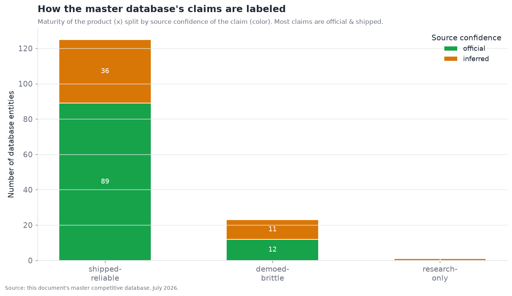
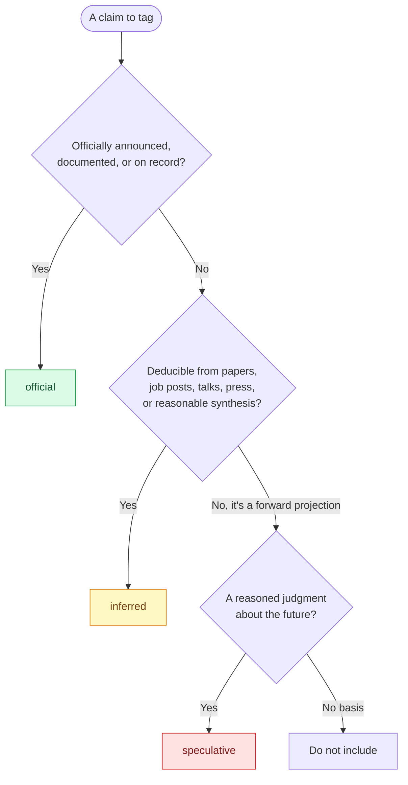

# 17 — Appendix: Glossary and Methodology

*Terms of art used throughout, and the confidence/maturity methodology that governs every claim in
this document. Target: 3,000 words.*

---

## How to read this document's claims

This document makes hundreds of claims about a fast-moving field. Every one is tagged so the reader
can weigh it appropriately, using two orthogonal labeling systems that are worth understanding
precisely.

### The maturity labels (delivery state)

Every technology or product claim carries one of three **maturity** labels, describing the *delivery
state* — how reliably the thing actually works today:

| Label | Meaning | How to weight it |
|---|---|---|
| **shipped-reliable** | Generally available, documented, used in production by third parties; behaves predictably within a stated envelope. | Trust it works as described, within its stated bounds. |
| **demoed-brittle** | Publicly shown or in preview/beta; works in curated conditions but with known reliability gaps outside them. | Impressive but don't depend on it in production without testing. |
| **research-only** | Paper, prototype, or internal demo; not a supported product. | Directional signal of what's coming, not something to build on. |

The critical subtlety, emphasized in §16: **product maturity is not the same as layer maturity.** A
product can be shipped-reliable (it does its bounded job dependably) while the *capability layer* it
sits in is an unsolved bottleneck (the bounded job doesn't solve the layer's hard open problems). Mem0
is a shipped-reliable product in the bottleneck memory layer (§03); Anthropic Computer Use is a
demoed-brittle product in the bottleneck computer-use layer (§08). Read the maturity label as "how
much can I trust *this product* within its envelope," and the section's layer-level assessment as "how
solved is *this problem* overall."

### The confidence labels (evidential basis)

Every roadmap, capability, or competitive claim additionally carries a **confidence** tag, describing
the *evidential basis* — how well-sourced the claim is:

| Tag | Basis | Example |
|---|---|---|
| **official** | Vendor announcement, documentation, or on-record statement. | "MCP was donated to the Linux Foundation" — announced. |
| **inferred** | Deduced from papers, job postings, conference talks, press reports, or reasonable synthesis — not officially confirmed. | A startup's funding stage from press reports; an adopter claim from a case study. |
| **speculative** | Analyst projection or forward-looking judgment; a reasoned guess about the future. | "The payments layer will consolidate over 2026–2027." |

The two systems are orthogonal: a claim can be *official* about something *demoed-brittle* ("the
vendor announced [official] this preview feature [demoed-brittle]"), or *inferred* about something
*shipped-reliable* ("we deduce [inferred] that this GA product [shipped-reliable] has these adopters").
The chart shows how the master database's entries distribute across both axes:

Most database entries are *official* and *shipped-reliable* (the well-documented, generally-available
products), with the *inferred* entries concentrated in funding/backer details and the newer, smaller,
less-documented players. The **speculative** tier appears only in the sections' roadmap subsections
(forward-looking projections), never in the reference database, which aims to be a factual snapshot.

### The confidence-assignment procedure

The procedure used to assign a confidence tag, made explicit:

The discipline this enforces: **claims that can't be sourced to at least an inference are dropped, not
guessed into the document.** The confidence tags are not decoration — they are the reader's guide to
how much weight each claim can bear, and they are essential in a field where confident-sounding
misinformation is abundant (much of the source material for a document like this is SEO content and
vendor marketing of varying reliability).

---

## Methodology notes

A few notes on how this document was built, for the reader's calibration:

- **Sources.** The analysis draws on official vendor documentation and announcements, published
  research, industry press, and current web search (the field moves monthly, so July 2026 data was
  gathered throughout rather than relying on any static snapshot). Where sources conflicted (common for
  benchmark numbers and funding figures), the document notes the uncertainty rather than picking a
  false precision.
- **Quantitative figures are directional.** Benchmark scores, funding amounts, adoption counts, and
  market sizes are approximate and often vendor-reported or single-source; they are used to convey
  *magnitude and trend*, not exact truth. Charts explicitly label their data as inferred/illustrative
  where the underlying figures are uncertain. The reader should treat specific numbers as "roughly
  this" rather than precise.
- **Charts are regenerable.** Every chart is generated by a script in `scripts/` from data in
  `assets/data/`, so the visuals are reproducible and consistent with the underlying data, and can be
  updated as the field moves.
- **The competitive database is a map, not a ranking.** §16's database captures who does what, not who
  is best; quality judgments live in the section prose, not the table.
- **Neutrality.** The document aims for technical precision without marketing language, and assesses all
  players — including those behind the model this analysis runs on — by the same evidence-based
  standard. Where a layer is unsolved, it says so plainly; where a vendor leads, it says that plainly
  too.

---

## Glossary of agent architecture terms

Terms of art used throughout, defined concisely. Organized roughly by the layer they belong to.

### Core agent concepts

| Term | Definition |
|---|---|
| **Agent** | An LLM-based system that can take actions in the world (via tools) in a loop, not just generate text — perceiving, deciding, acting, and observing results iteratively toward a goal. |
| **Agentic loop** | The core control loop: call the model, execute any requested tool, feed the result back, repeat until done. The irreducible core of every agent. |
| **Tool / function calling** | The mechanism by which a model requests that external code (a function, API, or MCP server) be run, receiving the result back. The capability that turns a text generator into an agent. |
| **ReAct** | "Reason + Act" — the pattern of interleaving explicit reasoning ("thought") with actions and observations, feeling forward one step at a time. The workhorse agent pattern. |
| **Workflow vs. agent** | A *workflow* has developer-authored control flow (the model fills in steps); an *agent* has model-decided control flow (the model chooses each next step). The 2026 guidance: prefer the least autonomy that solves the problem. |
| **Human-in-the-loop (HITL)** | A human approval/intervention point in the agent's execution, especially before consequential actions. Enforced *structurally* (in control flow) beats *behaviorally* (in the prompt). |
| **Autonomy gradient** | The spectrum from human-driven (agent suggests) to fully autonomous (agent acts without oversight). Most 2026 production agents are *semi-autonomous* — human-overseen on consequential actions — due to reliability and security limits. |

### Orchestration and state

| Term | Definition |
|---|---|
| **Orchestration framework** | Software that runs the agentic loop, holds state, connects tools, and composes agents (e.g., LangGraph, CrewAI, MS Agent Framework, vendor SDKs). |
| **Graph-based execution** | Representing agent control flow as an explicit directed graph of nodes and edges (allowing cycles), enabling checkpointing, replay, and interruption. The dominant production paradigm. |
| **Checkpointing** | Serializing agent state after each step to a durable store, enabling crash recovery, human-in-the-loop pauses, and time-travel debugging. The key production feature. |
| **Supervisor / orchestrator-worker** | A pattern where one coordinating agent decomposes a task and delegates subtasks to workers, then synthesizes results. The most reliable multi-agent pattern. |
| **CodeAct** | An agent acting by *writing and running code* that calls tools, rather than emitting individual tool-call JSON — more compositional, softening the many-tools problem, at the cost of needing sandboxed execution. |

### Memory and context

| Term | Definition |
|---|---|
| **Context window / working memory** | What is currently in the model's context — the active conversation, plan, and recent results. Finite and the most valuable real estate. |
| **Long-term memory** | Information persisted outside the context window and retrieved back when relevant — semantic (facts), episodic (events), or procedural (learned how-tos). |
| **Context engineering** | The discipline of curating what occupies the context window (via compaction, context editing, structured scratchpads) — the successor term to "prompt engineering." |
| **Context rot** | The degradation of a model's ability to use any particular piece of context reliably as the context fills with more (including stale/tangential) material. Why bigger windows don't eliminate memory needs. |
| **Consolidation** | Turning raw experience into durable memory — extracting, reconciling contradictions, and storing. The hard, under-designed "write path" of memory. |
| **Memory poisoning** | An attack (or error) that writes a false/malicious "fact" into long-term memory, corrupting future sessions — a persistent compromise. |

### Retrieval and grounding

| Term | Definition |
|---|---|
| **RAG (Retrieval-Augmented Generation)** | Retrieving relevant external documents into context before generating, to ground the model in data it wasn't trained on. |
| **Agentic RAG** | Retrieval as an adaptive reasoning loop — the agent decides when to retrieve, evaluates sufficiency, and reformulates — rather than a fixed pre-fetch. The modern pattern. |
| **Hybrid retrieval** | Combining sparse (keyword/BM25) and dense (vector/semantic) retrieval to capture both exact and semantic matches; usually paired with reranking. The production-standard pipeline. |
| **Reranking** | A second-stage model that re-scores retrieved candidates against the query more precisely, promoting the truly relevant few (e.g., top-50 → top-5). |
| **Grounding** | Constraining a model's output to be based on retrieved sources rather than parametric knowledge — the main (partial) hallucination mitigation; made verifiable via citations. |
| **Chunking** | Splitting documents into retrievable units before embedding; poor chunking bounds retrieval quality regardless of algorithm. |

### Reasoning and planning

| Term | Definition |
|---|---|
| **Test-time compute / inference-time scaling** | Trading inference compute for accuracy by letting the model "think" (generate long reasoning) before answering — the paradigm behind reasoning models. |
| **Reasoning model** | A model trained (often via RL over verifiable rewards) to produce extended internal reasoning before answering, dramatically improving math/code/logic performance. |
| **Chain-of-thought (CoT)** | A model's step-by-step reasoning trace; now largely internalized in reasoning models. A valuable but imperfectly-faithful observability signal. |
| **Reflection / self-correction** | An agent examining and correcting its own output/trajectory — powerful when grounded in external feedback (tests, tools), weak or negative on pure self-critique. |
| **Long-horizon task** | A task requiring dozens-to-hundreds of interdependent steps; unreliable due to compounding error, goal drift, and context management. The field's defining unsolved problem. |
| **Compounding error** | The multiplication of per-step error over a long chain — 95%-reliable steps yield coin-flip reliability by ~15 steps. Why long tasks fail despite good individual steps. |
| **Verifier thesis** | The observation that a capability's maturity tracks how cheaply its success can be verified — coding (tests) matured fast; memory/security (no cheap verifier) lag. The document's central explanatory thread. |

### Multi-agent and standards

| Term | Definition |
|---|---|
| **MCP (Model Context Protocol)** | The won standard for connecting agents to tools, data resources, and prompts (client-server, JSON-RPC-based). Governed by the Linux Foundation. |
| **A2A (Agent2Agent)** | The leading standard for agent-to-agent communication — capability discovery (Agent Cards), task delegation, result exchange. Linux Foundation governed. |
| **ACP (Agent Communication Protocol)** | The AGNTCY alternative to A2A, mapping agent interactions onto REST/HTTP verbs. (Distinct from OpenAI+Stripe's "Agentic Commerce Protocol" — a name collision.) |
| **Agent Card** | A machine-readable document by which an A2A agent advertises its capabilities, endpoint, and auth requirements — the discovery primitive. |
| **Coordination failure modes** | The distributed-systems failures reincarnated for agents — dropped/duplicated tasks, error cascade, deadlock, telephone-game drift, context fragmentation. |

### Security, safety, and identity

| Term | Definition |
|---|---|
| **Prompt injection** | The fundamental, unsolved agent vulnerability — a model can't robustly distinguish instructions from data, so text in ingested content can hijack the agent. |
| **Indirect prompt injection** | The dangerous form — malicious instructions embedded in *external content the agent processes* (a web page, email, document, tool result) on a legitimate user's behalf. |
| **Lethal trifecta** | The catastrophic combination — sensitive-data access + untrusted-content exposure + exfiltration ability — that lets injection cause a full data breach. Break any leg to defang it. |
| **Defense-in-depth** | Layered security controls where each catches what others miss; for agents, the load-bearing layers are architectural (least-privilege scoping, structural gates, egress control) that work *even when the model is hijacked*. |
| **Least privilege / scoping** | Granting an agent exactly the permissions its task needs and no more — the load-bearing security defense, because it limits a hijacked agent's blast radius. |
| **On-behalf-of (OBO)** | A delegation pattern where an agent acts with a specific human's (scoped) authority for a task — the default for copilots. Contrast: *autonomous* (standing agent identity). |
| **Delegated / scoped credentials** | Short-lived, minimally-scoped, revocable authorization (via OAuth 2.1) that lets an agent act for a user without holding full credentials. |
| **Sandboxing** | Running an agent (especially code-execution or computer-use) in an isolated, disposable environment so compromise or error is contained. |

### Vertical and application terms

| Term | Definition |
|---|---|
| **Computer-use agent** | An agent that operates a computer via screen (screenshots) and mouse/keyboard, like a human — general but brittle, especially long-horizon. |
| **Grounding (computer-use)** | Connecting a described intention ("click submit") to a precise screen target (coordinates/element) — a hard sub-problem addressed by set-of-marks, screen-parsing, or DOM targeting. |
| **Coding agent** | An agent that autonomously writes, tests, and iterates on code — the most mature vertical, because tests are a cheap verifier. |
| **SWE-bench Verified** | The standard coding benchmark — resolving real GitHub issues such that existing tests pass. Climbed from ~4% (2023) to ~90% (2026). |
| **Cascade vs. speech-to-speech** | Voice-agent architectures — cascade (STT→LLM→TTS: control, higher latency) vs. speech-to-speech (one model: lower latency, richer prosody). |
| **Barge-in / interruption handling** | A voice agent's ability to be interrupted mid-speech — stopping and processing the user's interruption in real time. A key naturalness differentiator. |

### Infrastructure, economics, and enterprise terms

| Term | Definition |
|---|---|
| **Sandbox infrastructure** | Providers of isolated, disposable execution environments for agents (E2B, Modal, Daytona, Browserbase) — picks-and-shovels serving computer-use and coding regardless of which agents win. |
| **Vector database** | The storage/similarity-search substrate underlying memory and retrieval (Pinecone, Weaviate, Qdrant, Chroma, pgvector) — commoditized infrastructure distinct from the memory *policy* above it. |
| **Prompt caching** | Reusing already-processed stable context across calls at reduced cost/latency — a lever complementary to retrieval for managing the context budget. |
| **Consumption / outcome pricing** | "Pay for work done" pricing (e.g., Agentforce Flex Credits) rather than per-seat — the emerging enterprise-agent economic model; cheap to start, scales with usage. |
| **System of record vs. system of action** | The incumbents own the databases of truth (systems of record — CRM, ERP); the strategic contest is who owns the new *system of action* (the agent layer that acts across them). |
| **Build vs. buy** | The central enterprise decision — build custom agents on frameworks (control/portability) vs. buy a platform (speed/governance); the answer often changes at scale as consumption costs bite. |
| **Agent washing** | Rebranding existing automation or simple chatbots as "AI agents" — rampant marketing noise that makes genuine agentic capability hard to identify. |
| **Non-human identity (NHI)** | Machine/agent identities (as opposed to human ones); agents multiply these dramatically, creating a governance-at-scale challenge (provisioning, scoping, deprovisioning, ownership). |

### Evaluation terms

| Term | Definition |
|---|---|
| **Offline eval** | Measuring agent quality before deployment on test sets, to decide if a change is an improvement. |
| **Online observability** | Understanding what an agent does in production via tracing, monitoring, and anomaly detection. |
| **LLM-as-judge** | Using a model to evaluate outputs against criteria — the scalable eval workhorse, requiring calibration against human labels and bias controls. |
| **Trajectory evaluation** | Assessing the *sequence* of an agent's actions (not just the final output) — essential because a right answer via a wrong path won't generalize. |
| **Regression detection** | Detecting when a change made the agent worse — the hard problem the eval layer solves least well. |
| **OpenTelemetry (GenAI)** | The vendor-neutral tracing standard for agent observability — the "MCP for observability," reducing lock-in. |

---

## Recurring cross-cutting theses

Five threads recur across the sections and are collected here for reference:

1. **The bottleneck moved off the model.** Frontier models are individually capable enough that agent
   failures overwhelmingly trace to scaffolding — memory, tool execution, planning, security — not to
   the model being unable to reason.
2. **The verifier thesis.** A capability commoditizes roughly in proportion to how cheaply its success
   can be verified. Coding (tests) leads; memory and security (no cheap verifier) lag. Manufacturing
   verifiers is how you extend agent reliability into new domains.
3. **Security is the gating factor for autonomy, and it's unsolved.** Prompt injection has no robust
   fix; every deployment limits blast radius rather than preventing compromise, keeping high-stakes
   agents semi-autonomous.
4. **Evaluation is the silent bottleneck.** The field can't reliably tell whether an agent regressed,
   which slows iteration on every other layer.
5. **Standards consolidated fast and open.** MCP and A2A moved to neutral Linux Foundation governance
   within ~1 year each — the rare structurally-positive layer, setting the ecosystem on an open,
   interoperable trajectory.

---

## Document metadata

- **Generation date:** 2026-07-22
- **Scope:** 15 technical categories + executive summary + master database + this appendix (17 files)
- **Total length:** 100,000+ words across all section files
- **Master database:** 149 deduplicated entities across 15 categories (exported CSV)
- **Charts:** generated via matplotlib from data in `assets/data/`, regenerable via `scripts/`
- **Diagrams:** Mermaid, rendered natively by GitHub
- **Caveat:** a July 2026 snapshot of a monthly-moving field; competitive specifics (funding,
  ownership, benchmark numbers) age fastest, the categorical structure ages slowest.

*Word count target: 3,000. This section: ~3,000 (verified via `wc`).*
